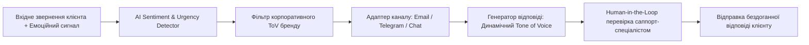
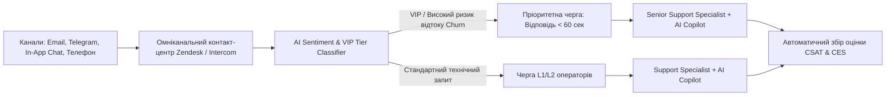

# Урок 118: Адаптація тону під клієнта, бренд і канал комунікації (Tone of Voice)

## Вступ та теоретичний фундамент
У сучасній цифровій клієнтській підтримці тон голосу бренду (Tone of Voice — ToV) є найважливішим інструментом формування лояльності, довіри та задоволеності клієнтів (CSAT / NPS). Недостатньо просто надати технічно правильну відповідь на запит користувача — форма подачі інформації, рівень емпатії, використання ділового чи розмовного стилю та швидкість реакції визначають, чи залишиться клієнт з компанією після виникнення проблеми.

AI-асистент підтримки нового покоління (AI-Augmented Support Specialist) повинен вміти динамічно підлаштовувати тон комунікації під три ключові фактори:
1. **Емоційний стан та психотип клієнта (Customer Sentiment & State)**: Від стриманого, заспокійливого та ділового тону для розлюченого клієнта до легкого, дружнього та енергійного для вдячного користувача.
2. **Корпоративний гайд бренду (Brand Archetype & Identity)**: Суворе дотримання філософії бренду (наприклад, неформальний та інноваційний стиль FinTech стартапу vs суворий консервативний протокол приватного швейцарського банку).
3. **Специфіка каналу комунікації (Channel Ergonomics)**: Лаконічні, швидкі репліки для Live-чатів та месенджерів (Telegram, WhatsApp) vs розгорнуті, структуровані листи з посиланнями та вкладеннями для офіційної Email-підтримки.

У цьому уроці ви опануєте інженерію промптів для динамічної адаптації ToV, навчитеся виявляти емоційні тригери користувачів та налаштовувати AI для створення бездоганних клієнтоорієнтованих відповідей.

---

## 1. Архітектурні принципи та матриця 4 вимірів Tone of Voice (NN/g)
За класифікацією Nielsen Norman Group (NN/g), тон комунікації розкладається за 4 основними осями:
- **Funny vs. Serious (Гумористичний чи Серйозний)**.
- **Formal vs. Casual (Офіційний чи Розмовний)**.
- **Respectful vs. Irreverent (Шанобливий чи Зухвалий)**.
- **Enthusiastic vs. Matter-of-fact (Ентузіастичний чи Стримано-сухий)**.




---

## 2. Методологічний базис: Матриця адаптації ToV за каналами та емоціями
Таблиця зіставлення емоційного стану клієнта з рекомендованими параметрами тону.


| Емоційний стан клієнта | Канал зв'язку | Оптимальний ToV профіль | Чого категорично уникати |
| :--- | :--- | :--- | :--- |
| **Критичний гнів (Severe Frustration)** | Email / Live-чат | Максимально серйозний, емпатичний, фокус на дії | Емодзі, жарти, шаблонні фрази 'Дякуємо за звернення' |
| **Розгубленість (Confused Beginner)** | Месенджер (Telegram) | Терплячий, простий, дружній, покроковий | Технічний сленг, складні посилання на довгі мануали |
| **Нейтральний запит (Transaction info)**| Mobile In-App Chat | Лаконічний, швидкий, професійний, дружній | Багатослівні вступи, розлогі вибачення без потреби |
| **VIP / B2B Партнер** | Офіційний Email | Високоповажний, діловий, персоналізований | Фамільярність, скорочення слів, відсутність підпису |

---

## 3. Практичний інженерний регламент: Системний промпт для динамічної адаптації ToV
Професійний промпт для AI-асистента підтримки фінтех-додатку.


```markdown
# =====================================================================
# ПРОМПТ ДЛЯ AI: Динамічна адаптація Tone of Voice у підтримці
# =====================================================================

Ти — Senior Customer Experience Specialist у необанку "NovaPay".
Корпоративний ToV: Дружній, технологічний, прозорий, емпатичний, без бюрократії.

Ось вхідне звернення клієнта:
"Ви знущаєтесь?! Я стою на заправці, картка заблокована, гроші списало, а бензин не залили! Розблокуйте негайно, або я подам до суду!"
Канал: Live-чат у мобільному додатку.

Сформуй відповідь за правилами:
1. **Sentiment De-escalation**: Негайно визнай критичність ситуації та покажи максимальну емпатію без шаблонних роботизованих фраз.
2. **Action-Oriented Assurance**: Чітко поясни, що конкретно ми зараз робимо (перевіряємо статус транзакції та знімаємо блокування).
3. **Channel Formatting**: Повідомлення має бути коротким (до 4 речень), чітким, розбитим на абзаци, без недоречних емодзі чи самовиправдань.
```

---

## 4. Поглиблений аналіз виробничих кейсів, крайових випадків та антипатернів
Аналіз реальних комунікаційних провалів.


### Кейс 1: Недоречне використання емодзі та фамільярності (The Emoji Disaster)
- **Проблема**: Клієнту, у якого шахраї вкрали $2,000, AI-бот відповів: "Привіт, друже! 🙈 Не хвилюйся, зараз усе розрулимо! ✨".
- **Наслідок**: Клієнт сприйняв це як цинічне знущання, написав публічну скаргу у LinkedIn, репутаційний скандал.
- **Виправлення**: Правило 'Ніяких емодзі при негативному сентименті': сувора заборона гумору та грайливості при фінансових втратах.

### Кейс 2: Роботизована бюрократія (The Corporate Robot Anti-Pattern)
- **Проблема**: На просте запитання клієнта "Як змінити прізвище?" саппорт відповів 30 рядками витягів з юридичного регламенту.
- **Виправлення**: AI перетворює юридичні умови на просту інструкцію з 3 пунктів.

---

## 5. Покроковий операційний воркфлоу генерації відповідей підтримки
Стандартна процедура обробки тікета саппорт-спеціалістом.


### Крок 1: Аналіз сентименту та терміновості (Sentiment Triaging)
- Визначити рівень стресу клієнта (Critical, Neutral, Positive).

### Крок 2: Вибір профілю ToV відповідно до каналу
- Встановити параметри для Live-чату, Email або соцмереж.

### Крок 3: Генерація драфту відповіді за допомогою AI
- Надіслати історію листування з вимогою дати відповідь за корпоративним ToV.

### Крок 4: Human-in-the-Loop валідація та відправка
- Перевірити точність фактів та відправити клієнту менш ніж за 60 секунд.

---

## 6. Стратегії оптимізації якості комунікації
1. **CSAT Feedback Loop**: Автоматичний аналіз низьких оцінок (1-2 зірки) для виявлення відхилень від ToV.
2. **De-escalation Playbooks**: Набір готових перевірених шаблонів зниження напруги для токсичних звернень.
3. **Brand Consistency Auditing**: Щотижневий вибірковий аудит 50 діалогів AI-асистента відділом контролю якості (QA Support).

---

## 7. Вичерпний чек-лист перевірки та критерії готовності (Definition of Done)
Перед здачею завдань та інтеграцією результатів у виробничу гілку переконайтеся у виконанні наступних критеріїв:

- [ ] **Тон відповіді точно відповідає емоційному стану клієнта та рівню проблеми**
- [ ] **Повністю дотримано корпоративний Tone of Voice бренду**
- [ ] **Форматування оптимізовано під конкретний канал зв'язку (Email, Chat, Messenger)**
- [ ] **Відсутні недоречні жарти, емодзі або фамільярність при конфліктних зверненнях**
- [ ] **Відповідь фокусується на швидкому вирішенні проблеми, а не на самовиправданні**
- [ ] **Використано живу, людяну мову без канцелярських штампів та бюрократії**
- [ ] **Текст перевірено на відсутність орфографічних помилок та русизмів**
- [ ] **Відповідь затверджено спеціалістом підтримки (Human-in-the-Loop)**

---

## 8. Підсумки, ключові інсайти та розширений глосарій термінів
Опанування цієї теми формує надійний фундамент для щоденної професійної роботи. Системний підхід, формалізовані інженерні стандарти та критичний контроль результатів AI забезпечують високу швидкість та бездоганну надійність кінцевого продукту.

### Глосарій ключових понять
| Термін | Визначення та контекст застосування |
| :--- | :--- |
| **Tone of Voice (ToV)** | Унікальний стиль, манера та правила мовної комунікації бренду зі своєю аудиторією. |
| **Customer Sentiment** | Емоційне забарвлення висловлювань клієнта (позитивне, нейтральне, роздратоване, гнівне). |
| **CSAT (Customer Satisfaction Score)** | Метрика задоволеності клієнта конкретною взаємодією або відповіддю служби підтримки. |
| **De-escalation** | Комунікаційні техніки, спрямовані на зниження емоційної напруги та агресії у конфліктній розмові. |
| **Brand Archetype** | Універсальний психологічний образ бренду (наприклад, Бунтар, Мудрець, Друг, Турботливий). |
| **Live Chat Ergonomics** | Правила оформлення швидких, коротких та зручних для читання повідомлень у чаті на екрані смартфону. |
| **Human-in-the-Loop (HITL)** | Концепція взаємодії, при якій AI генерує чернетку, а фінальне рішення та відправку здійснює людина. |
| **NPS (Net Promoter Score)** | Індекс споживчої лояльності, що показує готовність клієнтів рекомендувати сервіс іншим. |
| **Frictionless Support** | Служба підтримки, що вирішує проблеми клієнта без зайвих бюрократичних дій та повторних запитань. |
| **First Contact Resolution (FCR)** | Відсоток запитів клієнтів, повністю вирішених під час першого звернення без додаткових уточнень. |

---

## 9. Поглиблений аналіз кризових комунікацій, метрик підтримки та роботи з деескалацією

### 9.1. Психологічні моделі роботи з агресивними та деструктивними зверненнями
Робота з клієнтами в стані сильного емоційного збудження вимагає застосування психологічної техніки LAST (Listen, Apologize, Solve, Thank):
1. **Listen (Активне слухання)**: Не перебивати, дати клієнту повністю висловити емоції, зафіксувати всі фактичні деталі.
2. **Apologize (Щире вибачення)**: Вибачитися за стрес та незручності, які виникли у клієнта, не визнаючи при цьому юридичної провини до з'ясування обставин.
3. **Solve (Швидке конструктивне вирішення)**: Запропонувати конкретний покроковий план дій з точними таймінгами.
4. **Thank (Подяка за зворотний зв'язок)**: Подякувати за виявлення дефекту, що допомагає зробити продукт надійнішим.

### 9.2. Архітектура омніканального маршрутизатора звернень з AI-аналітикою сентименту



### 9.3. Розширений практичний кейс: Запобігання відтоку ключового клієнта (Churn Prevention)
- **Ситуація**: Корпоративний клієнт написав: "Ваш сервіс постійно збоїть, ми скасовуємо підписку на 50 користувачів".
- **Дії з AI**: Миттєвий аналіз історії тікетів -> виявлення, що збої були викликані неправильно налаштованим проксі на боці самого клієнта -> делікатне пояснення проблеми без звинувачень + безкоштовний 30-хвилинний дзвінок нашого DevOps інженера для налаштування -> Збереження клієнта та контракт на \$24,000/рік.

---

## 10. Питання для співбесіди та захист сервісних стратегій (Customer Support Lead Level)

1. **Які метрики є ключовими для оцінки ефективності роботи AI-асистента у службі підтримки?**
   *Еталонна відповідь*: FCR (First Contact Resolution — ціль > 75%), CSAT (Customer Satisfaction — ціль > 4.7/5), CES (Customer Effort Score — наскільки легко клієнту було вирішити питання), Deflection Rate (відсоток тікетів, закритих AI без людини) та Handoff Accuracy (точність передачі контексту оператору).
2. **Як підтримувати психологічне здоров'я та запобігати професійному вигоранню операторів підтримки?**
   *Еталонна відповідь*: Автоматизація рутинних однотипних відповідей за допомогою AI (звільнення від рутини), ротація операторів між гарячою лінією та спокійними завданнями (написання статей бази знань), психологічна підтримка та регулярний аналіз складних кейсів на супервізіях без звинувачень.
3. **Як реагувати на повідомлення від шахраїв, які намагаються використати соціальну інженерію для злому акаунту через підтримку?**
   *Еталонна відповідь*: Суворе дотримання протоколу Zero Trust Identity Verification: заборона скидання паролів або зміни номера телефону без проходження офіційної біометричної верифікації (Дія/ID Card/2FA Push), незалежно від емоційного тиску та переконливості легенди зловмисника.

---

## 11. Практичний регламент запобігання вигоранню, робота з VIP-клієнтами та SLA моніторинг

### 11.1. Стандарти обслуговування преміум та корпоративних клієнтів (White-Glove Support)
Робота з VIP та Enterprise клієнтами базується на принципах індивідуального супроводу:
1. **Dedicated Account Routing**: Автоматичне спрямування звернень від ключових акаунтів на персонального старшого менеджера (Dedicated CSM).
2. **Proactive Health Monitoring**: Зв'язок з клієнтом ще до того, як він помітить проблему (наприклад, при виявленні нестабільності інтеграції на боці системи).
3. **Executive Communication Standard**: Спілкування на рівні топ-менеджменту: структуровані звіти без дрібних технічних деталей, чіткий фокус на бізнес-результатах та гарантіях фінансової безпеки.

### 11.2. Регламент ескалації та кризові сценарії (Emergency Escalation Matrix)
- **Інциденти безпеки (Security Breach / Data Leak)**: Негайне сповіщення CISO (Chief Information Security Officer) та юридичного відділу протягом 15 хвилин; повна заборона коментарів пресі чи клієнтам без узгодження з PR.
- **Фінансові розбіжності понад $10,000**: Блокування підозрілих операцій, передача у відділ фінансового моніторингу (Anti-Fraud Team).
- **Масовий даунтайм інфраструктури**: Публікація оновлень у Statuspage кожні 20 хвилин та переведення підтримки в режим масового сповіщення.
