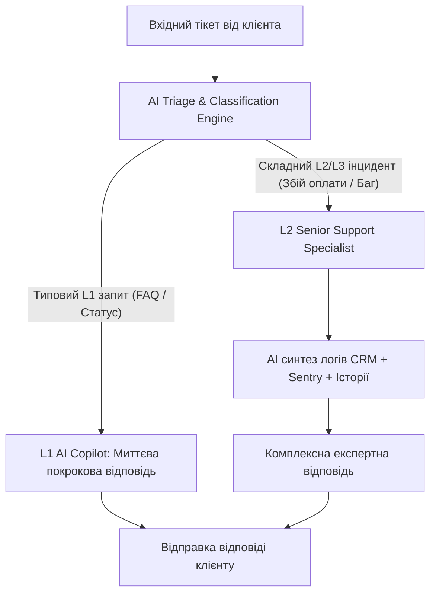
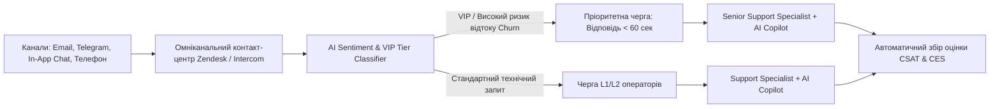

# Урок 119: Складання відповідей на типові та складні запити

## Вступ та теоретичний фундамент
Обробка клієнтських запитів у сучасній службі підтримки ділиться на два фундаментальні потоки: високочастотні типові звернення (L1 Tier — Tier 1 Support) та нестандартні, заплутані інженерно-фінансові інциденти (L2/L3 Tier — Complex Escalations).

Якщо для типових запитів (скидання пароля, перевірка статусу доставки, умови повернення) головною цінністю є швидкість реакції (< 30 секунд) та вичерпність інструкції, то для складних багаторівневих кейсів необхідний глибокий синтез логів, аналіз попередньої історії користувача та узгодження дій з розробниками чи юристами.

Використання генеративного AI дозволяє:
1. **Миттєво вирішувати 70% типових звернень (Automated Zero-Touch Resolution)**: Генерація точних покрокових інструкцій з прямими діплінками в додаток.
2. **Декомпозувати складні заплутані скарги (Multi-Problem Dissection)**: Розбиття довгого емоційного листа на окремі пункти та надання структурної відповіді на кожну проблему.
3. **Знижувати час обробки складних інцидентів (AHT — Average Handling Time Reduction)**: Підготовка чернеток для саппорт-інженера з автоматичним підтягуванням даних з CRM та бази знань.
4. **Запобігати повторним зверненням (Repeat Contact Prevention)**: Передбачення наступного логічного запитання клієнта (Next Issue Avoidance).

У цьому уроці ви опануєте інженерні фреймворки роботи з типовими та ескалаційними запитами за допомогою AI-асистентів.

---

## 1. Архітектурні принципи маршрутизації та класифікації запитів (Tier 1 vs Tier 2/3)
Ефективний саппорт базується на автоматичній багаторівневій фільтрації та маршрутизації звернень.




---

## 2. Методологічний базис: Порівняння стратегій обробки різних типів звернень
Порівняльний аналіз підходів до типових та складних кейсів.


| Параметр | Типовий запит (Tier 1) | Складний / Конфліктний кейс (Tier 2/3) |
| :--- | :--- | :--- |
| **Цільовий час реакції (FRT)** | < 1-2 хвилин | < 15-30 хвилин |
| **Головна мета відповіді** | Надати чітке пряме посилання або дію за 2 кроки | Локалізувати корінь проблеми, заспокоїти, узгодити компенсацію |
| **Роль AI-асистента** | 100% автогенерація тексту з RAG бази знань | Глибокий аналіз контексту, генерація плану дій для інженера |
| **Ризик помилки** | Низький (перевірені шаблони знань) | Критичний (можлива втрата ключового B2B клієнта або судовий позов) |

---

## 3. Практичний інженерний регламент: Еталонний промпт для обробки комплексного заплутаного листа
Професійний системний промпт для відповіді на багатошаровий лист обуреного користувача.


```markdown
# =====================================================================
# ПРОМПТ ДЛЯ AI: Декомпозиція та відповідь на складне мульти-звернення
# =====================================================================

Ти — Senior Escalations Specialist у SaaS компанії.
Ось лист клієнта:
"Добрий день. По-перше, ваші сервери лежали 2 години і ми втратили 5 клієнтів. По-друге, ваш новий інтерфейс жахливий, кнопка експорту зникла. По-третє, з моєї картки списало подвійну суму за минулий місяць! Я вимагаю негайного повернення грошей та компенсації, або ми йдемо до конкурентів!"

Сформуй професійну відповідь:
1. **Empathy & Ownership**: Візьми відповідальність за інцидент без перекладання вини на провайдерів.
2. **Point-by-Point Deconstruction**:
   - Пункт 1 (Даунтайм): Поясни першопричину та вкажи на нарахування кредитів за порушення SLA.
   - Пункт 2 (Кнопка експорту): Дай пряму покрокову інструкцію, де вона тепер знаходиться.
   - Пункт 3 (Подвійне списання): Підтвердь ініціацію повернення дублюючого платежу з точним терміном зарахування (3-5 банківських днів).
3. **Retention & Next Steps**: Запропонуй персональний дзвінок з технічним лідом для аудиту налаштувань.
```

---

## 4. Поглиблений аналіз виробничих кейсів, крайових випадків та антипатернів
Аналіз реальних помилок при відповідях на складні звернення.


### Кейс 1: Антипатерн "Ігнорування другого запитання" (Selective Answering)
- **Проблема**: Клієнт запитав про ціну та сумісність з macOS. AI відповів лише про ціну. Клієнт був змушений писати знову.
- **Виправлення**: Алгоритмічна перевірка, що відповідь покриває 100% знаків питання у вхідному повідомленні.

### Кейс 2: Надання неперевірених обіцянок щодо термінів фіксу багів
- **Проблема**: AI написав клієнту "Розробники виправлять цей баг до завтрашнього ранку", тоді як реліз планувався через 2 тижні.
- **Виправлення**: Заборона обіцянки точних дат релізів без підтвердженого тікета в Jira.

---

## 5. Покроковий операційний воркфлоу обробки складних тікетів
Стандартний регламент інженера підтримки.


### Крок 1: Декомпозиція звернення на атомарні питання
- Виділити всі підпроблеми (технічні, фінансові, інтерфейсні).

### Крок 2: Збір діагностики з внутрішніх систем
- Отримати логи транзакцій, статус інциденту в Statuspage.

### Крок 3: Генерація структурної чернетки за допомогою AI
- Сформувати відповідь за структурою: Емпатія -> Рішення 1 -> Рішення 2 -> Рішення 3 -> Наступний крок.

### Крок 4: Фінальна вичитка та узгодження фінансових компенсацій
- Перевірити відповідність лімітам повернення коштів та відправити.

---

## 6. Стратегії підвищення ефективності служби підтримки
1. **Next Issue Avoidance (NIA)**: Завчасне надання відповідей на ймовірні супутні запитання.
2. **Dynamic Knowledge Base Sync**: Автоматичне створення чернеток нових статей FAQ на основі повторюваних складних тікетів.
3. **Automated SLA Breach Alerting**: Оповіщення тімліда за 15 хвилин до порушення гарантованого часу відповіді.

---

## 7. Вичерпний чек-лист перевірки та критерії готовності (Definition of Done)
Перед здачею завдань та інтеграцією результатів у виробничу гілку переконайтеся у виконанні наступних критеріїв:

- [ ] **Відповідь надає чіткі рішення для ВСІХ запитань та проблем, згаданих клієнтом**
- [ ] **Для складних кейсів продемонстровано глибоку емпатію та прийняття відповідальності**
- [ ] **Вказано точні терміни повернення коштів або наступних кроків**
- [ ] **Відсутні непідтверджені обіцянки щодо термінів виходу нових фіч**
- [ ] **Покрокові інструкції містять точні назви кнопок та меню інтерфейсу**
- [ ] **Застосовано техніку Next Issue Avoidance для запобігання повторним зверненням**
- [ ] **Лист структурований списками та легко сканується оком**
- [ ] **Відповідь відповідає корпоративному стандарту Tone of Voice**

---

## 8. Підсумки, ключові інсайти та розширений глосарій термінів
Опанування цієї теми формує надійний фундамент для щоденної професійної роботи. Системний підхід, формалізовані інженерні стандарти та критичний контроль результатів AI забезпечують високу швидкість та бездоганну надійність кінцевого продукту.

### Глосарій ключових понять
| Термін | Визначення та контекст застосування |
| :--- | :--- |
| **Tier 1 Support (L1)** | Перша лінія підтримки, що обробляє стандартні типові звернення користувачів за базовими інструкціями. |
| **Tier 2/3 Support (L2/L3)** | Вища лінія технічної або інженерної підтримки, що розслідує глибокі баги, збої БД та архітектурні інциденти. |
| **First Response Time (FRT)** | Час від моменту створення тікета клієнтом до отримання першої відповіді від оператора. |
| **Average Handling Time (AHT)** | Середній час, необхідний спеціалісту підтримки для повного вирішення звернення. |
| **Escalation** | Процес передачі складного або конфліктного тікета на вищий рівень компетенції або керівництву. |
| **Next Issue Avoidance (NIA)** | Методика підтримки, спрямована на завчасне попередження наступних ймовірних запитань клієнта. |
| **SLA (Service Level Agreement)** | Офіційний договір про рівень обслуговування, що гарантує певний час реакції та доступність системи. |
| **Decomposition of Inquiries** | Розбиття заплутаного багатослівного листа клієнта на окремі незалежні питання для точної відповіді. |
| **Zero-Touch Resolution** | Автоматичне вирішення запиту користувача AI-системою без будь-якого втручання людини-оператора. |
| **Statuspage** | Публічний або внутрішній веб-сервіс, що відображає поточний стан працездатності серверів та інцидентів компанії. |

---

## 9. Поглиблений аналіз кризових комунікацій, метрик підтримки та роботи з деескалацією

### 9.1. Психологічні моделі роботи з агресивними та деструктивними зверненнями
Робота з клієнтами в стані сильного емоційного збудження вимагає застосування психологічної техніки LAST (Listen, Apologize, Solve, Thank):
1. **Listen (Активне слухання)**: Не перебивати, дати клієнту повністю висловити емоції, зафіксувати всі фактичні деталі.
2. **Apologize (Щире вибачення)**: Вибачитися за стрес та незручності, які виникли у клієнта, не визнаючи при цьому юридичної провини до з'ясування обставин.
3. **Solve (Швидке конструктивне вирішення)**: Запропонувати конкретний покроковий план дій з точними таймінгами.
4. **Thank (Подяка за зворотний зв'язок)**: Подякувати за виявлення дефекту, що допомагає зробити продукт надійнішим.

### 9.2. Архітектура омніканального маршрутизатора звернень з AI-аналітикою сентименту



### 9.3. Розширений практичний кейс: Запобігання відтоку ключового клієнта (Churn Prevention)
- **Ситуація**: Корпоративний клієнт написав: "Ваш сервіс постійно збоїть, ми скасовуємо підписку на 50 користувачів".
- **Дії з AI**: Миттєвий аналіз історії тікетів -> виявлення, що збої були викликані неправильно налаштованим проксі на боці самого клієнта -> делікатне пояснення проблеми без звинувачень + безкоштовний 30-хвилинний дзвінок нашого DevOps інженера для налаштування -> Збереження клієнта та контракт на \$24,000/рік.

---

## 10. Питання для співбесіди та захист сервісних стратегій (Customer Support Lead Level)

1. **Які метрики є ключовими для оцінки ефективності роботи AI-асистента у службі підтримки?**
   *Еталонна відповідь*: FCR (First Contact Resolution — ціль > 75%), CSAT (Customer Satisfaction — ціль > 4.7/5), CES (Customer Effort Score — наскільки легко клієнту було вирішити питання), Deflection Rate (відсоток тікетів, закритих AI без людини) та Handoff Accuracy (точність передачі контексту оператору).
2. **Як підтримувати психологічне здоров'я та запобігати професійному вигоранню операторів підтримки?**
   *Еталонна відповідь*: Автоматизація рутинних однотипних відповідей за допомогою AI (звільнення від рутини), ротація операторів між гарячою лінією та спокійними завданнями (написання статей бази знань), психологічна підтримка та регулярний аналіз складних кейсів на супервізіях без звинувачень.
3. **Як реагувати на повідомлення від шахраїв, які намагаються використати соціальну інженерію для злому акаунту через підтримку?**
   *Еталонна відповідь*: Суворе дотримання протоколу Zero Trust Identity Verification: заборона скидання паролів або зміни номера телефону без проходження офіційної біометричної верифікації (Дія/ID Card/2FA Push), незалежно від емоційного тиску та переконливості легенди зловмисника.

---

## 11. Практичний регламент запобігання вигоранню, робота з VIP-клієнтами та SLA моніторинг

### 11.1. Стандарти обслуговування преміум та корпоративних клієнтів (White-Glove Support)
Робота з VIP та Enterprise клієнтами базується на принципах індивідуального супроводу:
1. **Dedicated Account Routing**: Автоматичне спрямування звернень від ключових акаунтів на персонального старшого менеджера (Dedicated CSM).
2. **Proactive Health Monitoring**: Зв'язок з клієнтом ще до того, як він помітить проблему (наприклад, при виявленні нестабільності інтеграції на боці системи).
3. **Executive Communication Standard**: Спілкування на рівні топ-менеджменту: структуровані звіти без дрібних технічних деталей, чіткий фокус на бізнес-результатах та гарантіях фінансової безпеки.

### 11.2. Регламент ескалації та кризові сценарії (Emergency Escalation Matrix)
- **Інциденти безпеки (Security Breach / Data Leak)**: Негайне сповіщення CISO (Chief Information Security Officer) та юридичного відділу протягом 15 хвилин; повна заборона коментарів пресі чи клієнтам без узгодження з PR.
- **Фінансові розбіжності понад $10,000**: Блокування підозрілих операцій, передача у відділ фінансового моніторингу (Anti-Fraud Team).
- **Масовий даунтайм інфраструктури**: Публікація оновлень у Statuspage кожні 20 хвилин та переведення підтримки в режим масового сповіщення.
