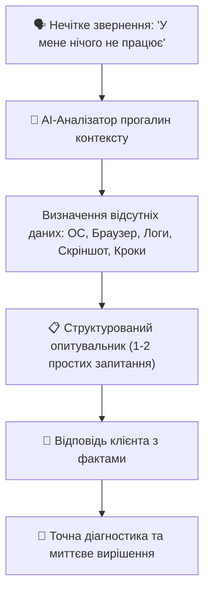

# Урок 119: Уточнення проблеми та ефективний збір контексту

## 1. Проблема «айсберга» у зверненнях клієнтів

Більшість клієнтів звертаються до служби підтримки з короткими, неповними та емоційними повідомленнями: *«У мене нічого не працює!», «Сайт зламався!», «Гроші зникли!»*. Це лише видима верхівка айсберга.

Справжня інженерна причина криється під водою:
- Специфічна модель пристрою або версія ОС.
- Нестабільне з'єднання або блокування розширеннями браузера (AdBlock / VPN).
- Порушення послідовності кроків через незрозумілий UI.
- Баг на бекенді при специфічному стані акаунту.

---

## 2. Методологія звуження проблеми (Funnel Technique)

Щоб не перевантажувати роздратованого клієнта довгою анкетою з 10 технічних питань, використовують **техніку воронки**:

### Етапи воронки уточнення:
1. **Емпатійне підтвердження**: Показати, що запит прийнято і проблема зрозуміла на базовому рівні.
2. **Одне-два ключових питання-розгалужувачі**:
   - *«Підкажіть, будь ласка, помилка з'являється в мобільному додатку чи у веб-браузері на комп'ютері?»*
   - *«Чи списуються кошти з балансу, чи кнопка взагалі не реагує на натискання?»*
3. **Проста інструкція надання артефактів**: Зрозуміле пояснення, як зробити скріншот або скопіювати код помилки без заплутаного IT-жаргону.

---

## 3. Використання AI для формування розумних уточнюючих питань

AI виступає діагностичним деревом рішень:
- **Передбачення найімовірніших збоїв**: на основі аналізу останніх релізів AI одразу підказує оператору, яке саме питання треба поставити для перевірки відомого інциденту.
- **Генерація інтерактивних кнопок швидкої відповіді (Quick Replies)** для чат-ботів, що прискорює збір інформації в один клік.
