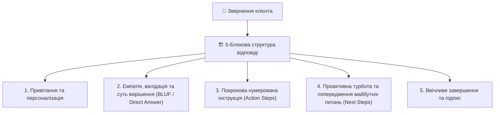

# Урок 120: Структура support-відповіді

## 1. Архітектура ідеального листа технічної підтримки

Відповідь спеціаліста підтримки — це не просто набір речень, а структурований інформаційний продукт, оптимізований для швидкого сприйняття (Scannability) людиною, яка перебуває у стресовому стані через технічну проблему.

Суцільне полотно неструктурованого тексту («стіна тексту») викликає у клієнта когнітивне перевантаження, призводить до пропускання важливих кроків інструкції та повторних звернень.

---

## 2. Принцип BLUF (Bottom Line Up Front) у підтримці

**BLUF (Головна суть на самому початку)** — золотий стандарт ефективної комунікації:
- Клієнт повинен отримати відповідь на своє головне питання («Чи повернули гроші?», «Коли запрацює сервіс?») у **перших двох реченнях** повідомлення.
- Лише після цього надаються технічні деталі, пояснення причин та покрокові інструкції.

### Порівняння підходів:
| Погано: Розмитий початок (❌) | Добре: Принцип BLUF (✅) |
| :--- | :--- |
| «Доброго дня. Ми розглянули ваше звернення №49184 щодо операції від 12 числа і передали його у фінансовий відділ, де провели аудит... (і лише в кінці) ...кошти повернено». | «Вітаю, Олександре! **Ми щойно успішно скасували помилкове списання і повернули 500 грн на вашу картку.** Кошти зарахуються протягом 15 хвилин». |

---

## 3. Правила візуального оформлення інструкцій

1. **Нумеровані списки для послідовних дій**: 1, 2, 3 (не маркери-крапки, які не мають порядку).
2. **Жирний шрифт для елементів UI**: «Натисніть **Налаштування** -> перейдіть у розділ **Безпека** -> виберіть **Змінити пароль**».
3. **Один крок = одна дія**: уникати перевантажених складнопідрядних речень.
4. **Виділення попереджень**: візуальні блоки уваги (наприклад: *«Зверніть увагу: після скидання сесії потрібно буде заново увійти в мобільний додаток»*).
