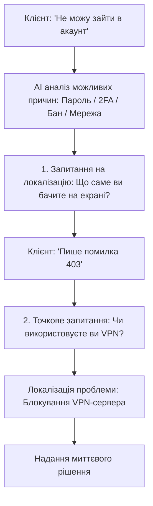
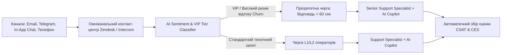

# Урок 120: Уточнення деталей у клієнта - формулювання правильних запитань

## Вступ та теоретичний фундамент
Нерідко клієнти звертаються у службу підтримки з надзвичайно неповними, розмитими або емоційними формулюваннями: 'У мене нічого не працює!', 'Додаток вилітає', 'Зникли гроші'. Якщо оператор підтримки реагує неправильно (ставить незрозумілі технічні запитання, вимагає невідомі користувачеві системні логи або влаштовує нескінченний допит з 10 пунктів), це викликає різкий сплеск роздратування та затягує вирішення проблеми на дні.

Мистецтво діагностичного уточнення (Diagnostic Probing & Clarification Engineering) полягає у здатності:
1. **Знижувати когнітивне навантаження на клієнта**: Ставити прості, закриті або альтернативні запитання замість складних відкритих опитувань.
2. **Формулювати покрокові інструкції самодіагностики**: Пояснювати, де саме подивитися номер версії чи як зробити скріншот на конкретному пристрої (iOS / Android / Mac).
3. **Використовувати техніку 'Одне головне запитання' (The Single Most Critical Question)**: Фокусуватися на інформації, яка негайно відсікає 80% можливих причин збою.
4. **Використовувати AI для автоматичного аналізу неповного опису**: Висунення 2-3 найбільш імовірних гіпотез проблеми на основі симптомів.

У цьому уроці ви опануєте алгоритми ведення діагностичного діалогу за допомогою AI, техніки формулювання уточнюючих запитань та правила роботи з нетехнічними користувачами.

---

## 1. Архітектурні принципи та воронка діагностичних запитань (Diagnostic Funnel)
Діагностика будується за принципом звуження простору пошуку (Binary Search Troubleshooting): від загального симптому до конкретного системного вузла.




---

## 2. Методологічний базис: Порівняння типів уточнюючих запитань
Порівняльний аналіз форм постановки запитань нетехнічним користувачам.


| Тип запитання | Поганий приклад (Антипатерн) | Еталонний приклад (Customer-Friendly) | Чому це працює краще |
| :--- | :--- | :--- | :--- |
| **Збір даних про пристрій** | "Надайте версію вашої OS та User-Agent" | "Підкажіть, будь ласка, ви заходите з комп'ютера чи з телефону (iPhone/Android)?" | Користувач миттєво розуміє, що від нього хочуть |
| **Локалізація помилки** | "Який HTTP статус повертає бекенд?" | "Чи з'являється червоне повідомлення з текстом, коли ви натискаєте кнопку?" | Фокус на візуальних спостереженнях людини |
| **Перевірка мережі** | "Чи є у вас проблеми з DNS або проксі?" | "Чи відкриваються у вас інші сайти у цій самій вкладці браузера?" | Простий побутовий тест без сленгу |
| **Збір скріншотів** | "Прикріпіть скріншот консолі DevTools" | "Надішліть, будь ласка, фото або скріншот екрана з цією помилкою (ось як це зробити: ...)" | Зрозуміла дія з наданням підказки |

---

## 3. Практичний інженерний регламент: Промпт для формулювання уточнюючих запитань
Професійний системний промпт для генерації делікатного та чіткого уточнюючого повідомлення.


```markdown
# =====================================================================
# ПРОМПТ ДЛЯ AI: Формулювання діагностичних запитань до розмитого тікета
# =====================================================================

Ти — Senior Technical Support Engineer.
Вхідне звернення: "У мене не працює відео у вашому плеєрі! Все чорне!".
Контекст: Клієнт роздратований, жодних технічних деталей не надав.

Сформуй коротку, турботливу відповідь:
1. Вияви емпатію та підтвердь готовність допомогти негайно.
2. Постав рівно 2 прості запитання з варіантами вибору:
   - Чи чути звук, коли екран чорний?
   - Чи працює відео в іншому браузері або додатку на телефоні?
3. Запропонуй одну найпростішу швидку дію, яка вирішує 60% таких проблем (вимкнути розширення AdBlock або оновити сторінку через Ctrl+F5 / Cmd+Shift+R).
```

---

## 4. Поглиблений аналіз виробничих кейсів, крайових випадків та антипатернів
Аналіз реальних випадків зриву комунікації через некоректні запитання.


### Кейс 1: Антипатерн "Анкета з 10 запитань" (The Interrogation Trap)
- **Проблема**: На скаргу клієнта саппорт відправив список з 12 обов'язкових пунктів (IP, провайдер, модель роутера, трасування traceroute...).
- **Наслідок**: Клієнт відмовився заповнювати анкету, закрив акаунт і пішов до конкурента.
- **Виправлення**: Правило 'Не більше 2 запитань за одне повідомлення' з поступовим заглибленням.

### Кейс 2: Звинувачення користувача у некомпетентності (User Blaming)
- **Проблема**: Оператор запитав: "Ви взагалі читали інструкцію перед тим як натискати?".
- **Виправлення**: М'яке переформулювання: "Давайте разом перевіримо кілька налаштувань, це займе лише 30 секунд".

---

## 5. Покроковий операційний воркфлоу діагностичного уточнення
Порядок дій оператора підтримки при роботі з неповними даними.


### Крок 1: Висунення гіпотез на основі сентименту та історії
- Перевірити останні події в системних логах клієнта.

### Крок 2: Генерація 1-2 простих запитань через AI
- Виключити весь технічний сленг та абревіатури.

### Крок 3: Додавання мікроінструкцій для складних дій
- Якщо потрібен скріншот — додати 1 речення про те, як його зробити.

### Крок 4: Аналіз отриманої відповіді та надання рішення
- Після отримання деталей негайно перейти до покрокового усунення дефекту.

---

## 6. Стратегії автоматизації збору діагностичних даних
1. **In-App Diagnostic Payload**: Автоматичне прикріплення логів, версії додатку та моделі пристрою до кожного тікета у мобільному додатку.
2. **Interactive Triage Bots**: Використання чат-ботів з кнопками вибору варіантів перед з'єднанням з живим оператором.
3. **Session Replay Integration**: Інтеграція інструментів відтворення сесій (FullStory / LogRocket) для перегляду дій користувача без необхідності розпитувати його.

---

## 7. Вичерпний чек-лист перевірки та критерії готовності (Definition of Done)
Перед здачею завдань та інтеграцією результатів у виробничу гілку переконайтеся у виконанні наступних критеріїв:

- [ ] **Уточнююче повідомлення містить не більше 2 простих запитань одночасно**
- [ ] **Повністю виключено незрозумілий технічний сленг, абревіатури та вимоги сирих логів**
- [ ] **Запитання сформульовані у формі вибору варіантів або так/ні**
- [ ] **Надано коротку підказку, як виконати дію (наприклад, зробити скріншот)**
- [ ] **Запропоновано одну швидку дію, яка може вирішити проблему одразу**
- [ ] **Тон повідомлення залишається турботливим, терплячим та емпатичним**
- [ ] **Відсутні будь-які натяки на звинувачення користувача у помилці**
- [ ] **Діагностика веде до швидкої локалізації першопричини збою**

---

## 8. Підсумки, ключові інсайти та розширений глосарій термінів
Опанування цієї теми формує надійний фундамент для щоденної професійної роботи. Системний підхід, формалізовані інженерні стандарти та критичний контроль результатів AI забезпечують високу швидкість та бездоганну надійність кінцевого продукту.

### Глосарій ключових понять
| Термін | Визначення та контекст застосування |
| :--- | :--- |
| **Diagnostic Probing** | Техніка постановки цільових запитань для точного з'ясування технічних обставин та першопричини проблеми клієнта. |
| **Diagnostic Funnel** | Методологія послідовного звуження кола можливих причин дефекту від загальних симптомів до конкретного вузла. |
| **Closed-Ended Question** | Запитання, що передбачає однозначну коротку відповідь (Так/Ні або вибір з наданих варіантів). |
| **Session Replay** | Технологія запису та візуального відтворення дій користувача на сайті (кліки, скрол, рухи миші) для швидкого дебагу. |
| **Cognitive Load** | Рівень розумових зусиль, який користувач повинен докласти для розуміння запитання та надання відповіді. |
| **Binary Search Troubleshooting** | Метод діагностики, що розділяє простір можливих помилок навпіл кожним наступним запитанням. |
| **User Blaming** | Комунікаційний антипатерн, коли служба підтримки прямо чи приховано звинувачує клієнта у виникненні проблеми. |
| **In-App Telemetry** | Автоматично зібрані дані про стан пристрою, рівень заряду, пам'ять та мережу, що передаються разом із тікетом. |
| **FullStory** | Платформа цифрового досвіду для запису сесій користувачів та виявлення точок роздратування (Rage Clicks). |
| **First Contact Resolution** | Вирішення проблеми користувача під час першого ж циклу комунікації. |

---

## 9. Поглиблений аналіз кризових комунікацій, метрик підтримки та роботи з деескалацією

### 9.1. Психологічні моделі роботи з агресивними та деструктивними зверненнями
Робота з клієнтами в стані сильного емоційного збудження вимагає застосування психологічної техніки LAST (Listen, Apologize, Solve, Thank):
1. **Listen (Активне слухання)**: Не перебивати, дати клієнту повністю висловити емоції, зафіксувати всі фактичні деталі.
2. **Apologize (Щире вибачення)**: Вибачитися за стрес та незручності, які виникли у клієнта, не визнаючи при цьому юридичної провини до з'ясування обставин.
3. **Solve (Швидке конструктивне вирішення)**: Запропонувати конкретний покроковий план дій з точними таймінгами.
4. **Thank (Подяка за зворотний зв'язок)**: Подякувати за виявлення дефекту, що допомагає зробити продукт надійнішим.

### 9.2. Архітектура омніканального маршрутизатора звернень з AI-аналітикою сентименту



### 9.3. Розширений практичний кейс: Запобігання відтоку ключового клієнта (Churn Prevention)
- **Ситуація**: Корпоративний клієнт написав: "Ваш сервіс постійно збоїть, ми скасовуємо підписку на 50 користувачів".
- **Дії з AI**: Миттєвий аналіз історії тікетів -> виявлення, що збої були викликані неправильно налаштованим проксі на боці самого клієнта -> делікатне пояснення проблеми без звинувачень + безкоштовний 30-хвилинний дзвінок нашого DevOps інженера для налаштування -> Збереження клієнта та контракт на \$24,000/рік.

---

## 10. Питання для співбесіди та захист сервісних стратегій (Customer Support Lead Level)

1. **Які метрики є ключовими для оцінки ефективності роботи AI-асистента у службі підтримки?**
   *Еталонна відповідь*: FCR (First Contact Resolution — ціль > 75%), CSAT (Customer Satisfaction — ціль > 4.7/5), CES (Customer Effort Score — наскільки легко клієнту було вирішити питання), Deflection Rate (відсоток тікетів, закритих AI без людини) та Handoff Accuracy (точність передачі контексту оператору).
2. **Як підтримувати психологічне здоров'я та запобігати професійному вигоранню операторів підтримки?**
   *Еталонна відповідь*: Автоматизація рутинних однотипних відповідей за допомогою AI (звільнення від рутини), ротація операторів між гарячою лінією та спокійними завданнями (написання статей бази знань), психологічна підтримка та регулярний аналіз складних кейсів на супервізіях без звинувачень.
3. **Як реагувати на повідомлення від шахраїв, які намагаються використати соціальну інженерію для злому акаунту через підтримку?**
   *Еталонна відповідь*: Суворе дотримання протоколу Zero Trust Identity Verification: заборона скидання паролів або зміни номера телефону без проходження офіційної біометричної верифікації (Дія/ID Card/2FA Push), незалежно від емоційного тиску та переконливості легенди зловмисника.

---

## 11. Практичний регламент запобігання вигоранню, робота з VIP-клієнтами та SLA моніторинг

### 11.1. Стандарти обслуговування преміум та корпоративних клієнтів (White-Glove Support)
Робота з VIP та Enterprise клієнтами базується на принципах індивідуального супроводу:
1. **Dedicated Account Routing**: Автоматичне спрямування звернень від ключових акаунтів на персонального старшого менеджера (Dedicated CSM).
2. **Proactive Health Monitoring**: Зв'язок з клієнтом ще до того, як він помітить проблему (наприклад, при виявленні нестабільності інтеграції на боці системи).
3. **Executive Communication Standard**: Спілкування на рівні топ-менеджменту: структуровані звіти без дрібних технічних деталей, чіткий фокус на бізнес-результатах та гарантіях фінансової безпеки.

### 11.2. Регламент ескалації та кризові сценарії (Emergency Escalation Matrix)
- **Інциденти безпеки (Security Breach / Data Leak)**: Негайне сповіщення CISO (Chief Information Security Officer) та юридичного відділу протягом 15 хвилин; повна заборона коментарів пресі чи клієнтам без узгодження з PR.
- **Фінансові розбіжності понад $10,000**: Блокування підозрілих операцій, передача у відділ фінансового моніторингу (Anti-Fraud Team).
- **Масовий даунтайм інфраструктури**: Публікація оновлень у Statuspage кожні 20 хвилин та переведення підтримки в режим масового сповіщення.
