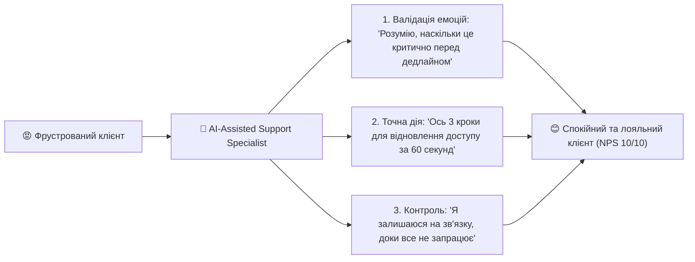

# Урок 121: Емпатична, але точна комунікація в клієнтській підтримці

## 1. Баланс між теплотою (Empathy) та інженерною точністю (Precision)

У сфері підтримки клієнтів часто спостерігаються два протилежні перекоси:
1. **Надмірна емоційність без рішення**: Оператор надсилає 5 вибачень, пише «як ми вас розуміємо», але не надає чіткої технічної інструкції, що викликає у клієнта ще більше роздратування.
2. **Суха технічна бездушність**: Оператор кидає сухий код помилки або витяг з документації без жодного прояву людяності, через що клієнт почувається покинутим напризволяще.

**Емпатично-точна комунікація (Empathetic Precision)** — це синергія, коли співчуття визнає та валідує емоції людини, а бездоганна технічна точність миттєво знімає першопричину стресу.

---

## 2. Фреймворк валідації емоцій (Hear-Empathize-Analyze-Resolve)

### Етапи HEAR:
- **H (Hear)**: Уважно вислухати та виокремити біль клієнта без перебивання.
- **E (Empathize)**: Назвати емоцію та підтвердити її природність (*«Це дійсно дуже неприємна ситуація, коли платіж підвисає під час термінової угоди»*).
- **A (Analyze)**: Швидко розібрати логи, транзакції чи системні події.
- **R (Resolve)**: Надати точний алгоритм вирішення з конкретними термінами та гарантією підтримки.

---

## 3. Використання AI для балансування чернеток

AI виступає ідеальним модератором тону:
- **Tone Equalizer**: AI вирівнює баланс, додаючи людяності до надто сухих інженерних відповідей та прибираючи «воду» з надмірно емоційних листів.
- **Детекція фальшивої емпатії**: AI відловлює шаблонні беззмістовні фрази на кшталт «Ваша думка дуже важлива для нас» і замінює їх на автентичні живі висловлювання.
