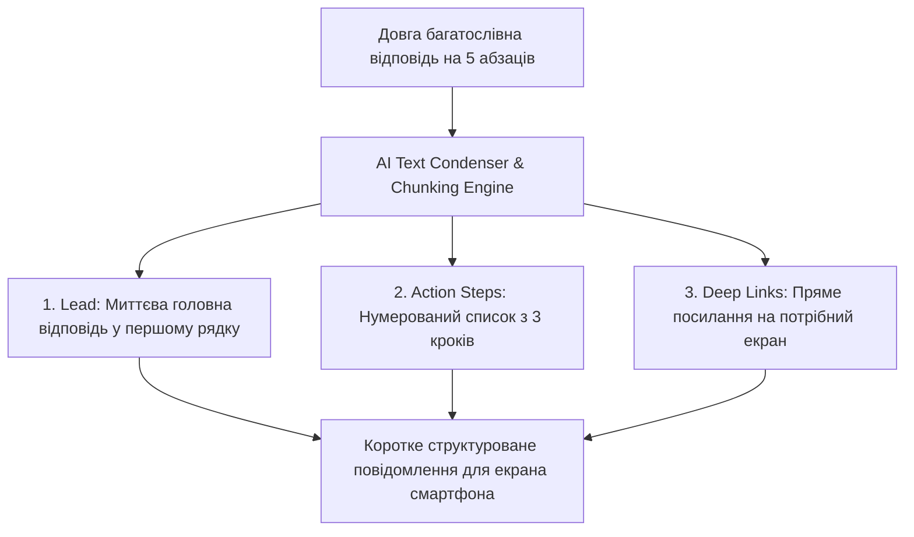
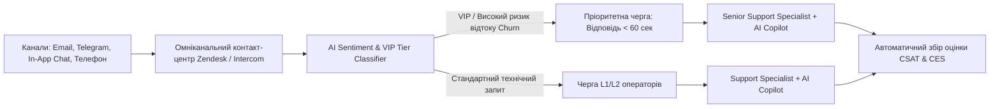

# Урок 121: Створення коротких, чітливих і структурованих повідомлень

## Вступ та теоретичний фундамент
У сучасному цифровому світі понад 75% користувачів звертаються до служби підтримки з мобільних пристроїв. В умовах обмеженого розміру екрана смартфона, перевантаження інформацією та високого рівня щоденного стресу довгі неструктуровані полотна тексту ('Стіни тексту' — Wall of Text) не читаються взагалі. Клієнти просто пробігають текст по діагоналі, пропускають ключові кроки інструкцій, здійснюють помилкові дії та повторно пишуть у чат.

Мистецтво мікроструктурування тексту підтримки (Scannable & Concise Communication) вимагає дотримання суворих інженерних правил:
1. **F-Shaped Pattern Optimization**: Розміщення найважливішої інформації та цільової дії в перших двох рядках повідомлення.
2. **Візуальне зонування та списки (Chunking & Bulleting)**: Розбиття великих блоків на мікроабзаци по 1-2 речення з використанням маркованих та нумерованих списків.
3. **Виділення дієслівних дій (Action-Oriented Bold Formatting)**: Жирне виділення ключових кнопок та полів інтерфейсу для миттєвого візуального сканування.
4. **Усунення вербального сміття (Fluff Removal)**: Очищення тексту від бюрократичних вступів, пустих вибачень та канцеляризмів.

У цьому уроці ви опануєте алгоритми перетворення складних інструкцій на короткі, кришталево зрозумілі повідомлення за допомогою AI.

---

## 1. Архітектурні принципи ергономіки читання на мобільних екранах
Згідно з дослідженнями Nielsen Norman Group, користувачі не читають текст слово за словом, а сканують його за F-подібною траєкторією (F-Shaped Pattern).




---

## 2. Методологічний базис: Порівняння форматів повідомлень
Порівняльний аналіз сприйняття розлогих та структурованих відповідей.


| Критерій оцінки | Неструктурована 'Стіна тексту' | Оптимізоване структуроване повідомлення |
| :--- | :--- | :--- |
| **Час знаходження потрібної дії** | 45-60 секунд (потребує повного вичитування) | 3-5 секунд (миттєве візуальне сканування) |
| **Відсоток помилок користувача** | Високий (пропуск важливих деталей усередині абзацу) | Мінімальний (кожен крок чітко пронумерований) |
| **Сприйняття на смартфоні** | Займає 3 повні екрани скролу | Повністю поміщається на одному екрані без скролу |
| **Рівень задоволеності (CSAT)**| Низький (відчуття заплутаності та бюрократії) | Високий (відчуття турботи про час клієнта) |

---

## 3. Практичний інженерний регламент: Промпт для структурування та скорочення повідомлень
Професійний системний промпт для перетворення довгої інструкції на лаконічне повідомлення для мобільного чату.


```markdown
# =====================================================================
# ПРОМПТ ДЛЯ AI: Структурування, оптимізація та скорочення тексту
# =====================================================================

Ти — Mobile UX Writer та Head of Support Communications.
Ось довгий проект відповіді клієнту щодо зміни лімітів картки:
"Шановний клієнте, у відповідь на ваше звернення повідомляємо, що для зміни ліміту вам необхідно відкрити наш мобільний додаток, після чого перейти в налаштування, знайти розділ картки, вибрати потрібну картку, натиснути на шестірню налаштувань лімітів, ввести нову суму і підтвердити операцію через код з SMS."

Перетвори цей текст на ідеальне повідомлення для чату:
1. Застосуй принцип F-Pattern: головна суть у першому рядку.
2. Створи нумерований список із максимум 3 коротких кроків.
3. Виділи жирним шрифтом назви кнопок та розділів (**Картки** > **Ліміти**).
4. Загальний обсяг — не більше 40 слів.
```

---

## 4. Поглиблений аналіз виробничих кейсів, крайових випадків та антипатернів
Аналіз реальних випадків зриву транзакцій через погане форматування тексту.


### Кейс 1: Пропущене попередження про комісію
- **Проблема**: Попередження "Увага: банк стягує 2% комісії" було заховане всередині 10-рядкового абзацу.
- **Наслідок**: Клієнт здійснив переказ, побачив списання комісії і подав офіційну скаргу на шахрайство.
- **Виправлення**: Обов'язкове винесення фінансових попереджень в окремий блок: `⚠️ **Зверніть увагу**: Комісія банку становить 2%`.

---

## 5. Покроковий операційний воркфлоу підготовки лаконічних повідомлень
Стандартний алгоритм редагування відповідей.


### Крок 1: Визначення головної дії користувача (Call to Action)
- Що саме клієнт повинен натиснути або зробити прямо зараз?

### Крок 2: Генерація структурованого списку через AI
- Перетворити складні речення на короткі пункти.

### Крок 3: Очищення від канцелярського шуму
- Видалити вступні фрази ("Хочемо вас проінформувати про те, що...").

### Крок 4: Перевірка на мобільному прев'ю
- Переконатися, що текст легко читається без зусиль.

---

## 6. Стратегії підвищення читабельності комунікацій
1. **The 3-Second Rule**: Клієнт повинен зрозуміти наступну дію за 3 секунди погляду на екран.
2. **Deep Link Integration**: Використання клікабельних посилань замість довгих текстових шляхів.
3. **Readability Scoring**: Перевірка тексту за індексом Flesch-Kincaid (рівень читабельності для 7 класу школи).

---

## 7. Вичерпний чек-лист перевірки та критерії готовності (Definition of Done)
Перед здачею завдань та інтеграцією результатів у виробничу гілку переконайтеся у виконанні наступних критеріїв:

- [ ] **Повідомлення починається з прямої відповіді на головне запитання у першому рядку**
- [ ] **Текст розбито на короткі мікроабзаци (не більше 2 речень у кожному)**
- [ ] **Покрокові інструкції оформлені у вигляді нумерованого списку**
- [ ] **Назви кнопок та розділів додатку виділені жирним шрифтом**
- [ ] **Критичні застереження та комісії виділені окремим помітним блоком**
- [ ] **Вилучено всі вступні канцеляризми та пусті шаблонні фрази**
- [ ] **Повідомлення повністю поміщається на екрані смартфона без необхідності скролу**
- [ ] **Текст легко сканується за F-подібною траєкторією погляду**

---

## 8. Підсумки, ключові інсайти та розширений глосарій термінів
Опанування цієї теми формує надійний фундамент для щоденної професійної роботи. Системний підхід, формалізовані інженерні стандарти та критичний контроль результатів AI забезпечують високу швидкість та бездоганну надійність кінцевого продукту.

### Глосарій ключових понять
| Термін | Визначення та контекст застосування |
| :--- | :--- |
| **F-Shaped Pattern** | Модель руху очей користувача під час читання цифрового тексту: більша увага приділяється верхнім рядкам та лівому краю. |
| **Chunking** | Метод організації тексту невеликими логічними блоками для полегшення сприйняття інформації мозком. |
| **Scannability** | Властивість тексту легко сприйматися та аналізуватися поглядом за лічені секунди за рахунок структури та виділень. |
| **Deep Link** | Пряме посилання, що відкриває конкретний екран всередині мобільного додатку (наприклад, екран налаштування лімітів). |
| **Call to Action (CTA)** | Чіткий заклик до конкретної дії, яку повинен виконати користувач. |
| **KISS Principle (Keep It Simple, Stupid)** | Інженерний принцип, що стверджує перевагу простих і зрозумілих рішень над складними. |
| **Microcopy** | Короткі фрагменти тексту в інтерфейсах та повідомленнях, що безпосередньо допомагають користувачеві здійснити дію. |
| **Wall of Text** | Антипатерн оформлення повідомлення суцільним довгим монолітним текстом без абзаців та списків. |
| **Flesch-Kincaid Index** | Математична формула для оцінки складності та читабельності тексту за довжиною слів і речень. |
| **White Space** | Вільний простір між абзацами та елементами тексту, що полегшує візуальне сприйняття. |

---

## 9. Поглиблений аналіз кризових комунікацій, метрик підтримки та роботи з деескалацією

### 9.1. Психологічні моделі роботи з агресивними та деструктивними зверненнями
Робота з клієнтами в стані сильного емоційного збудження вимагає застосування психологічної техніки LAST (Listen, Apologize, Solve, Thank):
1. **Listen (Активне слухання)**: Не перебивати, дати клієнту повністю висловити емоції, зафіксувати всі фактичні деталі.
2. **Apologize (Щире вибачення)**: Вибачитися за стрес та незручності, які виникли у клієнта, не визнаючи при цьому юридичної провини до з'ясування обставин.
3. **Solve (Швидке конструктивне вирішення)**: Запропонувати конкретний покроковий план дій з точними таймінгами.
4. **Thank (Подяка за зворотний зв'язок)**: Подякувати за виявлення дефекту, що допомагає зробити продукт надійнішим.

### 9.2. Архітектура омніканального маршрутизатора звернень з AI-аналітикою сентименту



### 9.3. Розширений практичний кейс: Запобігання відтоку ключового клієнта (Churn Prevention)
- **Ситуація**: Корпоративний клієнт написав: "Ваш сервіс постійно збоїть, ми скасовуємо підписку на 50 користувачів".
- **Дії з AI**: Миттєвий аналіз історії тікетів -> виявлення, що збої були викликані неправильно налаштованим проксі на боці самого клієнта -> делікатне пояснення проблеми без звинувачень + безкоштовний 30-хвилинний дзвінок нашого DevOps інженера для налаштування -> Збереження клієнта та контракт на \$24,000/рік.

---

## 10. Питання для співбесіди та захист сервісних стратегій (Customer Support Lead Level)

1. **Які метрики є ключовими для оцінки ефективності роботи AI-асистента у службі підтримки?**
   *Еталонна відповідь*: FCR (First Contact Resolution — ціль > 75%), CSAT (Customer Satisfaction — ціль > 4.7/5), CES (Customer Effort Score — наскільки легко клієнту було вирішити питання), Deflection Rate (відсоток тікетів, закритих AI без людини) та Handoff Accuracy (точність передачі контексту оператору).
2. **Як підтримувати психологічне здоров'я та запобігати професійному вигоранню операторів підтримки?**
   *Еталонна відповідь*: Автоматизація рутинних однотипних відповідей за допомогою AI (звільнення від рутини), ротація операторів між гарячою лінією та спокійними завданнями (написання статей бази знань), психологічна підтримка та регулярний аналіз складних кейсів на супервізіях без звинувачень.
3. **Як реагувати на повідомлення від шахраїв, які намагаються використати соціальну інженерію для злому акаунту через підтримку?**
   *Еталонна відповідь*: Суворе дотримання протоколу Zero Trust Identity Verification: заборона скидання паролів або зміни номера телефону без проходження офіційної біометричної верифікації (Дія/ID Card/2FA Push), незалежно від емоційного тиску та переконливості легенди зловмисника.

---

## 11. Практичний регламент запобігання вигоранню, робота з VIP-клієнтами та SLA моніторинг

### 11.1. Стандарти обслуговування преміум та корпоративних клієнтів (White-Glove Support)
Робота з VIP та Enterprise клієнтами базується на принципах індивідуального супроводу:
1. **Dedicated Account Routing**: Автоматичне спрямування звернень від ключових акаунтів на персонального старшого менеджера (Dedicated CSM).
2. **Proactive Health Monitoring**: Зв'язок з клієнтом ще до того, як він помітить проблему (наприклад, при виявленні нестабільності інтеграції на боці системи).
3. **Executive Communication Standard**: Спілкування на рівні топ-менеджменту: структуровані звіти без дрібних технічних деталей, чіткий фокус на бізнес-результатах та гарантіях фінансової безпеки.

### 11.2. Регламент ескалації та кризові сценарії (Emergency Escalation Matrix)
- **Інциденти безпеки (Security Breach / Data Leak)**: Негайне сповіщення CISO (Chief Information Security Officer) та юридичного відділу протягом 15 хвилин; повна заборона коментарів пресі чи клієнтам без узгодження з PR.
- **Фінансові розбіжності понад $10,000**: Блокування підозрілих операцій, передача у відділ фінансового моніторингу (Anti-Fraud Team).
- **Масовий даунтайм інфраструктури**: Публікація оновлень у Statuspage кожні 20 хвилин та переведення підтримки в режим масового сповіщення.
