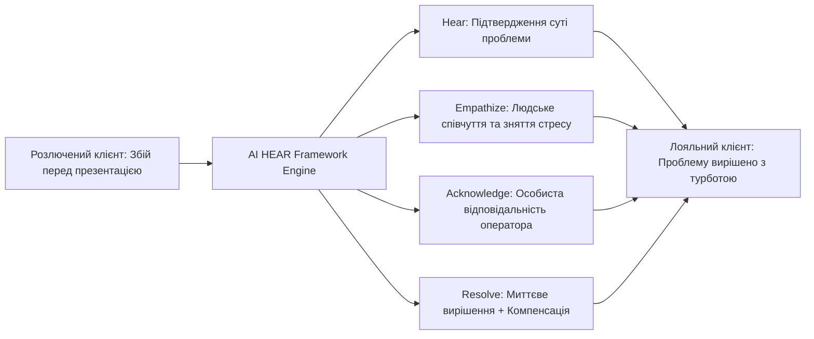
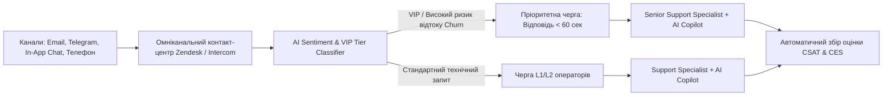

# Урок 122: Персоналізація та виявлення емпатії у згенерованих відповідях

## Вступ та теоретичний фундамент
Справжня якісна підтримка відрізняється від роботи бездушного чат-бота здатністю щиро проявляти людську емпатію, валідувати емоції користувача та надавати глибоко персоналізований сервіс (Hyper-Personalized Empathetic Support). Коли клієнт звертається зі складною проблемою (втрата доступу до акаунту перед важливою презентацією, затримка авіарейсу, помилкове списання грошей), формальна шаблонна відповідь 'Ми передали запит технічному відділу' сприймається як байдужість та зневага.

AI-інструменти нового покоління дозволяють досягти нового рівня персоналізації без втрати швидкості:
1. **Емоційна валідація (Emotional Validation & Mirroring)**: Визнання переживань клієнта природною людською мовою без роботизованого пафосу.
2. **Контекстна персоналізація на базі історії CRM (Contextual CRM Injection)**: Згадування імені клієнта, тривалості його перебування з сервісом (Customer Loyalty), його тарифного плану та попередніх звернень.
3. **Демонстрація персональної власності за проблему (Personal Accountability)**: Перехід від пасивного 'Система перевіряє' до активного 'Я особисто контролюю вирішення вашого питання'.
4. **Проактивна турбота та персональні компенсації (Proactive Delight)**: Нарахування бонусів, персональних промокодів або продовження підписки як щирий жест вибачення за завдані незручності.

У цьому уроці ви опануєте інженерію промптів для генерації щирих, теплих та емпатичних відповідей, що перетворюють розчарованих клієнтів на найвідданіших прихильників бренду.

---

## 1. Архітектурні принципи та психологічна модель емпатичної комунікації HEAR
Фреймворк HEAR (Hear, Empathize, Acknowledge, Resolve) є золотим стандартом емпатичної підтримки:
- **H (Hear)**: Уважно вислухати та показати, що суть проблеми повністю зрозуміла.
- **E (Empathize)**: Висловити щире людське співчуття та валідувати емоцію.
- **A (Acknowledge)**: Визнати відповідальність компанії без виправдань.
- **R (Resolve)**: Надати швидке, чітке та вичерпне вирішення ситуації.




---

## 2. Методологічний базис: Порівняння фальшивої та щирої емпатії
Порівняльний аналіз фраз роботизованої ввічливості та справжньої людської підтримки.


| Роботизована фальшива фраза (Антипатерн) | Чому це дратує клієнта | Щира емпатична фраза (Human-Centric) | Психологічний ефект |
| :--- | :--- | :--- | :--- |
| "Нам дуже шкода за заподіяні незручності" | Заїжджений корпоративний штамп без душі | "Я чудово розумію, як це неприємно, особливо коли сервіс потрібен просто зараз." | Клієнт відчуває, що його чує жива людина |
| "Будь ласка, заспокойтеся, я просто оператор" | Знецінення емоцій та відсторонення | "Андрію, я повністю на вашому боці і особисто розберуся, чому це сталося." | Зняття агресії через спільний фронт |
| "Згідно з пунктом 4.2 нашої оферти..." | Юридична бюрократія та перекладання вини | "Хоча регламент передбачає перевірку до 3 днів, я прискорю це для вас просто зараз." | Відчуття особливого VIP-ставлення |

---

## 3. Практичний інженерний регламент: Промпт для генерації гіперперсоналізованої відповіді
Професійний системний промпт для генерації глибоко персоналізованої відповіді на основі даних CRM.


```markdown
# =====================================================================
# ПРОМПТ ДЛЯ AI: Генерація емпатичної відповіді за фреймворком HEAR
# =====================================================================

Ти — Senior Customer Experience Specialist.
Дані про клієнта з CRM:
- Ім'я: Михайло
- Статус: Користувач тарифу Pro протягом 3 років (Loyal Customer)
- Поточна проблема: Через технічний збій міграції видалився проект, над яким він працював увесь тиждень.

Звернення клієнта: "Ви знищили мою роботу за тиждень! Завтра показ клієнту, а там порожньо! Це кінець!"

Сформуй відповідь:
1. Застосуй фреймворк HEAR: покажи максимальне співчуття та терміновість.
2. Згадай його лояльність (3 роки разом) та підкресли, що для нас це неприпустимий інцидент.
3. Поясни, що інженери вже відновлюють бекап за станом на 18:00 (це займе 25 хвилин).
4. Запропонуй 2 місяці безкоштовного тарифу Enterprise як компенсацію за стрес.
```

---

## 4. Поглиблений аналіз виробничих кейсів, крайових випадків та антипатернів
Аналіз реальних випадків порятунку клієнтської лояльності.


### Кейс 1: Порятунок B2B клієнта з контрактом на $50k/рік
- **Ситуація**: Під час оновлення системи обліку клієнт втратив доступ до панелі замовлень у 'Чорну п'ятницю'.
- **Дії саппорту**: Оператор надав прямий мобільний номер технічного директора, надсилав оновлення кожні 15 хвилин та нарахував компенсацію.
- **Результат**: Клієнт не лише не розірвав договір, а й публічно подякував службі підтримки за професіоналізм у кризовій ситуації.

---

## 5. Покроковий операційний воркфлоу надання емпатичної підтримки
Регламент роботи саппорт-спеціаліста.


### Крок 1: Завантаження профілю та історії клієнта з CRM
- Оцінити статус клієнта, попередній досвід та LTV (Lifetime Value).

### Крок 2: Генерація відповіді за фреймворком HEAR через AI
- Сформувати щиру людську чернетку з персональними акцентами.

### Крок 3: Валідація тону та прийняття персональної відповідальності
- Перевірити відсутність шаблонних фраз та виправдань.

### Крок 4: Пост-інцидентний фолоу-ап (Proactive Check-in)
- Написати клієнту через 24 години після вирішення: "Михайле, вітаю! Перевіряю, чи все працює стабільно після відновлення?".

---

## 6. Стратегії підвищення лояльності клієнтів
1. **Empowerment of Agents**: Надання операторам права нараховувати до $50 компенсації самостійно без погодження з керівництвом.
2. **Proactive Apology Outreaches**: Автоматична розсилка персональних листів з вибаченнями всім користувачам, які постраждали від технічного збою.
3. **Sentiment Mirroring Algorithms**: Налаштування AI для підбору лексики, яка найкраще резонує з конкретним клієнтом.

---

## 7. Вичерпний чек-лист перевірки та критерії готовності (Definition of Done)
Перед здачею завдань та інтеграцією результатів у виробничу гілку переконайтеся у виконанні наступних критеріїв:

- [ ] **Відповідь містить щире визнання емоцій клієнта без шаблонних фраз (HEAR Framework)**
- [ ] **Використано ім'я клієнта та враховано історію його попередньої взаємодії**
- [ ] **Оператор бере особисту відповідальність за вирішення проблеми на себе**
- [ ] **Повністю відсутні виправдання, звинувачення третіх сторін або клієнта**
- [ ] **Запропоновано конкретне рішення або призначено персональну компенсацію**
- [ ] **Тон повідомлення теплий, людяний, турботливий та професійний**
- [ ] **Заплановано проактивний контакт (Follow-up) через 24 години для перевірки стану**
- [ ] **Клієнт відчуває, що його проблема є найвищим пріоритетом для компанії**

---

## 8. Підсумки, ключові інсайти та розширений глосарій термінів
Опанування цієї теми формує надійний фундамент для щоденної професійної роботи. Системний підхід, формалізовані інженерні стандарти та критичний контроль результатів AI забезпечують високу швидкість та бездоганну надійність кінцевого продукту.

### Глосарій ключових понять
| Термін | Визначення та контекст застосування |
| :--- | :--- |
| **Empathetic Support** | Служба підтримки, що ставить на перше місце емоційний стан, розуміння та повагу до клієнта. |
| **HEAR Framework** | Методологія побудови емпатичного діалогу: Hear (почути), Empathize (проявити емпатію), Acknowledge (визнати), Resolve (вирішити). |
| **Hyper-Personalization** | Глибока персоналізація комунікації на основі детальної історії поведінки, покупок та звернень клієнта в CRM. |
| **Customer Lifetime Value (LTV)** | Сукупний прогнозований прибуток, який компанія отримує від клієнта за весь період співпраці. |
| **Emotional Validation** | Психологічний процес визнання та прийняття емоційного стану співрозмовника як цілком виправданого. |
| **Proactive Follow-Up** | Повторне звернення до клієнта з власної ініціативи компанії для перевірки якості роботи сервісу після вирішення проблеми. |
| **Agent Empowerment** | Надання співробітникам першої лінії підтримки повноважень самостійно приймати рішення про компенсації та знижки. |
| **Tone Mirroring** | Комунікаційна техніка підлаштування темпу та стилю мовлення під співрозмовника для створення рапорту. |
| **Service Recovery Paradox** | Психологічний феномен, коли клієнт, чия проблема була вирішена блискуче, стає лояльнішим, ніж клієнт, який не стикався з проблемами. |
| **CRM Context Injection** | Автоматичне підтягування атрибутів клієнта з бази даних у системний промпт мовної моделі. |

---

## 9. Поглиблений аналіз кризових комунікацій, метрик підтримки та роботи з деескалацією

### 9.1. Психологічні моделі роботи з агресивними та деструктивними зверненнями
Робота з клієнтами в стані сильного емоційного збудження вимагає застосування психологічної техніки LAST (Listen, Apologize, Solve, Thank):
1. **Listen (Активне слухання)**: Не перебивати, дати клієнту повністю висловити емоції, зафіксувати всі фактичні деталі.
2. **Apologize (Щире вибачення)**: Вибачитися за стрес та незручності, які виникли у клієнта, не визнаючи при цьому юридичної провини до з'ясування обставин.
3. **Solve (Швидке конструктивне вирішення)**: Запропонувати конкретний покроковий план дій з точними таймінгами.
4. **Thank (Подяка за зворотний зв'язок)**: Подякувати за виявлення дефекту, що допомагає зробити продукт надійнішим.

### 9.2. Архітектура омніканального маршрутизатора звернень з AI-аналітикою сентименту



### 9.3. Розширений практичний кейс: Запобігання відтоку ключового клієнта (Churn Prevention)
- **Ситуація**: Корпоративний клієнт написав: "Ваш сервіс постійно збоїть, ми скасовуємо підписку на 50 користувачів".
- **Дії з AI**: Миттєвий аналіз історії тікетів -> виявлення, що збої були викликані неправильно налаштованим проксі на боці самого клієнта -> делікатне пояснення проблеми без звинувачень + безкоштовний 30-хвилинний дзвінок нашого DevOps інженера для налаштування -> Збереження клієнта та контракт на \$24,000/рік.

---

## 10. Питання для співбесіди та захист сервісних стратегій (Customer Support Lead Level)

1. **Які метрики є ключовими для оцінки ефективності роботи AI-асистента у службі підтримки?**
   *Еталонна відповідь*: FCR (First Contact Resolution — ціль > 75%), CSAT (Customer Satisfaction — ціль > 4.7/5), CES (Customer Effort Score — наскільки легко клієнту було вирішити питання), Deflection Rate (відсоток тікетів, закритих AI без людини) та Handoff Accuracy (точність передачі контексту оператору).
2. **Як підтримувати психологічне здоров'я та запобігати професійному вигоранню операторів підтримки?**
   *Еталонна відповідь*: Автоматизація рутинних однотипних відповідей за допомогою AI (звільнення від рутини), ротація операторів між гарячою лінією та спокійними завданнями (написання статей бази знань), психологічна підтримка та регулярний аналіз складних кейсів на супервізіях без звинувачень.
3. **Як реагувати на повідомлення від шахраїв, які намагаються використати соціальну інженерію для злому акаунту через підтримку?**
   *Еталонна відповідь*: Суворе дотримання протоколу Zero Trust Identity Verification: заборона скидання паролів або зміни номера телефону без проходження офіційної біометричної верифікації (Дія/ID Card/2FA Push), незалежно від емоційного тиску та переконливості легенди зловмисника.

---

## 11. Практичний регламент запобігання вигоранню, робота з VIP-клієнтами та SLA моніторинг

### 11.1. Стандарти обслуговування преміум та корпоративних клієнтів (White-Glove Support)
Робота з VIP та Enterprise клієнтами базується на принципах індивідуального супроводу:
1. **Dedicated Account Routing**: Автоматичне спрямування звернень від ключових акаунтів на персонального старшого менеджера (Dedicated CSM).
2. **Proactive Health Monitoring**: Зв'язок з клієнтом ще до того, як він помітить проблему (наприклад, при виявленні нестабільності інтеграції на боці системи).
3. **Executive Communication Standard**: Спілкування на рівні топ-менеджменту: структуровані звіти без дрібних технічних деталей, чіткий фокус на бізнес-результатах та гарантіях фінансової безпеки.

### 11.2. Регламент ескалації та кризові сценарії (Emergency Escalation Matrix)
- **Інциденти безпеки (Security Breach / Data Leak)**: Негайне сповіщення CISO (Chief Information Security Officer) та юридичного відділу протягом 15 хвилин; повна заборона коментарів пресі чи клієнтам без узгодження з PR.
- **Фінансові розбіжності понад $10,000**: Блокування підозрілих операцій, передача у відділ фінансового моніторингу (Anti-Fraud Team).
- **Масовий даунтайм інфраструктури**: Публікація оновлень у Statuspage кожні 20 хвилин та переведення підтримки в режим масового сповіщення.
