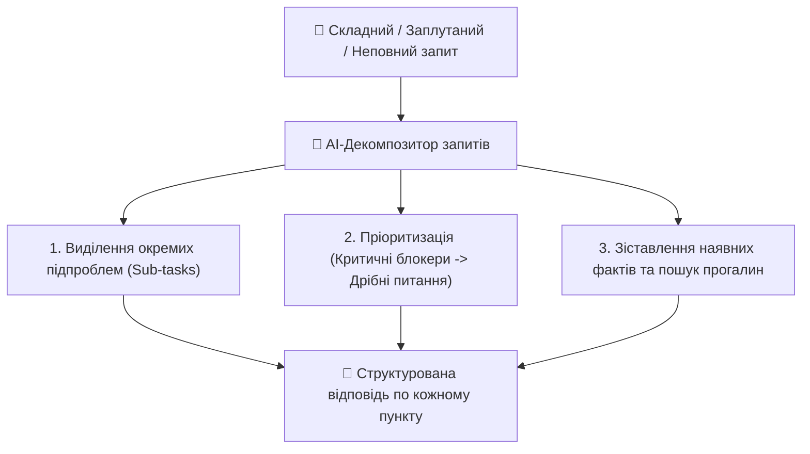

# Урок 122: Робота зі складними та неповними запитами

## 1. Типологія неповних та заплутаних звернень

У щоденній практиці клієнтської підтримки до 40% звернень надходять у дефектному або заплутаному вигляді:
- **Запит-пустушка**: «Не працює» або «Допоможіть» без жодного контексту.
- **Багатоскладовий монолог**: Довгий емоційний лист на 5 сторінок, де змішані 4 різні проблеми (оплата, збій додатку, скарга на кур'єра та питання щодо майбутнього оновлення).
- **Суперечливий запит**: Клієнт стверджує, що оплатив замовлення, але прикріплює скріншот з помилкою «Недостатньо коштів».
- **Запит з хибним діагнозом (XY Problem)**: Користувач просить змінити системний файл конфігурації, намагаючись насправді просто поміняти тему оформлення.

---

## 2. Методологія «Декомпозиція та Нумерація» (Split & Solve)

Коли клієнт надсилає потік думок з кількома питаннями, найкраща тактика — структурувати відповідь за пунктами, використовуючи цитування:

### Алгоритм Split & Solve:
1. **Подяка та підсумок**: «Вітаю! Бачу, що у вас виникло кілька важливих питань. Розберу кожне з них по черзі:»
2. **Блок 1 (Термінове / Фінанси)**: Вирішення блокуючої проблеми №1.
3. **Блок 2 (Технічний баг)**: Інструкція щодо усунення помилки №2.
4. **Блок 3 (Загальне питання)**: Відповідь щодо планів розвитку функції №3.
5. **Загальний підсумок та CTA**.

---

## 3. Використання AI для розбору заплутаних запитів

Сучасні LLM демонструють видатні здібності у розплутуванні хаотичного тексту:
- **Екстракція сутностей (Entity Extraction)**: Витягування номерів замовлень, дат, адрес, помилок та імен з неструктурованого листа.
- **Побудова чекліста невідповідностей**: AI зіставляє слова клієнта з прикріпленими файлами або логами та підказує оператору, де криється логічна суперечність.
