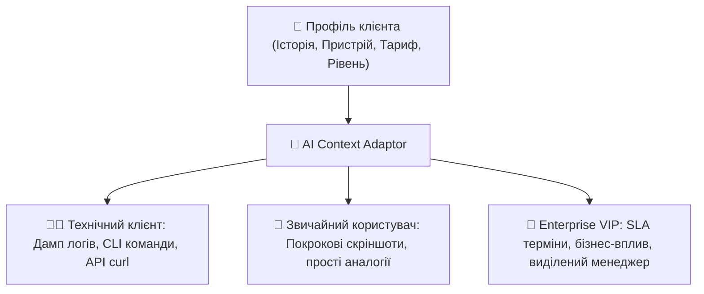

# Урок 123: Адаптація відповіді під контекст клієнта

## 1. Контекстна персоналізація у клієнтському сервісі

Шаблонні відповіді («копіпаст») викликають у сучасних користувачів стійке відторгнення. Справжня майстерність саппорт-спеціаліста полягає в **контекстній адаптації (Context-Aware Support)** — здатності миттєво підлаштувати мову, рівень деталізації та структуру відповіді під унікальний профіль клієнта.

### Ключові виміри клієнтського контексту:
1. **Технічна зрілість (Tech Literacy)**: Бабуся-пенсіонерка vs Senior DevOps архітектор.
2. **Тип пристрою та середовище**: Safari на iOS vs Chrome на Windows vs Terminal CLI на Linux.
3. **Бізнес-статус клієнта**: Безкоштовний користувач (Free Tier) vs Enterprise VIP клієнт з виділеним SLA.
4. **Історія взаємодії**: Новачок на онбордингу vs клієнт, який пише вже вдесяте через хронічний баг.

---

## 2. Матриця адаптації стилю під профіль користувача

| Профіль клієнта | Чого очікує | Як відповідати | Приклад команди / пояснення |
| :--- | :--- | :--- | :--- |
| **Non-tech (Початківець)** | Простоти, терпіння, відсутності заплутаних слів | Короткі кроки, візуальні орієнтири за кольором та формою іконок | «Натисніть на синій значок із шестірнею у верхньому правому кутку екрана» |
| **Tech Pro (Інженер / Розробник)** | Швидкості, конкретики, доступу до логів | Інженерні терміни, готові CLI команди або cURL запити | `curl -X POST https://api.site.com/v1/auth -H "Authorization: Bearer $TOKEN"` |
| **Enterprise / VIP** | Безпеки, гарантій, дотримання SLA | Офіційний діловий стиль, вказівка відповідальних та термінів усунення | «Інцидент локалізовано інженерною групою L3. Повний RCR звіт буде надано до 17:00 UTC» |

---

## 3. Використання AI для динамічної персоналізації

Генеративні мовні моделі здатні миттєво трансформувати одну й ту саму технічну інструкцію під різні аудиторії:
- **Style Shifter Prompt**: «Ось інструкція з очищення DNS-кешу. Перепиши її у двох варіантах: 1) Для початківця на Windows 11 з поясненням простими словами; 2) Для системного адміністратора Linux через `systemd-resolved`».
- **Автоматична підстановка персональних даних**: інтеграція з CRM системою для автоматичного врахування імені, поточної версії ОС та активного тарифного плану.
