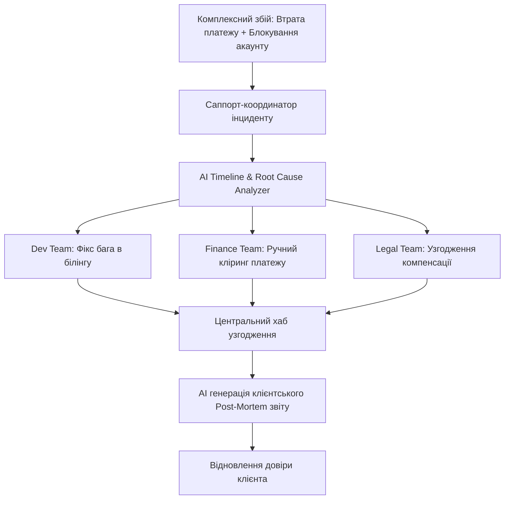
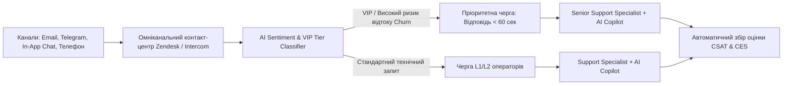

# Урок 123: Робота з багаторівневими проблемами та комплексними кейсами

## Вступ та теоретичний фундамент
Обробка складних, багаторівневих та нестандартних інцидентів (Complex Case Management & Cross-Functional Escalations) — це вершина професійної майстерності спеціаліста клієнтської підтримки. Такі кейси рідко вкладаються в рамки одного відділу: вони одночасно зачіпають технічні баги в коді, збої банківських шлюзів, юридичні претензії, порушення умов доставки та високий рівень репутаційного ризику.

У таких ситуаціях саппорт-спеціаліст виступає в ролі кризового менеджера (Incident Coordinator), який координує роботу інженерів, юристів, фінансистів та веде прозору комунікацію з клієнтом.

Штучний інтелект стає незамінним інструментом при розслідуванні таких інцидентів:
1. **Синтез розрізненої хронології подій (Incident Timeline Reconstruction)**: Об'єднання логів серверів, аудіозаписів дзвінків, переписки в чатах та банківських виписок у єдину хронологічну лінію.
2. **Аналіз першопричин за методом '5 Чому' (5 Whys Root Cause Analysis)**: Глибоке розслідування факторів, що призвели до системного збою.
3. **Генерація офіційних звітів про інцидент (Post-Mortem & Incident Reports)**: Створення професійних звітів для клієнтів та керівництва.
4. **Складання плану запобігання рецидивам (Corrective & Preventive Actions — CAPA)**: Формування задач для продуктової команди, щоб подібна проблема ніколи не повторилася.

У цьому уроці ви опануєте алгоритми ведення складних ескалаційних кейсів за допомогою AI, методики крос-функціональної взаємодії та складання клієнтських Post-Mortem звітів.

---

## 1. Архітектурні принципи та матриця крос-функціональної ескалації
Керування комплексними кейсами будується на чіткому регламенті взаємодії суміжних підрозділів (Incident Management Protocol).




---

## 2. Методологічний базис: Порівняння рівнів критичності інцидентів (P1-P4)
Класифікація комплексних проблем за рівнем впливу на бізнес.


| Рівень інциденту | Критерій оцінки | Задіяні команди | Регламент оновлення клієнта |
| :--- | :--- | :--- | :--- |
| **P1: Major Outage** | Масовий збій, повна зупинка платежів для всіх клієнтів | C-Level, DevOps, Backend, Support, PR | Кожні 15-30 хвилин у публічному Statuspage |
| **P2: Critical VIP** | Повний параліч роботи одного ключового корпоративного клієнта | Lead Engineer, Account Manager, Senior Support | Кожні 60 хвилин персонально через дзвінок/чат |
| **P3: Complex Edge Bug**| Складна проблема для окремого користувача з обхідним шляхом | Support L2, QA, Developer | Раз на добу з детальним прогресом |
| **P4: Minor Discrepancy**| Дрібні розбіжності у звітності без зупинки процесів | Support L1/L2 | Протягом стандартного SLA (2-3 дні) |

---

## 3. Практичний інженерний регламент: Еталонний клієнтський Post-Mortem звіт
Приклад високопрофесійного звіту про інцидент, згенерованого AI для корпоративного клієнта.


```markdown
# Офіційний звіт про інцидент (Incident Post-Mortem)
**Для компанії: ТОВ "АгроХолдинг Груп"**
**Дата інциденту: 18 вересня 2025 року**
**Статус: Повністю вирішено, впроваджено превентивні заходи**

---

## 1. Резюме інциденту (Executive Summary)
18 вересня о 09:15 UTC під час масової виплати заробітної плати виникла помилка синхронізації з банківським шлюзом, внаслідок чого 42 транзакції перейшли у статус `PENDING_TIMEOUT`. Роботу платіжного модуля було повністю відновлено о 11:30 UTC. Усі кошти успішно зараховані співробітникам. Жодних фінансових втрат не зафіксовано.

---

## 2. Хронологія подій (Timeline)
- **09:15 UTC**: Банківський шлюз відповів помилкою HTTP 504 Gateway Timeout під час пікового навантаження.
- **09:25 UTC**: Отримано звернення від фінансового директора клієнта; інциденту присвоєно пріоритет P2.
- **09:40 UTC**: Інженерна команда виявила збійний механізм повторних спроб (Retry Loop) та заблокувала завислі транзакції від дублювання.
- **10:45 UTC**: Проведено ручну звірку реєстрів між банком та нашою БД.
- **11:30 UTC**: Транзакції успішно проведені, доступ клієнта повністю відновлено.

---

## 3. Першопричина (Root Cause Analysis - 5 Whys)
Збій стався через відсутність експоненціальної затримки (Exponential Backoff) у черзі повторних запитів до банку під час тимчасового падіння мережевого з'єднання, що спричинило переповнення пулу з'єднань.

---

## 4. Вжиті превентивні заходи (Corrective & Preventive Actions)
1. Впроваджено алгоритм Exponential Backoff with Jitter для всіх банківських запитів.
2. Збільшено ліміт таймауту очікування відповіді шлюзу з 30 до 90 секунд.
3. Нараховано сервісний кредит у розмірі 50% місячної вартості обслуговування за порушення SLA.
```

---

## 4. Поглиблений аналіз виробничих кейсів, крайових випадків та антипатернів
Аналіз реальних кризових інцидентів у службах підтримки.


### Кейс 1: Антипатерн "Тиша в ефірі" (Radio Silence Catastrophe)
- **Проблема**: Під час 3-годинного збою системи підтримка не відповідала клієнтам, очікуючи фінального звіту від розробників.
- **Наслідок**: Клієнти вирішили, що компанія збанкрутувала, і почали масово вимагати чарджбеки у банках.
- **Виправлення**: Правило обов'язкових регулярних оновлень (Heartbeat Updates): навіть якщо прогресу немає, повідомляти кожні 30 хвилин: "Ми продовжуємо роботу, наступне оновлення о 14:00".

### Кейс 2: Публічне звинувачення партнерів
- **Проблема**: Саппорт написав клієнту: "Це не наша провина, це банк ПриватБанк зламав API".
- **Наслідок**: Втрата репутації надійного інтегратора. Клієнт платить нашому сервісу, і для нього відповідальність несемо саме ми.

---

## 5. Покроковий операційний воркфлоу ведення комплексного кейсу
Стандартна операційна процедура кризового менеджера підтримки.


### Крок 1: Ініціація кризового тікета та призначення координатора
- Зафіксувати всі симптоми, ідентифікатори та створити спільний канал інциденту в Slack.

### Крок 2: Збір хронології за допомогою AI
- Завантажити системні логи та скласти таймлайн подій.

### Крок 3: Координація з розробниками та фінансистами
- Поставити пріоритетні завдання суміжним відділам.

### Крок 4: Постійне інформування клієнта (Heartbeat Updates)
- Надсилати регулярні повідомлення про статус робіт.

### Крок 5: Підготовка та презентація фінального Post-Mortem звіту
- Надати вичерпний звіт із переліком впроваджених запобіжних заходів.

---

## 6. Стратегії підвищення стійкості до кризових ситуацій
1. **Blameless Post-Mortem Culture**: Культура аналізу помилок без пошуку винних, сфокусована на вдосконаленні системних процесів.
2. **Automated Incident Runbooks**: Готові інструкції дій для кожного типу аварії в базі знань Notion/Confluence.
3. **Escalation Drills**: Регулярні тренування команди підтримки з імітацією масових збоїв та ескалацій.

---

## 7. Вичерпний чек-лист перевірки та критерії готовності (Definition of Done)
Перед здачею завдань та інтеграцією результатів у виробничу гілку переконайтеся у виконанні наступних критеріїв:

- [ ] **Створено єдиний таймлайн подій з точністю до хвилин за допомогою AI**
- [ ] **Проведено аналіз першопричини за методом '5 Чому' (Root Cause Analysis)**
- [ ] **Клієнту надавалися регулярні оновлення статусу без виникнення 'тиші в ефірі'**
- [ ] **Компанія взяла повну відповідальність на себе без звинувачення зовнішніх партнерів**
- [ ] **Підготовлено офіційний клієнтський Post-Mortem звіт за стандартом галузі**
- [ ] **Сформовано конкретний список запобіжних заходів (CAPA) для розробників**
- [ ] **Узгоджено та нараховано справедливу компенсацію за порушення умов SLA**
- [ ] **Клієнт підтвердив повне відновлення працездатності та відсутність претензій**

---

## 8. Підсумки, ключові інсайти та розширений глосарій термінів
Опанування цієї теми формує надійний фундамент для щоденної професійної роботи. Системний підхід, формалізовані інженерні стандарти та критичний контроль результатів AI забезпечують високу швидкість та бездоганну надійність кінцевого продукту.

### Глосарій ключових понять
| Термін | Визначення та контекст застосування |
| :--- | :--- |
| **Complex Case Management** | Процес координації та вирішення складних клієнтських інцидентів, що вимагають залучення кількох відділів компанії. |
| **Post-Mortem Report** | Офіційний аналітичний документ, що підсумовує причини, перебіг, наслідки та заходи запобігання системному збою. |
| **5 Whys Analysis** | Методологія пошуку першопричини проблеми шляхом послідовної п'ятикратної постановки запитання 'Чому це сталося?'. |
| **CAPA (Corrective and Preventive Actions)** | Система коригувальних та запобіжних дій для усунення причин виявлених дефектів та невідповідностей. |
| **Exponential Backoff** | Алгоритм поступового збільшення інтервалу між повторними спробами відправки мережевих запитів під час збою. |
| **Heartbeat Update** | Регулярне коротке інформаційне повідомлення клієнту про поточний стан робіт, навіть якщо ситуація ще не вирішена. |
| **Radio Silence** | Комунікаційний провал, коли служба підтримки перестає виходити на зв'язок з клієнтом під час тривалої аварії. |
| **Blameless Culture** | Корпоративна культура розслідування аварій, спрямована на пошук системних вразливостей, а не покарання людей. |
| **SLA Breach** | Порушення гарантованого угодою часу доступності системи або швидкості вирішення інциденту. |
| **Cross-Functional Escalation** | Передача завдання між різними функціональними командами (розробка, маркетинг, фінанси, юристи) для спільного вирішення. |

---

## 9. Поглиблений аналіз кризових комунікацій, метрик підтримки та роботи з деескалацією

### 9.1. Психологічні моделі роботи з агресивними та деструктивними зверненнями
Робота з клієнтами в стані сильного емоційного збудження вимагає застосування психологічної техніки LAST (Listen, Apologize, Solve, Thank):
1. **Listen (Активне слухання)**: Не перебивати, дати клієнту повністю висловити емоції, зафіксувати всі фактичні деталі.
2. **Apologize (Щире вибачення)**: Вибачитися за стрес та незручності, які виникли у клієнта, не визнаючи при цьому юридичної провини до з'ясування обставин.
3. **Solve (Швидке конструктивне вирішення)**: Запропонувати конкретний покроковий план дій з точними таймінгами.
4. **Thank (Подяка за зворотний зв'язок)**: Подякувати за виявлення дефекту, що допомагає зробити продукт надійнішим.

### 9.2. Архітектура омніканального маршрутизатора звернень з AI-аналітикою сентименту



### 9.3. Розширений практичний кейс: Запобігання відтоку ключового клієнта (Churn Prevention)
- **Ситуація**: Корпоративний клієнт написав: "Ваш сервіс постійно збоїть, ми скасовуємо підписку на 50 користувачів".
- **Дії з AI**: Миттєвий аналіз історії тікетів -> виявлення, що збої були викликані неправильно налаштованим проксі на боці самого клієнта -> делікатне пояснення проблеми без звинувачень + безкоштовний 30-хвилинний дзвінок нашого DevOps інженера для налаштування -> Збереження клієнта та контракт на \$24,000/рік.

---

## 10. Питання для співбесіди та захист сервісних стратегій (Customer Support Lead Level)

1. **Які метрики є ключовими для оцінки ефективності роботи AI-асистента у службі підтримки?**
   *Еталонна відповідь*: FCR (First Contact Resolution — ціль > 75%), CSAT (Customer Satisfaction — ціль > 4.7/5), CES (Customer Effort Score — наскільки легко клієнту було вирішити питання), Deflection Rate (відсоток тікетів, закритих AI без людини) та Handoff Accuracy (точність передачі контексту оператору).
2. **Як підтримувати психологічне здоров'я та запобігати професійному вигоранню операторів підтримки?**
   *Еталонна відповідь*: Автоматизація рутинних однотипних відповідей за допомогою AI (звільнення від рутини), ротація операторів між гарячою лінією та спокійними завданнями (написання статей бази знань), психологічна підтримка та регулярний аналіз складних кейсів на супервізіях без звинувачень.
3. **Як реагувати на повідомлення від шахраїв, які намагаються використати соціальну інженерію для злому акаунту через підтримку?**
   *Еталонна відповідь*: Суворе дотримання протоколу Zero Trust Identity Verification: заборона скидання паролів або зміни номера телефону без проходження офіційної біометричної верифікації (Дія/ID Card/2FA Push), незалежно від емоційного тиску та переконливості легенди зловмисника.

---

## 11. Практичний регламент запобігання вигоранню, робота з VIP-клієнтами та SLA моніторинг

### 11.1. Стандарти обслуговування преміум та корпоративних клієнтів (White-Glove Support)
Робота з VIP та Enterprise клієнтами базується на принципах індивідуального супроводу:
1. **Dedicated Account Routing**: Автоматичне спрямування звернень від ключових акаунтів на персонального старшого менеджера (Dedicated CSM).
2. **Proactive Health Monitoring**: Зв'язок з клієнтом ще до того, як він помітить проблему (наприклад, при виявленні нестабільності інтеграції на боці системи).
3. **Executive Communication Standard**: Спілкування на рівні топ-менеджменту: структуровані звіти без дрібних технічних деталей, чіткий фокус на бізнес-результатах та гарантіях фінансової безпеки.

### 11.2. Регламент ескалації та кризові сценарії (Emergency Escalation Matrix)
- **Інциденти безпеки (Security Breach / Data Leak)**: Негайне сповіщення CISO (Chief Information Security Officer) та юридичного відділу протягом 15 хвилин; повна заборона коментарів пресі чи клієнтам без узгодження з PR.
- **Фінансові розбіжності понад $10,000**: Блокування підозрілих операцій, передача у відділ фінансового моніторингу (Anti-Fraud Team).
- **Масовий даунтайм інфраструктури**: Публікація оновлень у Statuspage кожні 20 хвилин та переведення підтримки в режим масового сповіщення.
