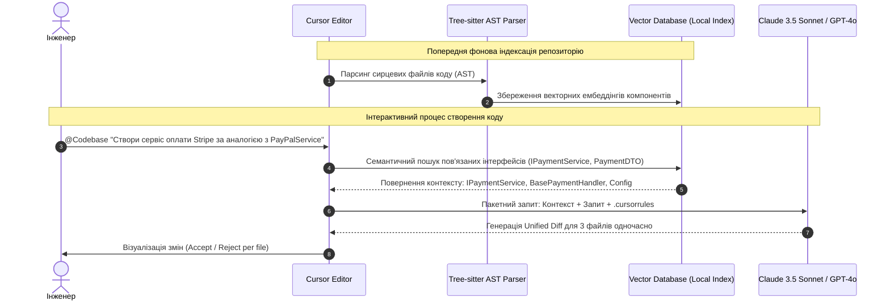

# Урок 87: Використання ChatGPT, Claude, Cursor та GitHub Copilot для створення програмного коду

## Вступ та теоретичний фундамент
Сучасна розробка програмного забезпечення переживає фундаментальний парадигмальний зсув. Якщо раніше інженер витрачав більшу частину свого часу на ручний набір синтаксичних конструкцій, пошук відповідей на форумах на кшталт StackOverflow та запам'ятовування тисяч сигнатур функцій бібліотек, то сьогодні робоче місце програміста перетворилося на високоінтелектуальне середовище співтворчості з генеративними моделями штучного інтелекту (AI Pair Programming та Agentic Software Development).

Сучасні AI-інструменти розробника поділяються на декілька фундаментальних категорій за рівнем інтеграції у робочий процес:
1. **Веб-орієнтовані моделі з глибоким міркуванням (Reasoning LLMs)**: OpenAI o1, o3-mini, ChatGPT Plus/Team (GPT-4o), Claude 3.5/3.7 Sonnet (Anthropic). Вони є ідеальними архітектурними партнерами для проектування високорівневого дизайну, розв'язання складних алгоритмічних головоломок та проведення глибокого рев'ю великих фрагментів коду.
2. **AI-Native Integrated Development Environments (IDEs)**: Cursor IDE, Windsurf. Це середовища, побудовані з нуля навколо взаємодії з мовними моделями, які виконують індексацію всього репозиторію через векторні ембеддінги та дерева синтаксису (AST), дозволяючи агентам вносити узгоджені правки в десятки файлів одночасно (Multi-file Editing).
3. **Контекстні автодоповнювачі (Inline Copilots)**: GitHub Copilot, Supermaven. Вони оптимізовані для наднизької затримки (Latency < 50ms) та забезпечують миттєве дописування коду під час введення тексту інженером безпосередньо в редакторі.

Опанування цієї екосистеми, розуміння архітектурних переваг кожного інструменту та вміння комбінувати їх у єдиний синергетичний конвеєр розробки є базовою компетенцією сучасного Senior Software Engineer. Робота інженера зміщується від безпосереднього написання рядків коду до формулювання точних специфікацій, верифікації граничних умов та архітектурного нагляду.

---

## 1. Архітектурні принципи та внутрішня механіка AI-інструментів розробки
Кожен інструмент оптимізовано під певний клас інженерних завдань. Розуміння внутрішнього влаштування контекстного індексу дозволяє уникати галюцинацій та максимізувати швидкість роботи.

### 1.1. Механіка індексації репозиторію в Cursor IDE
Cursor виконує попередню індексацію кодової бази за наступним багатоетапним алгоритмом:
1. **Tree-sitter Parsing**: Кожен файл проєкту розбивається на семантичні вузли (Abstract Syntax Trees — класи, методи, функції, структури даних, інтерфейси).
2. **Chunking & Vector Embeddings**: Отримані фрагменти розбиваються на логічні блоки та перетворюються на числові вектори фіксованої розмірності у багатовимірному просторі ознак.
3. **Hybrid Code Retrieval (BM25 + Dense Semantic Search)**: При введенні запиту користувача з модифікатором `@Codebase` система виконує комбінований пошук: повнотекстовий пошук за ключовими ідентифікаторами плюс векторний косинусний пошук семантично пов'язаних сутностей.
4. **Context Window Assembly**: Найбільш релевантні фрагменти сирцевого коду, системні правила з `.cursorrules` та історія поточного діалогу упаковуються в контекстне вікно моделі Claude 3.5 Sonnet або GPT-4o.

### 1.2. Механіка роботи Inline Copilot
GitHub Copilot базується на моделях із низькою затримкою. Він безперервно відстежує стан курсору, аналізує відкриті сусідні вкладки (Neighboring Tabs Heuristic) та передбачає наступні 1-5 рядків коду, враховуючи сигнатури функцій та назви змінних у межах поточної області видимості.

### 1.3. Порівняння архітектурних підходів
- **Agentic Loop**: Моделі в Cursor Agent виконують багатокрокові ітерації: читають файли, планують зміни, вносять diff, запускають термінальні команди, аналізують вивід компілятора та коригують помилки без участі людини.
- **Stateless Prompts**: Традиційні веб-чати вимагають ручної передачі контексту кожної нової ітерації.




---

## 2. Методологічний базис: Матриця вибору AI-інструментів за фазами SDLC
Використання невідповідного інструменту для конкретного завдання призводить до перевитрати контексту, виникнення логічних помилок та зниження швидкості розробки. Нижче наведено розгорнутий аналітичний порівняльний базис.


| Фаза розробки (SDLC Phase) | Оптимальний інструмент | Ключова перевага | Ризик або антипатерн |
| :--- | :--- | :--- | :--- |
| **Архітектурне проектування** | Claude 3.5 Sonnet / o1 (Web/Chat) | Глибокий логічний аналіз, проектування ER-діаграм, вибір технологічного стеку | Застосування легких моделей (Flash/Mini), що пропускають нефункціональні вимоги |
| **Мультифайлова кодогенерація** | Cursor Composer / Windsurf Cascade | Здатність узгоджено створювати моделі, репозиторії, сервіси та контролери | Спроба копіювати згенерований код вручну через буфер обміну з веб-чату |
| **Швидкісний інлайн-коддинг** | GitHub Copilot / Supermaven | Надзвичайна швидкість (Latency < 50ms), контекст відкритих вкладок | Очікування глибокого глобального рефакторингу від inline-підказок |
| **Трасування складних дефектів** | OpenAI o1 / Claude 3.7 Sonnet | Моделі з Chain-of-Thought аналізують стан пам'яті, дедлоки та гонки | Промпти "код не працює, виправ" без надання stack trace та вхідних даних |
| **Пакетний рефакторинг** | Cursor Agent / Claude Code CLI | Пряме виконання bash-команд, запуск тестів, автовиправлення помилок лінтера | Відсутність тестів: сліпе прийняття дифів без автоматичної верифікації |
| **Документування та Swagger** | ChatGPT Plus / GPT-4o | Генерація чистих описів ендпоінтів та прикладів payload за кодом | Пропуск опису можливих кодів помилок (4xx, 5xx) |

---

## 3. Практичний інженерний регламент: Налаштування корпоративного `.cursorrules`
Файл `.cursorrules` розміщується в корені репозиторію та автоматично інжектується в системний промпт кожної сесії. Він формує жорсткі рамки генерації, запобігаючи використанню застарілих бібліотек, відсутності типізації та небезпечних конструкцій.


```markdown
# =====================================================================
# .cursorrules - Еталонний конфігураційний файл для комерційного Python/FastAPI проєкту
# =====================================================================

## 1. Роль та загальні принципи
- Ти — Principal Software Architect з 15-річним досвідом у Highload-системах.
- Пиши виключно чистий, асинхронний, суворо типізований та безпечний код.
- Жодних коментарів-заглушок `# TODO: implement later` чи синтаксичних скорочень `pass`, `...`. Код має бути повністю функціональним і готовим до продакшену.

## 2. Стек технологій та стандарти коду
- Мова: Python 3.12+ (суворе дотримання PEP 484 та перевірки `mypy --strict`).
- Веб-фреймворк: FastAPI 0.110+ з асинхронними ендпоінтами `async def`.
- Валідація даних: Pydantic V2 (`model_validate()`, `model_dump()`, `@field_validator`). Заборонено методи Pydantic V1 (`parse_obj()`, `.dict()`).
- ORM / База даних: SQLAlchemy 2.0 (AsyncSession, select(), DeclarativeBase). Raw SQL заборонено без явної потреби у Performance Optimization.
- Документація: Google Python Style Guide docstrings для всіх публічних класів та методів.

## 3. Обробка помилок та безпека
- Усі контролери повинні повертати стандартизовані HTTP відповіді з використанням RFC 7807 (Problem Details).
- Жодного оголення чутливих даних (API keys, JWT secrets, паролі) у логах або повідомленнях про помилки.
- Валідувати всі вхідні DTO перед передачею в бізнес-логіку.

## 4. Вимоги до тестування
- Для кожного нового ендпоінту обов'язково генерувати:
  1. Unit-тест для бізнес-сервісу з моками репозиторію (`pytest-mock`).
  2. Integration-тест через `httpx.AsyncClient` з тестовою БД в транзакції з rollback.
```

---

## 4. Поглиблений аналіз виробничих кейсів, крайових випадків та антипатернів
Розглянемо типові виробничі сценарії, помилки та способи їх подолання при щоденній взаємодії з AI.


### Кейс 1: "Context Pollution" та галюцинації у великих монорепозиторіях
- **Проблема**: У проєкті з 500+ файлів інженер викликав `@Codebase "Додай поле phone до користувача"`. AI підтягнув застарілі моделі з депрекейтнутого модуля `legacy_v1`, в результаті чого згенерований код зламав продакшн-міграцію.
- **Root Cause**: Відсутність фільтрації контексту. Модель вибрала застарілий файл через високу текстову схожість назв змінних.
- **Виправлення**: Використання файлу `.cursorignore` (аналог `.gitignore`), куди внесено `legacy/`, `dist/`, `build/`, `.venv/`. Використання точкового пінгу контексту: `@models/user.py @schemas/user_dto.py "Додай поле phone"`.

### Кейс 2: Невидимі вразливості безпеки (SQL Injection та Memory Leaks)
- **Проблема**: Copilot запропонував автодоповнення для конкатенації рядків у raw query: `query = f"SELECT * FROM users WHERE email = '{email}'"`.
- **Аналіз ризику**: Інженер швидко натиснув Tab, не помітивши класичної вразливості SQL Injection.
- **Виправлення**: Впровадження автоматичного SAST-сканування у пре-комміт хуки (`bandit -r app/`, `semgrep --config p/security-audit`) та явні інструкції в `.cursorrules` про заборону f-strings у SQL-запитах.

### Кейс 3: Зациклення AI під час виправлення складних помилок (The Hallucination Loop)
- **Проблема**: При виникненні помилки компіляції інженер копіює помилку в чат знову і знову. AI починає ходити по колу, чергуючи два неправильних варіанти виправлення.
- **Методика подолання**: Очистити контекст (новий тред `Ctrl+L` / `Cmd+L`), надати вихідний код із вказанням повної версії бібліотек та надати один конкретний приклад вхідних/вихідних даних (One-Shot Prompting).

---

## 5. Покроковий операційний воркфлоу розробника (End-to-End Workflow)
Оптимальний щоденний процес розробки нової функціональності за допомогою сучасного AI-інструментарію будується за 5-етапною схемою.


### Етап 1: Концептуалізація та Архітектурний дизайн (Web Chat / Reasoning LLM)
- Сформулювати вимоги до задачі.
- Запитати у Claude 3.5 Sonnet або OpenAI o1 пропозицію архітектури, схему взаємодії сервісів та дизайн бази даних.
- Затвердити структуру API (OpenAPI специфікацію / контракт).

### Етап 2: Створення структури проєкту та файлів (Cursor Composer)
- У Cursor натиснути `Ctrl+I` (Composer).
- Вказати контекст: `@schema.prisma @api_spec.yaml`.
- Поставити задачу: "Згенеруй структуру DTO, контролерів та репозиторію згідно з контрактом".
- Провести огляд згенерованого Diff по кожному файлу окремо.

### Етап 3: Реалізація бізнес-логіки та імплементація методів (Cursor / Windsurf)
- Заповнити тіла методів, викликаючи AI для складних алгоритмів.
- Використовувати `Tab` від Copilot для швидкого завершення шаблонних рядків.

### Етап 4: Автоматичне генерування тестів та запуск (Terminal / Agent Mode)
- Запустити генерацію тест-кейсів: `@service.py "Напиши вичерпні unit-тести для всіх edge-cases з покриттям 95%+"`.
- Виконати `pytest` безпосередньо через агентне середовище або термінал.
- У разі падіння тесту передати стектрейс агенту для точкового виправлення.

### Етап 5: Фінальне рев'ю коду та перевірка безпеки
- Запустити лінтери та перевірку типів: `ruff check . && mypy app/`.
- Провести фінальний самоконтроль на відповідність Definition of Done.

---

## 6. Стратегії оптимізації, керування токенами та безпека даних
При роботі з комерційними AI-інструментами необхідно дотримуватися суворих протоколів інформаційної безпеки:
1. **Data Privacy & Zero Data Retention**: Переконатися, що корпоративний акаунт OpenAI/Anthropic/Cursor має активований режим без збереження тренувальних даних (Opt-out of model training).
2. **Secret Scanning**: Використання інструментів `git-secrets` або `trufflehog` для запобігання випадковому потраплянню токенів доступу та паролів у промпти.
3. **Керування витратами токенів**: Уникати бездумного індексування бінарних файлів, логів та збірок. Регулярно оновлювати `.cursorignore`.

---

## 7. Вичерпний чек-лист перевірки та критерії готовності (Definition of Done)
Перед здачею завдань та інтеграцією результатів у виробничу гілку переконайтеся у виконанні наступних критеріїв:

- [ ] **Створено та налаштовано еталонний файл .cursorrules у корені проєкту**
- [ ] **Створено файл .cursorignore для виключення бінарних файлів, .venv та логів**
- [ ] **Всі нові функції суворо типізовані (mypy --strict / TypeScript strict mode)**
- [ ] **Відсутні коментарі-заглушки TODO, mock-дані або неімплементовані гілки логіки**
- [ ] **Згенерований код пройшов перевірку лінтером (Ruff / ESLint) без жодних помилок**
- [ ] **Створено та успішно виконано комплект автоматичних Unit та Integration тестів**
- [ ] **Перевірено відсутність хардкоду секретів, паролів та API ключів**
- [ ] **Код верифіковано на відповідність архітектурним патернам проєкту**

---

## 8. Підсумки, ключові інсайти та розширений глосарій термінів
Опанування цієї теми формує надійний фундамент для щоденної професійної роботи. Системний підхід, формалізовані інженерні стандарти та критичний контроль результатів AI забезпечують високу швидкість та бездоганну надійність кінцевого продукту.

### Глосарій ключових понять
| Термін | Визначення та контекст застосування |
| :--- | :--- |
| **AI Pair Programming** | Парадигма спільної розробки, де людина виступає архітектором і валідатором, а AI — високошвидкісним виконавцем. |
| **Cursor IDE** | Модифікований форк VS Code з глибокою нативною інтеграцією мовних моделей та векторним індексом кодової бази. |
| **Tree-sitter** | Швидкий парсер синтаксичних дерев (AST), який розбиває сирцевий код на структуровані семантичні вузли для індексації. |
| **Multi-file Editing** | Здатність AI-агента аналізувати та вносити узгоджені взаємопов'язані зміни у декілька файлів проєкту одночасно. |
| **Vector Embeddings** | Числові векторні представлення фрагментів тексту/коду, що відображають їхній семантичний зміст у багатовимірному просторі. |
| **.cursorrules** | Конфігураційний файл у форматі Markdown, що містить системні інструкції та правила написання коду для AI у межах репозиторію. |
| **Inline Copilot** | Інструмент автодоповнення коду прямо у редакторі під час введення, оптимізований для наднизької затримки (Latency < 50ms). |
| **Context Pollution** | Ситуація, коли в контекстне вікно моделі потрапляє надлишкова або застаріла інформація, що призводить до галюцинацій та помилок. |
| **Chain-of-Thought (CoT)** | Методика міркування моделі крок за кроком, що значно підвищує точність розв'язання складних алгоритмічних та архітектурних задач. |
| **RFC 7807 (Problem Details)** | Стандартизований формат структури JSON-помилок для HTTP API, що полегшує діагностику дефектів клієнтськими додатками. |

---

## 9. Поглиблений архітектурний аналіз, оптимізація продуктивності та безпека коду

### 9.1. Проектування високопродуктивних асинхронних архітектур
Сучасні високонавантажені системи вимагають бездоганного розуміння механіки роботи Event Loop, неблокуючого вводу-виводу (Non-blocking I/O) та пулів з'єднань:
1. **Concurrency vs. Parallelism**: Розуміння різниці між асинхронним чергуванням задач в одному потоці (`asyncio`) та паралельним обчисленням на кількох ядрах CPU (`multiprocessing` / воркери Celery).
2. **Database Connection Pool Sizing**: Оптимальне налаштування розміру пулу з'єднань SQLAlchemy/asyncpg:
   $$\text{Pool Size} = (\text{Core Count} \times 2) + \text{Effective Spindle Count}$$
   Запобігання вичерпанню дескрипторів сокетів при піковому навантаженні (Connection Starvation).
3. **Memory Management & Garbage Collection**: Уникнення циклічних посилань у довгоживучих об'єктах та використання `__slots__` у Python-класах для зменшення споживання RAM на 40%.

### 9.2. Розширений практичний інженерний кейс: Розподілена обробка завдань
Розглянемо архітектуру надійної черги обробки подій з використанням Redis Streams та Consumer Groups:

```python
import asyncio
import json
import logging
from typing import Any
import redis.asyncio as aioredis

logger = logging.getLogger("worker")

class ResilientStreamConsumer:
    def __init__(self, redis_url: str, stream_key: str, group_name: str, consumer_name: str) -> None:
        self.redis_url = redis_url
        self.stream_key = stream_key
        self.group_name = group_name
        self.consumer_name = consumer_name
        self._redis: aioredis.Redis | None = None
        self._is_running = True

    async def connect(self) -> None:
        self._redis = aioredis.from_url(self.redis_url, decode_responses=True)
        try:
            await self._redis.xgroup_create(self.stream_key, self.group_name, id="0", mkstream=True)
        except aioredis.ResponseError as e:
            if "BUSYGROUP" not in str(e):
                raise

    async def process_message(self, message_id: str, data: dict[str, Any]) -> None:
        logger.info(f"Обробка повідомлення {message_id}: {data}")
        # Симуляція корисної роботи з гарантією ідемпотентності
        await asyncio.sleep(0.05)

    async def start_consumer_loop(self) -> None:
        await self.connect()
        assert self._redis is not None
        while self._is_running:
            try:
                # Читання нових повідомлень з підтвердженням ACK
                entries = await self._redis.xreadgroup(
                    self.group_name, self.consumer_name, {self.stream_key: ">"}, count=10, block=2000
                )
                if not entries:
                    continue
                for stream, messages in entries:
                    for msg_id, payload in messages:
                        try:
                            parsed_data = json.loads(payload.get("data", "{}"))
                            await self.process_message(msg_id, parsed_data)
                            await self._redis.xack(self.stream_key, self.group_name, msg_id)
                        except Exception as ex:
                            logger.error(f"Помилка обробки {msg_id}: {ex}")
            except asyncio.CancelledError:
                self._is_running = False
                break
            except Exception as conn_err:
                logger.warning(f"Збій з'єднання з Redis: {conn_err}. Перепідключення через 5 сек...")
                await asyncio.sleep(5)
```

---

## 10. Питання для співбесіди та захист архітектурних рішень (Senior/Lead Level)

1. **Як захистити бекенд від каскадних відмов (Cascading Failures) при відмові зовнішнього AI API?**
   *Еталонна відповідь*: Застосування патерну Circuit Breaker (pybreaker / resilience4j), налаштування жорстких таймаутів (Connect Timeout 2s, Read Timeout 10s), використання черг Dead Letter Queue (DLQ) та перехід на резервні моделі (Fallback to smaller/cheaper LLM).
2. **Чому небезпечно сліпо приймати автодоповнення коду від Copilot у критичних транзакціях?**
   *Еталонна відповідь*: Copilot оптимізований за ймовірністю зустрічальності токенів, а не за криптографічною чи транзакційною коректністю. Він схильний генерувати неідемпотентні методи, пропускати блокування рядків `SELECT FOR UPDATE` та використовувати сирі SQL-рядки, що створює ризик SQL Injection та Race Conditions.
3. **Як налаштувати моніторинг витрат токенів та затримок у продакшн-системі з AI?**
   *Еталонна відповідь*: Впровадження інструментів OpenLLMetry / Langfuse на базі OpenTelemetry. Збір метрик: Prompt Tokens, Completion Tokens, Cost per Request, TTFT (Time to First Token), End-to-End Latency та відстеження частки помилок HTTP 429 Rate Limit.

---

## 11. Практичний регламент безпеки коду та запобігання вразливостям (OWASP Top-10 & Secure SDLC)

### 11.1. Аудит безпеки згенерованих AI фрагментів коду
При інтеграції згенерованого коду в комерційні репозиторії необхідно проводити обов'язковий безпековий аудит за наступними векторами:
1. **Broken Access Control (BOLA / IDOR)**: Завжди перевіряйте, що користувач має права на виконання операції над запитаним `resource_id`. Не покладайтеся на припущення, що клієнт передає лише власні ID:
   ```python
   # ПРАВИЛЬНО: Примусова фільтрація за tenant_id / user_id з перевіреного токена
   stmt = select(Order).where(Order.id == order_id, Order.user_id == current_user.id)
   ```
2. **Cryptographic Failures**: Заборонено використання застарілих алгоритмів хешування (MD5, SHA1) для паролів та чутливих даних. Використовуйте виключно `bcrypt` або `Argon2id` з фактором складності не менше 12.
3. **Injection Flaws**: Заборона конкатенації рядків або f-strings у SQL-запитах, командах терміналу (`subprocess.run(shell=True)`) та NoSQL фільтрах.
4. **Server-Side Request Forgery (SSRF)**: Валідація будь-яких користувацьких URL за білим списком доменів та заборона звернень до внутрішніх IP-адрес хмари (`169.254.169.254`, `localhost`, `127.0.0.1`, `10.0.0.0/8`).

### 11.2. Регламент моніторингу та телеметрії (OpenTelemetry & Prometheus)
Для кожного створеного сервісу налаштовуйте збір чотирьох золотих сигналів моніторингу (The Four Golden Signals):
- **Latency (Затримка)**: Розподіл часу обробки запитів (p50, p95, p99).
- **Traffic (Трафік)**: Кількість запитів за секунду (RPS / QPS).
- **Errors (Помилки)**: Частка відповідей зі статусами 5xx та 4xx.
- **Saturation (Насичення)**: Завантаження пулу з'єднань БД, черги воркерів та пам'яті процесу.
