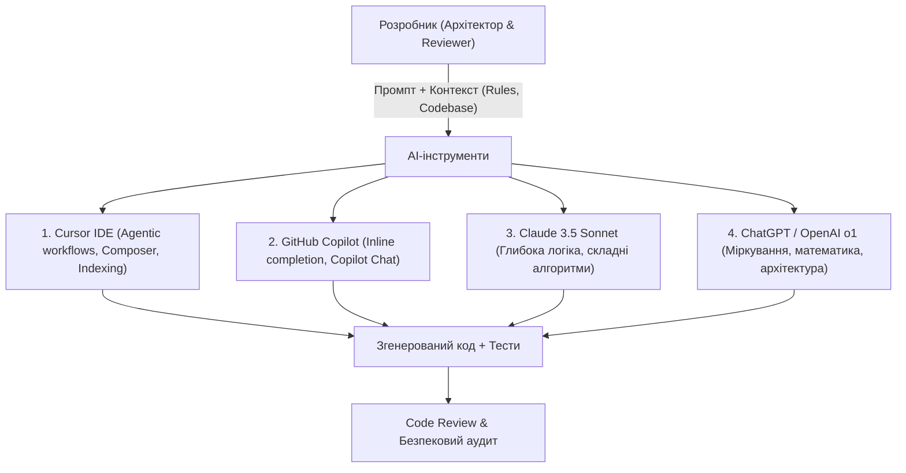

# Урок 87: Використання ChatGPT, Claude, Cursor та GitHub Copilot для створення програмного коду

## 1. Еволюція парадигми розробки: від ручного набору коду до AI-Assisted Development

Сучасна інженерія програмного забезпечення переживає фундаментальну трансформацію. Якщо раніше розробник витрачав 80% часу на механічний набір синтаксису, пошук відповідей на Stack Overflow та вичитку документації до API, то сьогодні провідні розробники працюють у режимі **AI-Assisted / AI-Augmented Engineering**.

Штучний інтелект бере на себе рутинні операції: генерацію бойлерплейт-коду, автодоповнення, трансформацію структур даних, написання тестів та швидке прототипування. Розробник переходить на рівень архітектора, валідатора рішень та постановника завдань (Prompt / Context Engineer).

---

## 2. Порівняльний аналіз ключових AI-інструментів розробника

| Інструмент | Головний фокус та сильні сторони | Оптимальні сценарії використання | Обмеження та особливості |
| :--- | :--- | :--- | :--- |
| **Cursor IDE** | Повна індексація репозиторію (Codebase Indexing), мультифайлове редагування через Composer, розуміння архітектури проєкту. | Розробка складних фіч, рефакторинг кількох сервісів одночасно, робота з великими проєктами. | Потребує переходу на спеціальний форк VS Code, витрати на підписку. |
| **GitHub Copilot** | Безшовна інтеграція у VS Code/JetBrains, блискавичне контекстне автодоповнення (Inline Completion), знання екосистеми GitHub. | Щоденне автодоповнення функцій, коментарів, написання рутинних тестів без виходу з IDE. | Менш ефективний при складних мультифайлових рефакторингах без розширеного контексту. |
| **Claude 3.5 Sonnet** | Неперевершене розуміння логіки, точність дотримання інструкцій, чудова робота з фронтендом (Artifacts, React, Next.js), довгий контекст (200k). | Проєктування складних алгоритмів, аналіз великих стек-трейсів, створення повних компонентів. | Робота через чат або API вимагає копіювання коду в проєкт (якщо не інтегровано в Cursor/Cline). |
| **OpenAI o1 / ChatGPT** | Покрокове логічне мислення (Chain of Thought), вирішення алгоритмічних задач, математика, системне проєктування. | Архітектурні консультації, аналіз безпеки криптографії, алгоритмічні головоломки. | Повільніша генерація (через фазу міркування 'Thinking'), вища ціна запитів. |

---

## 3. Cursor IDE: Повна індексація та агентний підхід

Cursor кардинально відрізняється від простих чат-ботів тим, що він автоматично індексує весь ваш репозиторій за допомогою векторних ембеддінгів (Codebase Embeddings).

### Ключові механіки Cursor:
1. **Символ `@` для точного таргетингу контексту**:
   - `@Files` — додати конкретний файл до запиту.
   - `@Codebase` — семантичний пошук по всій кодовій базі.
   - `@Docs` — підключення офіційної документації сторонніх бібліотек (FastAPI, React, Tailwind, Prisma).
   - `@Web` — пошук найновішої інформації в інтернеті.
2. **Cursor Composer (Ctrl+I / Cmd+I)**: Агентний режим, який самостійно створює, змінює та видаляє кілька файлів одночасно, впроваджуючи цілісну фічу з нуля.
3. **Файли `.cursorrules`**: Корпоративні правила проєкту, які AI читає перед кожною відповіддю (стек технологій, стиль коду, заборонені патерни).

---

## 4. GitHub Copilot: Інлайн-доповнення та Copilot Chat

- **Copilot Inline (Tab-driven development)**: Прогнозування наступного рядка чи блоку коду на основі відкритих вкладок (Tabs Context).
- **Copilot Chat (Slash commands)**:
  - `/explain` — пояснення виділеного фрагмента.
  - `/fix` — пропозиція виправлення виявленого багу чи помилки компіляції.
  - `/tests` — автоматична генерація юніт-тестів для функції.
  - `/doc` — створення документації у форматі Docstring / JSDoc.

---

## 5. Безпека, конфіденційність та інтелектуальна власність

- **Zero Data Retention (ZDR)**: Використання enterprise-налаштувань, де провайдери не мають права зберігати ваш код для навчання своїх публічних моделей.
- **Секрети та змінні оточення**: Категорично заборонено допускати потрапляння `.env` файлів, приватних API-ключів та паролів до бази даних у вікно контексту AI.
