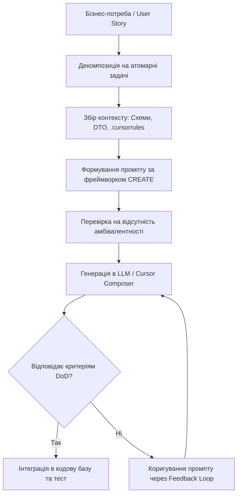

# Урок 88: Формування технічного завдання та контексту для AI

## Вступ та теоретичний фундамент
Якість програмного коду, згенерованого штучним інтелектом, прямо пропорційна якості та структурованості наданого контексту і технічного завдання (ТЗ). Побутує хибне уявлення, що сучасні великі мовні моделі здатні 'додумати' бізнес-логіку або архітектурні обмеження проєкту на основі розмитих фраз. На практиці ж неструктуровані та абстрактні запити неминуче призводять до галюцинацій, використання застарілих бібліотек, пропуску обробки помилок та порушення архітектурних шаблонів.

Інженерна дисципліна формування контексту (Context Engineering) передбачає системне конструювання запиту, що включає:
1. **Рольове позиціонування та системні обмеження (Role & Constraints)**: Чітке визначення архітектурного рівня моделі та заборонених патернів.
2. **Технологічний стек та версійність (Tech Stack & Environment)**: Точне зазначення версій фреймворків (FastAPI 0.110, Pydantic V2, Python 3.12), що відсікає генерацію застарілого синтаксису.
3. **Контракти даних та схеми (Data Contracts & Schemas)**: Передача DTO, SQL-схем або інтерфейсів.
4. **Критерії приймання та Definition of Done (DoD)**: Формалізовані правила успішності генерації (валідація, покриття тестами, формат відповідей).

Оволодіння фреймворками формалізації ТЗ (такими як CREATE, RICE-P, Few-Shot In-Context Learning) дозволяє інженеру отримувати продакшн-готовий код з першої ітерації, мінімізуючи витрати часу на ручний дебаг та повторні запити.

---

## 1. Архітектурні принципи та внутрішня механіка формування контекстного вікна
Мовні моделі функціонують в обмеженому контекстному вікні (Context Window), де кожен токен має вагу уваги (Attention Mechanism). Неструктурований надлишковий текст призводить до явища 'Lost in the Middle' (втрата уваги моделі до інструкцій всередині довгого тексту).

### 1.1. Фреймворк CREATE для формування інженерного ТЗ
Фреймворк CREATE структурує промпт за 6 обов'язковими блоками:
- **C (Context)**: Поточний стан проєкту, архітектурний патерн (Clean Architecture, DDD, CQRS), стек та залежності.
- **R (Role)**: Спеціалізація AI (наприклад, Senior Backend Engineer, DB Performance Specialist).
- **E (Explicit Task)**: Атомарна, точно сформульована задача (без розмитих 'зроби щось з користувачами').
- **A (Architectural Constraints)**: Суворі обмеження (заборона ORM lazy loading, вимога асинхронності, заборона f-strings у SQL).
- **T (Target Output Format)**: Формат результату (Unified Diff, повноцінний Python-файл без скорочень, OpenAPI специфікація).
- **E (Examples & Few-Shot Data)**: Зразки валідного вводу/виводу та приклад сусіднього аналогічного сервісу.




---

## 2. Методологічний базис: Порівняння технік промптингу для розробки
Залежно від складності завдання розробник повинен обирати відповідну техніку інжекції контексту.


| Техніка промптингу | Сутність та механіка | Найкращий контекст використання | Типова помилка |
| :--- | :--- | :--- | :--- |
| **Zero-Shot Prompting** | Запит без надання зразків коду | Створення простих утилітних функцій, регулярних виразів | Очікування дотримання складних архітектурних конвенцій проєкту |
| **Few-Shot In-Context** | Передача 1-3 прикладів існуючих сервісів та тестів | Написання нового ендпоінту за зразком існуючого | Передача застарілого зразка з deprecated синтаксисом |
| **Chain-of-Thought (CoT)** | Вимога покрокового розписування плану перед генерацією | Складні алгоритми, фінансові розрахунки, транзакційна логіка | Пропуск валідації проміжних кроків міркування моделі |
| **Skeleton-of-Thought** | Спочатку генерація інтерфейсів та сигнатур, потім реалізація | Проектування великих модулів та мікросервісів | Спроба згенерувати весь монолітний код в одному промпті |
| **Role-Based Framing** | Надання детального опису компетенцій та ролі | Спеціалізовані задачі: безпека (SAST), оптимізація SQL-планів | Використання шаблонних фраз без конкретних технічних рамок |

---

## 3. Практичний інженерний регламент: Еталонний шаблон ТЗ для генерації мікросервісу
Нижче наведено продакшн-шаблон технічного завдання для AI на створення повноцінного бізнес-модуля білінгу на FastAPI.


```markdown
### КОНТЕКСТ ПРОЄКТУ (Context):
- Репозиторій: FinTech Billing Gateway.
- Архітектура: Hexagonal Architecture (Domain -> Ports -> Adapters).
- Стек: Python 3.12, FastAPI 0.110, SQLAlchemy 2.0 (asyncpg), Pydantic V2, Redis.

### РОЛЬ (Role):
- Ти — Staff Backend Engineer та Security Specialist з досвідом PCI-DSS сертифікації.

### ЗАДАЧА (Explicit Task):
- Реалізувати сервіс списання коштів `WalletService.process_charge(user_id: UUID, amount: Decimal, idempotency_key: str) -> TransactionResult`.

### АРХІТЕКТУРНІ ТА БЕЗПЕКОВІ ОБМЕЖЕННЯ (Constraints):
1. **Ідемпотентність**: Обов'язкова перевірка `idempotency_key` у Redis (TTL = 24h) за допомогою атомарного `SET NX`.
2. **Транзакційність**: Зміна балансу користувача повинна відбуватися всередині транзакції PostgreSQL з блокуванням рядка `SELECT ... FOR UPDATE` для запобігання Race Condition (Double Spending).
3. **Фінансова точність**: Використовувати виключно тип `Decimal` (жодних `float`).
4. **Валідація**: Суми мають бути строго більшими за 0.00 (`amount > Decimal('0.00')`).
5. **Логування**: Логувати всі спроби списання з маскуванням ідентифікаторів карт (якщо передаються) та зазначенням `correlation_id`.
6. **Обробка помилок**: Повертати чіткі доменні винятки (`InsufficientFundsError`, `WalletLockedError`, `DuplicateTransactionError`).

### ФОРМАТ РЕЗУЛЬТАТУ (Output Format):
- Повний код: Domain Exception, SQLAlchemy Model, Repository Interface, Service Implementation, FastAPI Router.
- Жодних скорочень `# TODO` чи коментарів 'допишіть самостійно'.

### ПРИКЛАД ВХІДНИХ/ВИХІДНИХ ДАНИХ (Few-Shot Data):
Вхід: user_id="a1b2c3d4-...", amount=Decimal("150.00"), idempotency_key="tx_req_9988"
Успішна відповідь: TransactionResult(status="COMPLETED", tx_id="...", balance_after=Decimal("850.00"))
```

---

## 4. Поглиблений аналіз виробничих кейсів, крайових випадків та антипатернів
Розглянемо поширені помилки при постановці завдань для AI та методи їх усунення.


### Кейс 1: Антипатерн "Розмитий промпт" (The Vague Prompt Disaster)
- **Невдалий запит**: "Напиши функцію авторизації для користувача".
- **Результат AI**: Модель згенерувала збереження пароля у відкритому вигляді через MD5, зберегла сесію у глобальну змінну в пам'яті процесу та пропустила валідацію пошти.
- **Виправлення**: Застосування чек-листа ТЗ з явною вимогою: "Використовувати bcrypt (cost factor 12), JWT токени (RS256 з приватним/публічним ключем), зберігати refresh токени у Redis з TTL 7 днів".

### Кейс 2: Проблема застарілих сигнатур бібліотек (API Deprecation Drift)
- **Проблема**: При запиті коду для роботи з OpenAI API модель згенерувала застарілий метод `openai.ChatCompletion.create()`, який викликає `AttributeError` у бібліотеці версії 1.0+.
- **Root Cause**: Навчальні ваги моделі містять величезну кількість коду старих версій.
- **Виправлення**: Явна передача версії у промпті та демонстрація актуального виклику клієнта: `from openai import AsyncOpenAI; client = AsyncOpenAI(); await client.chat.completions.create(...)`.

### Кейс 3: Ігнорування крайових випадків у транзакціях
- **Проблема**: AI згенерував перевірку балансу та списання двома окремими неблокуючими SQL-запитами.
- **Наслідок**: Під час навантажувального тестування два одночасні запити призвели до негативного балансу на рахунку.
- **Виправлення**: Додавання до ТЗ вимоги: "Використовувати песимістичне блокування `with_for_update()` у SQLAlchemy або атомарну операцію `UPDATE wallet SET balance = balance - :val WHERE balance >= :val`".

---

## 5. Покроковий операційний воркфлоу підготовки контексту для складних завдань
При роботі над складними завданнями інженер проходить наступні обов'язкові етапи підготовки та передачі контексту.


### Крок 1: Збір контекстних артефактів (Context Harvesting)
- Визначити всі супутні файли: моделі даних, DTO, інтерфейси сховищ, конфігураційні змінні.
- Очистити кодові файли від непотрібної реалізації, залишивши сигнатури типів (Interfaces/Stubs) для економії контексту.

### Крок 2: Формування матриці вимог та обмежень
- Виписати нефункціональні вимоги: затримка (SLA < 100ms), вимоги пам'яті, рівень логування, вимоги до безпеки.

### Крок 3: Створення файлу специфікації або структурованого промпту
- Заповнити структуру фреймворку CREATE.
- Перевірити промпт на наявність протиріч або неоднозначностей.

### Крок 4: Подача в AI-середовище та ітеративна верифікація
- Надіслати промпт у Cursor Composer або Claude.
- Перевірити згенерований план реалізації перед генерацією самого тіла функцій.

### Крок 5: Збереження промпту як шаблону для команди (Prompt Template Library)
- Додати вдало сформований промпт у корпоративну базу знань або `.cursor/prompts/` для повторного використання колегами.

---

## 6. Стратегії оптимізації витрат токенів та управління якістю контексту
1. **Context Window Pruning**: Видалення з контексту великих JSON/HTML файлів, логів збірок та бінарних дампі. Передавати лише типізовані сигнатури.
2. **System Prompt Caching**: Використання підтримки кешування промптів (Prompt Caching в Anthropic/OpenAI) для статичних блоків системних інструкцій проєкту, що знижує вартість запитів на 90% і прискорює генерацію втричі.
3. **Structured Context Serialization**: Передача складних схем у форматі YAML/Pydantic замість багатослівних текстових описів.

---

## 7. Вичерпний чек-лист перевірки та критерії готовності (Definition of Done)
Перед здачею завдань та інтеграцією результатів у виробничу гілку переконайтеся у виконанні наступних критеріїв:

- [ ] **ТЗ містить точну версію технологічного стеку та ключових бібліотек**
- [ ] **Сформульовано роль та архітектурний рівень моделі за фреймворком CREATE**
- [ ] **Передано точні контракти даних (Pydantic/TypeScript інтерфейси або DTO)**
- [ ] **Чітко визначено всі нефункціональні вимоги (асинхронність, безпека, транзакційність)**
- [ ] **Вказано обов'язкові правила обробки помилок та формат повернення статусів**
- [ ] **Надано мінімум один приклад валідного Few-Shot вводу та виводу**
- [ ] **Виключено будь-яку двозначність або абстрактні формулювання вимог**
- [ ] **Збережено шаблон промпту для команди у випадку успішної валідації**

---

## 8. Підсумки, ключові інсайти та розширений глосарій термінів
Опанування цієї теми формує надійний фундамент для щоденної професійної роботи. Системний підхід, формалізовані інженерні стандарти та критичний контроль результатів AI забезпечують високу швидкість та бездоганну надійність кінцевого продукту.

### Глосарій ключових понять
| Термін | Визначення та контекст застосування |
| :--- | :--- |
| **Context Engineering** | Інженерна дисципліна оптимізації та структурування інформації, що передається в LLM для досягнення максимальної якості генерації. |
| **CREATE Framework** | Методологія структуризації промптів (Context, Role, Explicit task, Constraints, Target format, Examples). |
| **Lost in the Middle** | Ефект зниження точності моделі при знаходженні критично важливої інструкції всередині дуже довгого контекстного вікна. |
| **Few-Shot Prompting** | Передача в контекст 1-3 зразків бажаного вводу/виводу для точної фіксації синтаксису та структури відповіді. |
| **Zero-Shot Prompting** | Постановка задачі без надання попередніх прикладів виконання. |
| **Chain-of-Thought (CoT)** | Інструкція моделі міркувати покроково перед наданням фінального коду для підвищення точності логіки. |
| **Prompt Caching** | Технологія повторного використання попередньо обчисленого стану уваги для статичних частин контексту, що зменшує час і вартість запитів. |
| **Idempotency Key** | Унікальний ідентифікатор запиту, що гарантує виконання фінансової або мутаційної операції рівно один раз при повторних відправках. |
| **Pessimistic Locking** | Блокування запису в БД (SELECT FOR UPDATE) на час транзакції для запобігання паралельної зміни іншими процесами. |
| **Attention Mechanism** | Архітектурний компонент нейромереж Transformer, що визначає важливість кожного вхідного токена по відношенню до інших. |

---

## 9. Поглиблений архітектурний аналіз, оптимізація продуктивності та безпека коду

### 9.1. Проектування високопродуктивних асинхронних архітектур
Сучасні високонавантажені системи вимагають бездоганного розуміння механіки роботи Event Loop, неблокуючого вводу-виводу (Non-blocking I/O) та пулів з'єднань:
1. **Concurrency vs. Parallelism**: Розуміння різниці між асинхронним чергуванням задач в одному потоці (`asyncio`) та паралельним обчисленням на кількох ядрах CPU (`multiprocessing` / воркери Celery).
2. **Database Connection Pool Sizing**: Оптимальне налаштування розміру пулу з'єднань SQLAlchemy/asyncpg:
   $$\text{Pool Size} = (\text{Core Count} \times 2) + \text{Effective Spindle Count}$$
   Запобігання вичерпанню дескрипторів сокетів при піковому навантаженні (Connection Starvation).
3. **Memory Management & Garbage Collection**: Уникнення циклічних посилань у довгоживучих об'єктах та використання `__slots__` у Python-класах для зменшення споживання RAM на 40%.

### 9.2. Розширений практичний інженерний кейс: Розподілена обробка завдань
Розглянемо архітектуру надійної черги обробки подій з використанням Redis Streams та Consumer Groups:

```python
import asyncio
import json
import logging
from typing import Any
import redis.asyncio as aioredis

logger = logging.getLogger("worker")

class ResilientStreamConsumer:
    def __init__(self, redis_url: str, stream_key: str, group_name: str, consumer_name: str) -> None:
        self.redis_url = redis_url
        self.stream_key = stream_key
        self.group_name = group_name
        self.consumer_name = consumer_name
        self._redis: aioredis.Redis | None = None
        self._is_running = True

    async def connect(self) -> None:
        self._redis = aioredis.from_url(self.redis_url, decode_responses=True)
        try:
            await self._redis.xgroup_create(self.stream_key, self.group_name, id="0", mkstream=True)
        except aioredis.ResponseError as e:
            if "BUSYGROUP" not in str(e):
                raise

    async def process_message(self, message_id: str, data: dict[str, Any]) -> None:
        logger.info(f"Обробка повідомлення {message_id}: {data}")
        # Симуляція корисної роботи з гарантією ідемпотентності
        await asyncio.sleep(0.05)

    async def start_consumer_loop(self) -> None:
        await self.connect()
        assert self._redis is not None
        while self._is_running:
            try:
                # Читання нових повідомлень з підтвердженням ACK
                entries = await self._redis.xreadgroup(
                    self.group_name, self.consumer_name, {self.stream_key: ">"}, count=10, block=2000
                )
                if not entries:
                    continue
                for stream, messages in entries:
                    for msg_id, payload in messages:
                        try:
                            parsed_data = json.loads(payload.get("data", "{}"))
                            await self.process_message(msg_id, parsed_data)
                            await self._redis.xack(self.stream_key, self.group_name, msg_id)
                        except Exception as ex:
                            logger.error(f"Помилка обробки {msg_id}: {ex}")
            except asyncio.CancelledError:
                self._is_running = False
                break
            except Exception as conn_err:
                logger.warning(f"Збій з'єднання з Redis: {conn_err}. Перепідключення через 5 сек...")
                await asyncio.sleep(5)
```

---

## 10. Питання для співбесіди та захист архітектурних рішень (Senior/Lead Level)

1. **Як захистити бекенд від каскадних відмов (Cascading Failures) при відмові зовнішнього AI API?**
   *Еталонна відповідь*: Застосування патерну Circuit Breaker (pybreaker / resilience4j), налаштування жорстких таймаутів (Connect Timeout 2s, Read Timeout 10s), використання черг Dead Letter Queue (DLQ) та перехід на резервні моделі (Fallback to smaller/cheaper LLM).
2. **Чому небезпечно сліпо приймати автодоповнення коду від Copilot у критичних транзакціях?**
   *Еталонна відповідь*: Copilot оптимізований за ймовірністю зустрічальності токенів, а не за криптографічною чи транзакційною коректністю. Він схильний генерувати неідемпотентні методи, пропускати блокування рядків `SELECT FOR UPDATE` та використовувати сирі SQL-рядки, що створює ризик SQL Injection та Race Conditions.
3. **Як налаштувати моніторинг витрат токенів та затримок у продакшн-системі з AI?**
   *Еталонна відповідь*: Впровадження інструментів OpenLLMetry / Langfuse на базі OpenTelemetry. Збір метрик: Prompt Tokens, Completion Tokens, Cost per Request, TTFT (Time to First Token), End-to-End Latency та відстеження частки помилок HTTP 429 Rate Limit.

---

## 11. Практичний регламент безпеки коду та запобігання вразливостям (OWASP Top-10 & Secure SDLC)

### 11.1. Аудит безпеки згенерованих AI фрагментів коду
При інтеграції згенерованого коду в комерційні репозиторії необхідно проводити обов'язковий безпековий аудит за наступними векторами:
1. **Broken Access Control (BOLA / IDOR)**: Завжди перевіряйте, що користувач має права на виконання операції над запитаним `resource_id`. Не покладайтеся на припущення, що клієнт передає лише власні ID:
   ```python
   # ПРАВИЛЬНО: Примусова фільтрація за tenant_id / user_id з перевіреного токена
   stmt = select(Order).where(Order.id == order_id, Order.user_id == current_user.id)
   ```
2. **Cryptographic Failures**: Заборонено використання застарілих алгоритмів хешування (MD5, SHA1) для паролів та чутливих даних. Використовуйте виключно `bcrypt` або `Argon2id` з фактором складності не менше 12.
3. **Injection Flaws**: Заборона конкатенації рядків або f-strings у SQL-запитах, командах терміналу (`subprocess.run(shell=True)`) та NoSQL фільтрах.
4. **Server-Side Request Forgery (SSRF)**: Валідація будь-яких користувацьких URL за білим списком доменів та заборона звернень до внутрішніх IP-адрес хмари (`169.254.169.254`, `localhost`, `127.0.0.1`, `10.0.0.0/8`).

### 11.2. Регламент моніторингу та телеметрії (OpenTelemetry & Prometheus)
Для кожного створеного сервісу налаштовуйте збір чотирьох золотих сигналів моніторингу (The Four Golden Signals):
- **Latency (Затримка)**: Розподіл часу обробки запитів (p50, p95, p99).
- **Traffic (Трафік)**: Кількість запитів за секунду (RPS / QPS).
- **Errors (Помилки)**: Частка відповідей зі статусами 5xx та 4xx.
- **Saturation (Насичення)**: Завантаження пулу з'єднань БД, черги воркерів та пам'яті процесу.
