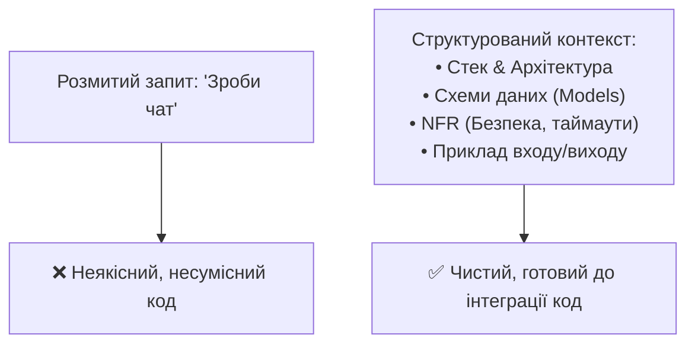

# Урок 88: Формування технічного завдання та контексту для AI

## 1. Чому якість коду залежить від контексту (Концепція Context-Driven Development)

Головний закон взаємодії з LLM — **«Якість результату на виході прямо пропорційна повноті та структурованості контексту на вході»** (GIGO — Garbage In, Garbage Out).

Якщо надати моделі розмитий запит: *«Напиши авторизацію для сайту»*, AI згенерує найпростіший, небезпечний код на застарілих бібліотеках без урахування бази даних, хешування паролів та токенів. Якщо ж надати структуроване ТЗ (Стек, моделі даних, вимоги до JWT, алгоритми Argon2/Bcrypt, обробку помилок), результат буде готовий до продакшену на 95%.

---

## 2. Фреймворк RTCCO (Role, Task, Context, Constraints, Output)

Для формулювання ТЗ для штучного інтелекту використовується інженерний фреймворк **RTCCO**:

1. **Role (Роль)**: Ким виступає AI (*«Ти — Senior Python Backend Architect, експерт з асинхронної архітектури та безпеки»*).
2. **Task (Цільове завдання)**: Що конкретно треба створити (*«Розроби модуль обробки фінансових платежів через Stripe Webhooks»*).
3. **Context (Контекст)**: Поточна архітектура проєкту, наявні моделі БД, версії бібліотек, залежності.
4. **Constraints (Обмеження та вимоги)**:
   - Заборонені бібліотеки та патерни.
   - Вимоги до швидкодії та асинхронності.
   - Обробка помилок (Idempotency Key, валідація підпису Webhook Signature).
5. **Output Format (Формат результату)**: Лише чистий код із коментарями, розділений на модулі `schemas.py`, `service.py`, `router.py`, без зайвого вступного тексту.

---

## 3. Управління контекстним вікном (Context Window Management)

Хоча сучасні моделі мають контекст від 128k до 2M токенів, перевантаження контексту «сміттям» призводить до явища **Lost in the Middle** (модель починає ігнорувати інструкції посередині довгого тексту).

### Правила гігієни контексту:
- Надавати лише сигнатури та інтерфейси пов'язаних модулів, а не тисячі рядків стороннього коду.
- Використовувати стислі `.d.ts` (TypeScript) або `.pyi` (Python Stubs) файли для передачі типів.
- Очищати історію діалогу при переході до принципово нової непов'язаної задачі.
