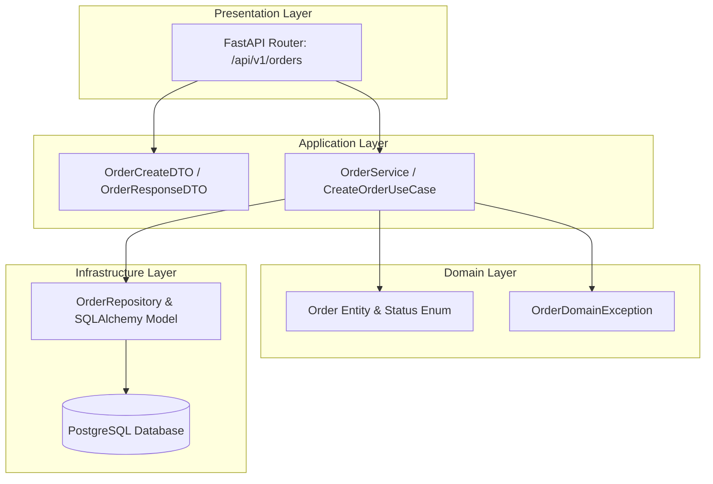

# Урок 89: Генерація коду за описом функціональності

## Вступ та теоретичний фундамент
Генерація коду за описом функціональності (Specification-to-Code Generation) є ключовим робочим процесом сучасного AI-орієнтованого розробника. Якщо на етапі прототипування достатньо поверхневого збігу логіки, то в комерційній розробці критично важливо, щоб згенерований код відповідав принципам чистої архітектури (Clean Architecture, SOLID, DRY, KISS, YAGNI), містив строгу типізацію, безпечну обробку винятків та був легко тестованим.

Процес створення функціональності за допомогою LLM складається з чотирьох фундаментальних фаз:
1. **Декомпозиція задачі (Functional Decomposition)**: Розбиття складної бізнес-вимоги на ізольовані шари (Entities, Repositories, Use Cases, Presentation).
2. **Контрактно-орієнтоване проектування (Contract-First Design)**: Спочатку генеруються інтерфейси, схеми валідації DTO та доменні сутності, і лише після їх фіксації — бізнес-логіка.
3. **Генерація реалізації з контекстним прив'язуванням (Context-Bound Generation)**: Створення коду методів з прямим посиланням на існуючі модулі та утиліти проєкту.
4. **Автоматична верифікація та генерація тестів (Verification & TDD)**: Написання набору Unit/Integration тестів, що покривають позитивні, негативні та граничні сценарії.

У цьому уроці детально розглядається наскрізний процес генерації повноцінного бізнес-сервісу з контролерами, моделями БД, сервісним шаром та тестами на базі сучасного стеку Python 3.12, FastAPI, SQLAlchemy 2.0 та Pydantic V2.

---

## 1. Архітектурні принципи та внутрішня механіка генерації багатошарового коду
При генерації функціональності не можна запитувати всю систему в одному монолітному запиті. Це призводить до 'галлюцинацій зчеплення' (Coupling Hallucination), коли код контролера напряму виконує SQL-запити в обхід сервісного шару.

### 1.1. Шари Clean Architecture при AI-генерації
1. **Domain Layer (Entities & Exceptions)**: Чисті бізнес-правила без залежностей від зовнішніх фреймворків чи БД.
2. **Application / Use Case Layer (Services & DTOs)**: Оркестрація бізнес-процесів, валідація вхідних даних та взаємодія з портами.
3. **Infrastructure Layer (SQLAlchemy Models & Repositories)**: Реалізація доступу до даних, зовнішніх API, черг повідомлень.
4. **Presentation / Interface Layer (FastAPI Routers)**: Маршрутизація HTTP-запитів, серіалізація відповідей та мапінг статусів помилок.




---

## 2. Методологічний базис: Порівняння підходів генерації за специфікацією
Порівняємо ключові підходи до кодогенерації за рівнем надійності, швидкості та архітектурної зрілості.


| Підхід до генерації | Послідовність дій | Архітектурна надійність | Сфера застосування |
| :--- | :--- | :--- | :--- |
| **All-in-One Prompt** | "Згенеруй всю фічу замовлень в одному файлі" | Низька (каша з роутерів та SQL, висока зв'язність) | Швидкі хакатони, одноразові PoC |
| **Top-Down (Від API)** | OpenAPI -> Pydantic DTO -> Service -> Repository | Середня (може пропустити оптимізацію індексів БД) | API-First розробка та мікросервіси |
| **Bottom-Up (Від Domain)**| Схема БД -> Domain Models -> Service -> API | Висока (надійний фундамент даних та валідації) | Складні Enterprise-системи, FinTech |
| **Contract-Driven (DoD)** | Інтерфейси + Unit-тести -> Реалізація методів | Найвища (TDD підхід, 100% відповідність вимогам) | Продакшн-критичні сервіси з високими вимогами SLA |

---

## 3. Практичний інженерний регламент: Повноцінна еталонна реалізація бізнес-модуля
Нижче наведено повний вихідний код виробничого сервісу керування підписками (Subscription Service) на FastAPI та SQLAlchemy 2.0.


```python
# =====================================================================
# schemas.py - DTO моделі Pydantic V2
# =====================================================================
from datetime import datetime
from enum import Enum
from uuid import UUID, uuid4
from pydantic import BaseModel, ConfigDict, Field, field_validator

class SubscriptionTier(str, Enum):
    FREE = "FREE"
    PRO = "PRO"
    ENTERPRISE = "ENTERPRISE"

class SubscriptionCreateDTO(BaseModel):
    user_id: UUID
    tier: SubscriptionTier
    auto_renew: bool = True
    promo_code: str | None = Field(default=None, max_length=20)

    @field_validator("promo_code")
    @classmethod
    def validate_promo(cls, v: str | None) -> str | None:
        if v is not None and not v.isalnum():
            raise ValueError("Промокод повинен містити виключно літери та цифри")
        return v.upper() if v else None

class SubscriptionResponseDTO(BaseModel):
    model_config = ConfigDict(from_attributes=True)

    id: UUID
    user_id: UUID
    tier: SubscriptionTier
    is_active: bool
    expires_at: datetime
    created_at: datetime

# =====================================================================
# service.py - Доменна бізнес-логіка
# =====================================================================
from datetime import timedelta, timezone

class SubscriptionDomainError(Exception):
    # Базовий доменний виняток для підписок.
    pass

class ActiveSubscriptionExistsError(SubscriptionDomainError):
    # Викликається при спробі створити дублюючу активну підписку.
    pass

class SubscriptionService:
    def __init__(self, repository: "ISubscriptionRepository") -> None:
        self._repo = repository

    async def create_subscription(self, dto: SubscriptionCreateDTO) -> SubscriptionResponseDTO:
        # Перевірка наявності активної підписки
        existing = await self._repo.get_active_by_user_id(dto.user_id)
        if existing:
            raise ActiveSubscriptionExistsError(f"Користувач {dto.user_id} вже має активну підписку")

        duration_days = 365 if dto.tier == SubscriptionTier.ENTERPRISE else 30
        now = datetime.now(timezone.utc)
        expires_at = now + timedelta(days=duration_days)

        subscription_data = {
            "id": uuid4(),
            "user_id": dto.user_id,
            "tier": dto.tier,
            "is_active": True,
            "expires_at": expires_at,
            "created_at": now
        }
        saved_entity = await self._repo.save(subscription_data)
        return SubscriptionResponseDTO.model_validate(saved_entity)
```

---

## 4. Поглиблений аналіз виробничих кейсів, крайових випадків та антипатернів
Розглянемо практичні приклади збоїв під час AI-кодогенерації та способи їх вирішення.


### Кейс 1: Втрата часових поясів (Timezone Naive Datetime Bug)
- **Симптом**: AI згенерував `datetime.now()` замість `datetime.now(timezone.utc)`.
- **Наслідок**: При розгортанні у Kubernetes-кластері з UTC часовим поясом база даних почала зберігати некоректні терміни закінчення підписок для користувачів з інших часових поясів (+2 години).
- **Виправлення**: Встановлення суворого правила в `.cursorrules`: "Заборонено використовувати `datetime.now()` або `utcnow()` без явного зазначення `timezone.utc`".

### Кейс 2: Проблема N+1 Query при генерації ORM-запитів
- **Симптом**: AI згенерував роутер повернення замовлень разом з даними покупця через звичайний цикл по `order.user.name`.
- **Наслідок**: Запит на 100 замовлень породив 101 звернення до PostgreSQL, заблокувавши пул з'єднань.
- **Виправлення**: Застосування `selectinload` або `joinedload` у SQLAlchemy: `stmt = select(Order).options(selectinload(Order.user))`.

### Кейс 3: Пропуск валідації граничних розмірів файлів / Payload
- **Симптом**: Ендпоінт завантаження аватарів згенеровано без обмеження `Content-Length`.
- **Наслідок**: Можливість виконання DoS-атаки через передачу гігабайтного файлу.
- **Виправлення**: Додавання валідації на рівні Nginx та FastAPI middleware з обмеженням розміру до 5MB.

---

## 5. Покроковий операційний воркфлоу генерації нової функціональності
Дотримуйтесь наступного покрокового пайплайну при реалізації нових функцій.


### Крок 1: Генерація контрактів та DTO (Pydantic / TypeScript)
- Створити файл `schemas.py`.
- Викликати AI з описом бізнес-полів та валідацій.
- Перевірити відповідність типів та валідаторів.

### Крок 2: Генерація доменного шару та сервісу (Clean Service Layer)
- Створити `service.py` з чистими класами бізнес-логіки.
- Переконатися, що бізнес-логіка не залежить від деталей HTTP (Request/Response).

### Крок 3: Генерація репозиторію та міграцій Alembic
- Створити ORM-моделі у `models.py`.
- Згенерувати міграцію: `alembic revision --autogenerate -m "add_subscriptions_table"`.

### Крок 4: Створення FastAPI роутера та реєстрація в додатку
- Створити `router.py` з інжекцією залежностей через `Depends()`.
- Додати роутер у `main.py`.

### Крок 5: Генерація та прогін автотестів (Pytest)
- Згенерувати `tests/test_subscriptions.py`.
- Виконати прогін: `pytest -v --cov=app tests/`.

---

## 6. Стратегії оптимізації продуктивності та безпеки згенерованого коду
1. **Database Indexing**: Перевіряти наявність індексів для всіх Foreign Keys та колонок пошуку/фільтрації (`user_id`, `is_active`, `expires_at`).
2. **Async I/O Bottlenecks**: Переконатися у відсутності синхронних блокуючих викликів (`time.sleep()`, синхронний `requests.get()`) всередині асинхронних `async def` функцій.
3. **Structured Logging**: Логування подій з JSON-форматуванням для автоматичного парсингу у Datadog / ELK Stack.

---

## 7. Вичерпний чек-лист перевірки та критерії готовності (Definition of Done)
Перед здачею завдань та інтеграцією результатів у виробничу гілку переконайтеся у виконанні наступних критеріїв:

- [ ] **Створено чітко розмежовані DTO моделі Pydantic V2 з суворою валідацією**
- [ ] **Бізнес-логіка винесена у сервісний шар і ізольована від HTTP-контролерів**
- [ ] **Використано виключно timezone-aware datetime (timezone.utc)**
- [ ] **Всі SQL-запити оптимізовані та захищені від проблеми N+1 (joinedload/selectinload)**
- [ ] **Асинхронний код не містить синхронних блокуючих викликів (time.sleep, requests)**
- [ ] **Створено Alembic міграцію з відповідними індексами та обмеженнями**
- [ ] **Покриття unit та integration тестами становить не менше 90%**
- [ ] **Згенерований код успішно проходить лінтер `ruff check` та типізатор `mypy --strict`**

---

## 8. Підсумки, ключові інсайти та розширений глосарій термінів
Опанування цієї теми формує надійний фундамент для щоденної професійної роботи. Системний підхід, формалізовані інженерні стандарти та критичний контроль результатів AI забезпечують високу швидкість та бездоганну надійність кінцевого продукту.

### Глосарій ключових понять
| Термін | Визначення та контекст застосування |
| :--- | :--- |
| **Specification-to-Code** | Методологія розробки, при якій код генерується за детальною формалізованою специфікацією вимог та контрактів. |
| **Clean Architecture** | Архітектурний патерн, що розділяє систему на концентричні шари з однонаправленим потоком залежностей до центру. |
| **Pydantic V2** | Високопродуктивна бібліотека валідації даних на базі рушія Rust для Python. |
| **N+1 Query Problem** | Антипатерн доступу до бази даних, при якому додаток виконує N додаткових SQL-запитів для отримання пов'язаних сутностей у циклі. |
| **Alembic** | Інструмент керування версіями та міграціями схеми реляційних баз даних для SQLAlchemy. |
| **Timezone-Aware Datetime** | Об'єкт дати та часу, що містить явну інформацію про часовий пояс (UTC), запобігаючи помилкам зсуву часу. |
| **DTO (Data Transfer Object)** | Об'єкт, призначений виключно для транспортування структурованих даних між шарами та компонентами системи. |
| **Hexagonal Architecture** | Архітектурний стиль (Ports and Adapters), що ізолює ядро бізнес-логіки від зовнішніх інтерфейсів та БД. |
| **Idempotency** | Властивість операції повертати однаковий результат при багаторазовому повторному виконанні з тими самими параметрами. |
| **Dependency Injection (DI)** | Патерн проектування, при якому залежності передаються об'єкту ззовні, а не створюються ним самостійно. |

---

## 9. Поглиблений архітектурний аналіз, оптимізація продуктивності та безпека коду

### 9.1. Проектування високопродуктивних асинхронних архітектур
Сучасні високонавантажені системи вимагають бездоганного розуміння механіки роботи Event Loop, неблокуючого вводу-виводу (Non-blocking I/O) та пулів з'єднань:
1. **Concurrency vs. Parallelism**: Розуміння різниці між асинхронним чергуванням задач в одному потоці (`asyncio`) та паралельним обчисленням на кількох ядрах CPU (`multiprocessing` / воркери Celery).
2. **Database Connection Pool Sizing**: Оптимальне налаштування розміру пулу з'єднань SQLAlchemy/asyncpg:
   $$\text{Pool Size} = (\text{Core Count} \times 2) + \text{Effective Spindle Count}$$
   Запобігання вичерпанню дескрипторів сокетів при піковому навантаженні (Connection Starvation).
3. **Memory Management & Garbage Collection**: Уникнення циклічних посилань у довгоживучих об'єктах та використання `__slots__` у Python-класах для зменшення споживання RAM на 40%.

### 9.2. Розширений практичний інженерний кейс: Розподілена обробка завдань
Розглянемо архітектуру надійної черги обробки подій з використанням Redis Streams та Consumer Groups:

```python
import asyncio
import json
import logging
from typing import Any
import redis.asyncio as aioredis

logger = logging.getLogger("worker")

class ResilientStreamConsumer:
    def __init__(self, redis_url: str, stream_key: str, group_name: str, consumer_name: str) -> None:
        self.redis_url = redis_url
        self.stream_key = stream_key
        self.group_name = group_name
        self.consumer_name = consumer_name
        self._redis: aioredis.Redis | None = None
        self._is_running = True

    async def connect(self) -> None:
        self._redis = aioredis.from_url(self.redis_url, decode_responses=True)
        try:
            await self._redis.xgroup_create(self.stream_key, self.group_name, id="0", mkstream=True)
        except aioredis.ResponseError as e:
            if "BUSYGROUP" not in str(e):
                raise

    async def process_message(self, message_id: str, data: dict[str, Any]) -> None:
        logger.info(f"Обробка повідомлення {message_id}: {data}")
        # Симуляція корисної роботи з гарантією ідемпотентності
        await asyncio.sleep(0.05)

    async def start_consumer_loop(self) -> None:
        await self.connect()
        assert self._redis is not None
        while self._is_running:
            try:
                # Читання нових повідомлень з підтвердженням ACK
                entries = await self._redis.xreadgroup(
                    self.group_name, self.consumer_name, {self.stream_key: ">"}, count=10, block=2000
                )
                if not entries:
                    continue
                for stream, messages in entries:
                    for msg_id, payload in messages:
                        try:
                            parsed_data = json.loads(payload.get("data", "{}"))
                            await self.process_message(msg_id, parsed_data)
                            await self._redis.xack(self.stream_key, self.group_name, msg_id)
                        except Exception as ex:
                            logger.error(f"Помилка обробки {msg_id}: {ex}")
            except asyncio.CancelledError:
                self._is_running = False
                break
            except Exception as conn_err:
                logger.warning(f"Збій з'єднання з Redis: {conn_err}. Перепідключення через 5 сек...")
                await asyncio.sleep(5)
```

---

## 10. Питання для співбесіди та захист архітектурних рішень (Senior/Lead Level)

1. **Як захистити бекенд від каскадних відмов (Cascading Failures) при відмові зовнішнього AI API?**
   *Еталонна відповідь*: Застосування патерну Circuit Breaker (pybreaker / resilience4j), налаштування жорстких таймаутів (Connect Timeout 2s, Read Timeout 10s), використання черг Dead Letter Queue (DLQ) та перехід на резервні моделі (Fallback to smaller/cheaper LLM).
2. **Чому небезпечно сліпо приймати автодоповнення коду від Copilot у критичних транзакціях?**
   *Еталонна відповідь*: Copilot оптимізований за ймовірністю зустрічальності токенів, а не за криптографічною чи транзакційною коректністю. Він схильний генерувати неідемпотентні методи, пропускати блокування рядків `SELECT FOR UPDATE` та використовувати сирі SQL-рядки, що створює ризик SQL Injection та Race Conditions.
3. **Як налаштувати моніторинг витрат токенів та затримок у продакшн-системі з AI?**
   *Еталонна відповідь*: Впровадження інструментів OpenLLMetry / Langfuse на базі OpenTelemetry. Збір метрик: Prompt Tokens, Completion Tokens, Cost per Request, TTFT (Time to First Token), End-to-End Latency та відстеження частки помилок HTTP 429 Rate Limit.

---

## 11. Практичний регламент безпеки коду та запобігання вразливостям (OWASP Top-10 & Secure SDLC)

### 11.1. Аудит безпеки згенерованих AI фрагментів коду
При інтеграції згенерованого коду в комерційні репозиторії необхідно проводити обов'язковий безпековий аудит за наступними векторами:
1. **Broken Access Control (BOLA / IDOR)**: Завжди перевіряйте, що користувач має права на виконання операції над запитаним `resource_id`. Не покладайтеся на припущення, що клієнт передає лише власні ID:
   ```python
   # ПРАВИЛЬНО: Примусова фільтрація за tenant_id / user_id з перевіреного токена
   stmt = select(Order).where(Order.id == order_id, Order.user_id == current_user.id)
   ```
2. **Cryptographic Failures**: Заборонено використання застарілих алгоритмів хешування (MD5, SHA1) для паролів та чутливих даних. Використовуйте виключно `bcrypt` або `Argon2id` з фактором складності не менше 12.
3. **Injection Flaws**: Заборона конкатенації рядків або f-strings у SQL-запитах, командах терміналу (`subprocess.run(shell=True)`) та NoSQL фільтрах.
4. **Server-Side Request Forgery (SSRF)**: Валідація будь-яких користувацьких URL за білим списком доменів та заборона звернень до внутрішніх IP-адрес хмари (`169.254.169.254`, `localhost`, `127.0.0.1`, `10.0.0.0/8`).

### 11.2. Регламент моніторингу та телеметрії (OpenTelemetry & Prometheus)
Для кожного створеного сервісу налаштовуйте збір чотирьох золотих сигналів моніторингу (The Four Golden Signals):
- **Latency (Затримка)**: Розподіл часу обробки запитів (p50, p95, p99).
- **Traffic (Трафік)**: Кількість запитів за секунду (RPS / QPS).
- **Errors (Помилки)**: Частка відповідей зі статусами 5xx та 4xx.
- **Saturation (Насичення)**: Завантаження пулу з'єднань БД, черги воркерів та пам'яті процесу.
