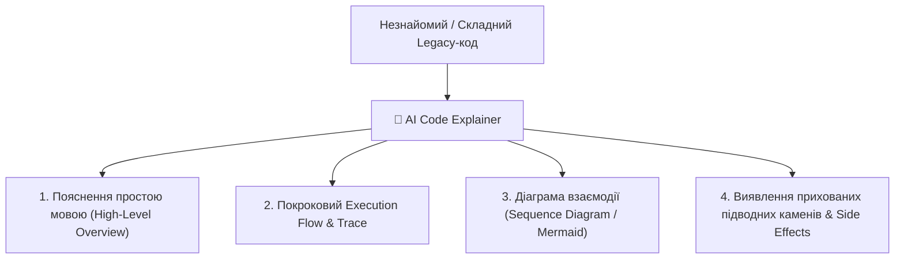

# Урок 90: Пояснення незнайомого коду за допомогою AI: реверс-інжиніринг, онбординг та аналіз legacy-систем

## 1. AI як інтелектуальний ментор при онбордингу в новий проєкт

Входження у великий комерційний проєкт із сотнями тисяч рядків коду (Legacy Codebase) традиційно займає тижні або місяці. AI-асистент дозволяє скоротити час онбордингу в рази, виконуючи роль персонального ментора, який миттєво пояснює архітектурні зв'язки, призначення нетривіальних функцій та потік даних.

---

## 2. Багаторівневі промпт-патерни для пояснення коду

1. **Executive / High-Level Explanation**: «Поясни бізнес-призначення цього модуля для нетехнічного продакт-менеджера за 3 речення.»
2. **Step-by-Step Execution Tracing**: «Опиши покроково, рядок за рядком, як змінюється стан змінних при передачі вхідного масиву `[1, 2, 0, -5]`.»
3. **Diagrammatic Representation**: «Перетвори логіку цього складного розгалуження у візуальну блок-схему Mermaid.js.»
4. **Edge Cases & Vulnerabilities Audit**: «Які неочевидні побічні ефекти (Side Effects), витоки пам'яті або проблеми з конкурентністю (Race Conditions) приховані в цьому коді?»

---

## 3. Дешифрування складних конструкцій (Регулярні вирази, SQL, бітові операції)

AI є незамінним для розшифровки «магічних» та важкочитабельних конструкцій:
- **Комплексні Regex**: Повний розбір кожної групи регулярного виразу з прикладами збігів та незбігів.
- **Монструозні SQL-запити з багатьма JOIN та Window Functions**: Пояснення порядку виконання операцій (`FROM` -> `WHERE` -> `GROUP BY` -> `HAVING` -> `WINDOW` -> `SELECT`).
- **Метапрограмування та декоратори в Python / TypeScript**.
