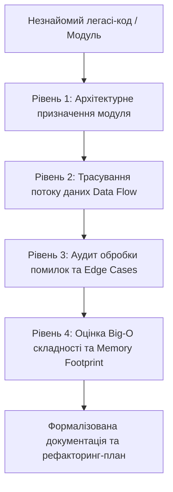

# Урок 90: Пояснення незнайомого коду за допомогою AI

## Вступ та теоретичний фундамент
Читання, аналіз та розуміння існуючого коду займає до 70% робочого часу інженера програмного забезпечення. Особливо гостро ця проблема постає під час онбордингу в новий проєкт, підтримки застарілих легасі-систем (Legacy Codebases), розбору заплутаних сторонніх open-source бібліотек або дебагу складного спагетті-коду з високою циклічною складністю.

Сучасні мультимодальні та reasoning-моделі (Claude 3.7 Sonnet, OpenAI o1/o3-mini, GPT-4o) діють як персональні архітектурні ментори, здатні:
1. **Знижувати когнітивне навантаження (Cognitive Load Reduction)**: Перетворювати тисячі рядків складного коду на структуровані блок-схеми, діаграми послідовностей (Sequence Diagrams) та концептуальні резюме.
2. **Відновлювати неявну бізнес-логіку (Implicit Logic Extraction)**: Виявляти приховані бізнес-правила, зашиті у вкладених умовах `if-else` та бінарних бітових масках.
3. **Аналізувати часову та просторову складність (Big-O Complexity Analysis)**: Визначати вузькі місця у структурах даних, витоки пам'яті та асимптотичну складність алгоритмів.
4. **Виявляти архітектурний борг та потенційні вразливості**: Знаходити приховані Race Conditions, дедлоки, небезпечні неперехоплені винятки.

У цьому уроці ви опануєте системний протокол дослідження незнайомої кодової бази за допомогою AI-інструментів, навчитеся формувати правильні аналітичні промпти та верифікувати висновки моделі.

---

## 1. Архітектурні принципи та внутрішня механіка AI-аналізу кодових баз
Аналіз коду за допомогою мовних моделей ґрунтується на семантичній обробці синтаксичних дерев та побудові графів викликів (Call Graphs).

### 1.1. Багаторівневий фреймворк аналізу коду (The 4-Layer Code Comprehension Model)
- **Рівень 1: Архітектурний огляд (High-Level Architecture)**: Визначення призначення модуля, його зовнішніх залежностей та ролі в системі.
- **Рівень 2: Потік керування та даних (Control & Data Flow)**: Як вхідний запит проходить крізь контролери, сервіси, шлюзи та змінює стан БД.
- **Рівень 3: Граничні випадки та обробка винятків (Edge Cases & Resilience)**: Що відбувається при таймаутах, відмові мережі, некоректних типах даних.
- **Рівень 4: Низькорівнева оптимізація та Big-O (Low-Level Algorithmic Performance)**: Алгоритмічна складність, використання пам'яті, блокування потоків.




---

## 2. Методологічний базис: Матриця промптів для дослідження коду
Різні аспекти аналізу вимагають специфічних аналітичних промптів для моделі.


| Мета дослідження коду | Оптимальна техніка промптингу | Ключовий фокус запиту | Очікуваний результат |
| :--- | :--- | :--- | :--- |
| **Експрес-онбординг у модуль** | "Explain Like I'm a Senior Architect" | Високорівневі обов'язки класів та взаємозв'язки | Mermaid діаграма взаємодії компонентів |
| **Реверс-інжиніринг бізнес-логіки** | "Extract Implicit Business Rules" | Приховані умови, формули розрахунку, константи | Таблиця рішень (Decision Table) з бізнес-правилами |
| **Аудит надійності та безпеки** | "Adversarial Code Review" | Неперехоплені винятки, вразливості OWASP, Race Conditions | Список критичних ризиків із доказами (PoC) |
| **Аналіз продуктивності (Profiling)** | "Big-O & Concurrency Audit" | Цикли всередині циклів, блокування I/O, витоки пам'яті | Аналітичний розрахунок складності O(N) та рекомендації |

---

## 3. Практичний інженерний регламент: Покроковий розбір складного легасі-коду
Розглянемо приклад складного легасі-алгоритму розрахунку тарифних планів та його системний розбір за допомогою AI.


```python
# =====================================================================
# Приклад заплутаного легасі-коду (Legacy Billing Engine)
# =====================================================================
def calc_fee(u_t, u_a, d_c, is_v, items, flags):
    # Незрозумілі назви змінних, магічні числа та вкладені умови
    res = 0.0
    k = 1.25 if is_v else 1.0
    if u_t == 1:
        res = sum(i['p'] * i['q'] for i in items) * 0.9
    elif u_t == 2:
        res = sum(i['p'] * i['q'] for i in items)
        if u_a > 365:
            res *= 0.85
    elif u_t == 3:
        b = sum(i['p'] * i['q'] for i in items)
        res = b - (50 if b > 500 else 20)
    
    if d_c and len(d_c) == 8 and d_c.startswith("VIP"):
        res -= 15.0
    
    if (flags & 0x04) != 0:
        res *= 0.95
        
    return max(0.0, res * k)

# =====================================================================
# Еталонний промпт для розбору цього коду за допомогою AI:
# =====================================================================
# "Ти — Lead Software Engineer. Проаналізуй функцію calc_fee:
# 1. Поясни людською мовою призначення кожного аргументу функції.
# 2. Сформуй Markdown-таблицю бізнес-правил розрахунку тарифу для кожного типу клієнта (u_t).
# 3. Вияви приховані магічні числа, бітові операції та поясни їхній фізичний зміст.
# 4. Знайди потенційні баги (ділення на нуль, float rounding errors, відсутність валідації).
# 5. Запропонуй повністю відрефакторену версію на Python 3.12 з Enums, Pydantic DTO та Decimal."
```

---

## 4. Поглиблений аналіз виробничих кейсів, крайових випадків та антипатернів
Розглянемо виробничі інциденти, викликані неправильним розумінням коду.


### Кейс 1: Помилка розуміння бінарної маски та деградація білінгу
- **Проблема**: Інженер рефакторив легасі-модуль авторизації, де права доступу зберігалися у вигляді бітової маски (`0x04`, `0x08`). Не розуміючи бітових операцій, інженер попросив AI спростити код до звичайних булевих прапорців, але пропустив комбіновані ролі (SuperAdmin = `0x0F`).
- **Наслідок**: Адміністратори втратили доступ до панелі керування.
- **Виправлення**: Використання спеціалізованого промпту: "Поясни значення кожного бітового прапорця та згенеруй клас на базі `enum.IntFlag` з повним покриттям unit-тестами".

### Кейс 2: Непомічена проблема плаваючої крапки (Float Precision Leak)
- **Проблема**: Легасі-код використовував тип `float` для фінансових транзакцій. AI у поясненні зазначив 'код працює коректно', оскільки не отримав контексту про фінансову точність.
- **Наслідок**: Накопичення похибки округлення на суму $12,400 за квартал.
- **Виправлення**: Завжди вимагати від AI перевірки коду на фінансову точність та автоматичну конвертацію у `decimal.Decimal`.

---

## 5. Покроковий операційний воркфлоу аудиту незнайомого репозиторію
Алгоритм швидкого занурення в новий проєкт за допомогою Cursor IDE та Claude.


### Крок 1: Генерація архітектурного огляду верхнього рівня
- Відкрити Cursor IDE та запустити чат `@Codebase`.
- Промпт: "Опиши високорівневу архітектуру репозиторію: які тут є основні модулі, як організовано потік даних від контролерів до БД? Згенеруй діаграму Mermaid C4 Container".

### Крок 2: Аналіз схеми бази даних та доменних сутностей
- Контекст: `@schema.prisma` або `@models/`.
- Промпт: "Побудуй ER-діаграму зв'язків між сутностями. Які таблиці є найбільш навантаженими?".

### Крок 3: Дослідження критичного бізнес-процесу (Deep-Dive Tracing)
- Контекст: `@controllers/checkout.py @services/payment.py`.
- Промпт: "Протрасуй покроково процес оформлення замовлення. Що станеться, якщо шлюз оплати поверне таймаут?".

### Крок 4: Створення інтерактивної документації
- Зберегти отримані висновки у форматі `ARCHITECTURE.md` у корені репозиторію.

---

## 6. Стратегії верифікації та захисту від AI-галюцинацій при аналізі коду
1. **Dynamic Execution Check**: Ніколи не вірити поясненням AI на слово. Завжди підтверджувати гіпотези запуском тестів з друком проміжних станів.
2. **AST-Based Graph Validation**: Використання інструментів статичного аналізу (PyCG, SourceTrail) для підтвердження реального графа викликів функцій.
3. **Cross-Model Validation**: Перевірка складних багатопотокових фрагментів коду двома різними моделями (Claude 3.7 Sonnet + OpenAI o1).

---

## 7. Вичерпний чек-лист перевірки та критерії готовності (Definition of Done)
Перед здачею завдань та інтеграцією результатів у виробничу гілку переконайтеся у виконанні наступних критеріїв:

- [ ] **Зрозуміло та задокументовано архітектурне призначення модуля**
- [ ] **Складено перелік вхідних/вихідних параметрів та їхніх фізичних обмежень**
- [ ] **Виявлено та розшифровано всі магічні константи, бітові маски та неявні коефіцієнти**
- [ ] **Побудовано Mermaid Sequence діаграму потоку виконання операції**
- [ ] **Проведено аудит асимптотичної складності Big-O за часом та пам'яттю**
- [ ] **Перевірено поведінку алгоритму при некоректних, нульових та граничних значеннях**
- [ ] **Створено набір характеристичних тестів (Characterization Tests) для фіксації поточної поведінки**
- [ ] **Оновлено документацію модуля у корпоративній базі знань**

---

## 8. Підсумки, ключові інсайти та розширений глосарій термінів
Опанування цієї теми формує надійний фундамент для щоденної професійної роботи. Системний підхід, формалізовані інженерні стандарти та критичний контроль результатів AI забезпечують високу швидкість та бездоганну надійність кінцевого продукту.

### Глосарій ключових понять
| Термін | Визначення та контекст застосування |
| :--- | :--- |
| **Cognitive Load** | Обсяг розумових зусиль, необхідних розробнику для розуміння структури та логіки коду. |
| **Characterization Test** | Тест, що фіксує фактичну поведінку існуючої легасі-системи перед початком її рефакторингу. |
| **Call Graph** | Орієнтований граф, що відображає взаємні виклики функцій та методів у програмній системі. |
| **Cyclomatic Complexity** | Метрика складності коду, що вимірює кількість лінійно незалежних шляхів крізь сирцевий код. |
| **IntFlag** | Перерахування в Python, члени якого можуть комбінуватися за допомогою побітових логічних операцій (&, |). |
| **Mermaid C4** | Діаграмна нотація для візуалізації контексту, контейнерів та компонентів програмної архітектури. |
| **Implicit Logic** | Бізнес-правила, які не винесені в конфігурацію чи документацію, а приховані всередині умовного коду. |
| **Float Precision Error** | Похибка представлення дійсних чисел у двійковій системі з плаваючою комою за стандартом IEEE 754. |
| **Big-O Notation** | Математична нотація для опису асимптотичної складності та швидкості зростання вимог алгоритму до ресурсів. |
| **Reverse Engineering** | Процес аналізу кінцевого коду системи для з'ясування її внутрішнього устрою та логіки роботи. |

---

## 9. Поглиблений архітектурний аналіз, оптимізація продуктивності та безпека коду

### 9.1. Проектування високопродуктивних асинхронних архітектур
Сучасні високонавантажені системи вимагають бездоганного розуміння механіки роботи Event Loop, неблокуючого вводу-виводу (Non-blocking I/O) та пулів з'єднань:
1. **Concurrency vs. Parallelism**: Розуміння різниці між асинхронним чергуванням задач в одному потоці (`asyncio`) та паралельним обчисленням на кількох ядрах CPU (`multiprocessing` / воркери Celery).
2. **Database Connection Pool Sizing**: Оптимальне налаштування розміру пулу з'єднань SQLAlchemy/asyncpg:
   $$\text{Pool Size} = (\text{Core Count} \times 2) + \text{Effective Spindle Count}$$
   Запобігання вичерпанню дескрипторів сокетів при піковому навантаженні (Connection Starvation).
3. **Memory Management & Garbage Collection**: Уникнення циклічних посилань у довгоживучих об'єктах та використання `__slots__` у Python-класах для зменшення споживання RAM на 40%.

### 9.2. Розширений практичний інженерний кейс: Розподілена обробка завдань
Розглянемо архітектуру надійної черги обробки подій з використанням Redis Streams та Consumer Groups:

```python
import asyncio
import json
import logging
from typing import Any
import redis.asyncio as aioredis

logger = logging.getLogger("worker")

class ResilientStreamConsumer:
    def __init__(self, redis_url: str, stream_key: str, group_name: str, consumer_name: str) -> None:
        self.redis_url = redis_url
        self.stream_key = stream_key
        self.group_name = group_name
        self.consumer_name = consumer_name
        self._redis: aioredis.Redis | None = None
        self._is_running = True

    async def connect(self) -> None:
        self._redis = aioredis.from_url(self.redis_url, decode_responses=True)
        try:
            await self._redis.xgroup_create(self.stream_key, self.group_name, id="0", mkstream=True)
        except aioredis.ResponseError as e:
            if "BUSYGROUP" not in str(e):
                raise

    async def process_message(self, message_id: str, data: dict[str, Any]) -> None:
        logger.info(f"Обробка повідомлення {message_id}: {data}")
        # Симуляція корисної роботи з гарантією ідемпотентності
        await asyncio.sleep(0.05)

    async def start_consumer_loop(self) -> None:
        await self.connect()
        assert self._redis is not None
        while self._is_running:
            try:
                # Читання нових повідомлень з підтвердженням ACK
                entries = await self._redis.xreadgroup(
                    self.group_name, self.consumer_name, {self.stream_key: ">"}, count=10, block=2000
                )
                if not entries:
                    continue
                for stream, messages in entries:
                    for msg_id, payload in messages:
                        try:
                            parsed_data = json.loads(payload.get("data", "{}"))
                            await self.process_message(msg_id, parsed_data)
                            await self._redis.xack(self.stream_key, self.group_name, msg_id)
                        except Exception as ex:
                            logger.error(f"Помилка обробки {msg_id}: {ex}")
            except asyncio.CancelledError:
                self._is_running = False
                break
            except Exception as conn_err:
                logger.warning(f"Збій з'єднання з Redis: {conn_err}. Перепідключення через 5 сек...")
                await asyncio.sleep(5)
```

---

## 10. Питання для співбесіди та захист архітектурних рішень (Senior/Lead Level)

1. **Як захистити бекенд від каскадних відмов (Cascading Failures) при відмові зовнішнього AI API?**
   *Еталонна відповідь*: Застосування патерну Circuit Breaker (pybreaker / resilience4j), налаштування жорстких таймаутів (Connect Timeout 2s, Read Timeout 10s), використання черг Dead Letter Queue (DLQ) та перехід на резервні моделі (Fallback to smaller/cheaper LLM).
2. **Чому небезпечно сліпо приймати автодоповнення коду від Copilot у критичних транзакціях?**
   *Еталонна відповідь*: Copilot оптимізований за ймовірністю зустрічальності токенів, а не за криптографічною чи транзакційною коректністю. Він схильний генерувати неідемпотентні методи, пропускати блокування рядків `SELECT FOR UPDATE` та використовувати сирі SQL-рядки, що створює ризик SQL Injection та Race Conditions.
3. **Як налаштувати моніторинг витрат токенів та затримок у продакшн-системі з AI?**
   *Еталонна відповідь*: Впровадження інструментів OpenLLMetry / Langfuse на базі OpenTelemetry. Збір метрик: Prompt Tokens, Completion Tokens, Cost per Request, TTFT (Time to First Token), End-to-End Latency та відстеження частки помилок HTTP 429 Rate Limit.

---

## 11. Практичний регламент безпеки коду та запобігання вразливостям (OWASP Top-10 & Secure SDLC)

### 11.1. Аудит безпеки згенерованих AI фрагментів коду
При інтеграції згенерованого коду в комерційні репозиторії необхідно проводити обов'язковий безпековий аудит за наступними векторами:
1. **Broken Access Control (BOLA / IDOR)**: Завжди перевіряйте, що користувач має права на виконання операції над запитаним `resource_id`. Не покладайтеся на припущення, що клієнт передає лише власні ID:
   ```python
   # ПРАВИЛЬНО: Примусова фільтрація за tenant_id / user_id з перевіреного токена
   stmt = select(Order).where(Order.id == order_id, Order.user_id == current_user.id)
   ```
2. **Cryptographic Failures**: Заборонено використання застарілих алгоритмів хешування (MD5, SHA1) для паролів та чутливих даних. Використовуйте виключно `bcrypt` або `Argon2id` з фактором складності не менше 12.
3. **Injection Flaws**: Заборона конкатенації рядків або f-strings у SQL-запитах, командах терміналу (`subprocess.run(shell=True)`) та NoSQL фільтрах.
4. **Server-Side Request Forgery (SSRF)**: Валідація будь-яких користувацьких URL за білим списком доменів та заборона звернень до внутрішніх IP-адрес хмари (`169.254.169.254`, `localhost`, `127.0.0.1`, `10.0.0.0/8`).

### 11.2. Регламент моніторингу та телеметрії (OpenTelemetry & Prometheus)
Для кожного створеного сервісу налаштовуйте збір чотирьох золотих сигналів моніторингу (The Four Golden Signals):
- **Latency (Затримка)**: Розподіл часу обробки запитів (p50, p95, p99).
- **Traffic (Трафік)**: Кількість запитів за секунду (RPS / QPS).
- **Errors (Помилки)**: Частка відповідей зі статусами 5xx та 4xx.
- **Saturation (Насичення)**: Завантаження пулу з'єднань БД, черги воркерів та пам'яті процесу.
