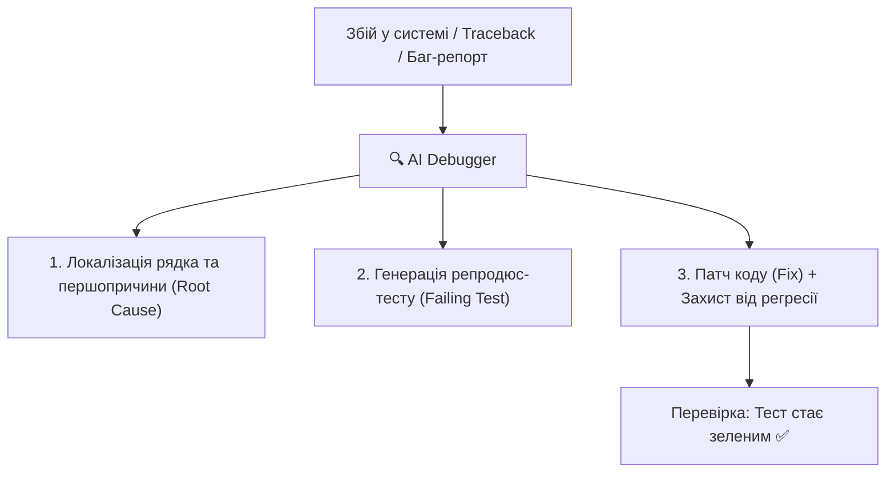

# Урок 91: Пошук і виправлення помилок за допомогою AI: Root Cause Analysis, дебаг та аналіз стек-трейсів

## 1. AI-підсилений дебагінг: від читання Traceback до ліквідації першопричини

Традиційний пошук багів може займати години, особливо коли помилка проявляється далеко від місця свого виникнення (наприклад, помилка серіалізації через `None`, який потрапив у пайплайн 10 кроків тому).

AI дозволяє автоматизувати процес дебагінгу через **Root Cause Analysis (RCA)**: аналіз контексту стек-трейсу, виявлення зламаного інваріанту та генерацію мінімального безпечного виправлення (Minimal Reproducible Fix).

---

## 2. Анатомія ефективного промпту для дебагінгу

Щоб AI точно знайшов і виправив баг, запит повинен містити 4 компоненти:
1. **Повний текст помилки та стек-трейс (Full Traceback)** без обрізання рядків.
2. **Фрагмент коду**, де стався збій, та пов'язані моделі даних.
3. **Вхідні дані (Payload/Input)**, на яких сталася аварія.
4. **Очікувана поведінка (Expected vs Actual)**.

---

## 3. Класифікація складних помилок, які ефективно локалізує AI

- **Off-by-One Errors**: Помилки виходу за межі діапазону масиву на 1 елемент у циклах.
- **NullPointer / NoneType Exceptions**: Спроба доступу до атрибута об'єкта, який виявився `None`.
- **Async Deadlocks & Unawaited Coroutines**: Забутий `await` перед викликом асинхронної функції.
- **Типові проблеми серіалізації (Pydantic / JSON / Decimal / Datetime)**.
