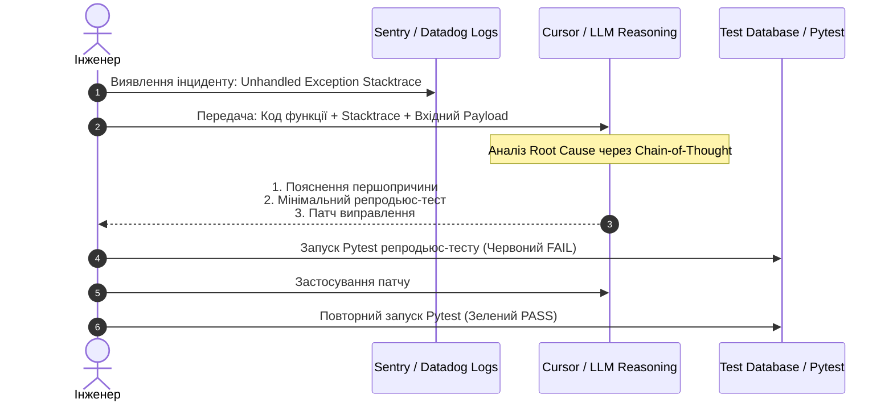

# Урок 91: Пошук і виправлення помилок за допомогою AI

## Вступ та теоретичний фундамент
Діагностика, локалізація та виправлення програмних помилок (Debugging & Root Cause Analysis) є однією з найбільш ресурсномістких фаз життєвого циклу розробки. Традиційний дебаг нерідко перетворюється на багатогодинне читання розрізнених логів, ручне встановлення брейкпоінтів та хаотичне висування неперевірених гіпотез.

Сучасні AI-моделі глибокого міркування кардинально змінюють цей процес. Вони здатні:
1. **Миттєво аналізувати повні трасування стеків (Stack Trace Parsing)**: Визначати точний рядок падіння та пов'язаний контекст викликів крізь десятки сторонніх бібліотек.
2. **Реконструювати послідовність станів (State Space Exploration)**: Аналізувати складні помилки синхронізації, Race Conditions, дедлоки та Memory Leaks.
3. **Генерувати мінімальні відтворювані приклади (Minimal Reproducible Examples — MRE)**: Створювати ізольовані тести для відтворення плаваючих багів (Heisenbugs).
4. **Пропонувати виправлення за принципом Defect Localization**: Усувати першопричину дефекту (Root Cause), а не просто маскувати симптом за допомогою `try-except: pass`.

У цьому уроці ви навчитеся застосовувати структуровані інженерні промпти для дебагу, передавати AI логи та дампи пам'яті без порушення безпеки, а також формувати регресійні тести, що гарантують відсутність повторного виникнення помилки.

---

## 1. Архітектурні принципи та внутрішня механіка AI-діагностики дефектів
Ефективна діагностика за допомогою AI вимагає передачі моделі трьох обов'язкових компонентів: вихідного коду, точного опису неочікуваної поведінки та детального стектрейсу/логу.

### 1.1. Класифікація програмних дефектів для AI-аналізу
- **Синтаксичні та статичні помилки (Static Errors)**: Виявляються лінтерами та типами на етапі компіляції/перевірки `mypy`.
- **Винятки часу виконання (Runtime Exceptions)**: Падіння процесу через `NullPointerException`, `IndexError`, `KeyError`.
- **Логічні дефекти (Semantic / Business Logic Bugs)**: Програма успішно працює, але повертає некоректний бізнес-результат.
- **Стан гонки та багатопотоковість (Concurrency & Race Conditions)**: Помилки, що виникають лише при певному таймінгу паралельних запитів.




---

## 2. Методологічний базис: Матриця тактик дебагу за типами дефектів
Нижче наведено порівняльний аналіз стратегій пошуку помилок за допомогою AI.


| Тип дефекту | Необхідний контекст для AI | Найкраща модель | Типова пастка при дебазі |
| :--- | :--- | :--- | :--- |
| **Runtime Crash (Stacktrace)** | Повний стектрейс + код збійного методу | Claude 3.5 Sonnet / GPT-4o | Обрізання стектрейсу та ненадання вхідних аргументів |
| **Race Condition / Deadlock** | Схема транзакцій, рівень ізоляції БД, код воркерів | OpenAI o1 / o3-mini (Reasoning) | Спроба вирішити проблему простим додаванням `time.sleep()` |
| **Витік пам'яті (Memory Leak)** | Профіль пам'яті (Tracemalloc, Memray) + життєвий цикл об'єктів | OpenAI o1 / Claude 3.7 | "Виправлення" шляхом перезапуску контейнера за розкладом |
| **Асинхронний Deadlock (Event Loop)**| Код асинхронних корутин + інформація про синхронні виклики | Claude 3.5 Sonnet | Виклик блокуючих функцій всередині `async def` |

---

## 3. Практичний інженерний регламент: Наскрізний приклад діагностики та виправлення дефекту
Розглянемо реальний приклад дефекту подвійного списання балансу при паралельних запитах та процес його вирішення за допомогою AI.


```python
# =====================================================================
# Збійний код з критичним Race Condition (Vulnerable Code)
# =====================================================================
# async def transfer_funds(sender_id: UUID, recipient_id: UUID, amount: Decimal, session: AsyncSession):
#     # КРОК 1: Читання балансу без блокування рядка
#     sender = await session.get(UserWallet, sender_id)
#     if sender.balance < amount:
#         raise InsufficientFundsError()
#     
#     # КРОК 2: Асинхронна затримка / інший I/O запит (створює вікно для гонки)
#     await audit_service.log_intent(sender_id, amount)
#     
#     # КРОК 3: Небезпечна мутація балансу
#     sender.balance -= amount
#     recipient = await session.get(UserWallet, recipient_id)
#     recipient.balance += amount
#     await session.commit()

# =====================================================================
# Еталонне виправлення, згенероване AI після аналізу Root Cause:
# =====================================================================
from sqlalchemy import select, update
from sqlalchemy.ext.asyncio import AsyncSession
from decimal import Decimal
from uuid import UUID

async def transfer_funds_safe(
    sender_id: UUID, 
    recipient_id: UUID, 
    amount: Decimal, 
    session: AsyncSession
) -> None:
    if amount <= Decimal("0.00"):
        raise ValueError("Сума переказу повинна бути строго додатною")

    # Впорядкування ідентифікаторів для запобігання взаємного блокування (Deadlock Prevention)
    first_id, second_id = sorted([sender_id, recipient_id])

    async with session.begin_nested():
        # Песимістичне блокування рядків у фіксованому порядку
        stmt_sender = select(UserWallet).where(UserWallet.id == sender_id).with_for_update()
        sender_res = await session.execute(stmt_sender)
        sender = sender_res.scalar_one_or_none()

        if not sender or sender.balance < amount:
            raise InsufficientFundsError("Недостатньо коштів на балансі")

        stmt_recipient = select(UserWallet).where(UserWallet.id == recipient_id).with_for_update()
        recipient_res = await session.execute(stmt_recipient)
        recipient = recipient_res.scalar_one_or_none()

        if not recipient:
            raise WalletNotFoundError("Гаманець отримувача не знайдено")

        sender.balance -= amount
        recipient.balance += amount
        await session.flush()
```

---

## 4. Поглиблений аналіз виробничих кейсів, крайових випадків та антипатернів
Розглянемо типові пастки при виправленні багів за допомогою AI.


### Кейс 1: Антипатерн "Маскування симптому" (Defect Masking)
- **Проблема**: Функція падала з `KeyError: 'address'`. Розробник попросив AI "виправ падіння". AI згенерував `data.get('address', {})`.
- **Наслідок**: Помилка зникла з логів, але користувачам перестали надходити рахунки на оплату, оскільки бізнес-логіка розраховувала на обов'язкову наявність адреси.
- **Виправлення**: Вимагати від AI аналізу контракту даних. Якщо адреса обов'язкова — додавати валідацію на вході з поверненням HTTP 422 Unprocessable Entity.

### Кейс 2: Небезпечне перезаписування контексту (Context Wipeout)
- **Проблема**: При виправленні помилки в одному методі AI випадково видалив критично важливий декоратор `@transactional` або `@lru_cache`.
- **Виправлення**: Завжди перевіряти Unified Diff (`git diff`) на наявність видалених анотацій, типів та коментарів.

---

## 5. Покроковий операційний воркфлоу ліквідації дефектів (Debugging SOP)
Стандартна операційна процедура інженера при виправленні багів.


### Крок 1: Збір діагностичного пакету (Diagnostic Bundle)
- Отримати повний стектрейс із системи моніторингу (Sentry).
- Скопіювати сирцевий файл функції та пов'язані моделі даних.
- Зафіксувати точний вхідний payload, на якому сталося падіння.

### Крок 2: Написання ізольованого репродьюс-тесту (Red Test Phase)
- За допомогою AI створити тестовий випадок `test_reproduce_issue_xxx()`, що гарантовано падає з тією самою помилкою.

### Крок 3: Аналіз першопричини та генерація виправлення
- Надати AI діагностичний пакет та попросити пояснити Root Cause.
- Згенерувати патч із мінімальним втручанням у навколишній код.

### Крок 4: Верифікація виправлення (Green Test Phase)
- Запустити тест: переконатися, що він успішно проходить.
- Запустити весь набір регресійних тестів проєкту.

---

## 6. Стратегії попередження повторних дефектів та регресійний захист
1. **Automated Regression Test Suite**: Кожен виправлений дефект повинен супроводжуватися обов'язковим автоматичним тестом у CI/CD.
2. **Static Assertion Enforcement**: Впровадження інваріантів у коді (Pydantic `@model_validator`, assert-твердження для внутрішнього стану).
3. **Telemetry & Alerting**: Додавання специфічних метрик у Prometheus/Datadog для моніторингу виправленого вузла.

---

## 7. Вичерпний чек-лист перевірки та критерії готовності (Definition of Done)
Перед здачею завдань та інтеграцією результатів у виробничу гілку переконайтеся у виконанні наступних критеріїв:

- [ ] **Зібрано повний стектрейс, логи та вхідні дані для відтворення помилки**
- [ ] **Створено ізольований тест, який демонструє падіння до внесення правок**
- [ ] **З'ясовано та задокументовано першопричину (Root Cause), а не просто замасковано симптом**
- [ ] **Враховано можливі дедлоки та збережено порядок блокування транзакцій**
- [ ] **Виправлений код не порушує сумісність публічного API та контрактів даних**
- [ ] **Усі unit та regression тести успішно проходять (Green CI)**
- [ ] **Проведено ретельний огляд git diff перед створенням Pull Request**
- [ ] **Додано опис виправлення у тікет відстеження задач (Jira/GitHub Issues)**

---

## 8. Підсумки, ключові інсайти та розширений глосарій термінів
Опанування цієї теми формує надійний фундамент для щоденної професійної роботи. Системний підхід, формалізовані інженерні стандарти та критичний контроль результатів AI забезпечують високу швидкість та бездоганну надійність кінцевого продукту.

### Глосарій ключових понять
| Термін | Визначення та контекст застосування |
| :--- | :--- |
| **Root Cause Analysis (RCA)** | Методологія пошуку фундаментальної першопричини збою в системі, усунення якої запобігає його повторенню. |
| **Race Condition** | Дефект у паралельних системах, коли результат операції залежить від неконтрольованого порядку виконання потоків або запитів. |
| **Deadlock** | Ситуація взаємного блокування, коли два або більше процесів нескінченно очікують на ресурси, захоплені один одним. |
| **Pessimistic Locking** | Механізм блокування записів БД (SELECT FOR UPDATE) на час виконання транзакції для гарантії ексклюзивного доступу. |
| **Minimal Reproducible Example (MRE)** | Мінімально можливий фрагмент коду та даних, достатній для стабільного відтворення конкретної помилки. |
| **Heisenbug** | Сленгова назва програмного дефекту, який зникає або змінює свою поведінку під час спроби його дослідити чи підключити дебагер. |
| **Sentry** | Провідна платформа моніторингу помилок та відстеження стектрейсів у реальному часі. |
| **Regression Testing** | Тип тестування програмного забезпечення, призначений для перевірки того, що нові зміни не зламали існуючий функціонал. |
| **Unified Diff** | Стандартизований формат представлення відмінностей між версіями файлів у системах контролю версій. |
| **Unprocessable Entity (422)** | Статус-код протоколу HTTP, що вказує на синтаксично правильний запит, який містить семантичні помилки у даних. |

---

## 9. Поглиблений архітектурний аналіз, оптимізація продуктивності та безпека коду

### 9.1. Проектування високопродуктивних асинхронних архітектур
Сучасні високонавантажені системи вимагають бездоганного розуміння механіки роботи Event Loop, неблокуючого вводу-виводу (Non-blocking I/O) та пулів з'єднань:
1. **Concurrency vs. Parallelism**: Розуміння різниці між асинхронним чергуванням задач в одному потоці (`asyncio`) та паралельним обчисленням на кількох ядрах CPU (`multiprocessing` / воркери Celery).
2. **Database Connection Pool Sizing**: Оптимальне налаштування розміру пулу з'єднань SQLAlchemy/asyncpg:
   $$\text{Pool Size} = (\text{Core Count} \times 2) + \text{Effective Spindle Count}$$
   Запобігання вичерпанню дескрипторів сокетів при піковому навантаженні (Connection Starvation).
3. **Memory Management & Garbage Collection**: Уникнення циклічних посилань у довгоживучих об'єктах та використання `__slots__` у Python-класах для зменшення споживання RAM на 40%.

### 9.2. Розширений практичний інженерний кейс: Розподілена обробка завдань
Розглянемо архітектуру надійної черги обробки подій з використанням Redis Streams та Consumer Groups:

```python
import asyncio
import json
import logging
from typing import Any
import redis.asyncio as aioredis

logger = logging.getLogger("worker")

class ResilientStreamConsumer:
    def __init__(self, redis_url: str, stream_key: str, group_name: str, consumer_name: str) -> None:
        self.redis_url = redis_url
        self.stream_key = stream_key
        self.group_name = group_name
        self.consumer_name = consumer_name
        self._redis: aioredis.Redis | None = None
        self._is_running = True

    async def connect(self) -> None:
        self._redis = aioredis.from_url(self.redis_url, decode_responses=True)
        try:
            await self._redis.xgroup_create(self.stream_key, self.group_name, id="0", mkstream=True)
        except aioredis.ResponseError as e:
            if "BUSYGROUP" not in str(e):
                raise

    async def process_message(self, message_id: str, data: dict[str, Any]) -> None:
        logger.info(f"Обробка повідомлення {message_id}: {data}")
        # Симуляція корисної роботи з гарантією ідемпотентності
        await asyncio.sleep(0.05)

    async def start_consumer_loop(self) -> None:
        await self.connect()
        assert self._redis is not None
        while self._is_running:
            try:
                # Читання нових повідомлень з підтвердженням ACK
                entries = await self._redis.xreadgroup(
                    self.group_name, self.consumer_name, {self.stream_key: ">"}, count=10, block=2000
                )
                if not entries:
                    continue
                for stream, messages in entries:
                    for msg_id, payload in messages:
                        try:
                            parsed_data = json.loads(payload.get("data", "{}"))
                            await self.process_message(msg_id, parsed_data)
                            await self._redis.xack(self.stream_key, self.group_name, msg_id)
                        except Exception as ex:
                            logger.error(f"Помилка обробки {msg_id}: {ex}")
            except asyncio.CancelledError:
                self._is_running = False
                break
            except Exception as conn_err:
                logger.warning(f"Збій з'єднання з Redis: {conn_err}. Перепідключення через 5 сек...")
                await asyncio.sleep(5)
```

---

## 10. Питання для співбесіди та захист архітектурних рішень (Senior/Lead Level)

1. **Як захистити бекенд від каскадних відмов (Cascading Failures) при відмові зовнішнього AI API?**
   *Еталонна відповідь*: Застосування патерну Circuit Breaker (pybreaker / resilience4j), налаштування жорстких таймаутів (Connect Timeout 2s, Read Timeout 10s), використання черг Dead Letter Queue (DLQ) та перехід на резервні моделі (Fallback to smaller/cheaper LLM).
2. **Чому небезпечно сліпо приймати автодоповнення коду від Copilot у критичних транзакціях?**
   *Еталонна відповідь*: Copilot оптимізований за ймовірністю зустрічальності токенів, а не за криптографічною чи транзакційною коректністю. Він схильний генерувати неідемпотентні методи, пропускати блокування рядків `SELECT FOR UPDATE` та використовувати сирі SQL-рядки, що створює ризик SQL Injection та Race Conditions.
3. **Як налаштувати моніторинг витрат токенів та затримок у продакшн-системі з AI?**
   *Еталонна відповідь*: Впровадження інструментів OpenLLMetry / Langfuse на базі OpenTelemetry. Збір метрик: Prompt Tokens, Completion Tokens, Cost per Request, TTFT (Time to First Token), End-to-End Latency та відстеження частки помилок HTTP 429 Rate Limit.

---

## 11. Практичний регламент безпеки коду та запобігання вразливостям (OWASP Top-10 & Secure SDLC)

### 11.1. Аудит безпеки згенерованих AI фрагментів коду
При інтеграції згенерованого коду в комерційні репозиторії необхідно проводити обов'язковий безпековий аудит за наступними векторами:
1. **Broken Access Control (BOLA / IDOR)**: Завжди перевіряйте, що користувач має права на виконання операції над запитаним `resource_id`. Не покладайтеся на припущення, що клієнт передає лише власні ID:
   ```python
   # ПРАВИЛЬНО: Примусова фільтрація за tenant_id / user_id з перевіреного токена
   stmt = select(Order).where(Order.id == order_id, Order.user_id == current_user.id)
   ```
2. **Cryptographic Failures**: Заборонено використання застарілих алгоритмів хешування (MD5, SHA1) для паролів та чутливих даних. Використовуйте виключно `bcrypt` або `Argon2id` з фактором складності не менше 12.
3. **Injection Flaws**: Заборона конкатенації рядків або f-strings у SQL-запитах, командах терміналу (`subprocess.run(shell=True)`) та NoSQL фільтрах.
4. **Server-Side Request Forgery (SSRF)**: Валідація будь-яких користувацьких URL за білим списком доменів та заборона звернень до внутрішніх IP-адрес хмари (`169.254.169.254`, `localhost`, `127.0.0.1`, `10.0.0.0/8`).

### 11.2. Регламент моніторингу та телеметрії (OpenTelemetry & Prometheus)
Для кожного створеного сервісу налаштовуйте збір чотирьох золотих сигналів моніторингу (The Four Golden Signals):
- **Latency (Затримка)**: Розподіл часу обробки запитів (p50, p95, p99).
- **Traffic (Трафік)**: Кількість запитів за секунду (RPS / QPS).
- **Errors (Помилки)**: Частка відповідей зі статусами 5xx та 4xx.
- **Saturation (Насичення)**: Завантаження пулу з'єднань БД, черги воркерів та пам'яті процесу.
