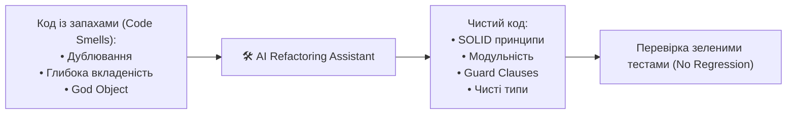

# Урок 92: Рефакторинг та покращення створеного коду: Code Smells, SOLID та патерни оптимізації

## 1. Що таке рефакторинг та коли він необхідний

**Рефакторинг** — це процес зміни внутрішньої структури програмного коду без зміни його зовнішньої спостережуваної поведінки. Мета рефакторингу — зробити код чистішим, читабельнішим, масштабованим, легшим для тестування та зменшити технічний борг (Technical Debt).

---

## 2. Каталог типових «Запахів коду» (Code Smells)

| Запах коду | Ознаки проблеми | Спосіб лікування через AI |
| :--- | :--- | :--- |
| **Long Method / God Function** | Функція містить понад 50–100 рядків і робить усе одночасно. | Декомпозиція за методом *Extract Method*, створення спеціалізованих сервісів. |
| **Arrow Anti-pattern (Deep Nesting)** | Багато рівнів вкладених `if-else` (піраміда з відступів). | Рефакторинг на *Guard Clauses* (раннє повернення `return`). |
| **Duplicated Code (Copy-Paste)** | Один і той самий алгоритм скопійований у 3 різних місцях. | Винесення у спільний утилітарний модуль / базовий клас (*DRY*). |
| **Feature Envy** | Метод одного класу постійно звертається до даних іншого класу. | Перенесення методу у відповідний клас (*Move Method*). |
| **Magic Numbers & Strings** | Незрозумілі числа та константи (`if status == 4` або `price * 1.185`). | Заміна на іменовані `Enum` або типізовані константи. |

---

## 3. Безпечний рефакторинг за правилом «Червоний - Зелений - Рефакторинг»

Головне правило безпечного рефакторингу за допомогою AI:
1. Переконатися, що наявний код покритий автоматичними тестами (всі тести **зелені**).
2. Попросити AI оптимізувати структуру, чітко заборонивши змінювати публічний API та контракти.
3. Перезапустити тести. Якщо тести залишаються **зеленими**, рефакторинг успішний.
