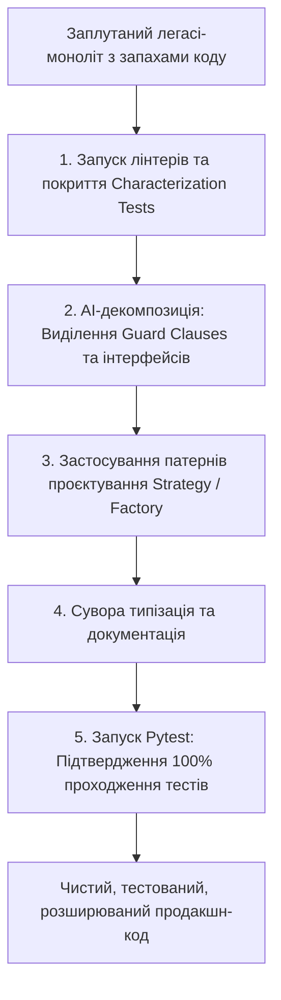

# Урок 92: Рефакторинг та покращення створеного коду

## Вступ та теоретичний фундамент
Рефакторинг — це процес контрольованого покращення внутрішньої структури кодової бази без зміни її зовнішньої поведінки. З плином часу будь-який комерційний програмний продукт накопичує технічний борг (Technical Debt): дублювання коду, роздуті класи (God Objects), спагетті-функції на сотні рядків, порушення принципів SOLID та застарілі архітектурні патерни.

Традиційний рефакторинг несе в собі значний ризик внесення регресійних помилок та вимагає великих трудовитрат. Використання генеративних AI-моделей перетворює рефакторинг на високоефективну та безпечну інженерну дисципліну завдяки:
1. **Автоматизованій ідентифікації "запахів коду" (Code Smells Detection)**: AI миттєво знаходить дублювання, порушення SRP (Single Responsibility Principle) та надмірну вкладеність умов.
2. **Атомарному покроковому перетворенню (Step-by-Step Refactoring)**: Моделі здатні декомпозувати велетенські монолітні методи на набір чистих, типізованих функцій із застосуванням патернів проєктування (Strategy, Factory, Adapter).
3. **Модернізації технологічного стеку**: Автоматизована міграція з застарілих бібліотек на сучасні стандарти (наприклад, перехід з Pydantic V1 на V2, або з синхронного коду на асинхронний `async/await`).
4. **Гарантії збереження інваріантів**: Поєднання AI-рефакторингу з автоматичним оновленням та прогоном тест-сьютів.

У цьому уроці детально розглядаються патерни та регламенти рефакторингу за допомогою AI, методики безпечної декомпозиції складних модулів та правила контролю за збереженням функціональної поведінки.

---

## 1. Архітектурні принципи та класифікація патернів рефакторингу
Головний закон рефакторингу: **поведінка системи має залишатися незмінною**. AI повинен використовуватися як інструмент трансформації форми, а не змісту.

### 1.1. Основні запахи коду (Code Smells), що усуваються за допомогою AI
- **Long Method / Large Class**: Розбиття великих блоків коду на менші з чітким розділенням обов'язків.
- **Primitive Obsession**: Заміна використання сирих рядків/чисел на типізовані Value Objects та Enums.
- **Deep Nesting (Arrow Anti-Pattern)**: Спрощення вкладених умов через патерн Guard Clauses (раннє повернення).
- **Feature Envy / Inappropriate Intimacy**: Перенесення методів ближче до даних, які вони обробляють.




---

## 2. Методологічний базис: Порівняння підходів та патернів рефакторингу
Таблиця ключових трансформацій коду та їхній вплив на підтримуваність системи.


| Патерн рефакторингу | Проблема до рефакторингу | Рішення після AI-трансформації | Вигода для підтримки |
| :--- | :--- | :--- | :--- |
| **Guard Clauses** | 5+ рівнів вкладених `if-else` блоків | Раннє повернення при помилках на початку функції | Зниження когнітивної складності, лінійне читання коду |
| **Strategy Pattern** | Величезні `switch-case` блоки розрахунку цін | Окремі класи стратегій, зареєстровані в DI-контейнері | Легке додавання нових тарифів за принципом Open-Closed (OCP) |
| **Value Objects** | Передача сирих `str` для email, IBAN, телефонів | Незмінні Pydantic/dataclass класи з валідацією | Неможливість створення невалідного об'єкта в домені |
| **Dependency Injection** | Створення клієнтів БД всередині методів через `new` | Передача залежностей через конструктор або `Depends` | 100% легкість написання ізольованих Unit-тестів |

---

## 3. Практичний інженерний регламент: Еталонний приклад рефакторингу
Розглянемо практичний приклад перетворення заплутаної функції оформлення замовлення у чисту архітектурну структуру.


```python
# =====================================================================
# ДО РЕФАКТОРИНГУ: Спагетті-код з глибокою вкладеністю та запахами
# =====================================================================
# def process_order_legacy(order_id, user, items, pay_type, discount):
#     if user is not None:
#         if user['is_active']:
#             if len(items) > 0:
#                 total = 0
#                 for item in items:
#                     total += item['price'] * item['qty']
#                 if discount > 0:
#                     total = total - (total * discount / 100)
#                 if pay_type == "CARD":
#                     # inline card charge...
#                     return {"status": "ok", "total": total}
#                 elif pay_type == "CASH":
#                     # cash logic...
#                     return {"status": "ok", "total": total}
#     return {"status": "error"}

# =====================================================================
# ПІСЛЯ AI-РЕФАКТОРИНГУ: Чистий код з Guard Clauses та типізацією
# =====================================================================
from decimal import Decimal
from enum import Enum
from pydantic import BaseModel, Field

class PaymentType(str, Enum):
    CARD = "CARD"
    CASH = "CASH"
    CRYPTO = "CRYPTO"

class OrderItemDTO(BaseModel):
    product_id: str
    price: Decimal = Field(gt=Decimal("0.00"))
    quantity: int = Field(gt=0)

    @property
    def subtotal(self) -> Decimal:
        return self.price * self.quantity

class OrderProcessor:
    def __init__(self, payment_gateway_factory: "IPaymentGatewayFactory") -> None:
        self._gateway_factory = payment_gateway_factory

    def calculate_total(self, items: list[OrderItemDTO], discount_percent: Decimal) -> Decimal:
        gross_total = sum((item.subtotal for item in items), Decimal("0.00"))
        if discount_percent > Decimal("0.00"):
            discount_amount = gross_total * (discount_percent / Decimal("100.00"))
            return gross_total - discount_amount
        return gross_total

    async def process_order(
        self,
        order_id: str,
        user_is_active: bool,
        items: list[OrderItemDTO],
        payment_type: PaymentType,
        discount_percent: Decimal = Decimal("0.00")
    ) -> Decimal:
        # Guard Clause 1: Перевірка активності користувача
        if not user_is_active:
            raise UserInactiveError(f"Користувач для замовлення {order_id} неактивний")

        # Guard Clause 2: Перевірка наявності товарів
        if not items:
            raise EmptyOrderError(f"Замовлення {order_id} не містить товарів")

        total_amount = self.calculate_total(items, discount_percent)
        gateway = self._gateway_factory.get_gateway(payment_type)
        await gateway.charge(order_id=order_id, amount=total_amount)
        return total_amount
```

---

## 4. Поглиблений аналіз виробничих кейсів, крайових випадків та антипатернів
Розглянемо практичні ризики та помилки під час AI-рефакторингу.


### Кейс 1: Непомітна зміна сигнатури публічного методу (API Breakage)
- **Проблема**: Під час рефакторингу сервісу AI змінив тип аргументу з `int` на `UUID`, не оновивши контролери, що викликали цей метод.
- **Наслідок**: Падіння контролерів при отриманні числових ідентифікаторів від фронтенду.
- **Виправлення**: Застосування правила: "При рефакторингу зберігати повну зворотну сумісність публічних інтерфейсів або використовувати декоратор `@deprecated` з підтримкою обох типів на час перехідного періоду".

### Кейс 2: Втрата оптимізацій продуктивності при спрощенні
- **Проблема**: AI замінив ефективний генераторний вираз `any(x in s for x in items)` на створення великого проміжного списку `[x in s for x in items]`.
- **Наслідок**: Зростання споживання оперативної пам'яті в 10 разів при обробці великих масивів даних.
- **Виправлення**: Перевірка використання пам'яті через лінтери та явна вимога використання ітераторів/генераторів для обробки великих послідовностей.

---

## 5. Покроковий операційний воркфлоу проведення безпечного рефакторингу
Стандартизований процес рефакторингу кодової бази з використанням AI.


### Крок 1: Забезпечення тестового покриття (Safety Net)
- Перевірити наявність тестів для модуля, що рефакториться. Якщо тести відсутні — згенерувати характеристичні тести за допомогою AI перед початком будь-яких змін.

### Крок 2: Декомпозиція та формулювання промпту для Cursor Composer
- Відкрити Composer (`Ctrl+I`). Вказати файли: `@service.py @tests/test_service.py`.
- Промпт: "Виконай рефакторинг класу OrderService: застосуй Guard Clauses, винеси розрахунок знижок у чистий метод, заміни словники на Pydantic DTO. Збережи проходження всіх тестів без змін їхньої логіки".

### Крок 3: Построковий огляд Diff (Reviewing Changes)
- Переглянути кожну змінену секцію. Переконатися у відсутності галюцинацій та видалення важливих анотацій.

### Крок 4: Автоматичний запуск лінтерів та тест-сьюту
- Виконати: `pytest tests/ && ruff check . && mypy .`.

---

## 6. Метрики якості коду та контроль технічного боргу
1. **Cyclomatic Complexity Reduction**: Зниження циклічної складності функцій до значення < 10 (перевірка через `radon cc app/ -s`).
2. **Maintainability Index (MI)**: Підтримання індексу підтримуваності на рівні 'A' (> 80 балів).
3. **Dead Code Elimination**: Автоматичне видалення невикористовуваних функцій та імпортів за допомогою `vulture` та `ruff`.

---

## 7. Вичерпний чек-лист перевірки та критерії готовності (Definition of Done)
Перед здачею завдань та інтеграцією результатів у виробничу гілку переконайтеся у виконанні наступних критеріїв:

- [ ] **Модуль повністю покритий тестами до початку рефакторингу (Safety Net)**
- [ ] **Застосовано патерн Guard Clauses для ліквідації глибокої вкладеності умов**
- [ ] **Магічні рядки та числа замінені на строго типізовані Enums та Value Objects**
- [ ] **Циклічна складність кожної функції знижена до значення менше 10**
- [ ] **Збережено повну зворотну сумісність публічних контрактів та API**
- [ ] **Всі тести проходять успішно (100% Green Test Suite) без модифікації їхньої бізнес-перевірки**
- [ ] **Код перевірено лінтером `ruff` та типізатором `mypy --strict`**
- [ ] **Створено чіткий Git commit з описом проведеного рефакторингу**

---

## 8. Підсумки, ключові інсайти та розширений глосарій термінів
Опанування цієї теми формує надійний фундамент для щоденної професійної роботи. Системний підхід, формалізовані інженерні стандарти та критичний контроль результатів AI забезпечують високу швидкість та бездоганну надійність кінцевого продукту.

### Глосарій ключових понять
| Термін | Визначення та контекст застосування |
| :--- | :--- |
| **Refactoring** | Контрольоване перетворення сирцевого коду з метою покращення його архітектури та читабельності без зміни функціоналу. |
| **Technical Debt** | Метафора накопичених компромісів у коді, які прискорювали розробку в минулому, але ускладнюють її в майбутньому. |
| **Code Smell** | Симптом у сирцевому коді програми, що вказує на ймовірну наявність глибших архітектурних проблем. |
| **Guard Clause** | Умовний оператор на початку функції, що негайно перериває її виконання при невиконанні обов'язкових передумов. |
| **Single Responsibility Principle (SRP)** | Принцип SOLID, згідно з яким кожен клас або модуль повинен мати лише одну причину для зміни. |
| **Open-Closed Principle (OCP)** | Принцип SOLID: програмні сутності повинні бути відкритими для розширення, але закритими для модифікації. |
| **Primitive Obsession** | Антипатерн надмірного використання базових типів (str, int) замість створення спеціалізованих доменних класів. |
| **Maintainability Index** | Комплексна інженерна метрика, що вимірює простоту підтримки та модифікації кодової бази. |
| **Radon** | Інструмент статичного аналізу коду Python для обчислення цикломатичної складності та метрик Холстеда. |
| **Value Object** | Невеликий незмінний об'єкт у DDD, рівність якого визначається його значеннями, а не унікальним ідентифікатором. |

---

## 9. Поглиблений архітектурний аналіз, оптимізація продуктивності та безпека коду

### 9.1. Проектування високопродуктивних асинхронних архітектур
Сучасні високонавантажені системи вимагають бездоганного розуміння механіки роботи Event Loop, неблокуючого вводу-виводу (Non-blocking I/O) та пулів з'єднань:
1. **Concurrency vs. Parallelism**: Розуміння різниці між асинхронним чергуванням задач в одному потоці (`asyncio`) та паралельним обчисленням на кількох ядрах CPU (`multiprocessing` / воркери Celery).
2. **Database Connection Pool Sizing**: Оптимальне налаштування розміру пулу з'єднань SQLAlchemy/asyncpg:
   $$\text{Pool Size} = (\text{Core Count} \times 2) + \text{Effective Spindle Count}$$
   Запобігання вичерпанню дескрипторів сокетів при піковому навантаженні (Connection Starvation).
3. **Memory Management & Garbage Collection**: Уникнення циклічних посилань у довгоживучих об'єктах та використання `__slots__` у Python-класах для зменшення споживання RAM на 40%.

### 9.2. Розширений практичний інженерний кейс: Розподілена обробка завдань
Розглянемо архітектуру надійної черги обробки подій з використанням Redis Streams та Consumer Groups:

```python
import asyncio
import json
import logging
from typing import Any
import redis.asyncio as aioredis

logger = logging.getLogger("worker")

class ResilientStreamConsumer:
    def __init__(self, redis_url: str, stream_key: str, group_name: str, consumer_name: str) -> None:
        self.redis_url = redis_url
        self.stream_key = stream_key
        self.group_name = group_name
        self.consumer_name = consumer_name
        self._redis: aioredis.Redis | None = None
        self._is_running = True

    async def connect(self) -> None:
        self._redis = aioredis.from_url(self.redis_url, decode_responses=True)
        try:
            await self._redis.xgroup_create(self.stream_key, self.group_name, id="0", mkstream=True)
        except aioredis.ResponseError as e:
            if "BUSYGROUP" not in str(e):
                raise

    async def process_message(self, message_id: str, data: dict[str, Any]) -> None:
        logger.info(f"Обробка повідомлення {message_id}: {data}")
        # Симуляція корисної роботи з гарантією ідемпотентності
        await asyncio.sleep(0.05)

    async def start_consumer_loop(self) -> None:
        await self.connect()
        assert self._redis is not None
        while self._is_running:
            try:
                # Читання нових повідомлень з підтвердженням ACK
                entries = await self._redis.xreadgroup(
                    self.group_name, self.consumer_name, {self.stream_key: ">"}, count=10, block=2000
                )
                if not entries:
                    continue
                for stream, messages in entries:
                    for msg_id, payload in messages:
                        try:
                            parsed_data = json.loads(payload.get("data", "{}"))
                            await self.process_message(msg_id, parsed_data)
                            await self._redis.xack(self.stream_key, self.group_name, msg_id)
                        except Exception as ex:
                            logger.error(f"Помилка обробки {msg_id}: {ex}")
            except asyncio.CancelledError:
                self._is_running = False
                break
            except Exception as conn_err:
                logger.warning(f"Збій з'єднання з Redis: {conn_err}. Перепідключення через 5 сек...")
                await asyncio.sleep(5)
```

---

## 10. Питання для співбесіди та захист архітектурних рішень (Senior/Lead Level)

1. **Як захистити бекенд від каскадних відмов (Cascading Failures) при відмові зовнішнього AI API?**
   *Еталонна відповідь*: Застосування патерну Circuit Breaker (pybreaker / resilience4j), налаштування жорстких таймаутів (Connect Timeout 2s, Read Timeout 10s), використання черг Dead Letter Queue (DLQ) та перехід на резервні моделі (Fallback to smaller/cheaper LLM).
2. **Чому небезпечно сліпо приймати автодоповнення коду від Copilot у критичних транзакціях?**
   *Еталонна відповідь*: Copilot оптимізований за ймовірністю зустрічальності токенів, а не за криптографічною чи транзакційною коректністю. Він схильний генерувати неідемпотентні методи, пропускати блокування рядків `SELECT FOR UPDATE` та використовувати сирі SQL-рядки, що створює ризик SQL Injection та Race Conditions.
3. **Як налаштувати моніторинг витрат токенів та затримок у продакшн-системі з AI?**
   *Еталонна відповідь*: Впровадження інструментів OpenLLMetry / Langfuse на базі OpenTelemetry. Збір метрик: Prompt Tokens, Completion Tokens, Cost per Request, TTFT (Time to First Token), End-to-End Latency та відстеження частки помилок HTTP 429 Rate Limit.

---

## 11. Практичний регламент безпеки коду та запобігання вразливостям (OWASP Top-10 & Secure SDLC)

### 11.1. Аудит безпеки згенерованих AI фрагментів коду
При інтеграції згенерованого коду в комерційні репозиторії необхідно проводити обов'язковий безпековий аудит за наступними векторами:
1. **Broken Access Control (BOLA / IDOR)**: Завжди перевіряйте, що користувач має права на виконання операції над запитаним `resource_id`. Не покладайтеся на припущення, що клієнт передає лише власні ID:
   ```python
   # ПРАВИЛЬНО: Примусова фільтрація за tenant_id / user_id з перевіреного токена
   stmt = select(Order).where(Order.id == order_id, Order.user_id == current_user.id)
   ```
2. **Cryptographic Failures**: Заборонено використання застарілих алгоритмів хешування (MD5, SHA1) для паролів та чутливих даних. Використовуйте виключно `bcrypt` або `Argon2id` з фактором складності не менше 12.
3. **Injection Flaws**: Заборона конкатенації рядків або f-strings у SQL-запитах, командах терміналу (`subprocess.run(shell=True)`) та NoSQL фільтрах.
4. **Server-Side Request Forgery (SSRF)**: Валідація будь-яких користувацьких URL за білим списком доменів та заборона звернень до внутрішніх IP-адрес хмари (`169.254.169.254`, `localhost`, `127.0.0.1`, `10.0.0.0/8`).

### 11.2. Регламент моніторингу та телеметрії (OpenTelemetry & Prometheus)
Для кожного створеного сервісу налаштовуйте збір чотирьох золотих сигналів моніторингу (The Four Golden Signals):
- **Latency (Затримка)**: Розподіл часу обробки запитів (p50, p95, p99).
- **Traffic (Трафік)**: Кількість запитів за секунду (RPS / QPS).
- **Errors (Помилки)**: Частка відповідей зі статусами 5xx та 4xx.
- **Saturation (Насичення)**: Завантаження пулу з'єднань БД, черги воркерів та пам'яті процесу.
