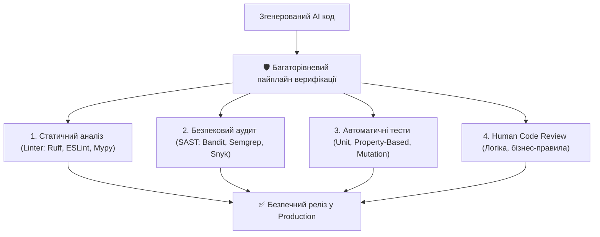

# Урок 93: Перевірка коректності коду, створеного AI: безпековий аудит, SAST, DAST та лінтинг

## 1. Чому сліпа довіра до AI-коду є небезпечною

Штучний інтелект навчався на мільярдах рядків коду з відкритого інтернету, включно зі старими, неоптимальними та вразливими репозиторіями. Дослідження показують, що до 30–40% згенерованого AI коду містить потенційні проблеми: від застарілих бібліотек до критичних вразливостей OWASP Top 10.

---

## 2. Топ вразливостей OWASP, які часто генерує AI

1. **SQL Injection**: Конкатенація рядків у запитах замість параметризованих плейсхолдерів (`cursor.execute(f"SELECT * FROM users WHERE name = '{name}'")`).
2. **Insecure Deserialization**: Використання небезпечного модуля `pickle.loads()` для неперевірених користувацьких даних.
3. **Hardcoded Secrets & API Keys**: Залишення тестових секретів або ключів доступу у коді.
4. **Weak Cryptography**: Використання застарілих алгоритмів хешування (MD5, SHA1) для збереження паролів замість Argon2 / Bcrypt.
5. **Path Traversal**: Відкриття файлів за неперевіреним шляхом від користувача (`open(f"/uploads/{user_input}")`), що дозволяє зловмиснику прочитати `/etc/passwd`.

---

## 3. Інструменти автоматизованого контролю якості (Tooling Matrix)

- **Linters & Formatters**: `Ruff` (надшвидкий лінтер Python), `Black`, `ESLint`, `Prettier`.
- **Static Type Checkers**: `Mypy`, `Pyright`, `TypeScript Compiler (tsc)`.
- **Security Scanners (SAST)**: `Bandit` (спеціалізований сканер безпеки Python), `Semgrep`, `Snyk`.
- **Dependency Vulnerability Audits**: `pip-audit`, `npm audit`, `Dependabot`.

---

## 4. Чекліст прийому AI-згенерованого коду розробником

- [ ] Чи відсутні хардкод-секрети, токени та внутрішні IP-адреси?
- [ ] Чи всі запити до БД параметризовані?
- [ ] Чи проходять лінтери (`ruff check`) та типізація (`mypy --strict`) без попереджень?
- [ ] Чи перевірені всі зовнішні залежності на наявність відомих CVE?
- [ ] Чи покрита логіка негативними тестами на невалідні вхідні дані?
