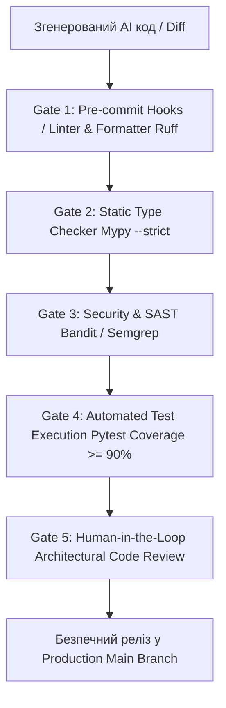

# Урок 93: Перевірка коректності коду, створеного AI

## Вступ та теоретичний фундамент
Код, створений генеративними мовними моделями, ніколи не повинен потрапляти у виробниче середовище без всебічної багаторівневої верифікації. Попри разючу здатність AI швидко писати синтаксично правильні конструкції, мовні моделі є ймовірнісними автоматами, схильними до галюцинацій (Hallucinations), прихованих безпекових вразливостей (Security Vulnerabilities), витоків пам'яті та тонких логічних помилок у крайових умовах.

Дисципліна верифікації AI-коду (AI-Generated Code Verification & Validation) включає чотири взаємопов'язані бар'єри контролю якості:
1. **Статичний аналіз та сувора типізація (SAST & Static Typing)**: Автоматизована перевірка сирцевого коду лінтерами (`ruff`, `eslint`), аналізаторами типів (`mypy --strict`, `tsc`) та сканерами безпеки (`bandit`, `semgrep`).
2. **Динамічне тестування (Automated Dynamic Verification)**: Запуск повного набору модульних, інтеграційних та контрактних тестів з вимірюванням покриття гілок (Branch Coverage).
3. **Аудит безпеки та комплайєнсу (Security Audit)**: Перевірка на відсутність вразливостей з топ-10 OWASP (SQL Injection, XSS, SSRF, Broken Object Level Authorization) та перевірка ліцензійної чистоти використаних залежностей.
4. **Експертний інженерний огляд (Human-in-the-Loop Code Review)**: Фінальна оцінка коду Senior-інженером на відповідність бізнес-вимогам, архітектурним патернам та стандартам проєкту.

У цьому уроці детально розглядається регламент побудови автоматизованого конвеєра верифікації згенерованого коду, правила налаштування Pre-commit хуків та методика проведення швидкого та безпомилкового AI-код-рев'ю.

---

## 1. Архітектурні принципи побудови багатоетапного конвеєра верифікації
Конвеєр перевірки будується за принципом "швейцарського сиру" (Swiss Cheese Model), де кожен наступний шар безпеки виявляє дефекти, пропущені попереднім.




---

## 2. Методологічний базис: Матриця бар'єрів верифікації AI-коду
Порівняльний аналіз інструментів автоматизованого контролю якості згенерованого коду.


| Рівень верифікації | Інструменти / Команди | Що конкретно перевіряється | Дія при виявленні помилки |
| :--- | :--- | :--- | :--- |
| **Форматування та синтаксис** | `ruff check .`, `black --check` | Стиль PEP 8, невикористані імпорти, синтаксичні помилки | Автоматичне форматування `ruff format` |
| **Сувора типізація** | `mypy --strict`, `pyright` | Відсутність Any, коректність дженеріків та Noneable | Блокування комміту до додавання типів |
| **Безпековий аудит (SAST)** | `bandit -r app/`, `semgrep` | SQL Injection, небезпечні виклики `eval/exec`, слабкі шифри | Негайне видалення вразливої конструкції |
| **Контрактне тестування** | `pytest --cov=app --cov-fail-under=90` | Проходження бізнес-сценаріїв та крайових випадків | Відхилення Pull Request |
| **Перевірка ліцензій** | `pip-licenses`, `trivy` | Відсутність GPL-залежностей у пропрієтарному проєкті | Заміна стороннього пакету |

---

## 3. Практичний інженерний регламент: Налаштування конфігурації `.pre-commit-config.yaml`
Еталонна конфігурація Pre-commit хуків для автоматичної фільтрації дефектного AI-коду перед фіксацією в Git.


```yaml
# =====================================================================
# .pre-commit-config.yaml - Корпоративний стандарт верифікації коду
# =====================================================================
repos:
  - repo: https://github.com/pre-commit/pre-commit-hooks
    rev: v4.5.0
    hooks:
      - id: trailing-whitespace
      - id: end-of-file-fixer
      - id: check-yaml
      - id: check-json
      - id: check-added-large-files
        args: ['--maxkb=500']
      - id: detect-private-key

  - repo: https://github.com/astral-sh/ruff-pre-commit
    rev: v0.3.0
    hooks:
      - id: ruff
        args: [--fix, --exit-non-zero-on-fix]
      - id: ruff-format

  - repo: https://github.com/pre-commit/mirrors-mypy
    rev: v1.8.0
    hooks:
      - id: mypy
        additional_dependencies: [pydantic>=2.6.0, types-all]
        args: [--strict, --ignore-missing-imports]

  - repo: https://github.com/PyCQA/bandit
    rev: 1.7.7
    hooks:
      - id: bandit
        args: [-r, app/, -ll]
```

---

## 4. Поглиблений аналіз виробничих кейсів, крайових випадків та антипатернів
Розглянемо реальні інциденти, викликані недостатньою верифікацією AI-коду.


### Кейс 1: Вразливість масового призначення (Mass Assignment Vulnerability)
- **Проблема**: AI згенерував ендпоінт оновлення профілю через `user.update(dto.model_dump())`. У DTO не було виключено поле `is_admin`.
- **Наслідок**: Звичайний користувач надіслав `{"is_admin": true}` у JSON-тілі і отримав права суперадміністратора.
- **Виправлення**: Використання виключно явних схем оновлення (Update DTO) з білим списком полів та валідація на рівні Pydantic.

### Кейс 2: Галюцинація неіснуючого пакету (Package Hallucination / Dependency Confusion)
- **Проблема**: AI порекомендував встановити бібліотеку `pip install fast-crypto-utils`. Цей пакет не існував в офіційному реєстрі, але зловмисники зареєстрували його з шкідливим кодом.
- **Виправлення**: Встановлення суворої політики перевірки залежностей через `pip-audit` та заборона встановлення неперевірених сторонніх бібліотек.

---

## 5. Покроковий операційний воркфлоу рев'ю AI-згенерованого Pull Request
Чек-лист та порядок дій інженера при проведенні код-рев'ю.


### Крок 1: Локальний запуск перевірочного конвеєра
- Виконати команду повної перевірки: `pre-commit run --all-files`.
- Запустити повний тестовий набір: `pytest -v --cov=app --cov-report=term-missing`.

### Крок 2: Інспекція безпеки (Security Sanity Check)
- Перевірити всі точки входу API на наявність авторизації та валідації вхідних даних.
- Переконатися у відсутності хардкоду секретів або чутливих логів.

### Крок 3: Перевірка відповідності бізнес-вимогам (Business Logic Audit)
- Зіставити реалізацію з вихідними критеріями приймання (Acceptance Criteria) тікета.

### Крок 4: Затвердження та злиття (Merge to Main)
- Переконатися у проходженні всіх статус-чеків у GitHub Actions CI.
- Здійснити Squash and Merge.

---

## 6. Стратегії підвищення надійності та довгострокового контролю якості
1. **Branch Protection Rules**: Заборона прямого пушу в `main` гілку без мінімум одного затвердженого рев'ю та зеленого CI.
2. **Mutation Testing**: Періодичний запуск мутаційного тестування (`mutmut`) для перевірки реальної якості автотестів, згенерованих AI.
3. **Automated Dependency Scanning**: Щоденне сканування репозиторію через Dependabot / Snyk на наявність відомих CVE.

---

## 7. Вичерпний чек-лист перевірки та критерії готовності (Definition of Done)
Перед здачею завдань та інтеграцією результатів у виробничу гілку переконайтеся у виконанні наступних критеріїв:

- [ ] **Код пройшов перевірку форматування та лінтингу `ruff` без зауважень**
- [ ] **Типізація перевірена `mypy --strict` без використання `Any` або `# type: ignore`**
- [ ] **Сканер безпеки `bandit` не виявив вразливостей середнього та високого рівня**
- [ ] **Тестове покриття коду становить не менше 90% (включаючи крайові випадки)**
- [ ] **Перевірено захист від Mass Assignment, SQL Injection та XSS**
- [ ] **Всі сторонні залежності перевірено на наявність у PyPI та відсутність шкідливого коду**
- [ ] **Проведено ретельний інженерний огляд змін за принципом Human-in-the-Loop**
- [ ] **Pull Request успішно пройшов усі обов'язкові перевірки в GitHub Actions CI**

---

## 8. Підсумки, ключові інсайти та розширений глосарій термінів
Опанування цієї теми формує надійний фундамент для щоденної професійної роботи. Системний підхід, формалізовані інженерні стандарти та критичний контроль результатів AI забезпечують високу швидкість та бездоганну надійність кінцевого продукту.

### Глосарій ключових понять
| Термін | Визначення та контекст застосування |
| :--- | :--- |
| **Human-in-the-Loop (HITL)** | Принцип проектування систем, при якому фінальне рішення та валідація результатів AI покладається на людину-експерта. |
| **SAST (Static Application Security Testing)** | Методологія аналізу сирцевого коду додатків для виявлення вразливостей безпеки без запуску програми. |
| **Pre-commit Hook** | Скрипт, що автоматично виконується Git перед створенням кожного комміту для перевірки коду на відповідність стандартам. |
| **Mass Assignment** | Вразливість безпеки, при якій зловмисник може змінити захищені поля моделі через передачу додаткових параметрів у запиті. |
| **Dependency Confusion** | Атака на ланцюг постачання програмного забезпечення шляхом реєстрації шкідливих публічних пакетів з іменами внутрішніх модулів. |
| **Branch Coverage** | Метрика тестування, що показує відсоток виконаних логічних гілок (умовних переходів) у коді під час запуску тестів. |
| **Mutation Testing** | Метод оцінки якості тестів шляхом внесення дрібних штучних змін (мутацій) у код та перевірки, чи впадуть тести. |
| **Bandit** | Інструмент статичного аналізу безпеки, розроблений для пошуку поширених проблем безпеки у коді Python. |
| **Ruff** | Надзвичайно швидкий лінтер та форматувальник коду Python, написаний на Rust. |
| **OWASP Top-10** | Регулярно оновлюваний звіт, що описує десять найбільш критичних ризиків безпеки веб-додатків. |

---

## 9. Поглиблений архітектурний аналіз, оптимізація продуктивності та безпека коду

### 9.1. Проектування високопродуктивних асинхронних архітектур
Сучасні високонавантажені системи вимагають бездоганного розуміння механіки роботи Event Loop, неблокуючого вводу-виводу (Non-blocking I/O) та пулів з'єднань:
1. **Concurrency vs. Parallelism**: Розуміння різниці між асинхронним чергуванням задач в одному потоці (`asyncio`) та паралельним обчисленням на кількох ядрах CPU (`multiprocessing` / воркери Celery).
2. **Database Connection Pool Sizing**: Оптимальне налаштування розміру пулу з'єднань SQLAlchemy/asyncpg:
   $$\text{Pool Size} = (\text{Core Count} \times 2) + \text{Effective Spindle Count}$$
   Запобігання вичерпанню дескрипторів сокетів при піковому навантаженні (Connection Starvation).
3. **Memory Management & Garbage Collection**: Уникнення циклічних посилань у довгоживучих об'єктах та використання `__slots__` у Python-класах для зменшення споживання RAM на 40%.

### 9.2. Розширений практичний інженерний кейс: Розподілена обробка завдань
Розглянемо архітектуру надійної черги обробки подій з використанням Redis Streams та Consumer Groups:

```python
import asyncio
import json
import logging
from typing import Any
import redis.asyncio as aioredis

logger = logging.getLogger("worker")

class ResilientStreamConsumer:
    def __init__(self, redis_url: str, stream_key: str, group_name: str, consumer_name: str) -> None:
        self.redis_url = redis_url
        self.stream_key = stream_key
        self.group_name = group_name
        self.consumer_name = consumer_name
        self._redis: aioredis.Redis | None = None
        self._is_running = True

    async def connect(self) -> None:
        self._redis = aioredis.from_url(self.redis_url, decode_responses=True)
        try:
            await self._redis.xgroup_create(self.stream_key, self.group_name, id="0", mkstream=True)
        except aioredis.ResponseError as e:
            if "BUSYGROUP" not in str(e):
                raise

    async def process_message(self, message_id: str, data: dict[str, Any]) -> None:
        logger.info(f"Обробка повідомлення {message_id}: {data}")
        # Симуляція корисної роботи з гарантією ідемпотентності
        await asyncio.sleep(0.05)

    async def start_consumer_loop(self) -> None:
        await self.connect()
        assert self._redis is not None
        while self._is_running:
            try:
                # Читання нових повідомлень з підтвердженням ACK
                entries = await self._redis.xreadgroup(
                    self.group_name, self.consumer_name, {self.stream_key: ">"}, count=10, block=2000
                )
                if not entries:
                    continue
                for stream, messages in entries:
                    for msg_id, payload in messages:
                        try:
                            parsed_data = json.loads(payload.get("data", "{}"))
                            await self.process_message(msg_id, parsed_data)
                            await self._redis.xack(self.stream_key, self.group_name, msg_id)
                        except Exception as ex:
                            logger.error(f"Помилка обробки {msg_id}: {ex}")
            except asyncio.CancelledError:
                self._is_running = False
                break
            except Exception as conn_err:
                logger.warning(f"Збій з'єднання з Redis: {conn_err}. Перепідключення через 5 сек...")
                await asyncio.sleep(5)
```

---

## 10. Питання для співбесіди та захист архітектурних рішень (Senior/Lead Level)

1. **Як захистити бекенд від каскадних відмов (Cascading Failures) при відмові зовнішнього AI API?**
   *Еталонна відповідь*: Застосування патерну Circuit Breaker (pybreaker / resilience4j), налаштування жорстких таймаутів (Connect Timeout 2s, Read Timeout 10s), використання черг Dead Letter Queue (DLQ) та перехід на резервні моделі (Fallback to smaller/cheaper LLM).
2. **Чому небезпечно сліпо приймати автодоповнення коду від Copilot у критичних транзакціях?**
   *Еталонна відповідь*: Copilot оптимізований за ймовірністю зустрічальності токенів, а не за криптографічною чи транзакційною коректністю. Він схильний генерувати неідемпотентні методи, пропускати блокування рядків `SELECT FOR UPDATE` та використовувати сирі SQL-рядки, що створює ризик SQL Injection та Race Conditions.
3. **Як налаштувати моніторинг витрат токенів та затримок у продакшн-системі з AI?**
   *Еталонна відповідь*: Впровадження інструментів OpenLLMetry / Langfuse на базі OpenTelemetry. Збір метрик: Prompt Tokens, Completion Tokens, Cost per Request, TTFT (Time to First Token), End-to-End Latency та відстеження частки помилок HTTP 429 Rate Limit.

---

## 11. Практичний регламент безпеки коду та запобігання вразливостям (OWASP Top-10 & Secure SDLC)

### 11.1. Аудит безпеки згенерованих AI фрагментів коду
При інтеграції згенерованого коду в комерційні репозиторії необхідно проводити обов'язковий безпековий аудит за наступними векторами:
1. **Broken Access Control (BOLA / IDOR)**: Завжди перевіряйте, що користувач має права на виконання операції над запитаним `resource_id`. Не покладайтеся на припущення, що клієнт передає лише власні ID:
   ```python
   # ПРАВИЛЬНО: Примусова фільтрація за tenant_id / user_id з перевіреного токена
   stmt = select(Order).where(Order.id == order_id, Order.user_id == current_user.id)
   ```
2. **Cryptographic Failures**: Заборонено використання застарілих алгоритмів хешування (MD5, SHA1) для паролів та чутливих даних. Використовуйте виключно `bcrypt` або `Argon2id` з фактором складності не менше 12.
3. **Injection Flaws**: Заборона конкатенації рядків або f-strings у SQL-запитах, командах терміналу (`subprocess.run(shell=True)`) та NoSQL фільтрах.
4. **Server-Side Request Forgery (SSRF)**: Валідація будь-яких користувацьких URL за білим списком доменів та заборона звернень до внутрішніх IP-адрес хмари (`169.254.169.254`, `localhost`, `127.0.0.1`, `10.0.0.0/8`).

### 11.2. Регламент моніторингу та телеметрії (OpenTelemetry & Prometheus)
Для кожного створеного сервісу налаштовуйте збір чотирьох золотих сигналів моніторингу (The Four Golden Signals):
- **Latency (Затримка)**: Розподіл часу обробки запитів (p50, p95, p99).
- **Traffic (Трафік)**: Кількість запитів за секунду (RPS / QPS).
- **Errors (Помилки)**: Частка відповідей зі статусами 5xx та 4xx.
- **Saturation (Насичення)**: Завантаження пулу з'єднань БД, черги воркерів та пам'яті процесу.
