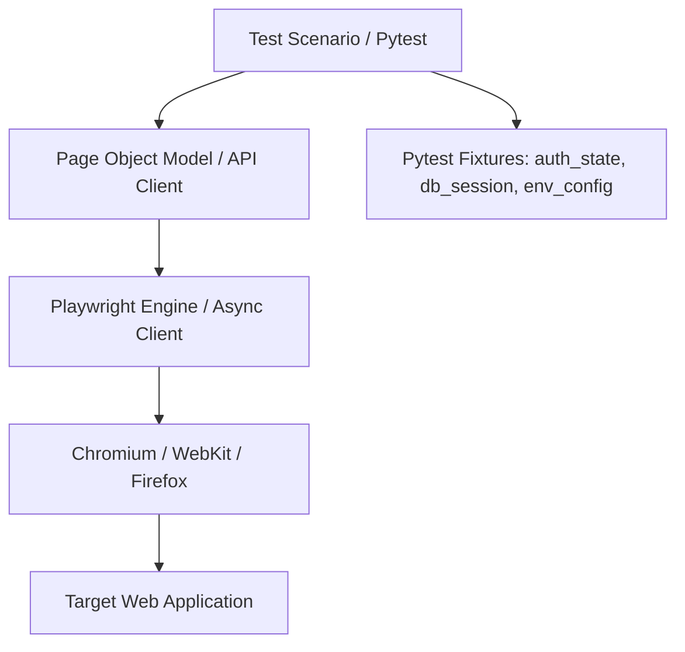

# Урок 100: Використання AI для написання автотестів

## Вступ та теоретичний фундамент
Автоматизація тестування програмного забезпечення (Test Automation Engineering) переходить на новий етап розвитку завдяки технологіям Generative AI та інтелектуальним агентам. Якщо раніше SDET (Software Development Engineer in Test) витрачав дні на написання однотипних Page Object моделей, конфігурацію фікстур та ручне налаштування очікувань (Waits), то сьогодні сучасний інструментарій дозволяє генерувати надійні, масштабовані автотести на основі специфікацій API та DOM-структури сторінок за лічені хвилини.

Сучасний підхід до AI-автоматизації охоплює:
1. **API Automation (FastAPI / Playwright API / Pytest / RestAssured)**: Миттєва генерація контрактних, позитивних та негативних автотестів на базі OpenAPI (Swagger) специфікацій.
2. **UI & E2E Automation (Playwright / Selenium / Cypress)**: Створення стійких до змін локаторів (Robust Locators: User-facing getByRole, getByTestId) та використання патерну Page Object Model (POM).
3. **Smart Assertions & Auto-Waiting**: Усунення нестабільних затримок `time.sleep()` та перехід на вбудовані веб-очікування (Web-First Assertions).
4. **Self-Healing Tests**: Здатність AI-агентів автоматично адаптувати зламані селектори при зміні інтерфейсу користувача.

У цьому уроці детально розглядається архітектура сучасного тестового фреймворку на базі Python 3.12, Pytest та Playwright, правила налаштування фікстур та генерація високоякісних тестів за допомогою AI.

---

## 1. Архітектурні принципи побудови сучасного тестового фреймворку
Надійний тестовий фреймворк будується за модульною трирівневою архітектурою:
1. **Core Layer (Fixtures & Drivers)**: Керування браузерними контекстами, автентифікаційними станами, підключенням до тестової БД.
2. **Page Objects / API Clients Layer**: Інкапсуляція дій з інтерфейсом та HTTP-запитів без асертів.
3. **Test Scenarios Layer**: Чисті бізнес-перевірки з чіткими твердженнями (Assertions).




---

## 2. Методологічний базис: Порівняння стратегій вибору селекторів у Playwright
Порівняльний аналіз типів локаторів за стійкістю до змін верстки (Resilience to UI Refactoring).


| Тип селектора | Приклад коду | Рівень стабільності | Рекомендація Playwright |
| :--- | :--- | :--- | :--- |
| **Role-Based (User-Facing)** | `page.get_by_role("button", name="Оплатити")` | Найвищий (орієнтований на accessibility) | Рекомендовано за замовчуванням |
| **Test ID (Explicit Attribute)**| `page.get_by_test_id("submit-order-btn")` | Найвищий (захищений від змін дизайну) | Рекомендовано для складних віджетів |
| **Label / Placeholder** | `page.get_by_label("Електронна пошта")` | Високий (імітує поведінку користувача) | Рекомендовано для форм |
| **CSS Selector (Class-based)** | `page.locator(".btn-primary.checkout-v2")` | Низький (ламається при будь-якому редизайні) | Антипатерн |
| **XPath (Absolute)** | `page.locator("/html/body/div[2]/div/button")` | Критично низький (ламається миттєво) | Суворо заборонено |

---

## 3. Практичний інженерний регламент: Повноцінний автотест Playwright + Pytest
Нижче наведено еталонний код сучасного Page Object та тестового сценарію на базі Playwright Python.


```python
# =====================================================================
# pages/checkout_page.py - Page Object Model
# =====================================================================
from playwright.sync_api import Page, expect

class CheckoutPage:
    def __init__(self, page: Page) -> None:
        self.page = page
        self.promo_input = page.get_by_label("Введіть промокод")
        self.apply_promo_btn = page.get_by_role("button", name="Застосувати")
        self.total_price_label = page.get_by_test_id("total-price-value")
        self.discount_badge = page.get_by_test_id("discount-applied-badge")
        self.pay_button = page.get_by_role("button", name="Підтвердити та оплатити")
        self.error_alert = page.get_by_role("alert")

    def navigate(self) -> None:
        self.page.goto("/checkout")

    def apply_promo_code(self, code: str) -> None:
        self.promo_input.fill(code)
        self.apply_promo_btn.click()

    def submit_payment(self) -> None:
        self.pay_button.click()

# =====================================================================
# tests/test_checkout_promo.py - Автоматизований тест
# =====================================================================
import pytest
from playwright.sync_api import Page, expect
from pages.checkout_page import CheckoutPage

@pytest.mark.ui
@pytest.mark.checkout
def test_successful_promo_code_discount_application(page: Page) -> None:
    # Arrange: Ініціалізація сторінки чекауту
    checkout = CheckoutPage(page)
    checkout.navigate()

    # Початкова ціна до знижки повинна бути 1000.00 UAH
    expect(checkout.total_price_label).to_have_text("1000.00 UAH")

    # Act: Застосування валідного промокоду
    checkout.apply_promo_code("SUMMER20")

    # Assert: Web-First асерти з автоматичним очікуванням
    expect(checkout.discount_badge).to_be_visible()
    expect(checkout.discount_badge).to_contain_text("-20%")
    expect(checkout.total_price_label).to_have_text("800.00 UAH")

@pytest.mark.ui
@pytest.mark.negative
def test_invalid_promo_code_shows_error(page: Page) -> None:
    checkout = CheckoutPage(page)
    checkout.navigate()

    checkout.apply_promo_code("INVALID_CODE_999")

    expect(checkout.error_alert).to_be_visible()
    expect(checkout.error_alert).to_have_text("Промокод недійсний або термін його дії закінчився")
    expect(checkout.total_price_label).to_have_text("1000.00 UAH")
```

---

## 4. Поглиблений аналіз виробничих кейсів, крайових випадків та антипатернів
Аналіз поширених помилок при AI-генерації коду автотестів.


### Кейс 1: Антипатерн "Хардкод затримок" (The Hardcoded Sleep Plague)
- **Проблема**: AI згенерував `time.sleep(5)` для очікування завантаження AJAX-відповіді.
- **Наслідок**: 200 автотестів почали виконуватися 40 хвилин замість 3 хвилин. При повільній мережі тести періодично падали (Flaky Test).
- **Виправлення**: Застосування нативних Web-First асертів Playwright (`expect(locator).to_be_visible()`) або `page.wait_for_response()`.

### Кейс 2: Генерація крихких XPath-селекторів
- **Проблема**: Замість семантичних локаторів AI використав довгий шлях `/div[1]/section/div[3]/button`.
- **Наслідок**: Після додавання рекламного банера верстальником усі автотести одночасно зламалися.
- **Виправлення**: Суворе налаштування правил у системному промпті: "Заборонено використовувати абсолютні XPath та динамічні класи стилів Tailwind. Використовувати виключно `get_by_role` та `get_by_test_id`".

---

## 5. Покроковий операційний воркфлоу розробки автотестів
Стандартний алгоритм створення та інтеграції автотестів з використанням AI.


### Крок 1: Запис сесії через Playwright Codegen (Trace & Record)
- Запустити генератор локаторів: `playwright codegen https://staging.app.com`.
- Виконати базовий користувацький сценарій у браузері.

### Крок 2: Рефакторинг згенерованого коду в Page Object Model
- Передати сирий запис у Cursor Composer з промптом: "Перетвори цей лінійний запис Playwright у чистий клас Page Object Model з типізацією та Web-First асертами".

### Крок 3: Параметризація даних та підключення фікстур
- Створити параметризовані тести для покриття класів еквівалентності.

### Крок 4: Запуск у паралельному режимі та генерація HTML-звіту
- Виконати: `pytest -n auto --html=report.html --tracing=retain-on-failure`.

---

## 6. Стратегії оптимізації та CI/CD інтеграція
1. **Storage State Re-use**: Збереження авторизаційної сесії (Cookies/LocalStorage) для уникнення повторного логіну в кожному тесті.
2. **Video & Tracing Artifacts**: Автоматичне збереження трасування Playwright (`trace.playwright.dev`) лише при падінні тесту для економії дискового простору.
3. **Headless Execution in Docker**: Запуск автотестів у легких Linux-контейнерах у GitHub Actions.

---

## 7. Вичерпний чек-лист перевірки та критерії готовності (Definition of Done)
Перед здачею завдань та інтеграцією результатів у виробничу гілку переконайтеся у виконанні наступних критеріїв:

- [ ] **Тести побудовані за патерном Page Object Model (POM)**
- [ ] **Використано семантичні локатори (get_by_role, get_by_test_id) замість XPath**
- [ ] **Повністю відсутні небезпечні синхронні затримки `time.sleep()`**
- [ ] **Всі асерти використовують Web-First assertions (`expect(el).to_be_visible()`)**
- [ ] **Авторизаційний стан зберігається та перевикористовується через storage_state**
- [ ] **Налаштовано збереження Tracing та скріншотів при падінні тестів**
- [ ] **Тести успішно виконуються у паралельному режимі (`pytest -n auto`)**
- [ ] **Тестовий набір інтегровано в автоматичний конвеєр GitHub Actions CI**

---

## 8. Підсумки, ключові інсайти та розширений глосарій термінів
Опанування цієї теми формує надійний фундамент для щоденної професійної роботи. Системний підхід, формалізовані інженерні стандарти та критичний контроль результатів AI забезпечують високу швидкість та бездоганну надійність кінцевого продукту.

### Глосарій ключових понять
| Термін | Визначення та контекст застосування |
| :--- | :--- |
| **Playwright** | Сучасний відкритий фреймворк для автоматизації веб-браузерів (Chromium, Firefox, WebKit) від Microsoft. |
| **Page Object Model (POM)** | Архітектурний патерн автоматизації тестування, що інкапсулює структуру веб-сторінок в окремі об'єкти. |
| **Web-First Assertions** | Асерти, що автоматично очікують досягнення бажаного стану елемента (видимість, текст, активність) перед перевіркою. |
| **Flaky Test** | Тест, який демонструє нестабільні результати (періодично падає без реальних змін у коді додатку). |
| **Storage State** | Збережений стан браузерного сховища (cookies, local storage), що дозволяє пропускати повторний логін у тестах. |
| **Pytest Fixture** | Функція у Pytest, що забезпечує створення, підготовку та очищення ресурсів для тестового середовища. |
| **Test Impact Analysis** | Техніка вибіркового запуску лише тих автотестів, які покривають змінені у коміті модулі. |
| **Headless Mode** | Режим виконання браузера без графічного інтерфейсу користувача для запуску на CI серверах. |
| **Tracing** | Детальний запис дій браузера, мережевих запитів та DOM-знімків під час виконання тесту для швидкого дебагу. |
| **Self-Healing Test** | Технологія автоматичного відновлення селекторів автотесту при зміні розмітки за допомогою машинного навчання. |

---

## 9. Поглиблений аналіз архітектури фреймворків автоматизації та оптимізація прогону

### 9.1. Масштабування тестової інфраструктури (Distributed Test Grid)
При зростанні кількості автотестів до 2,000+ критично важливо забезпечити час прогону регресії до 10 хвилин:
1. **Parallel Sharding у GitHub Actions**: Розбиття тест-сьюту на 10 паралельних контейнерів через матричну стратегію (Matrix Build Strategy):
   ```yaml
   strategy:
     matrix:
       shard: [1, 2, 3, 4, 5, 6, 7, 8, 9, 10]
   steps:
     - run: pytest --shard-id=${{ matrix.shard }} --num-shards=10
   ```
2. **Network Interception & Har Replay**: Запис мережевого трафіку реального бекенду (HAR files) та його відтворення під час прогону UI тестів для повної незалежності від стабільності тестового сервера.
3. **Visual Regression Testing**: Порівняння скріншотів екранів попіксельно (Pixel-by-Pixel Diff) за допомогою Playwright `expect(page).to_have_screenshot()` з допустимим порогом розбіжності $Threshold \le 0.2\%$.

### 9.2. Розширений код кастомного клієнта Playwright з інтелектуальним логуванням

```python
import logging
from typing import Any
from playwright.sync_api import Page, Locator, Response, expect

logger = logging.getLogger("sdet.driver")

class EnhancedPage:
    def __init__(self, page: Page) -> None:
        self.page = page
        self._setup_network_logging()

    def _setup_network_logging(self) -> None:
        self.page.on("requestfailed", lambda req: logger.error(f"Мережевий збій: {req.method} {req.url} -> {req.failure}"))
        self.page.on("response", self._log_slow_responses)

    def _log_slow_responses(self, response: Response) -> None:
        if response.status >= 400:
            logger.warning(f"HTTP Error {response.status}: {response.url}")

    def safe_click(self, locator: Locator, timeout_ms: int = 5000) -> None:
        logger.info(f"Клік на елемент: {locator}")
        expect(locator).to_be_visible(timeout=timeout_ms)
        expect(locator).to_be_enabled(timeout=timeout_ms)
        locator.click()

    def fill_and_verify(self, locator: Locator, text: str) -> None:
        logger.info(f"Введення тексту в {locator}")
        locator.fill(text)
        expect(locator).to_have_value(text)
```

---

## 10. Питання для співбесіди та захист рішень з автоматизації (Lead SDET Level)

1. **Як боротися з проблемою Flaky-тестів у великому корпоративному репозиторії?**
   *Еталонна відповідь*: Впровадження суворого карантину (Test Quarantine Pipeline): тест, що впав без змін у коді хоча б 1 раз за 50 прогонів, автоматично блокується від впливу на білд PR і переноситься у спеціальний карантинний беклог. Повна заборона `time.sleep()`, перехід на Web-First Assertions та збереження трасувань Playwright Tracing для швидкого аналізу DOM у момент збою.
2. **Яка різниця між підходами Page Object Model та Screenplay Pattern?**
   *Еталонна відповідь*: POM структурує код навколо веб-сторінок та їхніх елементів, що при великому розмірі сторінки веде до роздутих класів (God Objects). Screenplay фокусується на Акторі (Actor), його цілях (Tasks) та запитах до системи (Questions), забезпечуючи дотримання Single Responsibility Principle (SRP) та легке комбінування бізнес-кроків.
3. **Як протестувати WebSocket з'єднання та SSE (Server-Sent Events) за допомогою Playwright?**
   *Еталонна відповідь*: Використання нативного обробника подій `page.on("websocket")` з перехопленням фреймів повідомлень `ws.on("framereceived")` та перевіркою коректності структури переданих JSON пакетів у реальному часі.

---

## 11. Практичний регламент налаштування CI/CD пайплайнів та масштабування автотестів

### 11.1. Конфігурація матричного запуску тестів у GitHub Actions
Нижче наведено продакшн-конфігурацію паралельного виконання Playwright тестів у контейнерах:

```yaml
name: Playwright Regression Pipeline

on:
  pull_request:
    branches: [main, develop]
  schedule:
    - cron: '0 2 * * *' # Нічний повний прогін о 02:00 UTC

jobs:
  test:
    timeout-minutes: 15
    runs-on: ubuntu-latest
    strategy:
      fail-fast: false
      matrix:
        shardIndex: [1, 2, 3, 4]
        shardTotal: [4]
    steps:
      - uses: actions/checkout@v4
      - name: Set up Python 3.12
        uses: actions/setup-python@v5
        with:
          python-version: '3.12'
          cache: 'pip'

      - name: Install dependencies
        run: |
          python -m pip install --upgrade pip
          pip install -r requirements-test.txt
          playwright install --with-deps chromium

      - name: Run Playwright Tests (Sharded)
        run: |
          pytest tests/ --shard-id=${{ matrix.shardIndex }} --num-shards=${{ matrix.shardTotal }} --tracing=retain-on-failure --html=report-${{ matrix.shardIndex }}.html

      - name: Upload Test Artifacts
        if: always()
        uses: actions/upload-artifact@v4
        with:
          name: playwright-report-shard-${{ matrix.shardIndex }}
          path: |
            report-${{ matrix.shardIndex }}.html
            test-results/
```

### 11.2. Регламент підтримки стабільності тестового фреймворку
1. **Health-check тестового стенду**: Перед запуском автотестів обов'язково викликати ендпоінт `/healthz` цільового додатку з перевіркою готовності БД та черг.
2. **Deadlock & Timeout Protection**: Встановлення суворого тайм-ауту на кожен окремий тест (`pytest --timeout=60`), щоб уникнути зависання всього конвеєра збірки.
3. **Automatic Artifact Cleanup**: Очищення знімків екранів та трасувань старіших за 14 днів для запобігання переповнення сховища артефактів.
