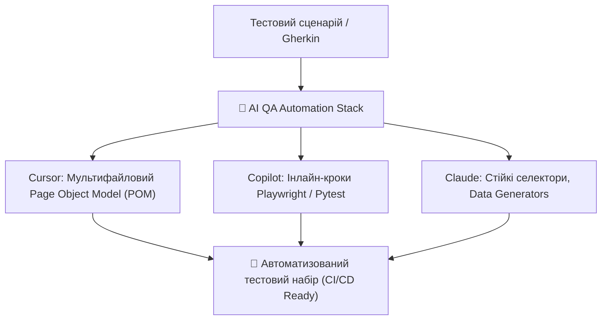

# Урок 100: Використання ChatGPT, Claude, Cursor та GitHub Copilot у QA Automation

## 1. Революція у розробці фреймворків автоматизації тестування

Автоматизація тестування (QA Automation / SDET) отримала потужний імпульс завдяки генеративному штучному інтелекту. Традиційно автоматизатор витрачав до 70% часу на механічну рутину: ручний пошук CSS/XPath локаторів, написання шаблонних Page Objects, підготовку тестових фікстур та параметризацію тестових даних.

Сучасний **AI-Augmented Automation Engineer** використовує зв'язку інструментів нового покоління:
- **Cursor IDE**: для мультифайлової генерації цілих Page Object класів та інтеграції зі сховищем тестів.
- **GitHub Copilot**: для миттєвого інлайн-автодоповнення кроків автотесту (Playwright / Selenium / Pytest / Cypress).
- **Claude 3.5 Sonnet**: для написання стійких до змін локаторів (Robust Locators) та аналізу заплутаної логіки асинхронних очікувань.
- **ChatGPT**: для генерації синтетичних моків, тестових фікстур та схем валідації API.

---

## 2. Порівняння інструментів у контексті Test Automation

| Інструмент | Найкращі сценарії в QA Automation | Особливості та сильні сторони |
| :--- | :--- | :--- |
| **Cursor IDE** | Побудова архітектури фреймворку з нуля, оновлення POM при зміні DOM дерева. | Через `@Codebase` та `@Files` розуміє всю структуру ваших сторінок та хелперів. |
| **GitHub Copilot** | Швидке дописування assertions, автодоповнення методів `expect(locator).to_be_visible()`. | Блискавичне інлайн-доповнення прямо в процесі набору в VS Code / PyCharm. |
| **Claude 3.5 Sonnet** | Створення надійних семантичних селекторів за доступністю (ARIA roles, data-testid) за HTML-фрагментом. | Неперевершена якість коду на Python (Pytest/Playwright) та TypeScript (Playwright/Cypress). |
| **ChatGPT** | Конвертація TestRail чеклістів у BDD фічі, генерація великих JSON-пейлоадів для API тестів. | Швидка робота через чат, аналіз та генерація регулярних виразів. |

---

## 3. Перехід від тендітних селекторів до стійких AI-локаторів

AI допомагає дотримуватися найкращих практик Playwright:
- Відмова від крихких абсолютних XPath (`/html/body/div[2]/div/button`).
- Використання семантичних ролей та ARIA: `page.get_by_role("button", name="Оформити замовлення")`.
- Пріоритизація спеціальних тестових атрибутів: `page.get_by_test_id("submit-order-btn")`.
