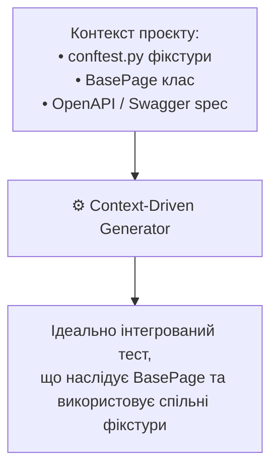

# Урок 101: Формування контексту для генерації automation-коду: контракти, фікстури та architecture context

## 1. Чому ізольовані промпти ламають архітектуру автотестів

Якщо попросити AI написати автотест без передачі контексту проєкту, модель згенерує автономний скрипт із прямим відкриттям браузера `webdriver.Chrome()`, без використання наявного фреймворку, без створених фікстур, без існуючих базових класів та з повторним дублюванням логіки.

**Context-Aware Automation Prompting** вимагає надання моделі 3 рівнів контексту:
1. **Архітектурний контекст**: які патерни використовуються (Page Object, Screenplay, Page Factory, Fluent Interface).
2. **Базові фікстури та хелпери (`conftest.py`)**: доступні фікстури браузера, API-клієнтів, генераторів даних.
3. **DOM-структура або Swagger/OpenAPI специфікація**: точні ендпоінти або селектори.

---

## 2. Структура файлу контексту автоматизації (.cursorrules / System Prompt)

Для автоматизаторів рекомендується створити спеціалізовані інструкції:
- Стек: `Python 3.12`, `pytest 8.x`, `playwright-python 1.45+`.
- Сувора заборона на `time.sleep()`.
- Обов'язкове використання Type Annotations у методах сторінок.
- Використання методів `expect(locator)` замість стандартних assert у UI тестах.

---

## 3. Передача OpenAPI / Swagger JSON для миттєвої генерації API тестів

Завантаження схеми OpenAPI у вікно контексту дозволяє AI згенерувати повний сьют API тестів за 10 секунд:
- Валідація статус-кодів (200, 201, 400, 401, 404, 422).
- Валідація відповідності JSON-схемі (Pydantic / jsonschema).
- Перевірка заголовків безпеки та часу відповіді.
