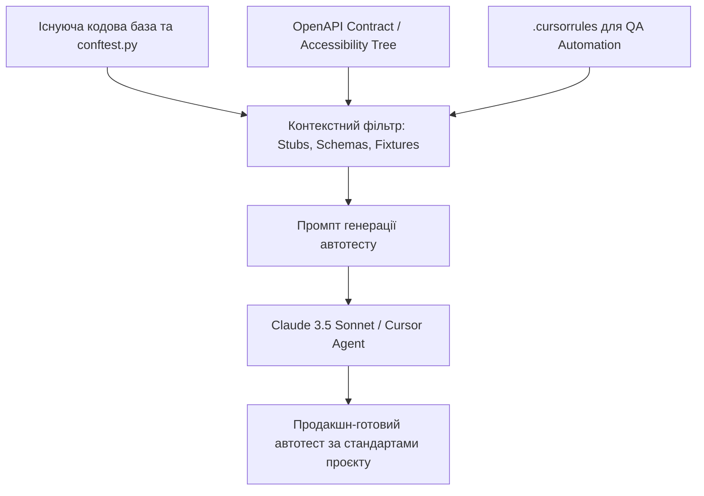

# Урок 101: Формування контексту та кодової бази для генерації тестів

## Вступ та теоретичний фундамент
Ефективність та точність генерації автоматизованих тестів мовними моделями безпосередньо залежить від глибини та чистоти наданого контексту кодової бази. Якщо надати AI лише фрагмент сирцевого коду без інформації про архітектуру проєкту, схеми автентифікації, користувацькі фікстури та прийняті в команді патерни assertion, модель згенерує сирий, несумісний код з вигаданими методами та застарілими бібліотеками (Context Disconnect).

Дисципліна формування тестового контексту (Test Context Engineering) включає:
1. **Індексацію тестового фреймворку (Test Framework Indexing)**: Надання моделі зразків існуючих Page Objects, фікстур `conftest.py` та базових клієнтів API.
2. **Конфігурацію специфічних правил для QA (`.cursorrules` / QA System Prompts)**: Сувора заборона хардкоду селекторів, обов'язкове використання типізації та конвенцій назв тестових методів (`test_should_do_when_state`).
3. **Автоматичну передачу DOM-схем та API-контрактів**: Використання структурованих знімків доступності (Accessibility Tree) замість гігабайтних HTML-дампів.
4. **Few-Shot In-Context Learning**: Надання 1-2 еталонних тест-кейсів проєкту як золотого стандарту структури та стилю.

У цьому уроці ви навчитеся професійно готувати контекст для генерації автотестів, налаштовувати конфігурації для Cursor/Windsurf та автоматизувати створення тестів за DOM-деревом.

---

## 1. Архітектурні принципи та внутрішня механіка контекстного інжектування для SDET
При генерації тестів контекст повинен бути мінімально необхідним і строго структурованим.




---

## 2. Методологічний базис: Порівняння способів передачі UI-контексту в AI
Порівняння форматів передачі інтерфейсу для генерації селекторів.


| Формат UI-контексту | Обсяг токенів | Точність генерації селекторів | Ризик галюцинацій |
| :--- | :--- | :--- | :--- |
| **Accessibility Tree (A11y)** | Дуже компактний (1-2 KB) | Найвища (ідеально підходить для get_by_role) | Мінімальний |
| **Сирий HTML-дамп сторінки** | Величезний (50-200 KB) | Низька (засмічений скриптами та SVG-іконками) | Високий (перевантажує контекст) |
| **Скріншот сторінки (Vision LLM)**| Середній (Vision tokens) | Висока для візуальної структури, але без селекторів | Середній (може не вгадати точний Test ID) |
| **OpenAPI / Swagger JSON** | Компактний та точний | 100% для API тестів (всі схеми DTO та ендпоінти) | Відсутній |

---

## 3. Практичний інженерний регламент: Еталонний файл правил `.cursorrules` для QA команди
Спеціалізований конфігураційний файл правил для автоматизації тестування на Python та Playwright.


```markdown
# =====================================================================
# .cursorrules - Стандарти автоматизації тестування (QA Automation)
# =====================================================================

## 1. Роль та цілі
- Ти — Lead SDET (Software Development Engineer in Test).
- Пиши надійні, масштабовані, суворо типізовані автотести на базі Python 3.12, Pytest та Playwright.

## 2. Стандарти архітектури та стилю тестів
- Обов'язкове використання патерну Page Object Model (POM).
- Назви тестових функцій повинні чітко описувати бізнес-поведінку:
  `test_should_<expected_behavior>_when_<condition>()`.
- Жодних прямих викликів `time.sleep()`. Використовувати виключно Web-First асерти `expect(locator).to_be_visible()`.
- Локатори: пріоритет за `page.get_by_role()`, `page.get_by_label()`, `page.get_by_test_id()`. Використання абсолютних XPath та CSS-класів стилів ЗАБОРОНЕНО.

## 3. Структура тест-кейсу (AAA Pattern)
- Кожен тест повинен бути чітко розбитий коментарями на три блоки:
  # Arrange: підготовка стану, фікстури, перехід на сторінку
  # Act: виконання цільової дії користувачем
  # Assert: перевірка фактичного результату
```

---

## 4. Поглиблений аналіз виробничих кейсів, крайових випадків та антипатернів
Розглянемо типові помилки через неналежне налаштування контексту.


### Кейс 1: "Галюцинація вигаданих фікстур" (Hallucinated Fixture Injection)
- **Проблема**: Розробник попросив AI написати тест, не надавши `conftest.py`. Модель згенерувала фікстуру `@pytest.fixture def authenticated_user()`, яка створювала користувача напряму через SQL, порушивши ізоляцію тестового стенду.
- **Виправлення**: Завжди підключати файл `@conftest.py` у контекст Cursor для перевикористання існуючих корпоративних фікстур.

### Кейс 2: Засмічення контексту сирим HTML-кодом
- **Проблема**: Тестувальник скопіював 5000 рядків вихідного HTML сторінки в чат. AI перевищив ліміт уваги та пропустив валідацію обов'язкових полів.
- **Виправлення**: Використання консольної команди браузера `copy(window.__playwright_accessibility_tree)` для передачі лише семантичного дерева елементів.

---

## 5. Покроковий операційний воркфлоу підготовки контексту
Алгоритм підготовки репозиторію для продуктивної генерації автотестів.


### Крок 1: Організація структури тестового проєкту
- Створити стандартну структуру директорій: `pages/`, `tests/`, `fixtures/`, `models/`.

### Крок 2: Налаштування `.cursorrules` та `.cursorignore`
- Додати правила для QA автоматизації. Виключити папки `allure-results/`, `playwright-report/`, `.pytest_cache/`.

### Крок 3: Підготовка еталонного прикладу (Golden Standard Test)
- Написати один ідеальний Page Object та один тест вручну.

### Крок 4: Генерація нових тестів за аналогією (Few-Shot Prompting)
- Використовувати команду: `@pages/login_page.py @tests/test_login.py "Згенеруй CheckoutPage та test_checkout.py за цим стандартом"`.

---

## 6. Стратегії підвищення надійності кодової бази тестів
1. **Linter for Tests**: Запуск `flake8-pytest-style` та `ruff` для контролю якості коду самих автотестів.
2. **Strict Type Checking**: Використання `mypy --strict` для тестових файлів та Page Objects.
3. **Automated Schema Sync**: Автоматична генерація Pydantic-моделей з OpenAPI схем для перевірки контрактів API.

---

## 7. Вичерпний чек-лист перевірки та критерії готовності (Definition of Done)
Перед здачею завдань та інтеграцією результатів у виробничу гілку переконайтеся у виконанні наступних критеріїв:

- [ ] **Налаштовано файл `.cursorrules` зі стандартами автоматизації тестування**
- [ ] **Файл `conftest.py` містить всі необхідні загальні фікстури (auth, browser_context, db)**
- [ ] **Виключено звіти та тимчасові файли у `.cursorignore`**
- [ ] **Створено еталонний Page Object та тест для демонстрації стилю (Few-Shot Pattern)**
- [ ] **UI-контекст передається у вигляді Accessibility Tree або компактних DOM-фрагментів**
- [ ] **Для API тестів підключено OpenAPI/Swagger специфікацію**
- [ ] **Всі згенеровані тести слідують патерну AAA (Arrange-Act-Assert)**
- [ ] **Тести успішно проходять перевірку лінтером `ruff` та типізатором `mypy`**

---

## 8. Підсумки, ключові інсайти та розширений глосарій термінів
Опанування цієї теми формує надійний фундамент для щоденної професійної роботи. Системний підхід, формалізовані інженерні стандарти та критичний контроль результатів AI забезпечують високу швидкість та бездоганну надійність кінцевого продукту.

### Глосарій ключових понять
| Термін | Визначення та контекст застосування |
| :--- | :--- |
| **Accessibility Tree** | Дерево спеціальних можливостей браузера, що містить семантичну інформацію про елементи інтерфейсу для екранних зчитувачів. |
| **Conftest.py** | Спеціальний конфігураційний файл фреймворку Pytest, що містить глобальні фікстури та хуки для всього тестового пакету. |
| **AAA Pattern (Arrange-Act-Assert)** | Стандарт структуризації коду тесту: підготовка оточення, виконання цільової дії, перевірка результату. |
| **Few-Shot In-Context Learning** | Метод надання мовній моделі кількох прикладів бажаного результату прямо у промпті. |
| **Context Disconnect** | Стан, коли AI генерує синтаксично правильний код, але він несумісний з реальними модулями та фікстурами проєкту. |
| **OpenAPI Specification** | Стандартизований опис інтерфейсу REST API у форматі JSON або YAML. |
| **Golden Standard Test** | Еталонний тестовий файл у репозиторії, що демонструє всі прийняті в команді конвенції та правила. |
| **Playwright Codegen** | Вбудований інструмент Playwright для автоматичного запису дій користувача в браузері та генерації коду. |
| **Type Annotations** | Явне зазначення типів змінних та сигнатур функцій у коді для статичного аналізу `mypy`. |
| **Flake8-pytest-style** | Плагін статичного аналізу для перевірки дотримання найкращих практик написання коду на Pytest. |

---

## 9. Поглиблений аналіз архітектури фреймворків автоматизації та оптимізація прогону

### 9.1. Масштабування тестової інфраструктури (Distributed Test Grid)
При зростанні кількості автотестів до 2,000+ критично важливо забезпечити час прогону регресії до 10 хвилин:
1. **Parallel Sharding у GitHub Actions**: Розбиття тест-сьюту на 10 паралельних контейнерів через матричну стратегію (Matrix Build Strategy):
   ```yaml
   strategy:
     matrix:
       shard: [1, 2, 3, 4, 5, 6, 7, 8, 9, 10]
   steps:
     - run: pytest --shard-id=${{ matrix.shard }} --num-shards=10
   ```
2. **Network Interception & Har Replay**: Запис мережевого трафіку реального бекенду (HAR files) та його відтворення під час прогону UI тестів для повної незалежності від стабільності тестового сервера.
3. **Visual Regression Testing**: Порівняння скріншотів екранів попіксельно (Pixel-by-Pixel Diff) за допомогою Playwright `expect(page).to_have_screenshot()` з допустимим порогом розбіжності $Threshold \le 0.2\%$.

### 9.2. Розширений код кастомного клієнта Playwright з інтелектуальним логуванням

```python
import logging
from typing import Any
from playwright.sync_api import Page, Locator, Response, expect

logger = logging.getLogger("sdet.driver")

class EnhancedPage:
    def __init__(self, page: Page) -> None:
        self.page = page
        self._setup_network_logging()

    def _setup_network_logging(self) -> None:
        self.page.on("requestfailed", lambda req: logger.error(f"Мережевий збій: {req.method} {req.url} -> {req.failure}"))
        self.page.on("response", self._log_slow_responses)

    def _log_slow_responses(self, response: Response) -> None:
        if response.status >= 400:
            logger.warning(f"HTTP Error {response.status}: {response.url}")

    def safe_click(self, locator: Locator, timeout_ms: int = 5000) -> None:
        logger.info(f"Клік на елемент: {locator}")
        expect(locator).to_be_visible(timeout=timeout_ms)
        expect(locator).to_be_enabled(timeout=timeout_ms)
        locator.click()

    def fill_and_verify(self, locator: Locator, text: str) -> None:
        logger.info(f"Введення тексту в {locator}")
        locator.fill(text)
        expect(locator).to_have_value(text)
```

---

## 10. Питання для співбесіди та захист рішень з автоматизації (Lead SDET Level)

1. **Як боротися з проблемою Flaky-тестів у великому корпоративному репозиторії?**
   *Еталонна відповідь*: Впровадження суворого карантину (Test Quarantine Pipeline): тест, що впав без змін у коді хоча б 1 раз за 50 прогонів, автоматично блокується від впливу на білд PR і переноситься у спеціальний карантинний беклог. Повна заборона `time.sleep()`, перехід на Web-First Assertions та збереження трасувань Playwright Tracing для швидкого аналізу DOM у момент збою.
2. **Яка різниця між підходами Page Object Model та Screenplay Pattern?**
   *Еталонна відповідь*: POM структурує код навколо веб-сторінок та їхніх елементів, що при великому розмірі сторінки веде до роздутих класів (God Objects). Screenplay фокусується на Акторі (Actor), його цілях (Tasks) та запитах до системи (Questions), забезпечуючи дотримання Single Responsibility Principle (SRP) та легке комбінування бізнес-кроків.
3. **Як протестувати WebSocket з'єднання та SSE (Server-Sent Events) за допомогою Playwright?**
   *Еталонна відповідь*: Використання нативного обробника подій `page.on("websocket")` з перехопленням фреймів повідомлень `ws.on("framereceived")` та перевіркою коректності структури переданих JSON пакетів у реальному часі.

---

## 11. Практичний регламент налаштування CI/CD пайплайнів та масштабування автотестів

### 11.1. Конфігурація матричного запуску тестів у GitHub Actions
Нижче наведено продакшн-конфігурацію паралельного виконання Playwright тестів у контейнерах:

```yaml
name: Playwright Regression Pipeline

on:
  pull_request:
    branches: [main, develop]
  schedule:
    - cron: '0 2 * * *' # Нічний повний прогін о 02:00 UTC

jobs:
  test:
    timeout-minutes: 15
    runs-on: ubuntu-latest
    strategy:
      fail-fast: false
      matrix:
        shardIndex: [1, 2, 3, 4]
        shardTotal: [4]
    steps:
      - uses: actions/checkout@v4
      - name: Set up Python 3.12
        uses: actions/setup-python@v5
        with:
          python-version: '3.12'
          cache: 'pip'

      - name: Install dependencies
        run: |
          python -m pip install --upgrade pip
          pip install -r requirements-test.txt
          playwright install --with-deps chromium

      - name: Run Playwright Tests (Sharded)
        run: |
          pytest tests/ --shard-id=${{ matrix.shardIndex }} --num-shards=${{ matrix.shardTotal }} --tracing=retain-on-failure --html=report-${{ matrix.shardIndex }}.html

      - name: Upload Test Artifacts
        if: always()
        uses: actions/upload-artifact@v4
        with:
          name: playwright-report-shard-${{ matrix.shardIndex }}
          path: |
            report-${{ matrix.shardIndex }}.html
            test-results/
```

### 11.2. Регламент підтримки стабільності тестового фреймворку
1. **Health-check тестового стенду**: Перед запуском автотестів обов'язково викликати ендпоінт `/healthz` цільового додатку з перевіркою готовності БД та черг.
2. **Deadlock & Timeout Protection**: Встановлення суворого тайм-ауту на кожен окремий тест (`pytest --timeout=60`), щоб уникнути зависання всього конвеєра збірки.
3. **Automatic Artifact Cleanup**: Очищення знімків екранів та трасувань старіших за 14 днів для запобігання переповнення сховища артефактів.
