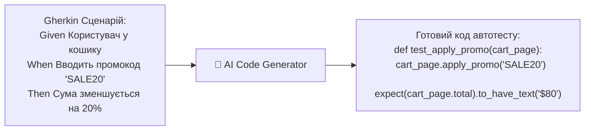

# Урок 102: Генерація коду за текстовим описом тестового сценарію: від Gherkin до готового Playwright/Pytest тесту

## 1. Трансляція бізнес-сценаріїв у програмний код автотестів

Створення автотесту починається зі зрозумілого текстового сценарію (Manual Test Case або Gherkin Feature). Сучасні мовні моделі здатні автоматично транслювати кроки сценарію у виклики методів Page Object класів та асерти.

---

## 2. Патерн BDD (Behavior Driven Development) з pytest-bdd / Behave

AI спрощує роботу з BDD фреймворками:
1. Генерація файлу `.feature` зрозумілою бізнесу мовою.
2. Автоматична генерація файлу кроків (Step Definitions / Step Implementations) на Python за допомогою декораторів `@given`, `@when`, `@then`.

---

## 3. Обробка складних взаємодій (Drag & Drop, iFrames, Shadow DOM, Multiple Tabs)

При описі складних сценаріїв важливо вимагати від AI врахування специфіки браузера:
- **Shadow DOM**: Playwright автоматично пробиває відкритий Shadow DOM за замовчуванням.
- **iFrames**: використання `page.frame_locator("#payment-iframe").get_by_role(...)`.
- **Нові вкладки браузера (Popup / New Tab)**: перехоплення події `page.context.expect_page()`.
- **Завантаження файлів (File Upload)**: метод `locator.set_input_files("test_doc.pdf")`.
