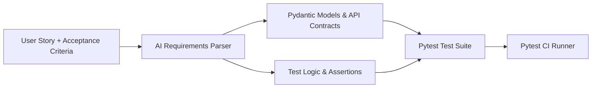

# Урок 102: Генерація тестових сценаріїв з вимог

## Вступ та теоретичний фундамент
Автоматизована генерація тестового коду безпосередньо з тексту бізнес-вимог (Specification-to-Automated-Tests Pipeline) є найвищим рівнем інженерної зрілості QA автоматизації. Вона дозволяє реалізувати справжню парадигму BDD (Behavior-Driven Development) та TDD (Test-Driven Development), коли автоматичні перевірки створюються паралельно або навіть до написання самого коду функціоналу.

Застосування LLM у цьому процесі забезпечує:
1. **Автоматичну трансляцію User Stories у Gherkin та Pytest**: Перетворення текстових описів у виконувані сценарії з параметризованими таблицями.
2. **Генерацію контрактних API-тестів з OpenAPI**: Автоматичне створення перевірок схем відповідей (JSON Schema Validation), статус-кодів та заголовків.
3. **Побудову синтетичних тестових даних (Synthetic Test Data Generation)**: Створення реалістичних фікстур користувачів, платіжних карток, замовлень за допомогою бібліотек Faker та AI.
4. **Створення комплексних інтеграційних сценаріїв (Multi-step User Journeys)**: Наскрізне тестування ланцюжка: Реєстрація -> Верифікація Email -> Поповнення балансу -> Оформлення замовлення -> Отримання чеку.

У цьому уроці ви опануєте наскрізний конвеєр перетворення User Story у повністю працездатний набір автоматичних тестів на Python.

---

## 1. Архітектурні принципи трансляції специфікацій у виконувані тести
Конвеєр генерації складається з чотирьох етапів: семантичний парсинг вимог, виділення сутностей і контрактів, генерація Page Objects/API Clients та фінальна збірка сценаріїв.




---

## 2. Методологічний базис: Порівняння фреймворків BDD автоматизації
Порівняння підходів до реалізації Behavior-Driven Development на Python.


| BDD Фреймворк | Переваги | Недоліки | Сфера застосування |
| :--- | :--- | :--- | :--- |
| **pytest-bdd** | Нативна інтеграція з фікстурами Pytest, висока швидкість | Потребує суворого узгодження кроків | Рекомендовано для Python проєктів |
| **Behave** | Класичний синтаксис Cucumber, зручні звіти | Складніша інтеграція з асинхронним Playwright | Загальнокорпоративні BDD проєкти |
| **Чистий Pytest (AAA)** | Максимальна швидкість написання, простота дебагу | Менша наочність для нетехнічних стейкхолдерів | Високонавантажені API та мікросервіси |
| **Robot Framework** | Keyword-driven підхід, велика екосистема | Специфічний синтаксис, повільніший розвиток | Legacy Enterprise системи |

---

## 3. Практичний інженерний регламент: Повний код API-тестів з валідацією JSON Schema
Еталонний приклад згенерованого набору тестів для REST API ендпоінту замовлень з використанням `httpx` та `pydantic`.


```python
# =====================================================================
# tests/test_orders_api.py - Автоматичні контрактні та бізнес-тести API
# =====================================================================
import pytest
import httpx
from pydantic import BaseModel, Field
from uuid import UUID

# Контракт відповіді сервера
class OrderItemResponse(BaseModel):
    product_id: str
    quantity: int = Field(gt=0)
    price: float = Field(gt=0.0)

class OrderResponseSchema(BaseModel):
    order_id: UUID
    status: str
    total_amount: float
    items: list[OrderItemResponse]

@pytest.mark.asyncio
@pytest.mark.api
async def test_create_order_success_contract_and_logic(async_client: httpx.AsyncClient, auth_headers: dict[str, str]) -> None:
    # Arrange: Підготовка валідного тіла запиту
    payload = {
        "items": [
            {"product_id": "prod_123", "quantity": 2, "price": 400.0}
        ],
        "delivery_address": "Київ, вул. Хрещатик, 1"
    }

    # Act: Виконання POST запиту
    response = await async_client.post("/api/v1/orders", json=payload, headers=auth_headers)

    # Assert: Перевірка статусу та валідація схеми Pydantic
    assert response.status_code == 201, f"Очікувався статус 201, отримано {response.status_code}: {response.text}"
    
    data = response.json()
    validated_order = OrderResponseSchema.model_validate(data)

    assert validated_order.status == "PENDING"
    assert validated_order.total_amount == 800.0
    assert len(validated_order.items) == 1

@pytest.mark.asyncio
@pytest.mark.api
@pytest.mark.parametrize("invalid_payload,expected_field", [
    ({"items": [], "delivery_address": "Kyiv"}, "items"),
    ({"items": [{"product_id": "p1", "quantity": -1, "price": 10.0}], "delivery_address": "Kyiv"}, "quantity"),
    ({"items": [{"product_id": "p1", "quantity": 1, "price": 0.0}], "delivery_address": "Kyiv"}, "price"),
])
async def test_create_order_validation_errors(
    async_client: httpx.AsyncClient, 
    auth_headers: dict[str, str],
    invalid_payload: dict,
    expected_field: str
) -> None:
    response = await async_client.post("/api/v1/orders", json=invalid_payload, headers=auth_headers)
    assert response.status_code == 422
    error_details = response.json()
    assert any(expected_field in str(err) for err in error_details.get("detail", []))
```

---

## 4. Поглиблений аналіз виробничих кейсів, крайових випадків та антипатернів
Розглянемо практичні приклади збоїв при генерації тестів за вимогами.


### Кейс 1: Пропуск перевірки невалідних форматів авторизаційного токена
- **Проблема**: AI згенерував тести лише для валідного токена та відсутності токена.
- **Наслідок**: Пропущено вразливість, коли сервер падав з 500 помилкою при отриманні пошкодженого base64 у заголовку Authorization.
- **Виправлення**: Включення до обов'язкового чек-листа тестів на: Malformed JWT, Expired JWT, JWT signed with wrong secret.

### Кейс 2: Тестування на захардкодженій статичній БД
- **Проблема**: Тести перевіряли видалення користувача з ID=1. Після першого прогону тест почав падати, оскільки користувач уже видалений.
- **Виправлення**: Використання фабрик даних (FactoryBoy / Faker) для створення унікального користувача перед кожним тестом та очищення стану.

---

## 5. Покроковий операційний воркфлоу генерації тестів
Етапи роботи SDET інженера.


### Крок 1: Отримання специфікації API (Swagger JSON)
- Завантажити свіжий `openapi.json` з розробницького середовища.

### Крок 2: Генерація Pydantic-схем та тест-сьюту в Cursor
- Викликати AI: `@openapi.json "Згенеруй pytest-asyncio тести для всіх ендпоінтів /orders: позитивні, параметризовані негативні, перевірку авторизації"`.

### Крок 3: Інтеграція з локальним тестовим оточенням
- Запустити Docker Compose з тестовою БД та сервісом.
- Виконати: `pytest tests/test_orders_api.py -v`.

### Крок 4: Включення тестів у PR Status Check
- Додати новий файл тестів у репозиторій.

---

## 6. Стратегії підвищення надійності тестів
1. **Database Transaction Rollback per Test**: Запуск кожного тесту у вкладеній транзакції SQLAlchemy з автоматичним rollback після завершення.
2. **Asynchronous HTTP Client**: Використання `httpx.AsyncClient` для виконання сотень тестів за секунди.
3. **Allure Reporting**: Генерація візуальних звітів з кроками та вкладеними даними запитів.

---

## 7. Вичерпний чек-лист перевірки та критерії готовності (Definition of Done)
Перед здачею завдань та інтеграцією результатів у виробничу гілку переконайтеся у виконанні наступних критеріїв:

- [ ] **Створено Pydantic моделі відповідей для валідації контрактів API**
- [ ] **Позитивні сценарії перевіряють статус-коди 200/201 та всі поля тіла**
- [ ] **Негативні сценарії параметризовані для перевірки всіх полів валідації**
- [ ] **Протестовано роботу з авторизаційними токенами (валідний, прострочений, відсутній, пошкоджений)**
- [ ] **Тести повністю ізольовані і не залежать від порядку їхнього виконання**
- [ ] **Створено фабрику динамічних тестових даних замість статичних ID**
- [ ] **Тести виконуються асинхронно та швидко (< 5 секунд на сьют)**
- [ ] **Звіт про проходження тестів інтегровано в Allure Report**

---

## 8. Підсумки, ключові інсайти та розширений глосарій термінів
Опанування цієї теми формує надійний фундамент для щоденної професійної роботи. Системний підхід, формалізовані інженерні стандарти та критичний контроль результатів AI забезпечують високу швидкість та бездоганну надійність кінцевого продукту.

### Глосарій ключових понять
| Термін | Визначення та контекст застосування |
| :--- | :--- |
| **BDD (Behavior-Driven Development)** | Методологія розробки ПЗ на основі формалізованого людино-читабельного опису поведінки системи. |
| **JSON Schema Validation** | Процес перевірки структури, типів даних та обов'язкових полів у JSON-відповіді відповідно до схеми. |
| **HTTPX** | Сучасний повнофункціональний асинхронний HTTP-клієнт для Python 3. |
| **FactoryBoy** | Бібліотека для створення тестових фікстур та генерації складних об'єктів у тестах. |
| **Faker** | Бібліотека для генерації реалістичних випадкових даних (імена, адреси, телефони, email). |
| **Allure Framework** | Популярний відкритий інструмент візуалізації звітів тестування з детальними кроками та графіками. |
| **OpenAPI Specification** | Стандарт опису REST API, що дозволяє людині та комп'ютеру розуміти можливості сервісу. |
| **Parameterized Test** | Тест, що виконується багаторазово з різними наборами вхідних параметрів та очікуваних результатів. |
| **Transaction Rollback** | Механізм скасування змін у БД після завершення тесту для збереження чистоти даних. |
| **Asyncio Test Runner** | Плагін `pytest-asyncio`, що забезпечує виконання асинхронних корутин у тестах. |

---

## 9. Поглиблений аналіз архітектури фреймворків автоматизації та оптимізація прогону

### 9.1. Масштабування тестової інфраструктури (Distributed Test Grid)
При зростанні кількості автотестів до 2,000+ критично важливо забезпечити час прогону регресії до 10 хвилин:
1. **Parallel Sharding у GitHub Actions**: Розбиття тест-сьюту на 10 паралельних контейнерів через матричну стратегію (Matrix Build Strategy):
   ```yaml
   strategy:
     matrix:
       shard: [1, 2, 3, 4, 5, 6, 7, 8, 9, 10]
   steps:
     - run: pytest --shard-id=${{ matrix.shard }} --num-shards=10
   ```
2. **Network Interception & Har Replay**: Запис мережевого трафіку реального бекенду (HAR files) та його відтворення під час прогону UI тестів для повної незалежності від стабільності тестового сервера.
3. **Visual Regression Testing**: Порівняння скріншотів екранів попіксельно (Pixel-by-Pixel Diff) за допомогою Playwright `expect(page).to_have_screenshot()` з допустимим порогом розбіжності $Threshold \le 0.2\%$.

### 9.2. Розширений код кастомного клієнта Playwright з інтелектуальним логуванням

```python
import logging
from typing import Any
from playwright.sync_api import Page, Locator, Response, expect

logger = logging.getLogger("sdet.driver")

class EnhancedPage:
    def __init__(self, page: Page) -> None:
        self.page = page
        self._setup_network_logging()

    def _setup_network_logging(self) -> None:
        self.page.on("requestfailed", lambda req: logger.error(f"Мережевий збій: {req.method} {req.url} -> {req.failure}"))
        self.page.on("response", self._log_slow_responses)

    def _log_slow_responses(self, response: Response) -> None:
        if response.status >= 400:
            logger.warning(f"HTTP Error {response.status}: {response.url}")

    def safe_click(self, locator: Locator, timeout_ms: int = 5000) -> None:
        logger.info(f"Клік на елемент: {locator}")
        expect(locator).to_be_visible(timeout=timeout_ms)
        expect(locator).to_be_enabled(timeout=timeout_ms)
        locator.click()

    def fill_and_verify(self, locator: Locator, text: str) -> None:
        logger.info(f"Введення тексту в {locator}")
        locator.fill(text)
        expect(locator).to_have_value(text)
```

---

## 10. Питання для співбесіди та захист рішень з автоматизації (Lead SDET Level)

1. **Як боротися з проблемою Flaky-тестів у великому корпоративному репозиторії?**
   *Еталонна відповідь*: Впровадження суворого карантину (Test Quarantine Pipeline): тест, що впав без змін у коді хоча б 1 раз за 50 прогонів, автоматично блокується від впливу на білд PR і переноситься у спеціальний карантинний беклог. Повна заборона `time.sleep()`, перехід на Web-First Assertions та збереження трасувань Playwright Tracing для швидкого аналізу DOM у момент збою.
2. **Яка різниця між підходами Page Object Model та Screenplay Pattern?**
   *Еталонна відповідь*: POM структурує код навколо веб-сторінок та їхніх елементів, що при великому розмірі сторінки веде до роздутих класів (God Objects). Screenplay фокусується на Акторі (Actor), його цілях (Tasks) та запитах до системи (Questions), забезпечуючи дотримання Single Responsibility Principle (SRP) та легке комбінування бізнес-кроків.
3. **Як протестувати WebSocket з'єднання та SSE (Server-Sent Events) за допомогою Playwright?**
   *Еталонна відповідь*: Використання нативного обробника подій `page.on("websocket")` з перехопленням фреймів повідомлень `ws.on("framereceived")` та перевіркою коректності структури переданих JSON пакетів у реальному часі.

---

## 11. Практичний регламент налаштування CI/CD пайплайнів та масштабування автотестів

### 11.1. Конфігурація матричного запуску тестів у GitHub Actions
Нижче наведено продакшн-конфігурацію паралельного виконання Playwright тестів у контейнерах:

```yaml
name: Playwright Regression Pipeline

on:
  pull_request:
    branches: [main, develop]
  schedule:
    - cron: '0 2 * * *' # Нічний повний прогін о 02:00 UTC

jobs:
  test:
    timeout-minutes: 15
    runs-on: ubuntu-latest
    strategy:
      fail-fast: false
      matrix:
        shardIndex: [1, 2, 3, 4]
        shardTotal: [4]
    steps:
      - uses: actions/checkout@v4
      - name: Set up Python 3.12
        uses: actions/setup-python@v5
        with:
          python-version: '3.12'
          cache: 'pip'

      - name: Install dependencies
        run: |
          python -m pip install --upgrade pip
          pip install -r requirements-test.txt
          playwright install --with-deps chromium

      - name: Run Playwright Tests (Sharded)
        run: |
          pytest tests/ --shard-id=${{ matrix.shardIndex }} --num-shards=${{ matrix.shardTotal }} --tracing=retain-on-failure --html=report-${{ matrix.shardIndex }}.html

      - name: Upload Test Artifacts
        if: always()
        uses: actions/upload-artifact@v4
        with:
          name: playwright-report-shard-${{ matrix.shardIndex }}
          path: |
            report-${{ matrix.shardIndex }}.html
            test-results/
```

### 11.2. Регламент підтримки стабільності тестового фреймворку
1. **Health-check тестового стенду**: Перед запуском автотестів обов'язково викликати ендпоінт `/healthz` цільового додатку з перевіркою готовності БД та черг.
2. **Deadlock & Timeout Protection**: Встановлення суворого тайм-ауту на кожен окремий тест (`pytest --timeout=60`), щоб уникнути зависання всього конвеєра збірки.
3. **Automatic Artifact Cleanup**: Очищення знімків екранів та трасувань старіших за 14 днів для запобігання переповнення сховища артефактів.
