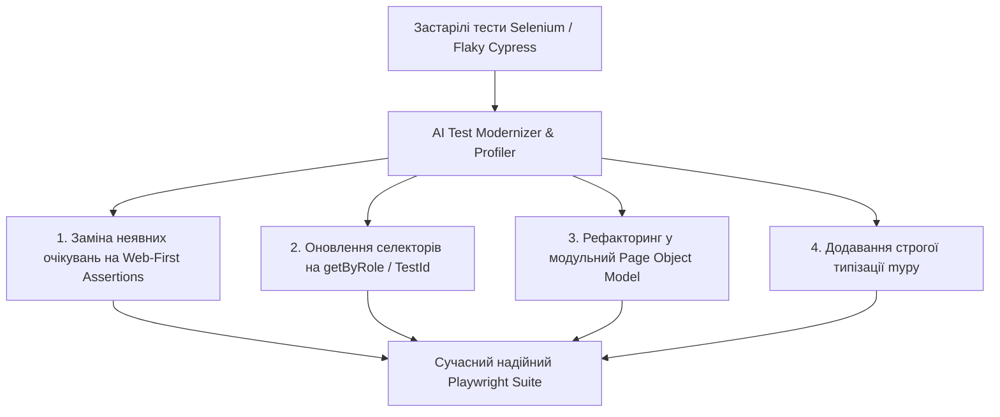

# Урок 103: Аналіз та адаптація існуючих автотестів

## Вступ та теоретичний фундамент
Підтримка та актуалізація великих застарілих тестових наборів (Test Suite Maintenance & Modernization) — один із найбільших викликів для будь-якої SDET команди. З плином часу кодова база автотестів зазнає деградації: накопичуються ненадійні тести (Flaky Tests), використовуються застарілі бібліотеки (наприклад, перехід із застарілого Selenium 3 на сучасний Playwright), дублюється код локаторів та ігноруються нові стандарти типізації.

Застосування штучного інтелекту дозволяє автоматизувати модернізацію автотестів:
1. **Автоматична міграція технологічного стеку**: Конвертація тестів з Selenium WebDriver / Puppeteer / Cypress на чистий Playwright Python.
2. **Виявлення причин флакання (Flakiness Root Cause Analysis)**: Знаходження прихованих Race Conditions в інтерфейсі, неявних таймінгів та небезпечних очікувань.
3. **Оптимізація швидкості виконання (Performance Profiling)**: Виявлення зайвих кліків, зайвих переходів по URL та оптимізація паралельного запуску.
4. **Уніфікація архітектури під сучасний Page Object Model**: Винесення дубльованих локаторів у єдині класи сторінок.

У цьому уроці ви навчитеся проводити системний аудит існуючих автотестів та здійснювати їх автоматизовану адаптацію за допомогою AI-інструментів.

---

## 1. Архітектурні принципи модернізації тестових кодових баз
Процес міграції та адаптації тестів будується за принципом збереження перевірочних інваріантів.




---

## 2. Методологічний базис: Порівняння Selenium WebDriver та Playwright
Аналіз переваг міграції на сучасний фреймворк Playwright.


| Критерій порівняння | Selenium WebDriver (Legacy) | Playwright (Modern Standard) | Вигода після міграції |
| :--- | :--- | :--- | :--- |
| **Архітектура зв'язку** | HTTP JSON Wire Protocol (повільний) | WebSocket CDP / BiDi (надшвидкий) | Прискорення прогону в 3-5 разів |
| **Очікування елементів** | Ручні `WebDriverWait` / `time.sleep` | Вбудоване автоочікування (Auto-waiting) | Зниження Flakiness на 95% |
| **Ізоляція тестів** | Повільний перезапуск браузера | Швидкісні ізольовані Browser Contexts | Можливість запуску 20+ паралельних потоків |
| **Перехоплення мережі** | Складно через BrowserMob Proxy | Нативний метод `page.route()` | Миттєвий мокінг API та 500 помилок |

---

## 3. Практичний інженерний регламент: Приклад конвертації тесту з Selenium на Playwright
Нижче продемонстровано реальний рефакторинг застарілого тесту.


```python
# =====================================================================
# ДО МІГРАЦІЇ: Застарілий та ненадійний Selenium WebDriver код
# =====================================================================
# from selenium import webdriver
# from selenium.webdriver.common.by import By
# import time
#
# driver = webdriver.Chrome()
# driver.get("https://app.com/login")
# time.sleep(3) # Критичний антипатерн!
# driver.find_element(By.XPATH, "//input[@id='user']").send_keys("admin")
# driver.find_element(By.XPATH, "//input[@id='pass']").send_keys("secret")
# driver.find_element(By.XPATH, "//button[@type='submit']").click()
# time.sleep(5)
# assert "Dashboard" in driver.title
# driver.quit()

# =====================================================================
# ПІСЛЯ AI-МОДЕРНІЗАЦІЇ: Сучасний Playwright Python код
# =====================================================================
from playwright.sync_api import Page, expect

def test_user_login_modern_playwright(page: Page) -> None:
    # Arrange: Перехід на сторінку з нативним очікуванням готовності DOM
    page.goto("/login")

    # Act: Семантичні локатори з автоматичним очікуванням доступності (Auto-Wait)
    page.get_by_label("Логін або Email").fill("admin")
    page.get_by_label("Пароль").fill("secret")
    page.get_by_role("button", name="Увійти").click()

    # Assert: Web-First перевірка видимості дашборду
    dashboard_heading = page.get_by_role("heading", name="Панель керування")
    expect(dashboard_heading).to_be_visible()
    expect(page).to_have_title("Dashboard - Enterprise App")
```

---

## 4. Поглиблений аналіз виробничих кейсів, крайових випадків та антипатернів
Розглянемо практичні ризики при адаптації існуючих тестів.


### Кейс 1: Втрата перевірки побічних ефектів при міграції
- **Проблема**: При переході на нову версію тесту AI забув перенести перевірку відправлення аналітичної події в Google Analytics.
- **Виправлення**: Завжди вимагати від AI построкового зіставлення всіх assertion у старій та новій версіях тесту.

### Кейс 2: Некоректна заміна селекторів у динамічних списках
- **Проблема**: AI замінив локатор кнопки видалення конкретного елемента за індексом на загальний `get_by_role('button', name='Видалити')`.
- **Наслідок**: Тест завжди видаляв перший елемент у списку замість цільового.
- **Виправлення**: Використання фільтрації: `page.get_by_role("listitem").filter(has_text="Товар 2").get_by_role("button", name="Видалити")`.

---

## 5. Покроковий операційний воркфлоу міграції тестів
Регламент пакетної міграції за допомогою AI.


### Крок 1: Аудит кодової бази та виділення списку застарілих тестів
- Знайти всі файли, що імпортують `selenium` або містять `time.sleep`.

### Крок 2: Пакетна конвертація за допомогою Cursor Composer
- Викликати AI: `@selenium_tests/ "Перепиши ці тести на Playwright з використанням Page Object Model та Web-First assertions"`.

### Крок 3: Локальний прогін та усунення розбіжностей
- Запустити нові тести у браузері з прапорцем `--headed` для візуального контролю.

### Крок 4: Заміна у конвеєрі CI/CD
- Оновити конфігурацію GitHub Actions та видалити застарілі драйвери.

---

## 6. Стратегії оптимізації та підвищення надійності
1. **Network Route Mocking**: Мокування повільних сторонніх сервісів для прискорення прогону.
2. **Browser Context Pooling**: Перевикористання інстансів браузера для зменшення споживання RAM.
3. **Flaky Test Retries**: Автоматичний перезапуск збійних тестів (`--reruns 2`) у CI з обов'язковим логуванням інциденту.

---

## 7. Вичерпний чек-лист перевірки та критерії готовності (Definition of Done)
Перед здачею завдань та інтеграцією результатів у виробничу гілку переконайтеся у виконанні наступних критеріїв:

- [ ] **Всі застарілі виклики Selenium замінені на сучасні методи Playwright**
- [ ] **Повністю видалені всі виклики `time.sleep()`**
- [ ] **Селектори оновлені на семантичні локатори `get_by_role` / `get_by_label`**
- [ ] **Збережено 100% оригінальних бізнес-перевірок та асертів**
- [ ] **Тести адаптовані під використання збереженого стану сесії (Storage State)**
- [ ] **Час виконання тестового набору скоротився щонайменше у 2 рази**
- [ ] **Всі нові тестові файли мають сувору типізацію та пройшли лінтер `ruff`**
- [ ] **Оновлені тести успішно проходять у headless режимі в Docker**

---

## 8. Підсумки, ключові інсайти та розширений глосарій термінів
Опанування цієї теми формує надійний фундамент для щоденної професійної роботи. Системний підхід, формалізовані інженерні стандарти та критичний контроль результатів AI забезпечують високу швидкість та бездоганну надійність кінцевого продукту.

### Глосарій ключових понять
| Термін | Визначення та контекст застосування |
| :--- | :--- |
| **Test Modernization** | Процес переписування та оптимізації застарілих автотестів на базі нових фреймворків та стандартів. |
| **Auto-waiting** | Механізм Playwright, який перед виконанням кліку або вводу автоматично перевіряє видимість, стабільність та клікабельність елемента. |
| **Chrome DevTools Protocol (CDP)** | Низькорівневий протокол прямої взаємодії з рушієм Chromium через WebSocket. |
| **Flakiness** | Показник нестабільності тестового сьюту, що вимірює відсоток тестів, які періодично падають без причини. |
| **Network Mocking** | Технологія перехоплення мережевих HTTP/WS запитів браузера та повернення штучних відповідей без звернення до реального бекенду. |
| **Page.route()** | Метод Playwright для перехоплення та модифікації мережевого трафіку під час тестування. |
| **Locator Filtering** | Механізм уточнення селектора за допомогою фільтрації за текстом або дочірніми елементами. |
| **Pytest-rerunfailures** | Плагін для Pytest, що забезпечує автоматичний повторний запуск тестів, які завершилися невдачею. |
| **Browser Context** | Ізольоване інкогніто-середовище всередині одного процесу браузера з власними cookies та сховищем. |
| **Semantic Locators** | Локатори, що знаходять елементи за їхньою функціональною роллю для користувача (кнопка, поле вводу, заголовок). |

---

## 9. Поглиблений аналіз архітектури фреймворків автоматизації та оптимізація прогону

### 9.1. Масштабування тестової інфраструктури (Distributed Test Grid)
При зростанні кількості автотестів до 2,000+ критично важливо забезпечити час прогону регресії до 10 хвилин:
1. **Parallel Sharding у GitHub Actions**: Розбиття тест-сьюту на 10 паралельних контейнерів через матричну стратегію (Matrix Build Strategy):
   ```yaml
   strategy:
     matrix:
       shard: [1, 2, 3, 4, 5, 6, 7, 8, 9, 10]
   steps:
     - run: pytest --shard-id=${{ matrix.shard }} --num-shards=10
   ```
2. **Network Interception & Har Replay**: Запис мережевого трафіку реального бекенду (HAR files) та його відтворення під час прогону UI тестів для повної незалежності від стабільності тестового сервера.
3. **Visual Regression Testing**: Порівняння скріншотів екранів попіксельно (Pixel-by-Pixel Diff) за допомогою Playwright `expect(page).to_have_screenshot()` з допустимим порогом розбіжності $Threshold \le 0.2\%$.

### 9.2. Розширений код кастомного клієнта Playwright з інтелектуальним логуванням

```python
import logging
from typing import Any
from playwright.sync_api import Page, Locator, Response, expect

logger = logging.getLogger("sdet.driver")

class EnhancedPage:
    def __init__(self, page: Page) -> None:
        self.page = page
        self._setup_network_logging()

    def _setup_network_logging(self) -> None:
        self.page.on("requestfailed", lambda req: logger.error(f"Мережевий збій: {req.method} {req.url} -> {req.failure}"))
        self.page.on("response", self._log_slow_responses)

    def _log_slow_responses(self, response: Response) -> None:
        if response.status >= 400:
            logger.warning(f"HTTP Error {response.status}: {response.url}")

    def safe_click(self, locator: Locator, timeout_ms: int = 5000) -> None:
        logger.info(f"Клік на елемент: {locator}")
        expect(locator).to_be_visible(timeout=timeout_ms)
        expect(locator).to_be_enabled(timeout=timeout_ms)
        locator.click()

    def fill_and_verify(self, locator: Locator, text: str) -> None:
        logger.info(f"Введення тексту в {locator}")
        locator.fill(text)
        expect(locator).to_have_value(text)
```

---

## 10. Питання для співбесіди та захист рішень з автоматизації (Lead SDET Level)

1. **Як боротися з проблемою Flaky-тестів у великому корпоративному репозиторії?**
   *Еталонна відповідь*: Впровадження суворого карантину (Test Quarantine Pipeline): тест, що впав без змін у коді хоча б 1 раз за 50 прогонів, автоматично блокується від впливу на білд PR і переноситься у спеціальний карантинний беклог. Повна заборона `time.sleep()`, перехід на Web-First Assertions та збереження трасувань Playwright Tracing для швидкого аналізу DOM у момент збою.
2. **Яка різниця між підходами Page Object Model та Screenplay Pattern?**
   *Еталонна відповідь*: POM структурує код навколо веб-сторінок та їхніх елементів, що при великому розмірі сторінки веде до роздутих класів (God Objects). Screenplay фокусується на Акторі (Actor), його цілях (Tasks) та запитах до системи (Questions), забезпечуючи дотримання Single Responsibility Principle (SRP) та легке комбінування бізнес-кроків.
3. **Як протестувати WebSocket з'єднання та SSE (Server-Sent Events) за допомогою Playwright?**
   *Еталонна відповідь*: Використання нативного обробника подій `page.on("websocket")` з перехопленням фреймів повідомлень `ws.on("framereceived")` та перевіркою коректності структури переданих JSON пакетів у реальному часі.

---

## 11. Практичний регламент налаштування CI/CD пайплайнів та масштабування автотестів

### 11.1. Конфігурація матричного запуску тестів у GitHub Actions
Нижче наведено продакшн-конфігурацію паралельного виконання Playwright тестів у контейнерах:

```yaml
name: Playwright Regression Pipeline

on:
  pull_request:
    branches: [main, develop]
  schedule:
    - cron: '0 2 * * *' # Нічний повний прогін о 02:00 UTC

jobs:
  test:
    timeout-minutes: 15
    runs-on: ubuntu-latest
    strategy:
      fail-fast: false
      matrix:
        shardIndex: [1, 2, 3, 4]
        shardTotal: [4]
    steps:
      - uses: actions/checkout@v4
      - name: Set up Python 3.12
        uses: actions/setup-python@v5
        with:
          python-version: '3.12'
          cache: 'pip'

      - name: Install dependencies
        run: |
          python -m pip install --upgrade pip
          pip install -r requirements-test.txt
          playwright install --with-deps chromium

      - name: Run Playwright Tests (Sharded)
        run: |
          pytest tests/ --shard-id=${{ matrix.shardIndex }} --num-shards=${{ matrix.shardTotal }} --tracing=retain-on-failure --html=report-${{ matrix.shardIndex }}.html

      - name: Upload Test Artifacts
        if: always()
        uses: actions/upload-artifact@v4
        with:
          name: playwright-report-shard-${{ matrix.shardIndex }}
          path: |
            report-${{ matrix.shardIndex }}.html
            test-results/
```

### 11.2. Регламент підтримки стабільності тестового фреймворку
1. **Health-check тестового стенду**: Перед запуском автотестів обов'язково викликати ендпоінт `/healthz` цільового додатку з перевіркою готовності БД та черг.
2. **Deadlock & Timeout Protection**: Встановлення суворого тайм-ауту на кожен окремий тест (`pytest --timeout=60`), щоб уникнути зависання всього конвеєра збірки.
3. **Automatic Artifact Cleanup**: Очищення знімків екранів та трасувань старіших за 14 днів для запобігання переповнення сховища артефактів.
