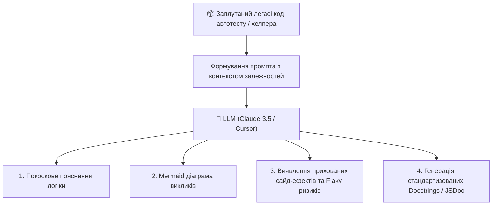

# Урок 103: Пояснення існуючого коду за допомогою AI

## 1. Проблема розуміння легасі фреймворків тестування

В інженерії якості (QA Automation) значна частина робочого часу витрачається не на створення нових тестів з чистого аркуша, а на підтримку, налагодження та розширення вже існуючих тестових наборів. Багато проєктів мають історію у 5–10 років:
- Заплутані ланцюжки наслідування класів (`BasePage -> AuthenticatedPage -> CustomDashboardPage`).
- Кастомні обгортки над веб-драйвером (`CustomWebDriverWaiterHelperProxy`).
- Складні регулярні вирази, лямбда-вирази та магічні константи без документації.
- Неочевидні асинхронні ланцюжки промісів або багатопотокові фікстури.

Сучасні LLM (Claude 3.5 Sonnet, GPT-4o, Cursor IDE) діють як персональний **Senior SDET ментор**, здатний за лічені секунди розібрати архітектуру заплутаного модуля, створити UML-діаграму послідовності викликів та пояснити приховані сайд-ефекти.



---

## 2. Стратегії запитів (Prompt Engineering) для аналізу коду

Щоб отримати глибоке та точне пояснення коду замість поверхневого переказу синтаксису, використовують багаторівневу структуру промпта:

### Схема промпта «Code Detective»:
1. **Рольовий контекст**: «Ти Senior SDET та експерт з Python Pytest / Playwright».
2. **Цільовий код**: Вставка фрагмента із зазначенням зв'язаних модулів.
3. **Фокус аналізу**:
   - Яка бізнес-мета цього тестового методу чи хелпера?
   - Які зовнішні ресурси або глобальний стан модифікуються?
   - Чому тут використано специфічний підхід (наприклад, перехоплення WebSocket повідомлень замість DOM polling)?
   - Які потенційні причини нестабільності (flakiness) або падіння у CI/CD пайплайні?
4. **Формат виводу**: Структурований список із блок-схемою Mermaid та таблицею параметрів.

---

## 3. Практичний приклад: деконструкція заплутаної Playwright фікстури

### Аналізований код:
```python
import pytest
from playwright.sync_api import Browser, BrowserContext, Page

@pytest.fixture(scope="function")
def authenticated_admin_context(browser: Browser, tmp_path_factory):
    storage_state_path = tmp_path_factory.mktemp("state") / "admin_auth.json"
    context = browser.new_context()
    page = context.new_page()
    page.goto("https://admin.portal.internal/login")
    page.get_by_label("Admin Token").fill("SECRET_SUPER_TOKEN")
    page.get_by_role("button", name="Authorize").click()
    page.wait_for_url("**/dashboard")
    context.storage_state(path=str(storage_state_path))
    page.close()
    context.close()
    
    auth_context = browser.new_context(storage_state=str(storage_state_path))
    yield auth_context
    auth_context.close()
```

### Пояснення від AI:
1. **Призначення**: Фікстура виконує попередню авторизацію один раз перед тестом і зберігає сесійні Cookies та LocalStorage у тимчасовий JSON-файл (`storage_state`).
2. **Створення ізольованого контексту**: Другий виклик `browser.new_context(storage_state=...)` породжує чистий браузерний профіль, який уже є авторизованим, уникаючи повторного проходження UI-форми логіну в кожному автотесті.
3. **Очищення ресурсів**: Після завершення тесту (`yield`) спрацьовує `auth_context.close()`, запобігаючи витоку пам'яті у headless-режимі.

---

## 4. Виявлення прихованих пасток та Flakiness за допомогою AI

AI допомагає виявляти антипатерни у чужому коді:
- **Race Conditions**: Одночасне очікування кліку та мережевого запиту без `expect_response()`.
- **Зворотна несумісність**: Використання застарілих методів бібліотеки.
- **Глобальні змінні**: Модифікація загальних списків або синглтонів між паралельними потоками pytest-xdist.
