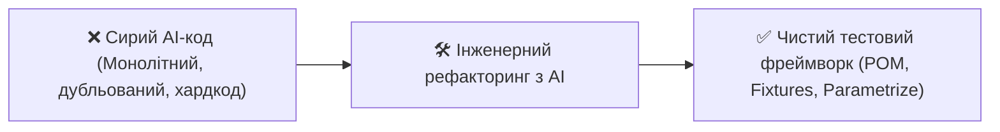

# Урок 104: Рефакторинг AI-generated коду

## 1. Чому сирий згенерований код потребує рефакторингу?

Генеративний штучний інтелект здатен миттєво генерувати працюючі прототипи автотестів. Проте базовий вивід LLM часто містить типові інженерні недоліки:
1. **Дублювання коду (Code Duplication)**: Повторення однакових селекторів та дій на різних кроках тесту.
2. **Порушення SRP (Single Responsibility Principle)**: Один тестовий метод відповідає і за навігацію, і за створення тестових сутностей, і за складні розрахунки бізнес-правил.
3. **«Протікання абстракцій» (Leaky Abstractions)**: Використання сирих DOM-селекторів безпосередньо в тілі тестових функцій замість методів Page Object.
4. **Неоптимальні структури даних**: Зашиті списки замість параметризованих Pytest тестів (`@pytest.mark.parametrize`).



---

## 2. Ключові напрямки рефакторингу в Test Automation

### А. Виділення Page Object Model (POM)
Перенесення пошуку елементів та користувацьких дій у спеціалізовані класи сторінок / компонентів.

### Б. Винесення передумов у Pytest Fixtures
Ініціалізація браузерів, генерація API-токенів та створення тестових користувачів виносяться у `conftest.py`.

### В. Параметризація сценаріїв
Заміна копіпасту однакових тестів з різними значеннями на один компактний тест з `@pytest.mark.parametrize`.

---

## 3. Практичний кейс рефакторингу «До та Після»

### Сирий AI-код (ДО):
```python
def test_login_flow(page):
    page.goto("https://app.example.com/login")
    page.fill("#email", "user@test.com")
    page.fill("#password", "Password123")
    page.click("button[type='submit']")
    page.wait_for_selector(".dashboard-header")
    assert page.inner_text(".dashboard-header") == "Ласкаво просимо"
```

### Відрефакторений код (ПІСЛЯ):
```python
# pages/login_page.py
from playwright.sync_api import Page, Locator, expect

class LoginPage:
    def __init__(self, page: Page):
        self.page = page
        self.email_input = page.get_by_label("Електронна пошта")
        self.password_input = page.get_by_label("Пароль")
        self.submit_btn = page.get_by_role("button", name="Увійти")
        self.dashboard_header = page.get_by_role("heading", level=1)

    def navigate(self):
        self.page.goto("/login")

    def login(self, email: str, password: str):
        self.email_input.fill(email)
        self.password_input.fill(password)
        self.submit_btn.click()

    def verify_logged_in(self, expected_title: str):
        expect(self.dashboard_header).to_have_text(expected_title)

# tests/test_login.py
def test_login_flow(login_page: LoginPage):
    login_page.navigate()
    login_page.login("user@test.com", "Password123")
    login_page.verify_logged_in("Ласкаво просимо")
```
