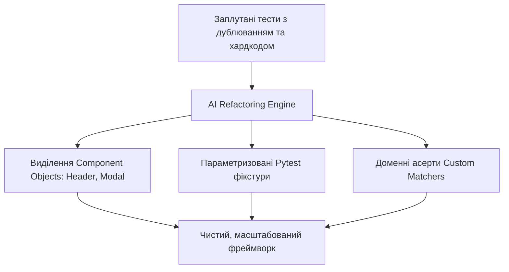

# Урок 104: Рефакторинг тестового коду за допомогою AI

## Вступ та теоретичний фундамент
Тестовий код — це такий самий виробничий код системи (Production Code), який вимагає дотримання принципів чистої архітектури, регулярного рефакторингу та позбавлення від технічного боргу. Часто автоматизатори тестування припускаються помилки, вважаючи, що до автотестів можна застосовувати нижчі стандарти якості: допускається дублювання коду (Copy-Paste Anti-pattern), використання магічних рядків та відсутність модульності.

Наслідком неякісного тестового коду стає його непідтримуваність: зміна одного селектора в шапці сайту змушує змінювати сотні окремих тестових файлів.

Використання AI для рефакторингу автотестів забезпечує:
1. **Ліквідацію дублювання через Fluent Page Objects та App Actions**: Об'єднання послідовностей дій у зручні ланцюжки викликів.
2. **Впровадження принципу DRY у фікстурах (Fixture Modularization)**: Винесення загального коду підготовки даних у параметризовані фікстури Pytest.
3. **Заміну магічних чисел та локаторів на типізовані Enums**: Створення централізованих констант для маршрутів та ролей.
4. **Оптимізацію Assertion Blocks (Soft Assertions)**: Застосування м'яких асертів для збору всіх помилок форми за один прогін.

У цьому уроці детально розглядаються патерни рефакторингу автоматизованих тестів за допомогою AI-асистентів.

---

## 1. Архітектурні патерни рефакторингу тестових фреймворків
Ключові патерни покращення структури тестів:
- **Fluent Interface (Method Chaining)**: Методи сторінки повертають `self` або наступну сторінку для побудови елегантних ланцюжків.
- **Custom Matchers / Assertions**: Винесення складних багаторядкових перевірок в окремі зрозумілі функції `assert_user_has_active_subscription()`.
- **Component Objects**: Виділення повторюваних віджетів (Header, Sidebar, Modal, Data Table) в окремі модулі.




---

## 2. Методологічний базис: Порівняння патернів побудови тестів
Порівняльний аналіз архітектурних стилів організації автотестів.


| Патерн організації | Сутність патерну | Переваги | Сфера найкращого застосування |
| :--- | :--- | :--- | :--- |
| **Page Object Model (POM)** | Клас представляє окрему веб-сторінку | Чітке розділення структури та тестів | Великі веб-додатки з багатьма сторінками |
| **Component Object Model** | Клас представляє повторюваний віджет (Header, Modal) | Зменшення дублювання між різними сторінками | Додатки з єдиним макетом та мікрофронтендами |
| **Screenplay Pattern** | Фокус на діях актора (Actor -> Tasks -> Questions) | Найвища масштабованість, людино-читабельність | Складні Enterprise-системи з багатьма ролями |
| **App Actions (Cypress style)** | Прямі виклики методів додатку через JS стан | Максимальна швидкість виконання | Single Page Applications (React/Vue) |

---

## 3. Практичний інженерний регламент: Еталонний Fluent Page Object з компонентним підходом
Приклад відрефактореної сторінки з виділеним компонентом модального вікна.


```python
# =====================================================================
# components/confirmation_modal.py - Component Object
# =====================================================================
from playwright.sync_api import Page, Locator, expect

class ConfirmationModal:
    def __init__(self, page: Page) -> None:
        self.modal_container = page.get_by_role("dialog")
        self.confirm_btn = self.modal_container.get_by_role("button", name="Підтвердити")
        self.cancel_btn = self.modal_container.get_by_role("button", name="Скасувати")

    def confirm(self) -> None:
        expect(self.modal_container).to_be_visible()
        self.confirm_btn.click()
        expect(self.modal_container).to_be_hidden()

# =====================================================================
# pages/profile_page.py - Fluent Page Object
# =====================================================================
class ProfilePage:
    def __init__(self, page: Page) -> None:
        self.page = page
        self.delete_account_btn = page.get_by_role("button", name="Видалити акаунт")
        self.modal = ConfirmationModal(page)

    def navigate(self) -> "ProfilePage":
        self.page.goto("/profile")
        return self

    def delete_account_with_confirmation(self) -> None:
        self.delete_account_btn.click()
        self.modal.confirm()

# =====================================================================
# tests/test_profile_clean.py - Елегантний читабельний тест
# =====================================================================
def test_user_can_delete_account(page: Page) -> None:
    # Тест читається як проста бізнес-інструкція
    ProfilePage(page).navigate().delete_account_with_confirmation()
    expect(page).to_have_url("/goodbye")
```

---

## 4. Поглиблений аналіз виробничих кейсів, крайових випадків та антипатернів
Аналіз помилок під час рефакторингу тестів.


### Кейс 1: Втрата ізоляції тестів через спільний стан у Page Object
- **Проблема**: AI створив статичну змінну `user_id` всередині класу Page Object.
- **Наслідок**: При паралельному запуску тестів у кількох потоках значення перезаписувалося, викликаючи конфлікти даних.
- **Виправлення**: Заборона збереження змінюваного стану в екземплярах Page Objects. Усі дані повинні передаватися як аргументи методів.

---

## 5. Покроковий операційний воркфлоу рефакторингу тестового набору
Алгоритм систематичного очищення тестової кодової бази.


### Крок 1: Ідентифікація дублювання коду в тестових файлах
- Знайти повторювані ланцюжки локаторів та дій.

### Крок 2: Генерація компонентів та методів-хелперів
- Викликати AI для винесення повторюваних елементів у Component Objects.

### Крок 3: Заміна прямого коду на виклики Fluent методів
- Оновити тестові сценарії.

### Крок 4: Запуск лінтерів та прогін тестів
- Переконатися, що всі 100% тестів продовжують стабільно проходити.

---

## 6. Стратегії підвищення підтримуваності тестів
1. **Static Analysis with Flake8/Ruff**: Автоматичний аудит стилю написання тестів у CI/CD.
2. **Strict Page Object Isolation**: Заборона розміщення assertions всередині методів Page Objects (Assertions належать лише тестам).
3. **Centralized Test Configuration**: Збереження всіх базових URL та таймаутів у єдиному файлі `pytest.ini` / `.env`.

---

## 7. Вичерпний чек-лист перевірки та критерії готовності (Definition of Done)
Перед здачею завдань та інтеграцією результатів у виробничу гілку переконайтеся у виконанні наступних критеріїв:

- [ ] **Дублювання локаторів та дій ліквідовано через виділення Page/Component Objects**
- [ ] **Методи Page Objects не містять assertions (крім перевірок видимості самого віджета)**
- [ ] **Магічні константи та рядки винесені у типізовані Enums**
- [ ] **Застосовано патерн Fluent Interface для покращення читабельності сценаріїв**
- [ ] **Спільні операції підготовки даних винесені у модульні Pytest фікстури**
- [ ] **Усі тестові файли мають сувору типізацію та проходять перевірку `mypy`**
- [ ] **Час підтримки та додавання нових тестів скоротився завдяки модульній структурі**
- [ ] **Повний набір тестів успішно проходить у паралельному режимі**

---

## 8. Підсумки, ключові інсайти та розширений глосарій термінів
Опанування цієї теми формує надійний фундамент для щоденної професійної роботи. Системний підхід, формалізовані інженерні стандарти та критичний контроль результатів AI забезпечують високу швидкість та бездоганну надійність кінцевого продукту.

### Глосарій ключових понять
| Термін | Визначення та контекст застосування |
| :--- | :--- |
| **Test Refactoring** | Процес покращення внутрішньої структури тестового коду без зміни перевірюваної бізнес-поведінки. |
| **Component Object Model** | Розширення патерну Page Object для інкапсуляції повторюваних компонентів та віджетів UI. |
| **Fluent Interface** | Стиль проектування API, при якому виклики методів поєднуються у безперервний ланцюжок (Method Chaining). |
| **Screenplay Pattern** | Архітектурний патерн тестування, що фокусується на акторах, їхніх завданнях та перевірках результату. |
| **Soft Assertion** | Тип перевірки, що фіксує падіння, але не зупиняє виконання тесту негайно, дозволяючи зібрати всі помилки. |
| **DRY (Don't Repeat Yourself)** | Принцип розробки, спрямований на уникнення дублювання інформації та логіки в кодовій базі. |
| **Custom Matcher** | Користувацька функція перевірки, створена для читабельної перевірки специфічних доменних умов. |
| **App Actions** | Підхід до автоматизації, при якому взаємодія з додатком здійснюється через прямі виклики його внутрішніх сервісів. |
| **Test Isolation** | Принцип, згідно з яким кожен тест повинен виконуватися незалежно від інших без збереження залишкового стану. |
| **Pytest.ini** | Конфігураційний файл, що визначає глобальні параметри, маркери та налаштування запуску Pytest. |

---

## 9. Поглиблений аналіз архітектури фреймворків автоматизації та оптимізація прогону

### 9.1. Масштабування тестової інфраструктури (Distributed Test Grid)
При зростанні кількості автотестів до 2,000+ критично важливо забезпечити час прогону регресії до 10 хвилин:
1. **Parallel Sharding у GitHub Actions**: Розбиття тест-сьюту на 10 паралельних контейнерів через матричну стратегію (Matrix Build Strategy):
   ```yaml
   strategy:
     matrix:
       shard: [1, 2, 3, 4, 5, 6, 7, 8, 9, 10]
   steps:
     - run: pytest --shard-id=${{ matrix.shard }} --num-shards=10
   ```
2. **Network Interception & Har Replay**: Запис мережевого трафіку реального бекенду (HAR files) та його відтворення під час прогону UI тестів для повної незалежності від стабільності тестового сервера.
3. **Visual Regression Testing**: Порівняння скріншотів екранів попіксельно (Pixel-by-Pixel Diff) за допомогою Playwright `expect(page).to_have_screenshot()` з допустимим порогом розбіжності $Threshold \le 0.2\%$.

### 9.2. Розширений код кастомного клієнта Playwright з інтелектуальним логуванням

```python
import logging
from typing import Any
from playwright.sync_api import Page, Locator, Response, expect

logger = logging.getLogger("sdet.driver")

class EnhancedPage:
    def __init__(self, page: Page) -> None:
        self.page = page
        self._setup_network_logging()

    def _setup_network_logging(self) -> None:
        self.page.on("requestfailed", lambda req: logger.error(f"Мережевий збій: {req.method} {req.url} -> {req.failure}"))
        self.page.on("response", self._log_slow_responses)

    def _log_slow_responses(self, response: Response) -> None:
        if response.status >= 400:
            logger.warning(f"HTTP Error {response.status}: {response.url}")

    def safe_click(self, locator: Locator, timeout_ms: int = 5000) -> None:
        logger.info(f"Клік на елемент: {locator}")
        expect(locator).to_be_visible(timeout=timeout_ms)
        expect(locator).to_be_enabled(timeout=timeout_ms)
        locator.click()

    def fill_and_verify(self, locator: Locator, text: str) -> None:
        logger.info(f"Введення тексту в {locator}")
        locator.fill(text)
        expect(locator).to_have_value(text)
```

---

## 10. Питання для співбесіди та захист рішень з автоматизації (Lead SDET Level)

1. **Як боротися з проблемою Flaky-тестів у великому корпоративному репозиторії?**
   *Еталонна відповідь*: Впровадження суворого карантину (Test Quarantine Pipeline): тест, що впав без змін у коді хоча б 1 раз за 50 прогонів, автоматично блокується від впливу на білд PR і переноситься у спеціальний карантинний беклог. Повна заборона `time.sleep()`, перехід на Web-First Assertions та збереження трасувань Playwright Tracing для швидкого аналізу DOM у момент збою.
2. **Яка різниця між підходами Page Object Model та Screenplay Pattern?**
   *Еталонна відповідь*: POM структурує код навколо веб-сторінок та їхніх елементів, що при великому розмірі сторінки веде до роздутих класів (God Objects). Screenplay фокусується на Акторі (Actor), його цілях (Tasks) та запитах до системи (Questions), забезпечуючи дотримання Single Responsibility Principle (SRP) та легке комбінування бізнес-кроків.
3. **Як протестувати WebSocket з'єднання та SSE (Server-Sent Events) за допомогою Playwright?**
   *Еталонна відповідь*: Використання нативного обробника подій `page.on("websocket")` з перехопленням фреймів повідомлень `ws.on("framereceived")` та перевіркою коректності структури переданих JSON пакетів у реальному часі.

---

## 11. Практичний регламент налаштування CI/CD пайплайнів та масштабування автотестів

### 11.1. Конфігурація матричного запуску тестів у GitHub Actions
Нижче наведено продакшн-конфігурацію паралельного виконання Playwright тестів у контейнерах:

```yaml
name: Playwright Regression Pipeline

on:
  pull_request:
    branches: [main, develop]
  schedule:
    - cron: '0 2 * * *' # Нічний повний прогін о 02:00 UTC

jobs:
  test:
    timeout-minutes: 15
    runs-on: ubuntu-latest
    strategy:
      fail-fast: false
      matrix:
        shardIndex: [1, 2, 3, 4]
        shardTotal: [4]
    steps:
      - uses: actions/checkout@v4
      - name: Set up Python 3.12
        uses: actions/setup-python@v5
        with:
          python-version: '3.12'
          cache: 'pip'

      - name: Install dependencies
        run: |
          python -m pip install --upgrade pip
          pip install -r requirements-test.txt
          playwright install --with-deps chromium

      - name: Run Playwright Tests (Sharded)
        run: |
          pytest tests/ --shard-id=${{ matrix.shardIndex }} --num-shards=${{ matrix.shardTotal }} --tracing=retain-on-failure --html=report-${{ matrix.shardIndex }}.html

      - name: Upload Test Artifacts
        if: always()
        uses: actions/upload-artifact@v4
        with:
          name: playwright-report-shard-${{ matrix.shardIndex }}
          path: |
            report-${{ matrix.shardIndex }}.html
            test-results/
```

### 11.2. Регламент підтримки стабільності тестового фреймворку
1. **Health-check тестового стенду**: Перед запуском автотестів обов'язково викликати ендпоінт `/healthz` цільового додатку з перевіркою готовності БД та черг.
2. **Deadlock & Timeout Protection**: Встановлення суворого тайм-ауту на кожен окремий тест (`pytest --timeout=60`), щоб уникнути зависання всього конвеєра збірки.
3. **Automatic Artifact Cleanup**: Очищення знімків екранів та трасувань старіших за 14 днів для запобігання переповнення сховища артефактів.
