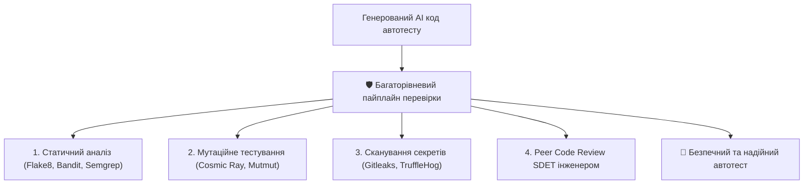

# Урок 105: Перевірка коректності та безпечності AI-generated коду

## 1. Загрози та підводні камені при сліпому прийнятті AI-коду

Штучний інтелект значно прискорює створення тестів, але безконтрольне копіювання коду несе серйозні ризики:
- **Фальшиво-зелені тести (False Positive Tests)**: Тест завжди успішно проходить (Pass), навіть якщо система має критичний баг, через відсутність або некоректність асертів (Assert-less tests).
- **Витік секретів (Secret Exposure)**: Жорстко зашиті API-ключі, паролі або токени доступу в генерованих тестах.
- **Вразливості безпеки (Security Vulnerabilities)**: Використання небезпечних методів десеріалізації (наприклад, `pickle.loads()`), відключення SSL валідації (`verify=False`), виконання довільного коду через `eval()`.
- **Фантомні бібліотеки (Package Hallucination)**: Імпорт неіснуючих пакетів, що створює ризик атаки типу Typosquatting / Dependency Confusion.



---

## 2. Інструменти аудиту безпеки та якості коду

| Інструмент | Тип перевірки | Що шукає |
| :--- | :--- | :--- |
| **Bandit** | AST Security Linter для Python | `verify=False`, використання `eval()`, хардкод паролів, небезпечний парсинг XML. |
| **Semgrep** | Семантичний статичний аналізатор | Кастомні правила безпеки та патерни вразливого коду. |
| **Gitleaks** | Сканер секретів | Випадково залишені AWS ключі, JWT токени, приватні SSH ключі. |
| **Mutmut** | Мутаційне тестування | Перевіряє, чи тест впаде, якщо навмисно змінити логіку в системі (детектор "пустих" тестів). |

---

## 3. Як перевірити тест на «Фальшиву позитивність»

Найбільш небезпечний автотест — це тест, який завжди зелений.
AI може згенерувати такий код:
```python
# АНТИПАТЕРН: Такий тест ніколи не впаде!
def test_user_checkout(page):
    try:
        page.goto("/checkout")
        page.click("#pay-button")
        assert page.is_visible(".success-message")
    except Exception:
        pass  # Приховування будь-яких помилок!
```

### Правильний підхід:
Завжди запускайте **тест червоним** перед тим, як зробити його зеленим (Red-Green-Refactor):
1. Змініть очікуваний результат на завідомо хибний (наприклад, очікуйте статус 500 або інший текст).
2. Переконайтеся, що тест гарантовано падає з інформативним повідомленням про помилку.
3. Поверніть правильний очікуваний результат.
