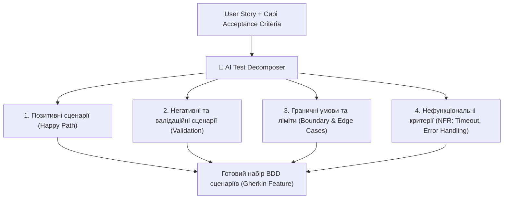

# Урок 94: Декомпозиція Acceptance Criteria за допомогою AI: від бізнес-вимог до атомарних тестових умов

## 1. Acceptance Criteria як міст між бізнесом та якістю

**Критерії прийнятності (Acceptance Criteria / AC)** — це чіткі, вимірювані умови, за яких функціональність вважається повністю реалізованою, перевіреною та готовою до прийняття замовником або Product Owner.

Головна проблема традиційного тестування — занадто високорівневі або розмиті AC у User Story (наприклад: *«Користувач може легко оплатити замовлення»*). Якщо тестувальник візьме такі критерії без декомпозиції, буде пропущено 80% нефункціональних, безпекових та крайових сценаріїв.

---

## 2. Формати оформлення AC: Scenario-Oriented (Gherkin) vs Rule-Oriented

1. **Rule-Oriented (За правилами)**: Список чітких бізнес-правил. Ідеально підходить для опису складних фінансових чи тарифних обмежень.
2. **Scenario-Oriented (Gherkin: Given-When-Then)**:
   - **Given (Дано)**: Початковий стан системи, авторизація, баланс, права доступу.
   - **When (Коли)**: Цільова дія користувача (клік, відправка форми, API виклик).
   - **Then (Тоді)**: Очікуваний результат, зміна стану БД, візуальне сповіщення, відповідь сервера.

---

## 3. Фреймворк декомпозиції AC за допомогою AI

Для отримання вичерпного тестового покриття AI-асистенту ставиться завдання розбити кожен пункт AC за 4 вимірами:
- **UI/UX вимір**: відображення станів (Disabled, Loading, Empty State, Error Tooltip).
- **Backend/API вимір**: статус-коди (200, 201, 400, 401, 403, 404, 422, 500), валідація схеми JSON.
- **Database вимір**: збереження записів, відсутність дублікатів, перевірка транзакційної цілісності.
- **Security & Perms вимір**: перевірка ролей користувачів (Admin vs Manager vs Guest), CSRF, XSS.
