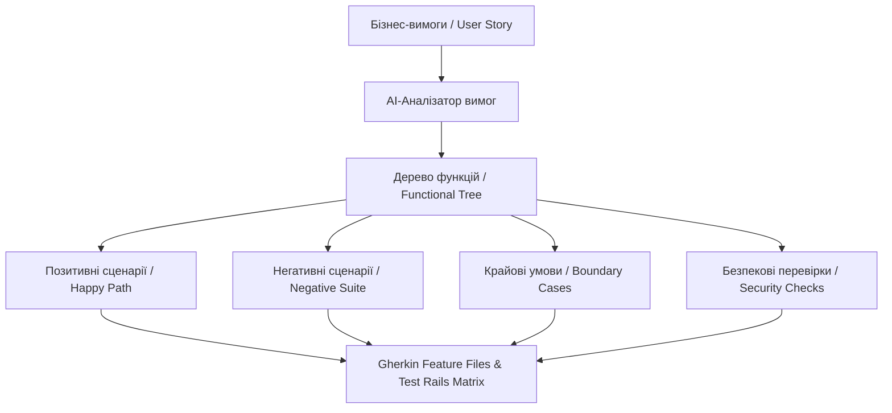
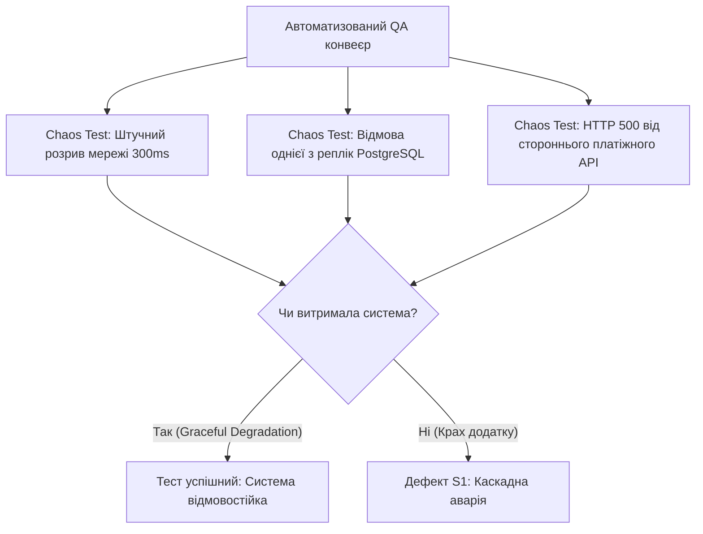

# Урок 94: Декомпозиція вимог та створення структурованих тестових сценаріїв

## Вступ та теоретичний фундамент
Тестування програмного забезпечення в еру штучного інтелекту трансформується з рутинного ручного процесу на високоінтелектуальну інженерну дисципліну керування якістю (Quality Engineering). Основою надійного тестування залишається системна декомпозиція бізнес-вимог та створення вичерпного набору тест-кейсів, що покривають як прямі бізнес-сценарії (Happy Path), так і крайові умови (Edge Cases), нетипову поведінку користувачів та відмови інфраструктури.

Використання генеративних моделей (Claude 3.5/3.7 Sonnet, GPT-4o, OpenAI o1) дозволяє QA-інженеру:
1. **Знизити ризик сліпих зон (Blind Spots Elimination)**: AI допомагає виявити приховані залежності у вимогах та нетривіальні комбінації вхідних параметрів.
2. **Формалізувати критерії приймання (Acceptance Criteria Formalization)**: Перетворювати неструктуровані описи завдань у формат Gherkin (Given-When-Then) або стандартні тестові матриці.
3. **Забезпечити повну трасованість вимог (Requirements Traceability Matrix — RTM)**: Автоматично пов'язувати кожен тест-кейс з конкретним пунктом специфікації.
4. **Мінімізувати дублювання перевірок**: AI структурує тестові набори, виключаючи надлишкові однотипні перевірки та фокусуючи увагу на критичних ділянках.

У цьому уроці детально розглядаються алгоритми декомпозиції вимог за допомогою AI, побудова карт покриття та правила валідації згенерованих сценаріїв.

---

## 1. Архітектурні принципи та внутрішня механіка декомпозиції вимог
Декомпозиція вимог за допомогою AI вимагає системного багатошарового підходу: від загального функціонального блоку до атомарних тестових перевірок.

### 1.1. Ієрархія декомпозиції в Quality Assurance
- **Епік / Модуль (Feature / Epic)**: Загальний функціонал (наприклад, "Модуль кошика та оформлення замовлення").
- **Користувацька історія (User Story)**: Окремий бізнес-сценарій ("Як зареєстрований користувач, я хочу застосувати промокод...").
- **Тестовий набір (Test Suite)**: Групування перевірок за типом (Smoke, Regression, Security, Performance).
- **Атомарний тест-кейс (Atomic Test Case)**: Конкретна послідовність дій з фіксованими вхідними даними та очікуваним результатом.




---

## 2. Методологічний базис: Порівняння форматів представлення тестових сценаріїв
Залежно від цільового інструменту та методології тестування обирається оптимальний формат документації тест-кейсів.


| Формат представлення | Структура та синтаксис | Переваги формату | Недоліки або обмеження |
| :--- | :--- | :--- | :--- |
| **Gherkin (BDD)** | `Scenario: Given... When... Then...` | Читабельність бізнесом, пряма інтеграція в Cucumber/Behave | Надмірна багатослівність для дрібних перевірок |
| **Класичний Step-by-Step** | Preconditions -> Steps (1..N) -> Expected Result | Детальна покрокова інструкція для ручних тестувальників | Потребує більше часу на підтримку при змінах UI |
| **Таблиця рішень (Decision Table)** | Стовпці умов (Inputs) та рядки дій (Actions) | 100% покриття комбінаторної логіки зі складними правилами | Складно сприймати для довгих користувацьких шляхів |
| **Checklist-Based** | Короткі твердження: `[ ] Перевірити X при Y` | Максимальна швидкість виконання під час Smoke-тестів | Відсутність точних описів вхідних даних для джуніорів |

---

## 3. Практичний інженерний регламент: Еталонний промпт та приклад згенерованого BDD-набору
Розглянемо практичний приклад промпту для декомпозиції вимог до системи оформлення замовлення та отриманий еталонний результат у форматі Gherkin.


```gherkin
# =====================================================================
# Feature: Оформлення замовлення з промокодом та валідацією залишків
# =====================================================================

Feature: Checkout Process with Promo Code & Inventory Check
  Як зареєстрований покупець інтернет-магазину
  Я хочу застосувати промокод під час чекауту
  Щоб отримати знижку та успішно оплатити наявний товар

  Background:
    Given Користувач авторизований у системі з балансом "1000.00 UAH"
    And У кошику знаходиться товар "Ноутбук Dell" у кількості 1 шт з ціною "800.00 UAH"
    And Товар "Ноутбук Dell" має залишок на складі 5 шт

  @smoke @positive
  Scenario: Успішне застосування валідного відсоткового промокоду
    Given Існує активний промокод "SUMMER20" зі знижкою 20%
    When Користувач вводить промокод "SUMMER20" у поле "Промокод"
    And Натискає кнопку "Застосувати"
    Then Система відображає повідомлення про успішне застосування "Промокод застосовано: -20%"
    And Підсумкова сума до сплати перераховується на "640.00 UAH"
    And Розмір знижки відображається окремим рядком "-160.00 UAH"

  @negative @validation
  Scenario Outline: Введення невалідного або простроченого промокоду
    When Користувач вводить промокод "<promo_code>"
    And Натискає кнопку "Застосувати"
    Then Система блокує застосування знижки
    And Відображається помилка "<error_message>"
    And Підсумкова сума залишається "800.00 UAH"

    Examples:
      | promo_code  | error_message                          |
      | EXPIRED2023 | Термін дії промокоду вичерпано        |
      | INVALID_XYZ | Промокод не знайдено                  |
      |             | Поле промокоду не може бути порожнім  |
      | SQL' OR 1=1 | Некоректний формат промокоду          |

  @edge_case @concurrency
  Scenario: Оформлення замовлення товару, який щойно закінчився на складі
    Given Інший покупець щойно викупив останні залишки "Ноутбук Dell"
    When Користувач натискає "Підтвердити та оплатити"
    Then Система не списує кошти з балансу
    And Відображає модальне вікно "Вибачте, товар закінчився на складі"
    And Статус замовлення у базі даних встановлюється у "OUT_OF_STOCK"
```

---

## 4. Поглиблений аналіз виробничих кейсів, крайових випадків та антипатернів
Розглянемо практичні помилки при генерації тест-кейсів за допомогою AI.


### Кейс 1: Антипатерн "Нереалістичні передумови" (Impossible Preconditions)
- **Проблема**: AI згенерував тест-кейс: "Given користувач заблокований, When він переходить у налаштування профілю...". У реальній системі заблокований користувач негайно викидається на сторінку логіну і не має доступу до налаштувань.
- **Виправлення**: Завжди надавати AI правила автентифікації та життєвого циклу сесій (State Transition Diagram).

### Кейс 2: Пропуск перевірок зворотного зв'язку та станів завантаження
- **Проблема**: Згенеровані тест-кейси описували лише фінальні стани, ігноруючи UI-лоадери, блокування кнопок від подвійного кліку (Double-Click Prevention) та таймаути.
- **Виправлення**: Включення до системного промпту обов'язкової вимоги: "Для кожної дії додавати перевірку стану кнопки під час запиту (disabled/spinner) та захисту від подвійного відправлення".

---

## 5. Покроковий операційний воркфлоу підготовки тестової документації
Регламент роботи QA інженера з вимогами та AI-асистентом.


### Крок 1: Отримання та очищення бізнес-вимог
- Скопіювати User Story та Acceptance Criteria з Jira/Notion.
- Виявити прогалини або амбівалентні фрази ('швидко працює', 'зручний інтерфейс') та формалізувати їх у точні числові метрики.

### Крок 2: Генерація структури тест-сьюту (Test Suite Architecture)
- Надіслати вимоги в Claude з промптом: "Склади дерево тестових перевірок для цієї фічі: Smoke (3 кейси), Critical Path (5 кейсів), Extended Negative (10 кейсів), Security & Permissions (4 кейси)".

### Крок 3: Деталізація сценаріїв у формат Gherkin / TestRail CSV
- Згенерувати покрокові інструкції з точними тестовими даними (Payloads, граничні суми, спецсимволи).

### Крок 4: Експертний огляд та імпорт у Test Management Tool
- Перевірити реалістичність кроків та імпортувати у TestRail / Zephyr / Qase.

---

## 6. Стратегії оптимізації та підвищення тестового покриття
1. **Equivalence Partitioning & BVA Mapping**: Автоматичне зіставлення класів еквівалентності для всіх числових та строкових полів вводу.
2. **Traceability Matrix Automation**: Перевірка, що кожен критерій приймання з User Story покритий мінімум одним позитивним та двома негативними тест-кейсами.
3. **Risk-Based Testing**: Пріоритизація тестів за оцінкою ризику відмови (Risk = Impact × Probability).

---

## 7. Вичерпний чек-лист перевірки та критерії готовності (Definition of Done)
Перед здачею завдань та інтеграцією результатів у виробничу гілку переконайтеся у виконанні наступних критеріїв:

- [ ] **Всі критерії приймання (Acceptance Criteria) покриті позитивними сценаріями**
- [ ] **Створено вичерпний набір негативних сценаріїв (невалідні формати, спецсимволи, пусті поля)**
- [ ] **Описано граничні значення (Boundary Value Analysis) для всіх числових полів**
- [ ] **Враховано сценарії паралельних змін та стану гонки (Concurrency Edge Cases)**
- [ ] **Описано поведінку UI при повільному з'єднанні та помилках сервера (HTTP 500/504)**
- [ ] **Тест-кейси структуровані за пріоритетами (P0 Smoke, P1 Critical, P2 Major, P3 Minor)**
- [ ] **Тестові дані містять точні значення без абстрактних формулювань 'якесь число'**
- [ ] **Сценарії імпортовано у систему управління тестуванням (TestRail/Qase)**

---

## 8. Підсумки, ключові інсайти та розширений глосарій термінів
Опанування цієї теми формує надійний фундамент для щоденної професійної роботи. Системний підхід, формалізовані інженерні стандарти та критичний контроль результатів AI забезпечують високу швидкість та бездоганну надійність кінцевого продукту.

### Глосарій ключових понять
| Термін | Визначення та контекст застосування |
| :--- | :--- |
| **Test Decomposition** | Процес розділення складних бізнес-вимог на прості, атомарні та перевірювані тестові сценарії. |
| **Gherkin** | Людино-читабельна предметно-орієнтована мова опису поведінки системи за шаблоном Given-When-Then. |
| **Acceptance Criteria** | Формалізований набір умов, яким повинен відповідати програмний продукт для прийняття замовником. |
| **Traceability Matrix (RTM)** | Таблиця, що пов'язує вимоги специфікації з відповідними тестовими сценаріями для контролю покриття. |
| **Happy Path** | Сценарій використання системи за замовчуванням, у якому не виникає жодних помилок чи відхилень. |
| **Negative Testing** | Тестування системи на стійкість при отриманні некоректних, неочікуваних або шкідливих вхідних даних. |
| **Boundary Value Analysis (BVA)** | Техніка тест-дизайну, що полягає у перевірці значень на межах класів еквівалентності. |
| **Equivalence Partitioning (EP)** | Розділення вхідного простору даних на групи значень, що обробляються системою за однаковою логікою. |
| **Risk-Based Testing** | Підхід до тестування, при якому обсяг та пріоритет перевірок визначаються рівнем критичності потенційних ризиків. |
| **Double-Click Prevention** | Механізм блокування кнопки інтерфейсу після першого натискання для уникнення повторного відправлення форми. |

---

## 9. Поглиблений аналіз стратегій контролю якості та архітектури тестових стендів

### 9.1. Проектування ізольованих тестових середовищ (Ephemeral Environments)
Надійність тестування прямо залежить від чистоти та повторюваності тестового стенду:
1. **Dynamic Ephemeral Environments**: Створення тимчасового ізольованого оточення в Kubernetes для кожного Pull Request (Preview Apps). Після проходження тестів середовище повністю знищується, унеможливлюючи забруднення бази даних.
2. **Database Seeding & Fixture Factories**: Використання міграцій Alembic/Flyway та фабрик даних замість завантаження статичних SQL-дампів.
3. **Service Virtualization & Contract Testing**: Використання Pact / WireMock для емуляції відповідей сторонніх платіжних та логістичних шлюзів.

### 9.2. Матриця перевірки стійкості розподілених систем (Resilience Verification Matrix)



### 9.3. Розширений практичний кейс: Тестування узгодженості даних в умовах Eventual Consistency
- **Контекст**: У мікросервісній системі дані замовлення публікуються через Kafka у сервіс аналітики та сервіс доставки.
- **Проблема**: Тести перевіряли наявність запису в базі сервісу доставки одразу після створення і періодично падали (Flaky Test) через асинхронну затримку Kafka (50-200ms).
- **Виправлення**: Впровадження патерну `Polling Awaitility` з експоненціальним очікуванням замість статичного сну: `await_until(lambda: delivery_service.has_order(order_id), timeout=5, interval=0.1)`.

---

## 10. Питання для співбесіди та захист стратегії якості (Senior QA Lead Level)

1. **Як ви аргументуєте перед менеджментом необхідність скорочення кількості E2E UI тестів на користь API тестів?**
   *Еталонна відповідь*: Розрахунком вартості підтримки (ROI тестування) та часу прогону. UI тести на Playwright дорогі в підтримці, повільні (хвилини на сценарій) та схильні до мережевого флакання. API тести виконуються за мілісекунди, ізолюють бізнес-логіку та забезпечують 100% повторюваність при скороченні часу релізу в 10 разів.
2. **Як перевірити якість самих тестів, згенерованих AI?**
   *Еталонна відповідь*: За допомогою мутаційного тестування (Mutation Testing через `mutmut` або `Stryker`). Ми вносимо штучні зміни в код (заміна операторів, видалення викликів) і перевіряємо, чи впадуть тести. Якщо тест залишається зеленим — він є неефективним та містить тавтологічний асерт.
3. **Як організувати тестування продукту в умовах повної відсутності формальних вимог?**
   *Еталонна відповідь*: Застосування дослідницького тестування за сесіями (Session-Based Exploratory Testing) з фіксацією хартій тестування (Test Charters), відновленням вимог через реверс-інжиніринг з AI та створення характеристичних тестів (Characterization Tests).

---

## 11. Практичний регламент аудиту якості тестів та запобігання помилкам у тестових даних

### 11.1. Синтетичні тестові дані та безпека PII (Data Privacy & GDPR)
При створенні та генерації тестових даних за допомогою AI суворо дотримуйтеся правил конфіденційності:
1. **Повна анонімізація (Data Masking & Anonymization)**: Категорично заборонено копіювати реальні персональні дані клієнтів (номери телефонів, картки, паспорти, реальні email) з продакшн-бази на тестові стенди.
2. **Синтетична генерація (Faker + LLM)**: Створення реалістичних тестових масивів (валідна валідація IBAN, номери карток за алгоритмом Луна, тестові податкові номери) за допомогою бібліотеки `Faker` або ізольованих промптів.
3. **Граничні формати даних**: Обов'язкова перевірка підтримки рідкісних символів Unicode (апострофи в іменах O'Connor, подвійні прізвища через дефіс, спецсимволи та emoji у полях коментарів).

### 11.2. Метрики ефективності тестового процесу (QA KPIs & Quality Gates)
Для об'єктивного вимірювання якості роботи QA-інженера використовуються наступні ключові показники:
- **Defect Detection Percentage (DDP)**: Відсоток дефектів, знайдених командою тестування до релізу (цільовий показник > 95%).
- **Defect Escape Rate**: Кількість багів, пропущених у продакшн (цільовий показник < 5%).
- **Test Automation ROI**: Економія людино-годин на ручну регресію після впровадження автотестів.
- **Mean Time to Detect (MTTD)**: Середній час від моменту появи багу в коді до його виявлення автотестом.
