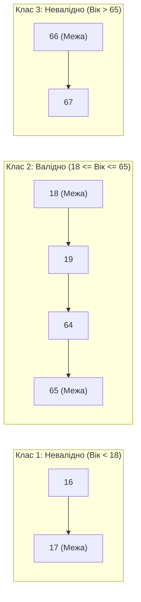

# Урок 95: Boundary Value Analysis (BVA) за допомогою AI: теорія 2-point / 3-point BVA та автоматизація тест-дизайну

## 1. Чому саме на межах діапазонів ховається 90% дефектів

**Аналіз граничних значень (Boundary Value Analysis / BVA)** — це класична техніка тест-дизайну чорної скриньки, заснована на тому факті, що більшість помилок у коді виникає на межах переходів між класами еквівалентності через неправильно обрані оператори порівняння (наприклад, `<` замість `<=`, або `>` замість `>=`).

---

## 2. Підходи до BVA: 2-Point BVA vs 3-Point BVA

1. **2-Point Boundary Value Analysis**:
   - Для кожної межі тестуються 2 точки: сама **Межа (Boundary / On-point)** та значення **Одразу за межею (Off-point)**.
   - Наприклад, для умови $X \ge 18$: точки `18` (On) та `17` (Off).
2. **3-Point Boundary Value Analysis**:
   - Тестуються 3 точки: **On-point** (сама межа), **Off-point** (точка за межею) та **In-point** (точка всередині дозволеного діапазону).
   - Забезпечує максимальну надійність для критичних фінансових та медичних систем.

---

## 3. Автоматизація BVA за допомогою AI

AI допомагає за мілісекунди будувати точні математичні таблиці граничних значень для складних багатовимірних умов:
- Границі довжини рядків (String length boundaries: 0, 1, 255, 256 символів).
- Числові діапазони та переповнення (Integer Overflow: $-2^{31}, 2^{31}-1$).
- Границі дат і часу (високосні роки, перехід на літній час, 23:59:59 -> 00:00:00).
- Границі розміру та кількості файлів (0 байт, 1 байт, 9.99 MB, 10.00 MB, 10.01 MB).
