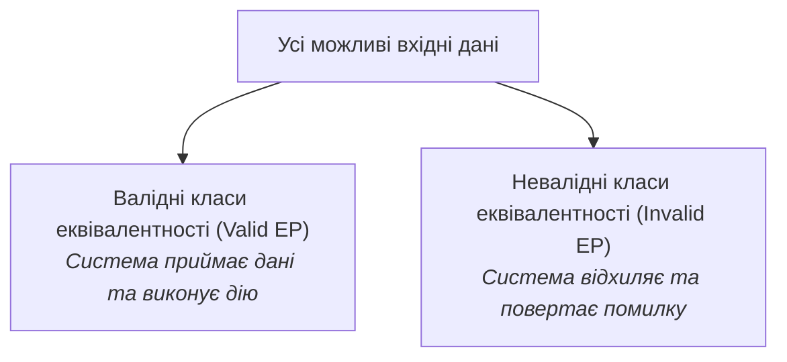

# Урок 96: Класи еквівалентності (Equivalence Partitioning) за допомогою AI: оптимізація тестового покриття

## 1. Концепція класів еквівалентності (Equivalence Partitioning / EP)

**Розбиття на класи еквівалентності (Equivalence Partitioning)** — це фундаментальна техніка тест-дизайну чорної скриньки, яка ділить увесь нескінченний масив можливих вхідних даних на групи (класи), де кожен елемент класу обробляється системою за однаковою бізнес-логікою і призводить до однакового результату.

Головна мета EP — **мінімізувати кількість тестів без втрати якості покриття**. Якщо діапазон від 18 до 65 років є валідним, достатньо взяти одне представницьке значення (наприклад, `30`), замість перевірки всіх 48 чисел окремо.

---

## 2. Правила виділення класів еквівалентності

1. **Якщо вимога задає діапазон значень (від 1 до 100)**:
   - 1 валідний клас: `1 <= X <= 100` (представник: `50`).
   - 2 невалідні класи: `X < 1` (представник: `-5`) та `X > 100` (представник: `150`).
2. **Якщо вимога задає множину значень (наприклад, статус замовлення)**:
   - Валідні класи: окремий клас для кожного дозволеного статусу (`NEW`, `PAID`, `CANCELLED`).
   - 1 невалідний клас: будь-який інший рядок (`UNKNOWN`, `123`).
3. **Якщо вимога задає формат (наприклад, Email)**:
   - 1 валідний клас: коректний email (`user@test.com`).
   - Невалідні класи: без символу `@`, без домену, подвійна крапка, пробіли, недозволені спецсимволи.

---

## 3. Синергія EP та AI: автоматична матриця покриття

Штучний інтелект миттєво проводить декомпозицію складних бізнес-правил на вичерпну таблицю класів еквівалентності, поєднуючи валідні та невалідні представницькі значення з технікою граничних значень (BVA).
