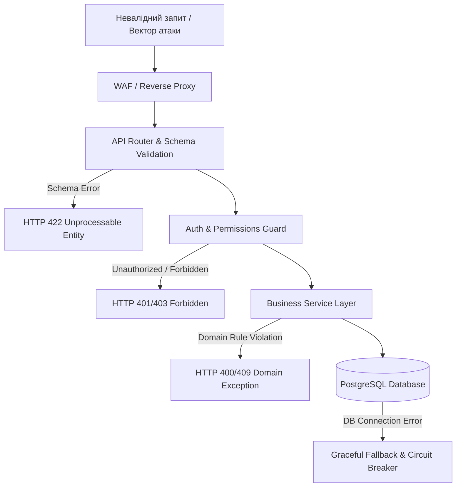
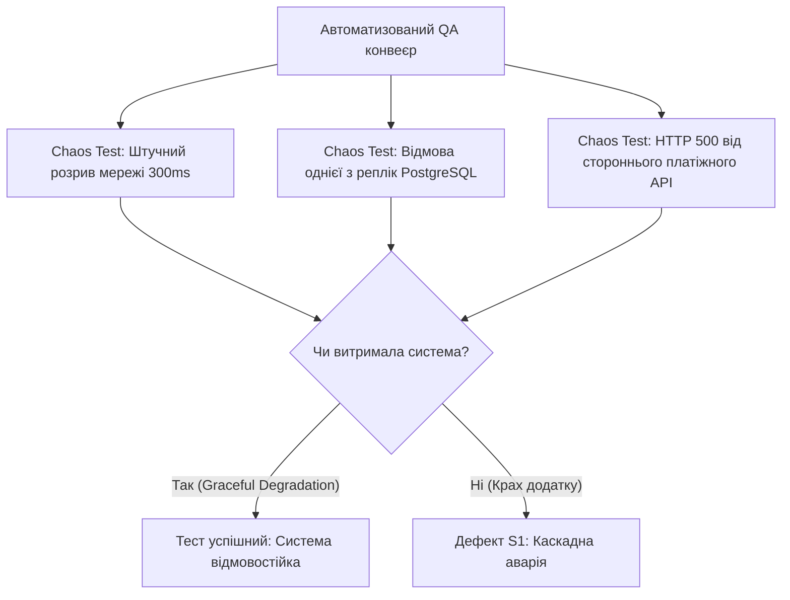

# Урок 96: Генерація негативних сценаріїв тестування за допомогою AI

## Вступ та теоретичний фундамент
Негативне тестування (Negative Testing / Error Handling Verification) — це процес перевірки здатності програмного забезпечення коректно реагувати на невалідні, неповні, шкідливі або неочікувані вхідні дані без аварійного завершення роботи (Crash Resistance). Якщо позитивні тести перевіряють, чи робить система те, для чого вона призначена, то негативні тести гарантують, що вона не робить того, чого робити не повинна.

Більшість катастрофічних збоїв у продакшені (витоки пам'яті, злами баз даних, компрометація сесій) стаються саме через недостатнє покриття негативними сценаріями.

Застосування AI дозволяє QA-команді:
1. **Змоделювати поведінку зловмисника (Adversarial Testing & Security Vectors)**: Генерація векторів атак SQL Injection, XSS, SSRF, IDOR, XML External Entity (XXE).
2. **Протестувати збої мережі та таймінги (Network Chaos & Timeouts)**: Сценарії обриву WebSocket-з'єднання, 429 Too Many Requests (Rate Limiting), HTTP 504 Gateway Timeout.
3. **Виявити розкриття чутливих даних у стек-трейсах (Information Disclosure)**: Перевірка, що система не повертає сирі системні помилки, паролі БД чи внутрішні IP-адреси у тілі відповіді.
4. **Перевірити цілісність стану транзакцій при відмові (Rollback Verification)**: Гарантія, що помилка на кроці N призводить до повного скасування змін у базі даних.

---

## 1. Архітектурні принципи та внутрішня механіка негативного тестування
Негативне тестування базується на концепції відмовостійкості (Resilience Architecture) та безпечної деградації сервісу (Graceful Degradation).

### 1.1. Таксономія негативних тестових векторів
- **Валідаційні помилки (Schema & Format Violations)**: Порушення типів даних, розмірів, регулярних виразів, відсутність обов'язкових полів.
- **Бізнес-конфлікти (Domain Constraint Violations)**: Спроба оплати простроченою картою, перевищення денного ліміту, списання коштів з заблокованого рахунку.
- **Авторизаційні збої (Auth & Access Control Violations)**: Маніпуляція JWT-токенами, спроба доступу до чужого ресурсу (IDOR), використання відкликаного токена.
- **Інфраструктурні збої (System & Hardware Faults)**: Переповнення диска, недоступність черги Redis, таймаут відповіді мікросервісу.




---

## 2. Методологічний базис: Матриця негативних сценаріїв для REST API
Порівняння типових негативних тестів, категорій атак та очікуваної реакції системи.


| Категорія негативного тесту | Приклад тестового вектору | Очікуваний HTTP статус | Вимога безпеки до відповіді |
| :--- | :--- | :--- | :--- |
| **SQL Injection** | `username = "admin' OR '1'='1"` | 400 Bad Request / 422 | Жодного виводу синтаксичних помилок SQL драйвера |
| **Broken Object Auth (IDOR)** | `GET /api/v1/orders/OTHER_USER_UUID` | 403 Forbidden / 404 Not Found | Заборонено розкривати наявність чужого ID у системі |
| **Rate Limit Spoilage** | 100 запитів за 1 секунду з одного IP | 429 Too Many Requests | Наявність заголовка `Retry-After: 60` |
| **Large Payload DoS** | Відправка 50MB JSON у полі коментаря | 413 Payload Too Large | Миттєве закриття з'єднання без зчитування в пам'ять |
| **Malformed JSON** | `{"user_id": 123,, "name": }` | 400 Bad Request | Стандартизований JSON RFC 7807 без витоку стектрейсу |

---

## 3. Практичний інженерний регламент: Промпт для генерації негативного сьюту
Еталонний промпт для збагачення тестового набору критичними негативними перевірками.


```markdown
# =====================================================================
# ПРОМПТ ДЛЯ AI: Генерація негативного тест-сьюту (OWASP + Resilience)
# =====================================================================

Ти — Senior Application Security Specialist та Lead QA Engineer.
Проаналізуй наступну специфікацію API ендпоінту:
"POST /api/v1/users/{user_id}/transfer
Body: { "recipient_account": str, "amount": float, "currency": str, "note": str }
Забезпечує переказ коштів між рахунками."

Згенеруй вичерпний список негативних та безпекових тест-кейсів за категоріями:
1. Маніпуляції з автентифікацією (Expired JWT, Tampered Signature, Missing Header).
2. Атаки на авторизацію (IDOR: user_id не належить поточному токену).
3. Граничні та невалідні суми (від'ємні числа, нуль, NaN, Infinity, екстремальні суми 10^18, дробові частки цента).
4. Ін'єкції та безпека (SQLi в полі note, Stored XSS, CRLF ін'єкції).
5. Стан гонки та повторне відправлення (Подвійний клік з однаковим ідентифікатором запиту).
6. Інфраструктурні збої (Таймаут банківського шлюзу, помилка фіксації транзакції).

Для кожного кейсу вкажи: Назву, Вхідний Payload, Очікуваний HTTP статус, Текст повідомлення про помилку та перевірку відсутності розкриття інформації.
```

---

## 4. Поглиблений аналіз виробничих кейсів, крайових випадків та антипатернів
Аналіз реальних катастрофічних збоїв через пропущені негативні тести.


### Кейс 1: Вразливість від'ємного переказу коштів (Negative Balance Exploit)
- **Дефект**: Ендпоінт переказу грошей перевіряв лише `sender.balance >= amount`, але не мав перевірки `amount > 0`.
- **Атака**: Зловмисник відправив `amount = -5000`. В результаті операції `sender.balance -= (-5000)` баланс зловмисника збільшився на $5000, а у жертви списалися гроші.
- **Виправлення**: Обов'язковий негативний тест на від'ємні значення та сувора Pydantic валідація `amount: Decimal = Field(gt=Decimal('0.00'))`.

### Кейс 2: Витік структури бази даних через необроблений виняток (Stack Trace Leak)
- **Дефект**: При передачі некоректного UUID сервер повертав HTML-сторінку з повним трейсом Django/SQLAlchemy, включаючи версію сервера та назви внутрішніх таблиць.
- **Виправлення**: Додавання глобального Exception Handler, що перехоплює всі необроблені помилки та повертає чистий JSON `{ "error": "Internal Server Error", "code": "ERR_INTERNAL" }`.

---

## 5. Покроковий операційний воркфлоу реалізації негативного тестування
Порядок побудови негативних перевірок у CI/CD пайплайні.


### Крок 1: Аналіз моделі загроз ендпоінту (Threat Modeling)
- Визначити критичність даних, які обробляє сервіс (фінанси, PII, паролі).

### Крок 2: Генерація негативних сценаріїв за допомогою AI
- Надіслати OpenAPI контракт з промптом безпекового аудиту.
- Отримати перелік негативних тестових векторів.

### Крок 3: Автоматизація перевірок у Pytest / REST Assured
- Написати параметризовані тести для відхилення невалідних запитів.

### Крок 4: Перевірка захисту від витоку даних (Information Disclosure Check)
- Налаштувати перевірку, що жодна відповідь не містить слів `Traceback`, `SQL`, `Exception`.

---

## 6. Стратегії підвищення надійності та захисту від атак
1. **Fuzz Testing & Chaos Engineering**: Застосування інструментів фаззінгу (Atheris, Schemathesis) для надсилання мільйонів спотворених запитів до API.
2. **Rate Limiting & DoS Protection**: Обов'язкова перевірка обмеження частоти запитів на рівні шлюзу (Kong, Cloudflare).
3. **Security Headers Verification**: Перевірка наявності заголовків `Content-Security-Policy`, `X-Content-Type-Options: nosniff`.

---

## 7. Вичерпний чек-лист перевірки та критерії готовності (Definition of Done)
Перед здачею завдань та інтеграцією результатів у виробничу гілку переконайтеся у виконанні наступних критеріїв:

- [ ] **Перевірено всі типи невалідних даних (невірний тип, відсутність поля, null)**
- [ ] **Протестовано від'ємні, нульові та екстремальні значення для всіх числових полів**
- [ ] **Проведено перевірку на базові вразливості OWASP (SQLi, XSS, IDOR, SSRF)**
- [ ] **Перевірено поведінку системи при відсутності або простроченні JWT токена**
- [ ] **Переконанося, що жодна помилка сервера (500) не розкриває стектрейс у відповіді**
- [ ] **Протестовано реакцію на перевищення ліміту частоти запитів (HTTP 429)**
- [ ] **Перевірено відкат транзакції в БД при виникненні збою в середині бізнес-процесу**
- [ ] **Створено автоматизований сьют негативних тестів у репозиторії**

---

## 8. Підсумки, ключові інсайти та розширений глосарій термінів
Опанування цієї теми формує надійний фундамент для щоденної професійної роботи. Системний підхід, формалізовані інженерні стандарти та критичний контроль результатів AI забезпечують високу швидкість та бездоганну надійність кінцевого продукту.

### Глосарій ключових понять
| Термін | Визначення та контекст застосування |
| :--- | :--- |
| **Negative Testing** | Процедура тестування системи за умов передачі невалідних, неочікуваних або некоректних даних. |
| **Graceful Degradation** | Здатність системи продовжувати функціонувати в обмеженому режимі у разі відмови частини компонентів. |
| **IDOR (Insecure Direct Object Reference)** | Вразливість, коли додаток надає прямий доступ до об'єктів на основі введеного користувачем ідентифікатора без перевірки прав. |
| **Rate Limiting** | Обмеження кількості мережевих запитів, які користувач може відправити за певний проміжок часу. |
| **Circuit Breaker** | Патерн проектування, що автоматично ізолює збійний сервіс і запобігає каскадним аваріям у мікросервісній системі. |
| **Chaos Engineering** | Дисципліна експериментування над системою у продакшені для перевірки її стійкості до раптових збоїв інфраструктури. |
| **Schemathesis** | Сучасний інструмент тестування API на основі OpenAPI схем та Property-Based Testing. |
| **Information Disclosure** | Дефект безпеки, при якому система розкриває конфіденційні внутрішні дані зловмиснику. |
| **WAF (Web Application Firewall)** | Захисний екран рівня додатків, що фільтрує та блокує шкідливий HTTP-трафік. |
| **Transaction Rollback** | Операція повернення бази даних до попереднього узгодженого стану у разі виникнення помилки. |

---

## 9. Поглиблений аналіз стратегій контролю якості та архітектури тестових стендів

### 9.1. Проектування ізольованих тестових середовищ (Ephemeral Environments)
Надійність тестування прямо залежить від чистоти та повторюваності тестового стенду:
1. **Dynamic Ephemeral Environments**: Створення тимчасового ізольованого оточення в Kubernetes для кожного Pull Request (Preview Apps). Після проходження тестів середовище повністю знищується, унеможливлюючи забруднення бази даних.
2. **Database Seeding & Fixture Factories**: Використання міграцій Alembic/Flyway та фабрик даних замість завантаження статичних SQL-дампів.
3. **Service Virtualization & Contract Testing**: Використання Pact / WireMock для емуляції відповідей сторонніх платіжних та логістичних шлюзів.

### 9.2. Матриця перевірки стійкості розподілених систем (Resilience Verification Matrix)



### 9.3. Розширений практичний кейс: Тестування узгодженості даних в умовах Eventual Consistency
- **Контекст**: У мікросервісній системі дані замовлення публікуються через Kafka у сервіс аналітики та сервіс доставки.
- **Проблема**: Тести перевіряли наявність запису в базі сервісу доставки одразу після створення і періодично падали (Flaky Test) через асинхронну затримку Kafka (50-200ms).
- **Виправлення**: Впровадження патерну `Polling Awaitility` з експоненціальним очікуванням замість статичного сну: `await_until(lambda: delivery_service.has_order(order_id), timeout=5, interval=0.1)`.

---

## 10. Питання для співбесіди та захист стратегії якості (Senior QA Lead Level)

1. **Як ви аргументуєте перед менеджментом необхідність скорочення кількості E2E UI тестів на користь API тестів?**
   *Еталонна відповідь*: Розрахунком вартості підтримки (ROI тестування) та часу прогону. UI тести на Playwright дорогі в підтримці, повільні (хвилини на сценарій) та схильні до мережевого флакання. API тести виконуються за мілісекунди, ізолюють бізнес-логіку та забезпечують 100% повторюваність при скороченні часу релізу в 10 разів.
2. **Як перевірити якість самих тестів, згенерованих AI?**
   *Еталонна відповідь*: За допомогою мутаційного тестування (Mutation Testing через `mutmut` або `Stryker`). Ми вносимо штучні зміни в код (заміна операторів, видалення викликів) і перевіряємо, чи впадуть тести. Якщо тест залишається зеленим — він є неефективним та містить тавтологічний асерт.
3. **Як організувати тестування продукту в умовах повної відсутності формальних вимог?**
   *Еталонна відповідь*: Застосування дослідницького тестування за сесіями (Session-Based Exploratory Testing) з фіксацією хартій тестування (Test Charters), відновленням вимог через реверс-інжиніринг з AI та створення характеристичних тестів (Characterization Tests).

---

## 11. Практичний регламент аудиту якості тестів та запобігання помилкам у тестових даних

### 11.1. Синтетичні тестові дані та безпека PII (Data Privacy & GDPR)
При створенні та генерації тестових даних за допомогою AI суворо дотримуйтеся правил конфіденційності:
1. **Повна анонімізація (Data Masking & Anonymization)**: Категорично заборонено копіювати реальні персональні дані клієнтів (номери телефонів, картки, паспорти, реальні email) з продакшн-бази на тестові стенди.
2. **Синтетична генерація (Faker + LLM)**: Створення реалістичних тестових масивів (валідна валідація IBAN, номери карток за алгоритмом Луна, тестові податкові номери) за допомогою бібліотеки `Faker` або ізольованих промптів.
3. **Граничні формати даних**: Обов'язкова перевірка підтримки рідкісних символів Unicode (апострофи в іменах O'Connor, подвійні прізвища через дефіс, спецсимволи та emoji у полях коментарів).

### 11.2. Метрики ефективності тестового процесу (QA KPIs & Quality Gates)
Для об'єктивного вимірювання якості роботи QA-інженера використовуються наступні ключові показники:
- **Defect Detection Percentage (DDP)**: Відсоток дефектів, знайдених командою тестування до релізу (цільовий показник > 95%).
- **Defect Escape Rate**: Кількість багів, пропущених у продакшн (цільовий показник < 5%).
- **Test Automation ROI**: Економія людино-годин на ручну регресію після впровадження автотестів.
- **Mean Time to Detect (MTTD)**: Середній час від моменту появи багу в коді до його виявлення автотестом.
