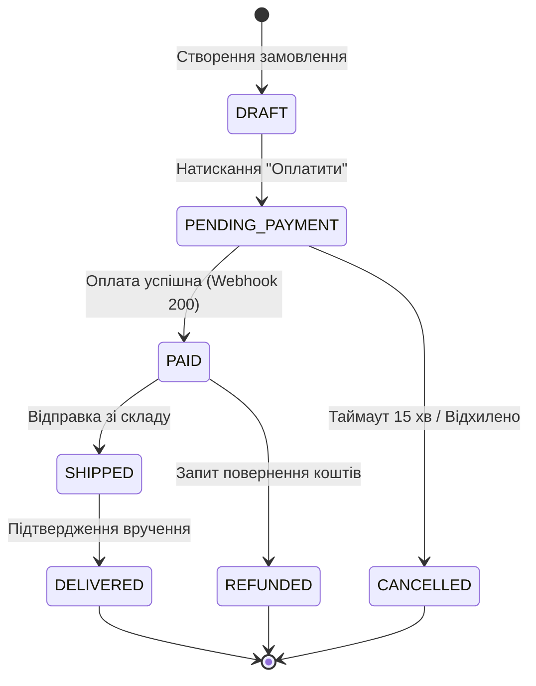

# Урок 97: Таблиці прийняття рішень (Decision Tables) та діаграми переходів станів (State Transition) за допомогою AI

## 1. Комбінаторна бізнес-логіка: коли простих тестів недостатньо

У складних системах (страхування, розрахунок кредитів, логістика, кошик покупок) результат операції залежить не від одного поля, а від **комбінації багатьох булевих умов** (Conditions) та початкового **стану системи** (State).

Дві ключові техніки чорної скриньки для таких систем:
1. **Таблиці прийняття рішень (Decision Tables)**: Моделюють взаємодію вхідних умов і дій (Actions).
2. **Тестування переходів станів (State Transition Testing)**: Моделює життєвий цикл сутності (State Machine) та реакцію на події (Events).

---

## 2. Побудова таблиць прийняття рішень (Decision Table / Cause-Effect)

Структура Decision Table:
- **Умови (Conditions)**: Булеві змінні ($T/F$). Наприклад: *Чи є підписка Pro? Чи сума > 1000 грн? Чи діє акція?*
- **Дії (Actions / Outcomes)**: Що робить система. Наприклад: *Безкоштовна доставка, Знижка 15%, Подарунок*.
- **Правила (Rules / Columns)**: Повні комбінації $2^N$ варіантів з наступною оптимізацією (згортанням однакових гілок `Don't Care` / `-`).

---

## 3. Автоматизація State Machine та Decision Tables за допомогою AI

AI допомагає:
1. Витягнути логіку з текстового опису ТЗ та згенерувати повну **Decision Table** у форматі Markdown.
2. Побудувати діаграму переходів станів у синтаксисі **Mermaid `stateDiagram-v2`**.
3. Згенерувати тести для **недозволених переходів** (Invalid State Transitions) — наприклад, спроба перевести замовлення зі статусу `CANCELLED` прямо в `SHIPPED`.
