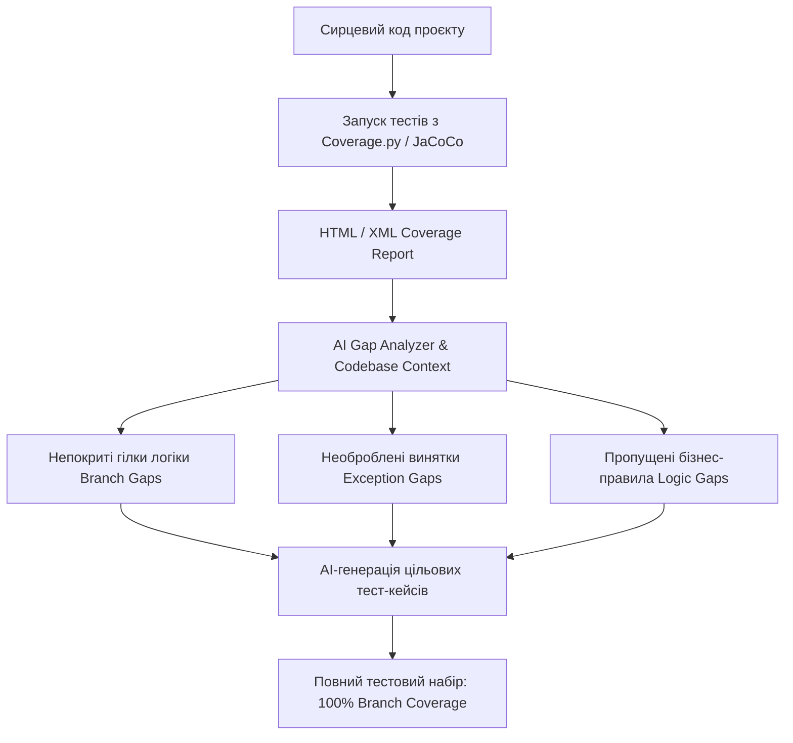
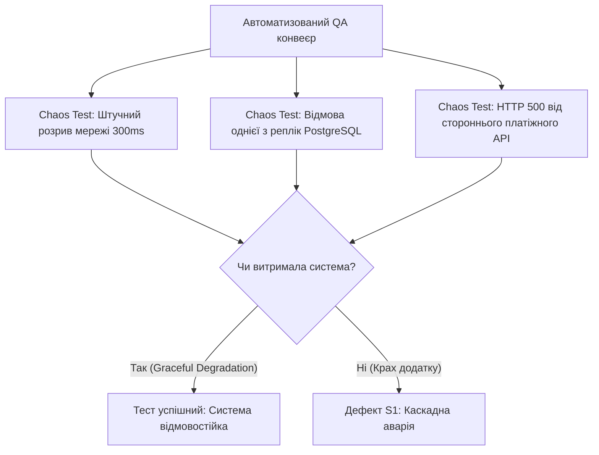

# Урок 97: Пошук прогалин у тестовому покритті

## Вступ та теоретичний фундамент
Аналіз та усунення прогалин у тестовому покритті (Test Gap Analysis & Coverage Optimization) — це критичний процес забезпечення якості, спрямований на виявлення неперевірених фрагментів коду, забутих користувацьких сценаріїв та неврахованих інтеграційних точок. Високий відсоток формального покриття рядків коду (Line Coverage) нерідко створює оманливе відчуття безпеки: тести можуть виконувати 95% рядків, але не перевіряти жодного реального бізнес-інваріанта або крайового стану (Branch / Logic Coverage Gap).

Сучасні генеративні моделі здатні виконати глибокий семантичний аудит репозиторію:
1. **Зіставляти сирцевий код з тестовими сьютами (Code-to-Test Mapping)**: Виявляти непокриті умови `else`, необроблені доменні винятки та пропущені стани кінцевих автоматів (State Machines).
2. **Проводити аудит комбінаторного покриття (Branch & Decision Audit)**: Знаходити складні логічні вирази (`if (A and B) or (C and not D)`), для яких протестовано лише один варіант істинності.
3. **Виявляти розриви у матриці трасованості (Traceability Gaps)**: Знаходити функціональні вимоги, для яких відсутні автоматичні тести в CI/CD.
4. **Генерувати точкові відсутні тест-кейси (Targeted Test Infill)**: Створювати код тестів безпосередньо для 'червоних' ділянок звіту покриття `coverage.py` або `JaCoCo`.

У цьому уроці детально розглядаються методики пошуку сліпих зон за допомогою AI, аналіз мутаційного покриття та побудова процесу безперервного покращення тестів.

---

## 1. Архітектурні принципи та метрики оцінки тестового покриття
Для об'єктивної оцінки якості тестів використовуються метрики різного рівня глибини:
- **Line / Statement Coverage**: Відсоток виконаних рядків коду. (Найслабша метрика).
- **Branch / Decision Coverage**: Відсоток перевірених переходів у розгалуженнях `if/switch`.
- **Condition / MC/DC Coverage (Modified Condition/Decision Coverage)**: Перевірка незалежного впливу кожної окремої умови на результат виразу.
- **Mutation Score**: Відсоток штучно внесених дефектів (мутацій), виявлених тестовим набором.




---

## 2. Методологічний базис: Порівняння підходів до вимірювання покриття
Порівняльний аналіз глибини різних метрик тестування.


| Метрика покриття | Що вимірює | Рівень виявлення прихованих багів | Складність досягнення |
| :--- | :--- | :--- | :--- |
| **Line Coverage** | Чи виконувався рядок коду хоча б раз | Низький (пропускає неперевірені гілки) | Легко досягти (80-90%) |
| **Branch Coverage** | Чи пройдено всі шляхи `True` та `False` для кожного `if` | Високий (гарантує перевірку всіх розгалужень) | Середня (вимагає точних даних) |
| **Mutation Testing** | Чи падають тести при зміні операторів (`+` на `-`, `>` на `>=`)| Найвищий (оцінює якість самих перевірок `assert`)| Висока (вимагає обчислювальних ресурсів) |
| **Requirements Coverage** | Зв'язок між User Stories та автоматизованими тестами | Оцінює бізнес-повноту системи | Середня (потребує RTM матриці) |

---

## 3. Практичний інженерний регламент: Промпт для виявлення прогалин у коді
Професійний промпт для аналізу функції та створення відсутніх перевірок.


```markdown
# =====================================================================
# ПРОМПТ ДЛЯ AI: Аудит тестових прогалин та генерація відсутніх тестів
# =====================================================================

Ти — Principal QA Engineer та експерт з Mutation Testing.
Ось код сервісу розрахунку доставки:
[ВСТАВИТИ СИРЦЕВИЙ КОД ФУНКЦІЇ]

Ось існуючий файл тестів:
[ВСТАВИТИ ІСНУЮЧИЙ TEST_SUITE.PY]

Виконай комплексний Gap-аналіз:
1. Знайди всі логічні розгалуження (if, elif, else, ternary), які жодного разу не виконуються в існуючих тестах.
2. Вияви граничні умови (BVA), які пропущені в асертах.
3. Знайди потенційні винятки, які можуть бути викинуті, але не перевіряються через `pytest.raises`.
4. Згенеруй додаткові тести на Pytest, які закриють виявлені прогалини і забезпечать 100% Branch Coverage.
```

---

## 4. Поглиблений аналіз виробничих кейсів, крайових випадків та антипатернів
Розглянемо практичні інциденти, викликані ілюзією високого покриття.


### Кейс 1: Антипатерн "Тести без асертів" (The Assertion-Free Illusion)
- **Проблема**: Тест виконував функцію `calculate_taxes()`, генеруючи 100% Line Coverage, але не мав жодного `assert result == expected`.
- **Наслідок**: Під час зміни логіки функція почала повертати `None`, але тест продовжував проходити 'зеленим', приховавши падіння білінгу.
- **Виправлення**: Застосування мутаційного тестування (`mutmut run`), яке миттєво виявило, що мутації у функції не вбивають тести (0% Mutation Score).

### Кейс 2: Пропущена гілка повернення кешу (Cache Invalidation Gap)
- **Проблема**: Тести покривали отримання даних із бази, але жоден тест не перевіряв шлях отримання з Redis при повторному запиті.
- **Наслідок**: У продакшені кеш повертав застарілі дані з некоректним форматом серіалізації.
- **Виправлення**: Додавання обов'язкових тестів для перевірки обох станів: Cache Miss та Cache Hit.

---

## 5. Покроковий операційний воркфлоу ліквідації тестових прогалин
Регламент роботи інженера для досягнення максимального тестового покриття.


### Крок 1: Генерація звіту про покриття з аналізом гілок
- Виконати: `pytest --cov=app --cov-report=html --cov-branch tests/`.
- Відкрити `htmlcov/index.html` та знайти файли з найнижчим відсотком Branch Coverage.

### Крок 2: Локалізація червоних рядків (Missing Lines & Branches)
- Виділити фрагменти коду, позначені червоним кольором (невиконані гілки).

### Крок 3: Запуск AI для генерації цільових тестів (Targeted Test Generation)
- Передати виділені фрагменти в AI з вимогою написати тести, що досягають саме цих рядків.

### Крок 4: Повторний запуск та підтвердження закриття прогалини
- Запустити тест: переконатися у досягненні цільового показника (> 90% Branch Coverage).

---

## 6. Стратегії підвищення якості тестів та інструменти автоматизації
1. **CI/CD Coverage Gate**: Встановлення порогу падіння збірки: `--cov-fail-under=90` у GitHub Actions.
2. **Mutation Testing Pipeline**: Регулярний нічний запуск `mutmut` для критичних доменних модулів.
3. **Automated PR Diff Coverage**: Використання сервісів на кшталт Codecov для перевірки, що новий код у Pull Request покритий на 100%.

---

## 7. Вичерпний чек-лист перевірки та критерії готовності (Definition of Done)
Перед здачею завдань та інтеграцією результатів у виробничу гілку переконайтеся у виконанні наступних критеріїв:

- [ ] **Згенеровано звіт Branch Coverage для всього проєкту**
- [ ] **Виявлено та проаналізовано всі непокриті гілки `if/else` та винятки**
- [ ] **Ліквідовано всі тести без асертів (Assertion-Free Tests)**
- [ ] **Проведено мутаційне тестування ключових модулів бізнес-логіки**
- [ ] **Покриття гілок нового коду в Pull Request становить не менше 95%**
- [ ] **Всі доменні винятки покриті перевірками `pytest.raises()`**
- [ ] **Налаштовано автоматичний контроль порогу покриття в CI/CD**
- [ ] **Оновлено матрицю трасованості вимог (RTM)**

---

## 8. Підсумки, ключові інсайти та розширений глосарій термінів
Опанування цієї теми формує надійний фундамент для щоденної професійної роботи. Системний підхід, формалізовані інженерні стандарти та критичний контроль результатів AI забезпечують високу швидкість та бездоганну надійність кінцевого продукту.

### Глосарій ключових понять
| Термін | Визначення та контекст застосування |
| :--- | :--- |
| **Test Gap Analysis** | Процес систематичного виявлення ділянок кодової бази або бізнес-вимог, що не мають достатнього тестового покриття. |
| **Branch Coverage** | Метрика оцінки якості тестів, що показує відсоток виконаних логічних розгалужень у програмі. |
| **Mutation Testing** | Метод оцінки якості тестового набору шляхом внесення дрібних дефектів (мутацій) та перевірки реакції тестів. |
| **Mutation Score** | Відношення кількості виявлених мутацій ('вбитих мутантів') до загальної кількості згенерованих мутацій. |
| **Line Coverage** | Базова метрика тестування, що фіксує сам факт виконання кожного рядка сирцевого коду. |
| **MC/DC Coverage** | Модифіковане покриття умов та рішень, що вимагає доведення незалежного впливу кожної умови на фінальний результат. |
| **Mutmut** | Популярний фреймворк для мутаційного тестування коду на Python. |
| **Codecov** | Хмарна платформа для аналізу та візуалізації тестового покриття у Pull Requests. |
| **Assertion** | Спеціальне твердження у коді тесту, що перевіряє рівність фактичного та очікуваного результату. |
| **Cache Invalidation** | Процес видалення або оновлення застарілих даних у кеші для підтримки актуальності стану. |

---

## 9. Поглиблений аналіз стратегій контролю якості та архітектури тестових стендів

### 9.1. Проектування ізольованих тестових середовищ (Ephemeral Environments)
Надійність тестування прямо залежить від чистоти та повторюваності тестового стенду:
1. **Dynamic Ephemeral Environments**: Створення тимчасового ізольованого оточення в Kubernetes для кожного Pull Request (Preview Apps). Після проходження тестів середовище повністю знищується, унеможливлюючи забруднення бази даних.
2. **Database Seeding & Fixture Factories**: Використання міграцій Alembic/Flyway та фабрик даних замість завантаження статичних SQL-дампів.
3. **Service Virtualization & Contract Testing**: Використання Pact / WireMock для емуляції відповідей сторонніх платіжних та логістичних шлюзів.

### 9.2. Матриця перевірки стійкості розподілених систем (Resilience Verification Matrix)



### 9.3. Розширений практичний кейс: Тестування узгодженості даних в умовах Eventual Consistency
- **Контекст**: У мікросервісній системі дані замовлення публікуються через Kafka у сервіс аналітики та сервіс доставки.
- **Проблема**: Тести перевіряли наявність запису в базі сервісу доставки одразу після створення і періодично падали (Flaky Test) через асинхронну затримку Kafka (50-200ms).
- **Виправлення**: Впровадження патерну `Polling Awaitility` з експоненціальним очікуванням замість статичного сну: `await_until(lambda: delivery_service.has_order(order_id), timeout=5, interval=0.1)`.

---

## 10. Питання для співбесіди та захист стратегії якості (Senior QA Lead Level)

1. **Як ви аргументуєте перед менеджментом необхідність скорочення кількості E2E UI тестів на користь API тестів?**
   *Еталонна відповідь*: Розрахунком вартості підтримки (ROI тестування) та часу прогону. UI тести на Playwright дорогі в підтримці, повільні (хвилини на сценарій) та схильні до мережевого флакання. API тести виконуються за мілісекунди, ізолюють бізнес-логіку та забезпечують 100% повторюваність при скороченні часу релізу в 10 разів.
2. **Як перевірити якість самих тестів, згенерованих AI?**
   *Еталонна відповідь*: За допомогою мутаційного тестування (Mutation Testing через `mutmut` або `Stryker`). Ми вносимо штучні зміни в код (заміна операторів, видалення викликів) і перевіряємо, чи впадуть тести. Якщо тест залишається зеленим — він є неефективним та містить тавтологічний асерт.
3. **Як організувати тестування продукту в умовах повної відсутності формальних вимог?**
   *Еталонна відповідь*: Застосування дослідницького тестування за сесіями (Session-Based Exploratory Testing) з фіксацією хартій тестування (Test Charters), відновленням вимог через реверс-інжиніринг з AI та створення характеристичних тестів (Characterization Tests).

---

## 11. Практичний регламент аудиту якості тестів та запобігання помилкам у тестових даних

### 11.1. Синтетичні тестові дані та безпека PII (Data Privacy & GDPR)
При створенні та генерації тестових даних за допомогою AI суворо дотримуйтеся правил конфіденційності:
1. **Повна анонімізація (Data Masking & Anonymization)**: Категорично заборонено копіювати реальні персональні дані клієнтів (номери телефонів, картки, паспорти, реальні email) з продакшн-бази на тестові стенди.
2. **Синтетична генерація (Faker + LLM)**: Створення реалістичних тестових масивів (валідна валідація IBAN, номери карток за алгоритмом Луна, тестові податкові номери) за допомогою бібліотеки `Faker` або ізольованих промптів.
3. **Граничні формати даних**: Обов'язкова перевірка підтримки рідкісних символів Unicode (апострофи в іменах O'Connor, подвійні прізвища через дефіс, спецсимволи та emoji у полях коментарів).

### 11.2. Метрики ефективності тестового процесу (QA KPIs & Quality Gates)
Для об'єктивного вимірювання якості роботи QA-інженера використовуються наступні ключові показники:
- **Defect Detection Percentage (DDP)**: Відсоток дефектів, знайдених командою тестування до релізу (цільовий показник > 95%).
- **Defect Escape Rate**: Кількість багів, пропущених у продакшн (цільовий показник < 5%).
- **Test Automation ROI**: Економія людино-годин на ручну регресію після впровадження автотестів.
- **Mean Time to Detect (MTTD)**: Середній час від моменту появи багу в коді до його виявлення автотестом.
