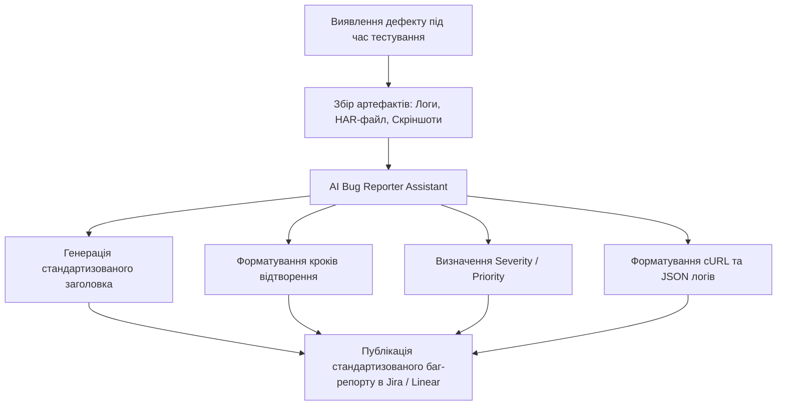
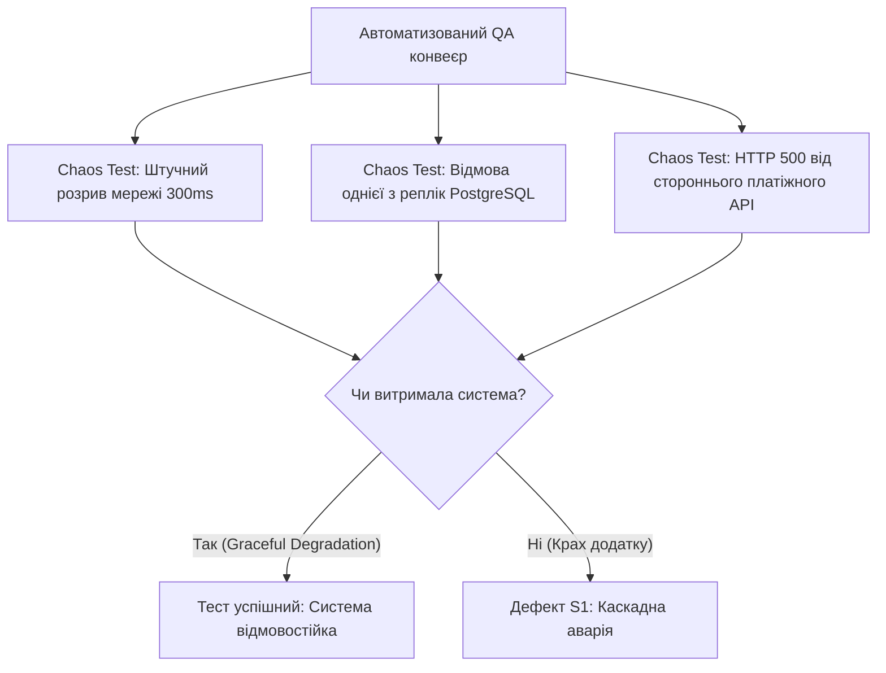

# Урок 98: Документування знайдених дефектів за допомогою AI

## Вступ та теоретичний фундамент
Складання якісних, вичерпних та структурованих баг-репортів (Defect Reporting & Bug Tracking) є однією з ключових компетенцій інженера з якості. Неякісний баг-репорт з розмитим описом, відсутністю кроків відтворення або неповними логами призводить до повернення тікета зі статусом 'Cannot Reproduce', марнування годин робочого часу розробників та затримки релізу продукту.

Штучний інтелект кардинально прискорює та стандартизує процес документування дефектів завдяки:
1. **Автоматичному формуванню інформативних заголовків (Concise Bug Title Formulation)**: Складання заголовка за стандартом 'Що? Де? Коли/За яких умов?' (What? Where? When?).
2. **Структуризації кроків відтворення (Step-by-Step Reconstruction)**: Перетворення сирих логів дій користувача або відеозапису на чіткі нумеровані кроки.
3. **Виділенню істотних діагностичних даних**: Автоматичне форматування стектрейсів, curl-запитів, JSON-відповідей та оточення (Environment Info).
4. **Об'єктивній оцінці критичності та пріоритету (Severity vs Priority Matrix)**: Аналіз бізнес-впливу дефекту для коректного вибору рівнів Blocker, Critical, Major чи Minor.

У цьому уроці ви опануєте інженерні стандарти складання баг-репортів та навчитеся використовувати AI для миттєвої генерації професійних тікетів у Jira, GitHub Issues та Linear.

---

## 1. Архітектурні принципи та анатомія еталонного баг-репорту
Професійний баг-репорт повинен містити вичерпний набір атрибутів, що дозволяють розробнику локалізувати та виправити дефект без додаткових уточнюючих питань.

### 1.1. Обов'язкові компоненти структури баг-репорту
- **Title (Заголовок)**: Чіткий опис проблеми за формулою `[Компонент] Що сталося + За яких умов`.
- **Environment (Середовище)**: OS, браузер/пристрій, версія збірки (Build Version), URL або ендпоінт.
- **Preconditions (Передумови)**: Стан тестових акаунтів, наявність коштів, права доступу.
- **Steps to Reproduce (Кроки для відтворення)**: Покрокова послідовність дій (1, 2, 3...).
- **Expected Result (Очікуваний результат)**: Поведінка згідно з вимогами/дизайном.
- **Actual Result (Фактичний результат)**: Що реально сталося (з точним кодом помилки).
- **Diagnostics & Artifacts**: Стектрейси, cURL запити, мережеві логи, скріншоти.




---

## 2. Методологічний базис: Матриця градації Severity та Priority
Розмежування технічної критичності дефекту (Severity) та черговості його виправлення бізнесом (Priority).


| Рівень Severity | Опис технічного впливу | Приклад дефекту | Типовий рівень Priority |
| :--- | :--- | :--- | :--- |
| **S1: Blocker** | Повний крах системи, блокування релізу, неможливість оплати | HTTP 500 на чекауті для всіх користувачів | P1: Immediate (Виправити зараз) |
| **S2: Critical** | Критична функція не працює, але існує складний обхідний шлях (Workaround) | Оплата карткою Visa падає, але працює MasterPass | P1: High (Виправити в поточному спринті) |
| **S3: Major** | Порушення бізнес-логіки, що не блокує основний потік дій | Некоректний розрахунок накопичувальних бонусів | P2: Medium (Запланувати в наступний спринт) |
| **S4: Minor** | Дрібні візуальні дефекти, помилки верстки, друкарські помилки | Зсув логотипу на 2px, одрук у тексті кнопки | P3: Low (Виправити при нагоді) |

---

## 3. Практичний інженерний регламент: Еталонний згенерований Jira баг-репорт
Приклад високоякісного баг-репорту, згенерованого AI на основі сирих логів помилки.


```markdown
# [Checkout][API] HTTP 500 Internal Server Error при спробі оплати з від'ємною знижкою

## 1. Загальна інформація
- **Проєкт**: E-Commerce Core API
- **Компонент**: Billing & Payment Gateway
- **Версія збірки**: `v2.14.0-rc3` (Commit `8a7f9b2`)
- **Середовище**: Staging (https://staging-api.shop.com)
- **Severity**: S2 (Critical) | **Priority**: P1 (High)

---

## 2. Передумови (Preconditions)
1. Користувач авторизований під акаунтом `qa_tester_01@test.com`.
2. У кошику знаходиться 1 товар вартістю 1000.00 UAH.
3. До акаунту прив'язана валідна тестова картка Stripe.

---

## 3. Кроки для відтворення (Steps to Reproduce)
1. Відправити запит на створення транзакції оплати з передачею промокоду з від'ємною знижкою:
   - Ендпоінт: `POST /api/v1/checkout/pay`
2. Передати JSON payload:
```json
{
  "order_id": "9b1deb4d-3b7d-4bad-9bdd-2b0d7b3dcb6d",
  "payment_method": "STRIPE",
  "discount_override": -150.00
}
```
3. Проаналізувати відповідь сервера та статус-код.

---

## 4. Очікуваний результат (Expected Result)
- Сервер повертає статус `HTTP 422 Unprocessable Entity` з детальним описом валідації:
```json
{
  "error": "Validation Error",
  "field": "discount_override",
  "message": "Знижка не може бути від'ємним числом"
}
```

---

## 5. Фактичний результат (Actual Result)
- Сервер повертає `HTTP 500 Internal Server Error`.
- У логах Sentry фіксується неперехоплений виняток `ValueError: Invalid charge amount -150.00` у модулі `stripe_adapter.py:42`.

---

## 6. Діагностичні матеріали (Diagnostics)
<details>
<summary>Повний cURL запит для відтворення</summary>

```bash
curl -X POST "https://staging-api.shop.com/api/v1/checkout/pay"      -H "Authorization: Bearer eyJhbGciOi..."      -H "Content-Type: application/json"      -d '{"order_id":"9b1deb4d-3b7d-4bad-9bdd-2b0d7b3dcb6d","payment_method":"STRIPE","discount_override":-150.00}'
```
</details>
```

---

## 4. Поглиблений аналіз виробничих кейсів, крайових випадків та антипатернів
Розглянемо типові помилки при створенні баг-репортів.


### Кейс 1: Антипатерн "Заголовок без контексту" (The Vague Bug Summary)
- **Поганий заголовок**: "Кнопка оплати не працює".
- **Наслідок**: Розробник відкрив головну сторінку, натиснув кнопку — все працює, тікет закрито як 'Cannot Reproduce'.
- **Виправлення з AI**: Заголовок змінено на: "[iOS App][Cart] Кнопка 'Оплатити' стає неактивною при виборі адреси доставки з двома апострофами".

### Кейс 2: Відсутність даних середовища (Missing Environment Info)
- **Проблема**: Дефект проявлявся виключно у браузері Safari на iOS 17 через специфіку роботи WebKit flexbox. Тестувальник не вказав пристрій.
- **Наслідок**: Розробник тестував у Chrome на Windows і витратив 4 години на марні пошуки.

---

## 5. Покроковий операційний воркфлоу документування багів
Стандартний алгоритм фіксації дефектів за допомогою AI-асистента.


### Крок 1: Локалізація та мінімізація кроків (Defect Isolation)
- Перевірити, чи відтворюється баг стабільно (100% Repro Rate).
- Відсікти зайві дії, залишивши мінімальну кількість кроків.

### Крок 2: Збір логів та артефактів
- Скопіювати cURL запит із вкладки Network браузера.
- Зробити скріншот або запис екрана (Loom/CleanShot).

### Крок 3: Генерація опису тікета через AI
- Надіслати cURL та опис поведінки в AI з вимогою сформувати тікет за стандартом Jira Markdown.

### Крок 4: Фінальна валідація та публікація в трекері
- Перевірити коректність згенерованого опису та опублікувати в Jira/Linear.

---

## 6. Стратегії автоматизації інтеграції з баг-трекерами
1. **AI Bug Triage Automation**: Автоматичне призначення відповідальної команди та міток (Labels) на основі тексту дефекту.
2. **Duplicate Bug Detection**: Використання векторного пошуку для перевірки, чи не був цей баг уже зареєстрований іншим тестувальником.
3. **Automated Retest Playbooks**: Генерація скриптів автоматичної повторної перевірки після закриття тікета розробником.

---

## 7. Вичерпний чек-лист перевірки та критерії готовності (Definition of Done)
Перед здачею завдань та інтеграцією результатів у виробничу гілку переконайтеся у виконанні наступних критеріїв:

- [ ] **Заголовок баг-репорту чітко відповідає формулі 'Що? Де? За яких умов?'**
- [ ] **Вказано точне середовище, версію збірки та конфігурацію тестового стенду**
- [ ] **Описано стан тестового акаунту в передумовах (Preconditions)**
- [ ] **Кроки відтворення є атомарними, нумерованими та мінімально необхідними**
- [ ] **Чітко розмежовано Очікуваний результат (Expected) та Фактичний результат (Actual)**
- [ ] **Додано точний cURL запит або повний стектрейс із системи моніторингу**
- [ ] **Об'єктивно встановлено рівні Severity та Priority відповідно до бізнес-впливу**
- [ ] **Тікет зареєстровано у корпоративному баг-трекері (Jira/Linear)**

---

## 8. Підсумки, ключові інсайти та розширений глосарій термінів
Опанування цієї теми формує надійний фундамент для щоденної професійної роботи. Системний підхід, формалізовані інженерні стандарти та критичний контроль результатів AI забезпечують високу швидкість та бездоганну надійність кінцевого продукту.

### Глосарій ключових понять
| Термін | Визначення та контекст застосування |
| :--- | :--- |
| **Bug Report** | Формальний технічний документ, що описує виявлений дефект у програмному забезпеченні з інструкціями для його відтворення. |
| **Severity** | Атрибут дефекту, що визначає ступінь його технічного впливу на працездатність та безпеку системи. |
| **Priority** | Атрибут дефекту, що визначає черговість та терміновість його виправлення з точки зору бізнес-цілей. |
| **Preconditions** | Умови та початковий стан системи, які обов'язково мають бути виконані перед початком відтворення дефекту. |
| **Reproduction Rate** | Відсоток успішних повторень виникнення дефекту при повторенні описаної послідовності кроків. |
| **cURL** | Утиліта командного рядка та бібліотека для передачі даних за мережевими протоколами (HTTP/HTTPS/WS). |
| **Workaround** | Тимчасовий обхідний шлях або метод вирішення проблеми, що дозволяє користувачеві продовжити роботу до виправлення бага. |
| **Bug Triage** | Процес колективного аналізу, пріоритизації та розподілу нових зареєстрованих дефектів між розробниками. |
| **Duplicate Bug** | Повторно заведений баг-репорт, що описує вже відомий та раніше зафіксований дефект. |
| **Linear** | Сучасна швидкісна система управління завданнями та відстеження дефектів для інженерних команд. |

---

## 9. Поглиблений аналіз стратегій контролю якості та архітектури тестових стендів

### 9.1. Проектування ізольованих тестових середовищ (Ephemeral Environments)
Надійність тестування прямо залежить від чистоти та повторюваності тестового стенду:
1. **Dynamic Ephemeral Environments**: Створення тимчасового ізольованого оточення в Kubernetes для кожного Pull Request (Preview Apps). Після проходження тестів середовище повністю знищується, унеможливлюючи забруднення бази даних.
2. **Database Seeding & Fixture Factories**: Використання міграцій Alembic/Flyway та фабрик даних замість завантаження статичних SQL-дампів.
3. **Service Virtualization & Contract Testing**: Використання Pact / WireMock для емуляції відповідей сторонніх платіжних та логістичних шлюзів.

### 9.2. Матриця перевірки стійкості розподілених систем (Resilience Verification Matrix)



### 9.3. Розширений практичний кейс: Тестування узгодженості даних в умовах Eventual Consistency
- **Контекст**: У мікросервісній системі дані замовлення публікуються через Kafka у сервіс аналітики та сервіс доставки.
- **Проблема**: Тести перевіряли наявність запису в базі сервісу доставки одразу після створення і періодично падали (Flaky Test) через асинхронну затримку Kafka (50-200ms).
- **Виправлення**: Впровадження патерну `Polling Awaitility` з експоненціальним очікуванням замість статичного сну: `await_until(lambda: delivery_service.has_order(order_id), timeout=5, interval=0.1)`.

---

## 10. Питання для співбесіди та захист стратегії якості (Senior QA Lead Level)

1. **Як ви аргументуєте перед менеджментом необхідність скорочення кількості E2E UI тестів на користь API тестів?**
   *Еталонна відповідь*: Розрахунком вартості підтримки (ROI тестування) та часу прогону. UI тести на Playwright дорогі в підтримці, повільні (хвилини на сценарій) та схильні до мережевого флакання. API тести виконуються за мілісекунди, ізолюють бізнес-логіку та забезпечують 100% повторюваність при скороченні часу релізу в 10 разів.
2. **Як перевірити якість самих тестів, згенерованих AI?**
   *Еталонна відповідь*: За допомогою мутаційного тестування (Mutation Testing через `mutmut` або `Stryker`). Ми вносимо штучні зміни в код (заміна операторів, видалення викликів) і перевіряємо, чи впадуть тести. Якщо тест залишається зеленим — він є неефективним та містить тавтологічний асерт.
3. **Як організувати тестування продукту в умовах повної відсутності формальних вимог?**
   *Еталонна відповідь*: Застосування дослідницького тестування за сесіями (Session-Based Exploratory Testing) з фіксацією хартій тестування (Test Charters), відновленням вимог через реверс-інжиніринг з AI та створення характеристичних тестів (Characterization Tests).

---

## 11. Практичний регламент аудиту якості тестів та запобігання помилкам у тестових даних

### 11.1. Синтетичні тестові дані та безпека PII (Data Privacy & GDPR)
При створенні та генерації тестових даних за допомогою AI суворо дотримуйтеся правил конфіденційності:
1. **Повна анонімізація (Data Masking & Anonymization)**: Категорично заборонено копіювати реальні персональні дані клієнтів (номери телефонів, картки, паспорти, реальні email) з продакшн-бази на тестові стенди.
2. **Синтетична генерація (Faker + LLM)**: Створення реалістичних тестових масивів (валідна валідація IBAN, номери карток за алгоритмом Луна, тестові податкові номери) за допомогою бібліотеки `Faker` або ізольованих промптів.
3. **Граничні формати даних**: Обов'язкова перевірка підтримки рідкісних символів Unicode (апострофи в іменах O'Connor, подвійні прізвища через дефіс, спецсимволи та emoji у полях коментарів).

### 11.2. Метрики ефективності тестового процесу (QA KPIs & Quality Gates)
Для об'єктивного вимірювання якості роботи QA-інженера використовуються наступні ключові показники:
- **Defect Detection Percentage (DDP)**: Відсоток дефектів, знайдених командою тестування до релізу (цільовий показник > 95%).
- **Defect Escape Rate**: Кількість багів, пропущених у продакшн (цільовий показник < 5%).
- **Test Automation ROI**: Економія людино-годин на ручну регресію після впровадження автотестів.
- **Mean Time to Detect (MTTD)**: Середній час від моменту появи багу в коді до його виявлення автотестом.
