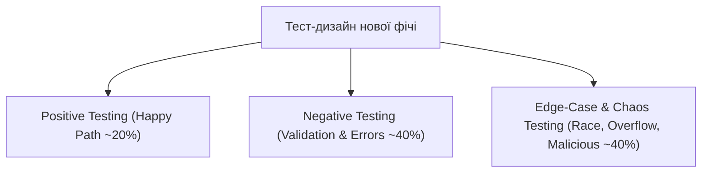

# Урок 98: Негативні та edge-case сценарії за допомогою AI: деструктивне тестування та відмовостійкість

## 1. Філософія деструктивного тестування (Break the System Mindset)

Позитивне тестування перевіряє: *«Чи робить система те, що повинна робити?»*.  
Негативне та Edge-case тестування перевіряє: **«Чи не робить система те, чого вона робити не повинна, і чи зберігає вона стабільність у разі непередбачених дій?»**.

До 80% критичних вразливостей та падінь систем у продакшені відбуваються саме на **Edge Cases** (крайових випадках) — екстремальних, малоймовірних або ворожих комбінаціях умов.

---

## 2. Класифікація крайових випадків (Edge Cases Taxonomy)

1. **Конкурентність та гонитва станів (Concurrency & Race Conditions)**:
   - Одночасний клік по кнопці «Оплатити» з двох вкладок браузера в одну мілісекунду.
   - Спроба двох покупців купити останній 1 екземпляр товару на складі одночасно.
2. **Мережеві збої та нестабільність (Network Chaos)**:
   - Обрив Wi-Fi з'єднання прямо під час відправки POST-запиту оплати.
   - Дублювання пакетів (Packet Duplication), повільний інтернет (High Latency / Slow 3G).
3. **Екстремальні дані та атаки (Malicious & Extreme Inputs)**:
   - JSON-бомби (вкладеність у 1000 рівнів), наддовгі рядки (100,000 символів).
   - SQL Injection, XSS, нульові байти (`\x00`), Unicode-аномалії.
4. **Ресурсні обмеження (Resource Exhaustion)**:
   - Переповнення дискового простору, закінчення пулу з'єднань з БД (Connection Pool Starvation).

---

## 3. Генерація деструктивних сценаріїв за допомогою AI (Chaos Prompting)

AI виступає в ролі «Злого тестувальника» (Evil QA Persona), моделюючи найнеймовірніші сценарії зламу та відмови системи, які зазвичай випадають із поля зору розробників.
