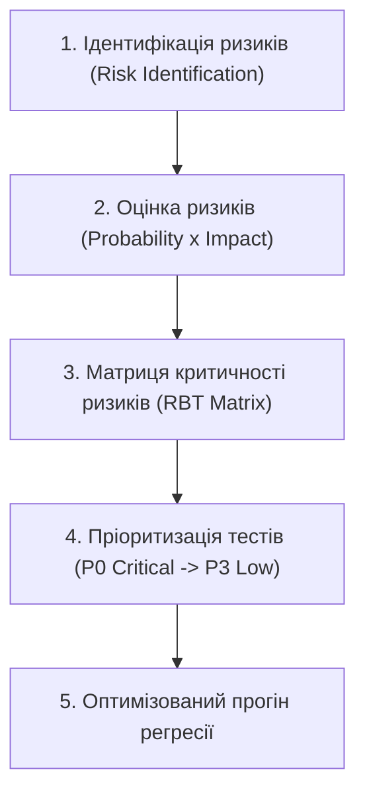

# Урок 99: Тестування на основі ризиків (Risk-Based Testing / RBT) з AI-підтримкою: матриці ризиків та оптимізація регресії

## 1. Концепція Risk-Based Testing: тестувати найважливіше за обмежений час

У реальному житті IT-проєктів ніколи не буває достатньо часу, щоб протестувати «абсолютно все на 100%». Завжди є дедлайни, тиск бізнесу на швидкий реліз та обмежені ресурси команди.

**Тестування на основі ризиків (Risk-Based Testing / RBT)** — це стратегічний підхід, який організовує, пріоритизує та спрямовує зусилля тестування на ті модулі, де ймовірність виникнення дефекту та його негативний вплив на бізнес є найвищими.

---

## 2. Формула оцінки ризику (Risk Exposure)

$$\text{Рівень ризику (Risk Exposure)} = \text{Ймовірність збою (Likelihood)} \times \text{Вплив на бізнес (Impact)}$$

1. **Ймовірність дефекту (Likelihood / Probability)** (шкала 1–5):
   - Складність коду та архітектури.
   - Новизна технології або велика кількість змін у цьому релізі.
   - Історична баговитість модуля (Code Churn).
2. **Вплив на бізнес (Impact / Severity)** (шкала 1–5):
   - Прямі фінансові втрати при збої.
   - Юридичні штрафи та блокування регуляторами (GDPR, PCI-DSS).
   - Репутаційний удар та відтік користувачів (Churn).

---

## 3. Матриця пріоритетів тестування за рівнями ризику

| Ризик (Risk Exposure) | Рівень тестування | Стратегія тестування |
| :--- | :--- | :--- |
| **20 – 25 (Критичний)** | **P0 (Smoke / Blocker)** | 100% автоматизація, обов'язковий регресійний прогін при кожному PR, негативні та edge-case тести, ручний exploratory контроль. |
| **12 – 19 (Високий)** | **P1 (Critical Regression)** | Автоматизація API/UI, перевірка основних та граничних сценаріїв перед кожним релізом. |
| **6 – 11 (Середній)** | **P2 (Normal)** | Базове тестування валідних класів еквівалентності при наявності часу. |
| **1 – 5 (Низький)** | **P3 (Low / Ad-hoc)** | Поверхневе тестування або відкладання на пост-релізний період. |

---

## 4. Використання AI для динамічного ризик-аналізу змін коду

AI аналізує Git Diff пул-реквесту та підказує QA інженеру:
- Які суміжні сервіси можуть неявно зламатися від внесених змін (Impact Analysis).
- Які саме тести з велетенського регресійного набору треба запустити в першу чергу (Smart Test Selection).
