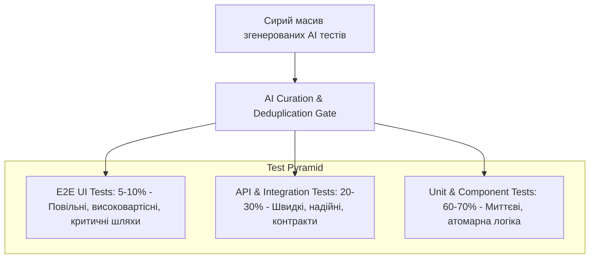
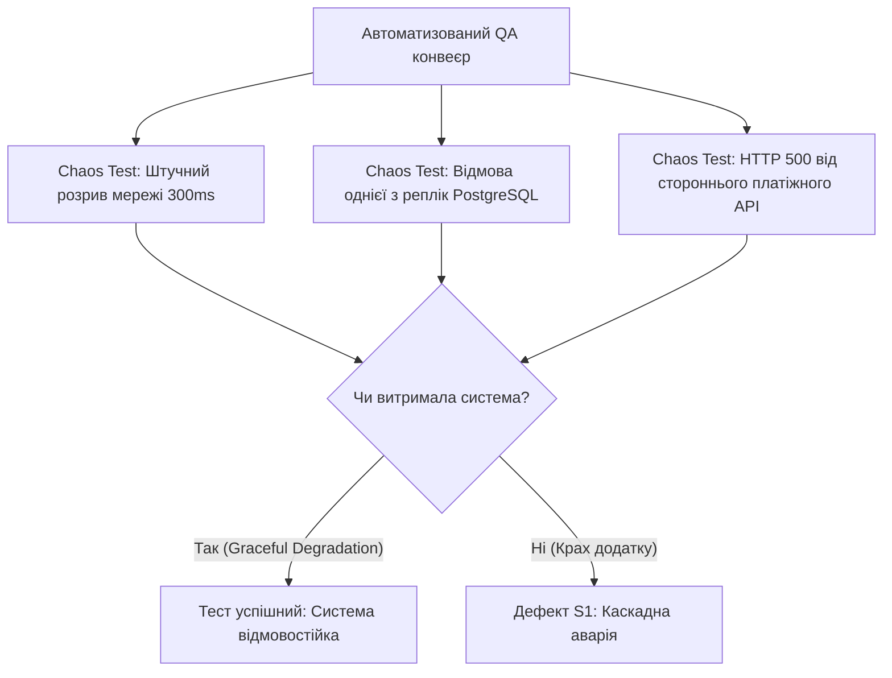

# Урок 99: Валідація та пріоритизація AI-генерованих тест-кейсів

## Вступ та теоретичний фундамент
Штучний інтелект здатний за лічені секунди згенерувати сотні тест-кейсів для будь-якої функціональності. Проте без системної валідації та пріоритизації цей обсяг перетворюється на 'інформаційний шум' (Test Suite Bloat): надлишкові однотипні перевірки збільшують час прогону регресії, споживають пам'ять та ресурси інфраструктури, не підвищуючи при цьому реальної якості продукту.

Дисципліна валідації та пріоритизації AI-згенерованих тестів (Test Suite Curation & Prioritization) передбачає:
1. **Фільтрацію галюцинацій та нездійсненних умов (Feasibility Filtering)**: Виявлення тестів, що описують неіснуючі поля API або суперечать бізнес-правилам.
2. **Усунення надлишковості та дублювання (Deduplication & Orthogonality)**: Об'єднання схожих перевірок у параметризовані матриці.
3. **Пріоритизацію за моделлю оцінки бізнес-ризику (Risk-Based Prioritization)**: Класифікація тестів за рівнями P0 (Smoke / Blocking), P1 (Critical Business Path), P2 (Major Functional), P3 (Edge & Minor UI).
4. **Оптимізацію тестової піраміди (Test Pyramid Optimization)**: Розподіл згенерованих сценаріїв між рівнями Unit, API/Integration та E2E UI.

У цьому уроці ви опануєте інженерні фреймворки валідації AI-тестів, методики оптимізації тестових сьютів та побудову збалансованого тестового покриття.

---

## 1. Архітектурні принципи побудови збалансованої тестової піраміди
Ефективна стратегія тестування вимагає розміщення тестів на правильних архітектурних рівнях згідно з класичною пірамідою тестування Майка Кона (The Test Pyramid).




---

## 2. Методологічний базис: Матриця пріоритизації тестових сценаріїв
Класифікація тест-кейсів за рівнями пріоритету та частотою виконання в CI/CD конвеєрі.


| Рівень пріоритету | Критерій відбору | Частота виконання | Допустимий час прогону |
| :--- | :--- | :--- | :--- |
| **P0: Smoke / Blocker** | Основні потоки життєдіяльності додатку (Login, Checkout, Pay) | Кожен комміт / PR | < 2 хвилин |
| **P1: Critical Path** | Ключові бізнес-функції, робота з фінансами, безпека, PII | Кожен Pull Request | < 5-10 хвилин |
| **P2: Extended Regression** | Всі граничні умови (BVA), обробка винятків, інтеграції | Нічний білд (Nightly) | < 30-45 хвилин |
| **P3: Minor / Exploratory** | Рідкісні крайові випадки, косметичні перевірки, локалізація | Перед мажорним релізом | За потребою |

---

## 3. Практичний інженерний регламент: Промпт для валідації та пріоритизації тестового набору
Професійний промпт для очищення та структурування згенерованого набору тест-кейсів.


```markdown
# =====================================================================
# ПРОМПТ ДЛЯ AI: Валідація, дедуплікація та пріоритизація тест-сьюту
# =====================================================================

Ти — Principal QA Architect.
Ось невідфільтрований перелік з 30 тест-кейсів, згенерованих для модуля підписок:
[ВСТАВИТИ СИРИЙ ПЕРЕЛІК ТЕСТ-КЕЙСІВ]

Виконай професійну обробку та оптимізацію набору:
1. **Deduplication**: Об'єднай однотипні тести валідації полів у єдині параметризовані таблиці (Data-Driven Test Tables).
2. **Hallucination Check**: Видали перевірки, що базуються на вигаданих або нереалістичних передумовах.
3. **Pyramid Allocation**: Розподіли тести за рівнями: Unit (бізнес-правила), API Integration (контракти ендпоінтів), UI E2E (наскрізний потік користувача).
4. **Prioritization**: Присвой кожному кейсу рівень P0, P1, P2 або P3 з детальним обґрунтуванням бізнес-ризику.

Сформуй фінальну матрицю тестового покриття у структурованому Markdown форматі.
```

---

## 4. Поглиблений аналіз виробничих кейсів, крайових випадків та антипатернів
Аналіз типових проблем, пов'язаних із надмірною кількістю невалідованих тестів.


### Кейс 1: "Test Flakiness & Bloat" через надлишок UI E2E тестів
- **Проблема**: AI згенерував 150 UI тестів на Playwright для перевірки кожного поля форми. Час виконання зріс до 2.5 годин, а 15% тестів постійно падали через мережеві затримки (Flaky Tests).
- **Виправлення**: 130 тестів валідації перенесено на рівень швидких Unit-тестів схем Pydantic (виконуються за 0.5 сек), на рівні UI залишено лише 5 наскрізних сценаріїв.

### Кейс 2: Пропуск критичного бізнес-шляху через неправильний пріоритет
- **Проблема**: Тест перевірки повернення коштів (Refund) було позначено як P3, і він не запускався у щоденному CI пайплайні.
- **Наслідок**: Реліз з багом у модулі повернень вийшов у продакшн і заблокував роботу служби підтримки на три дні.

---

## 5. Покроковий операційний воркфлоу оптимізації тестового сьюту
Послідовність дій для підтримки чистоти та актуальності тестового набору.


### Крок 1: Збір згенерованих сценаріїв та аудит реалістичності
- Перевірити відповідність кожного сценарію актуальній бізнес-специфікації.

### Крок 2: Параметризація однотипних перевірок
- Перетворити розрізнені негативні кейси на параметризовані таблиці.

### Крок 3: Розподіл по тестових люках (Smoke, Regression, Nightly)
- Додати відповідні мітки (pytest marks: `@pytest.mark.smoke`, `@pytest.mark.regression`).

### Крок 4: Моніторинг часу виконання та стабільності (Flakiness Tracking)
- Видаляти або стабілізувати ненадійні тести за допомогою інструментів аналітики CI/CD.

---

## 6. Стратегії підвищення ефективності тестового конвеєра
1. **Parallel Test Execution**: Розпаралелювання прогону тестів за допомогою `pytest-xdist` на N ядер CPU.
2. **Selective Test Execution (Test Impact Analysis)**: Запуск лише тих тестів, які покривають безпосередньо змінений у Pull Request код.
3. **Automated Quarantine for Flaky Tests**: Автоматична ізоляція нестабільних тестів для запобігання блокування релізів.

---

## 7. Вичерпний чек-лист перевірки та критерії готовності (Definition of Done)
Перед здачею завдань та інтеграцією результатів у виробничу гілку переконайтеся у виконанні наступних критеріїв:

- [ ] **Всі згенеровані тести перевірені на відсутність галюцинацій та нездійсненних передумов**
- [ ] **Однотипні перевірки валідації об'єднані у параметризовані тестові набори**
- [ ] **Тести чітко розподілені за рівнями тестової піраміди (Unit, API, UI)**
- [ ] **Кожному тесту присвоєно пріоритет (P0, P1, P2, P3) на основі оцінки ризику**
- [ ] **Smoke-сьют (P0) виконується менш ніж за 2 хвилини**
- [ ] **Налаштовано теги та мітки для вибіркового запуску тестів у CI/CD**
- [ ] **Відсутні ненадійні (Flaky) тести, що періодично падають без зміни коду**
- [ ] **Тестовий набір затверджено провідним інженером з якості (QA Lead)**

---

## 8. Підсумки, ключові інсайти та розширений глосарій термінів
Опанування цієї теми формує надійний фундамент для щоденної професійної роботи. Системний підхід, формалізовані інженерні стандарти та критичний контроль результатів AI забезпечують високу швидкість та бездоганну надійність кінцевого продукту.

### Глосарій ключових понять
| Термін | Визначення та контекст застосування |
| :--- | :--- |
| **Test Prioritization** | Методологія ранжування тестових сценаріїв за їхньою важливістю та критичністю для виконання у конвеєрі перевірки. |
| **Test Pyramid** | Концептуальна модель, що визначає оптимальне співвідношення кількості Unit, Integration та UI тестів у проєкті. |
| **Flaky Test** | Автоматизований тест, який демонструє як успішне, так і збійне виконання на одному й тому самому коді без внесення змін. |
| **Smoke Testing** | Мінімальний набір критичних перевірок, що запускається на початку для визначення базової працездатності збірки. |
| **Pytest-xdist** | Плагін для тестового фреймворку Pytest, що забезпечує паралельне виконання тестів на кількох процесах. |
| **Test Impact Analysis (TIA)** | Технологія визначення мінімально необхідного набору тестів для запуску на основі аналізу змінених файлів у Git diff. |
| **Data-Driven Testing** | Підхід до тестування, при якому логіка перевірки відокремлена від великої таблиці тестових даних. |
| **Test Suite Bloat** | Надмірне розростання тестового набору за рахунок дублюючих або неефективних тестів, що сповільнює розробку. |
| **Risk-Based Testing** | Стратегія тестування, що пріоритизує перевірки відповідно до ймовірності та тяжкості наслідків потенційного збою. |
| **Orthogonal Testing** | Принцип проектування незалежних тестів, що перевіряють окремі ізольовані параметри без взаємного перекриття. |

---

## 9. Поглиблений аналіз стратегій контролю якості та архітектури тестових стендів

### 9.1. Проектування ізольованих тестових середовищ (Ephemeral Environments)
Надійність тестування прямо залежить від чистоти та повторюваності тестового стенду:
1. **Dynamic Ephemeral Environments**: Створення тимчасового ізольованого оточення в Kubernetes для кожного Pull Request (Preview Apps). Після проходження тестів середовище повністю знищується, унеможливлюючи забруднення бази даних.
2. **Database Seeding & Fixture Factories**: Використання міграцій Alembic/Flyway та фабрик даних замість завантаження статичних SQL-дампів.
3. **Service Virtualization & Contract Testing**: Використання Pact / WireMock для емуляції відповідей сторонніх платіжних та логістичних шлюзів.

### 9.2. Матриця перевірки стійкості розподілених систем (Resilience Verification Matrix)



### 9.3. Розширений практичний кейс: Тестування узгодженості даних в умовах Eventual Consistency
- **Контекст**: У мікросервісній системі дані замовлення публікуються через Kafka у сервіс аналітики та сервіс доставки.
- **Проблема**: Тести перевіряли наявність запису в базі сервісу доставки одразу після створення і періодично падали (Flaky Test) через асинхронну затримку Kafka (50-200ms).
- **Виправлення**: Впровадження патерну `Polling Awaitility` з експоненціальним очікуванням замість статичного сну: `await_until(lambda: delivery_service.has_order(order_id), timeout=5, interval=0.1)`.

---

## 10. Питання для співбесіди та захист стратегії якості (Senior QA Lead Level)

1. **Як ви аргументуєте перед менеджментом необхідність скорочення кількості E2E UI тестів на користь API тестів?**
   *Еталонна відповідь*: Розрахунком вартості підтримки (ROI тестування) та часу прогону. UI тести на Playwright дорогі в підтримці, повільні (хвилини на сценарій) та схильні до мережевого флакання. API тести виконуються за мілісекунди, ізолюють бізнес-логіку та забезпечують 100% повторюваність при скороченні часу релізу в 10 разів.
2. **Як перевірити якість самих тестів, згенерованих AI?**
   *Еталонна відповідь*: За допомогою мутаційного тестування (Mutation Testing через `mutmut` або `Stryker`). Ми вносимо штучні зміни в код (заміна операторів, видалення викликів) і перевіряємо, чи впадуть тести. Якщо тест залишається зеленим — він є неефективним та містить тавтологічний асерт.
3. **Як організувати тестування продукту в умовах повної відсутності формальних вимог?**
   *Еталонна відповідь*: Застосування дослідницького тестування за сесіями (Session-Based Exploratory Testing) з фіксацією хартій тестування (Test Charters), відновленням вимог через реверс-інжиніринг з AI та створення характеристичних тестів (Characterization Tests).

---

## 11. Практичний регламент аудиту якості тестів та запобігання помилкам у тестових даних

### 11.1. Синтетичні тестові дані та безпека PII (Data Privacy & GDPR)
При створенні та генерації тестових даних за допомогою AI суворо дотримуйтеся правил конфіденційності:
1. **Повна анонімізація (Data Masking & Anonymization)**: Категорично заборонено копіювати реальні персональні дані клієнтів (номери телефонів, картки, паспорти, реальні email) з продакшн-бази на тестові стенди.
2. **Синтетична генерація (Faker + LLM)**: Створення реалістичних тестових масивів (валідна валідація IBAN, номери карток за алгоритмом Луна, тестові податкові номери) за допомогою бібліотеки `Faker` або ізольованих промптів.
3. **Граничні формати даних**: Обов'язкова перевірка підтримки рідкісних символів Unicode (апострофи в іменах O'Connor, подвійні прізвища через дефіс, спецсимволи та emoji у полях коментарів).

### 11.2. Метрики ефективності тестового процесу (QA KPIs & Quality Gates)
Для об'єктивного вимірювання якості роботи QA-інженера використовуються наступні ключові показники:
- **Defect Detection Percentage (DDP)**: Відсоток дефектів, знайдених командою тестування до релізу (цільовий показник > 95%).
- **Defect Escape Rate**: Кількість багів, пропущених у продакшн (цільовий показник < 5%).
- **Test Automation ROI**: Економія людино-годин на ручну регресію після впровадження автотестів.
- **Mean Time to Detect (MTTD)**: Середній час від моменту появи багу в коді до його виявлення автотестом.
