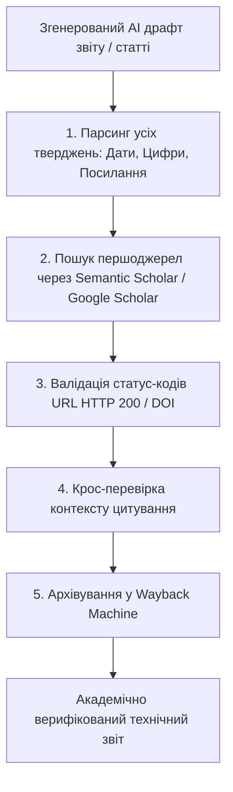
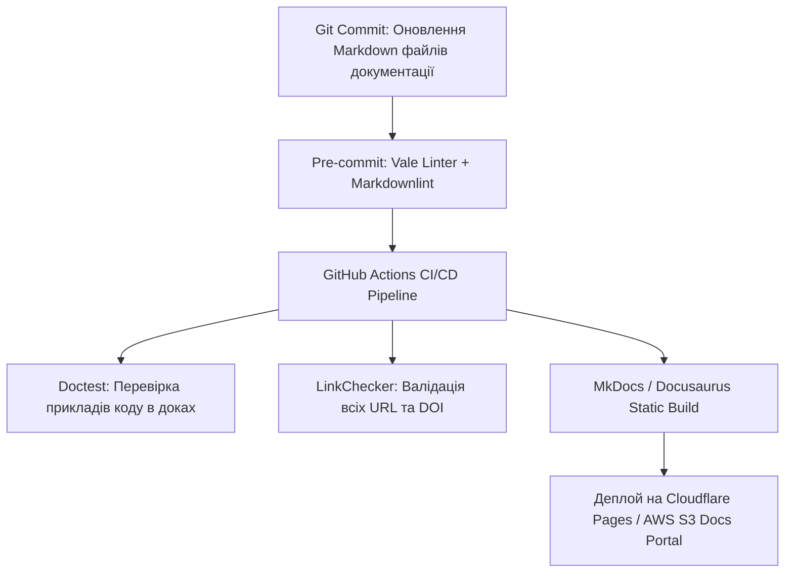

# Урок 112: Перевірка фактів, цитат, посилань і статистичних даних

## Вступ та теоретичний фундамент
У епоху генеративного контенту технічний письменник та дослідник (Technical Writer & Research Analyst) перетворюється з простого укладача текстів на висококваліфікованого верифікатора інформації (Information Verification & Fact-Checking Specialist). Мовні моделі схильні до створення надзвичайно переконливих, граматично бездоганних, але повністю вигаданих фактів, псевдонаукових статистичних даних, спотворених цитат та неіснуючих URL-посилань (Dead & Phantom Links).

Професійна дисципліна перевірки фактів (Fact-Checking & Source Verification) спирається на чотири обов'язкові протоколи:
1. **Первинна верифікація першоджерел (Primary Source Tracing)**: Будь-яка статистична цифра, відсоток чи дата повинні бути протрасовані до офіційного наукового звіту, урядової публікації або рецензованої статті (Peer-Reviewed Paper).
2. **Аудит посилань на доступність та збереженість (Link Health & Permalinks)**: Перевірка працездатності URL (HTTP 200), захист від 'гниття посилань' (Link Rot) через архівування у Wayback Machine (archive.org) та використання DOI (Digital Object Identifier).
3. **Контроль коректності цитування (Verbatim & Context Integrity)**: Зіставлення цитованого фрагмента з оригінальним абзацом автора для уникнення виривання з контексту (Quote Mining).
4. **Статистичний аудит вибірки та методології**: Перевірка розміру вибірки, похибки дослідження (p-value, довірчий інтервал) перед публікацією голослівних тверджень.

У цьому уроці ви опануєте системний протокол фактчекінгу, інструменти автоматизації перевірки посилань та правила роботи з AI-асистентами для підготовки науково достовірних звітів.

---

## 1. Архітектурні принципи та методологія фактчекінгу в технічній документації
Процес верифікації даних будується за принципом 'Нульової довіри' (Zero Trust Fact-Checking Architecture). Жоден факт, згенерований мовною моделлю, не може вважатися істинним без незалежного підтвердження двома авторитетними джерелами.




---

## 2. Методологічний базис: Ієрархія авторитетності джерел (Hierarchy of Evidence)
Класифікація інформаційних джерел за рівнем надійності та академічної ваги.


| Рівень авторитетності | Типи джерел | Коли обов'язково використовувати | Чому не можна замінити іншим |
| :--- | :--- | :--- | :--- |
| **Рівень 1 (Золотий стандарт)** | Peer-reviewed наукові журнали (Nature, IEEE, ACM), офіційні стандарти (ISO, W3C, RFC) | Технічні специфікації, наукові звіти, Whitepapers | Проходять незалежне рецензування експертами |
| **Рівень 2 (Високий)** | Офіційні звіти урядів (NIST, Eurostat), фінансова звітність публічних компаній (SEC 10-K) | Статистика ринку, макроекономіка, комплайєнс | Юридична відповідальність за неправдиві дані |
| **Рівень 3 (Помірний)** | Корпоративна інженерна документація (AWS Docs, Microsoft Learn), галузеві аналітичні звіти (Gartner) | Інженерні гайди, інструкції користувача | Може містити маркетингове забарвлення |
| **Рівень 4 (Низький / Недопустимий)** | Пости в блогах Medium, Wikipedia, повідомлення на форумах Reddit, відповіді в ChatGPT | Категорично заборонено як єдине джерело фактів | Висока ймовірність помилок, відсутність редакційного контролю |

---

## 3. Практичний інженерний регламент: Промпт для глибокого фактчекінгу та перевірки цитат
Професійний промпт для аудиту чернетки статті та виявлення непідтверджених тверджень.


```markdown
# =====================================================================
# ПРОМПТ ДЛЯ AI: Комплексний фактчекінг, аудит посилань та цитувань
# =====================================================================

Ти — Lead Fact-Checker та науковий редактор видання рівня IEEE Software.
Ось чернетка аналітичного звіту щодо безпеки хмарних технологій:
[ВСТАВИТИ ТЕКСТ ЗВІТУ]

Виконай суворий аудит матеріалу:
1. **Fact Extraction Table**: Склади таблицю всіх фактичних тверджень:
   | Твердження | Наведена цифра/дата | Чи є пряме джерело? | Рівень ризику (High/Med/Low) |
2. **Citation Verification**: Перевір кожну цитату на наявність автора, року та точного контексту. Вияви ознаки спотворення сенсу.
3. **URL & DOI Integrity**: Перевір наявність ідентифікаторів DOI для всіх наукових посилань. Познач підозрілі або вигадані URL.
4. **Vague Claims Flags**: Вияви розмиті фрази-узагальнення ("Більшість експертів вважає", "Дослідження довели", "Як усім відомо") та перетвори їх на точні твердження з посиланнями або вимагай видалення.
```

---

## 4. Поглиблений аналіз виробничих кейсів, крайових випадків та антипатернів
Аналіз реальних репутаційних втрат через неперевірені дані.


### Кейс 1: Галюцинація судових прецедентів (The Mata v. Avianca Incident)
- **Проблема**: Юристи використали ChatGPT для підготовки судового позову. Модель згенерувала 6 переконливих судових рішень з номерами справ та цитатами суддів, які виявилися повністю вигаданими.
- **Наслідок**: Судові санкції проти адвокатів, публічна дискредитація та штрафи.
- **Виправлення**: Правило обов'язкової ручної перевірки кожного прецеденту/посилання у державних реєстрах або базах Scopus/PubMed.

### Кейс 2: Проблема "Гниття посилань" (Link Rot) у Whitepaper
- **Проблема**: У звіті було вказано 40 посилань на зовнішні веб-сайти. Через рік 18 з них повертали помилку HTTP 404.
- **Виправлення**: Обов'язкове збереження всіх веб-джерел в архіві archive.org та додавання архівного посилання поруч з оригінальним.

---

## 5. Покроковий операційний воркфлоу проведення фактчекінгу
Стандартна операційна процедура технічного дослідника.


### Крок 1: Екстракція всіх числових даних та тверджень
- За допомогою скрипту або AI виділити всі цифри, відсотки, роки та імена.

### Крок 2: Пошук оригінальних PDF-звітів через академічні бази
- Знайти першоджерело у Semantic Scholar, Google Scholar або arXiv.

### Крок 3: Перевірка статус-коду посилань (HTTP Status Check)
- Запустити автоматичний скрипт валідації посилань: linkchecker report.html.

### Крок 4: Фіксація пермалінків в Internet Archive
- Зберегти кожну веб-сторінку у Wayback Machine (Save Page Now).

---

## 6. Стратегії автоматизації контролю достовірності матеріалів
1. **Automated Broken Link CI Gate**: Включення лінкерів у GitHub Actions для автоматичної перевірки працездатності всіх URL у документації.
2. **DOI Validation APIs**: Автоматичне звернення до CrossRef API для підтвердження існування наукових статей.
3. **Plagiarism & AI Detector Audit**: Перевірка оригінальності тексту через Turnitin / Grammarly перед фінальною версткою.

---

## 7. Вичерпний чек-лист перевірки та критерії готовності (Definition of Done)
Перед здачею завдань та інтеграцією результатів у виробничу гілку переконайтеся у виконанні наступних критеріїв:

- [ ] **Кожна статистична цифра та відсоток підтверджені посиланням на першоджерело**
- [ ] **Всі наукові статті містять валідні цифрові ідентифікатори DOI**
- [ ] **Всі веб-посилання перевірені на статус HTTP 200 та не містять битих редиректів**
- [ ] **Критичні веб-джерела заархівовані у Wayback Machine (Internet Archive)**
- [ ] **Цитати звірені з оригінальним текстом авторів без спотворення контексту**
- [ ] **Ліквідовано всі маніпулятивні узагальнення ('всі знають', 'вчені довели')**
- [ ] **Звіт пройшов перевірку на академічну доброчесність та плагіат**
- [ ] **Фінальний документ затверджено провідним технічним редактором**

---

## 8. Підсумки, ключові інсайти та розширений глосарій термінів
Опанування цієї теми формує надійний фундамент для щоденної професійної роботи. Системний підхід, формалізовані інженерні стандарти та критичний контроль результатів AI забезпечують високу швидкість та бездоганну надійність кінцевого продукту.

### Глосарій ключових понять
| Термін | Визначення та контекст застосування |
| :--- | :--- |
| **Fact-Checking** | Процес перевірки фактичної достовірності інформації, наведеної у тексті, перед його публікацією. |
| **DOI (Digital Object Identifier)** | Унікальний постійний цифровий ідентифікатор наукового документа в мережі Інтернет. |
| **Link Rot** | Процес поступової втрати працездатності гіперпосилань через зміну структури сайтів або видалення сторінок (HTTP 404). |
| **Wayback Machine** | Цифровий архів всесвітньої павутини, що зберігає історичні копії веб-сторінок на конкретні дати. |
| **Peer-Reviewed Paper** | Наукова стаття, що пройшла обов'язкове анонімне рецензування незалежними експертами галузі. |
| **Quote Mining (Contextomy)** | Маніпулятивна вибірка окремих слів або цитат з тексту з метою спотворення первісної думки автора. |
| **Primary Source** | Первинний документ або оригінальний масив даних, створений безпосередньо учасниками чи дослідниками події. |
| **Whitepaper** | Поглиблений авторитетний звіт, що пояснює складну проблему та пропонує конкретне технологічне або бізнес-рішення. |
| **CrossRef** | Офіційне агентство реєстрації DOI для наукових та професійних публікацій. |
| **Zero Trust Fact-Checking** | Підхід до верифікації інформації, при якому жодне твердження не вважається правдивим без незалежних доказів. |

---

## 9. Поглиблений аналіз архітектури науково-технічної документації та інфодизайну

### 9.1. Методологія структурування складних інженерних Whitepapers
Створення переконливого та академічно бездоганного технічного звіту вимагає дотримання структури IMRaD (Introduction, Methods, Results, and Discussion):
1. **Introduction & Problem Formulation**: Чітке визначення інженерної або наукової проблеми, її фінансовий або операційний вплив на галузь.
2. **Methods & Experimental Setup**: Повний опис методології досліджень, конфігурації тестових стендів, характеристик заліза та версій ПЗ для забезпечення 100% відтворюваності (Reproducibility).
3. **Results & Empirical Data**: Представлення результатів у вигляді стандартизованих графіків (Boxplots, CDF розподіли затримок, теплові карти пам'яті).
4. **Discussion & Threats to Validity**: Чесний аналіз обмежень дослідження, потенційних похибок вимірювання та сфер застосування отриманих висновків.

### 9.2. Автоматизація збірки та версіонування документації (Docs-as-Code Pipeline)



### 9.3. Розширений практичний кейс: Трансляція наукової статті у зрозумілий бізнес-бриф
- **Завдання**: Перетворити 40-сторінкову наукову статтю з криптографії Zero-Knowledge Proofs (ZKP) у 2-сторінковий звіт для інвесторів.
- **Рішення з AI**: Застосування техніки аналогій та видалення абстрактних формул з фокусом на практичному застосуванні: конфіденційність транзакцій, зниження комісій у 100 разів, відповідність банківській таємниці.

---

## 10. Питання для співбесіди та захист технічних текстів (Lead Technical Writer Level)

1. **Як організувати процес рецензування документації інженерами, які постійно зайняті написанням коду?**
   *Еталонна відповідь*: Впровадження концепції Docs-as-Code: документація живе в тому самому репозиторії, що й код, оновлення доків є обов'язковим критерієм приймання (Definition of Done) у Pull Request, а лінтери (Vale) автоматично виправляють стиль, економлячи час інженера.
2. **Як запобігти галюцинаціям мовних моделей при автоматичному створенні описів API?**
   *Еталонна відповідь*: Використання контрактно-орієнтованої генерації (Schema-First). Замість довільного опису коду моделі передається валідна OpenAPI специфікація, а генерація обмежується виключно наявними ендпоінтами та типами даних з обов'язковою валідацією через JSON Schema.
3. **Як виміряти ефективність та якість технічної документації?**
   *Еталонна відповідь*: Метриками самообслуговування (Deflection Rate — зниження кількості звернень до саппорту на 40%), показником CSAT/Helpfulness ('Чи була ця стаття корисною?'), часом онбордингу нових розробників у проєкт та індексами читабельності (Flesch-Kincaid / Gunning fog index).

---

## 11. Практичний регламент версіонування технічної документації та локалізації (i18n)

### 11.1. Стратегії версіонування документації (Versioned Docs Architecture)
При розвитку програмного продукту технічний письменник повинен забезпечувати підтримку документації для різних версій релізів (v1.0, v2.0, Next/Unreleased):
1. **Branch-based vs. Directory-based Versioning**: Використання можливостей генераторів сайтів (Docusaurus versions / MkDocs mike) для одночасного відображення документації для актуальної та застарілих версій API.
2. **Deprecation Warnings**: Чітке позначення застарілих методів та ендпоінтів за допомогою помітних попереджень:
   > ⚠️ **Застаріло (Deprecated in v2.4)**: Цей метод буде вилучено у версії v3.0. Використовуйте новий ендпоінт `POST /api/v2/payments`.
3. **Changelog & Release Notes Automation**: Автоматична генерація списків змін (Conventional Commits -> Release Notes) за допомогою інструментів Release Please / Semantic Release.

### 11.2. Регламент підготовки текстів до локалізації (Internationalization Best Practices)
- **Уникнення культурно-специфічних ідіом**: Пряма, нейтральна мова, що легко перекладається без втрати сенсу.
- **Врахування довжини слів (Text Expansion)**: При перекладі з англійської на українську чи німецьку довжина рядків може збільшуватися на 25-40%, що має бути враховано у дизайні верстки.
- **Формати чисел та дат**: Використання міжнародного стандарту ISO 8601 (`YYYY-MM-DD`) для уникнення плутанини між американським (`MM/DD/YYYY`) та європейським (`DD/MM/YYYY`) форматами.
