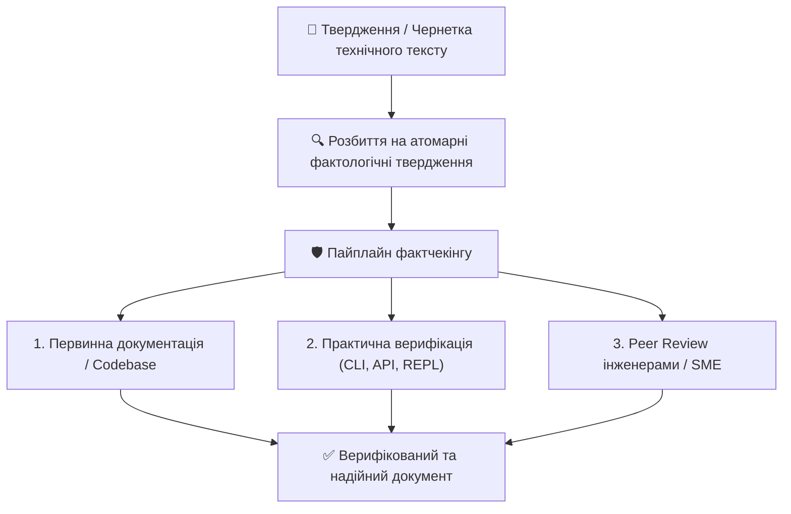

# Урок 112: Перевірка фактів у роботі технічного автора та дослідника

## 1. Проблема точності та фактчекінгу в епоху генеративного AI

У професійному технічному письменстві (Technical Writing) та науково-аналітичних дослідженнях (Research) точність фактів є абсолютною цінністю. Навіть дрібна помилка у версії API, назві прапорця конфігурації чи числовому показнику надійності може призвести до збоїв у виробничому середовищі клієнта або репутаційних втрат компанії.

Поява великих мовних моделей (LLM) створила подвійну реальність:
1. З одного боку, швидкість створення чернеток зросла в рази.
2. З іншого боку, з'явився критичний виклик — **фактологічні галюцинації (Factual Hallucinations)**, коли модель генерує вигадані параметри або застарілі дані з високим рівнем лінгвістичної впевненості.

---

## 2. Методологія фактчекінгу: Атомізація тверджень

Для ефективної перевірки складного тексту дослідник розбиває абзаци на **атомарні факти (Atomic Fact Verification)**.

### Приклад деконструкції речення:
> *«PostgreSQL 16 за замовчуванням підтримує логічну реплікацію з автентифікацією через SCRAM-SHA-256 та знижує навантаження на CPU на 40% завдяки використанню SIMD інструкцій у JSONB операціях».*

### Виділені атомарні твердження для перевірки:
1. Чи дійсно версія 16 підтримує логічну реплікацію? *(Так, перевірка за Release Notes)*.
2. Чи встановлено SCRAM-SHA-256 за замовчуванням? *(Так, перевірка `pg_hba.conf`)*.
3. Чи реалізовано прискорення JSONB через SIMD інструкції? *(Так, AVX-512 підтримка)*.
4. Чи становить показник зниження CPU рівно 40%? *(Потребує перевірки бенчмарків: це максимальний показник чи середній?)*.

---

## 3. Використання AI як асистента для фактчекінгу

AI може виконувати роль реверсивного фактчекера, якщо задати правильні обмеження:
- **Промпти виявлення сумнівних тверджень**: «Виділи всі твердження, що містять конкретні дати, версії бібліотек, числові показники та цитати, і познач їх рівень ризику».
- **Звірка з переданим контекстом (Grounding)**: перевірка фактів виключно за наданим офіційним PDF або Markdown-файлом специфікації без використання зовнішньої пам'яті моделі.
