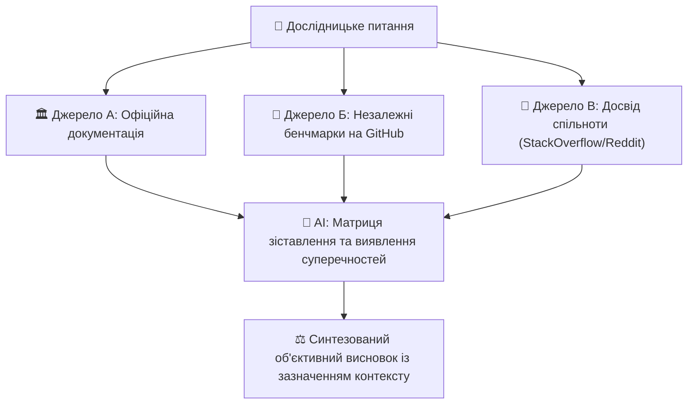

# Урок 113: Cross-check між джерелами

## 1. Конфлікт інформації у сучасних дослідженнях

Під час дослідження нових технологій, відкритих бібліотек чи ринкових аналізів фахівець стикається з масою суперечливих джерел:
- Офіційний сайт вендора дає оптимістичні маркетингові дані.
- Тести незалежних інженерів на GitHub показують інші результати продуктивності.
- Обговорення на StackOverflow містять застарілі воркараунди для старих версій.
- Звіти аналітичних агентств (Gartner, Forrester) спираються на специфічні корпоративні вибірки.

**Крос-чекінг (Cross-checking)** — це систематичний процес порівняння та зіставлення інформації з кількох незалежних джерел для виявлення розбіжностей, перевірки методологій та встановлення об'єктивної істини.

---

## 2. Матриця зіставлення джерел (Source Comparison Matrix)

Для виявлення розбіжностей будується порівняльна матриця:

| Критерій оцінки | Офіційна документація | Незалежний бенчмарк (GitHub) | Реальний кейс (Tech Blog) |
| :--- | :--- | :--- | :--- |
| **Пропускна здатність** | 100 000 req/sec | 65 000 req/sec | 45 000 req/sec під навантаженням |
| **Умови тестування** | In-memory, без мережевих затримок, 64 ядра | 8 ядер, реальна мережа 1Gbps | Реальний продакшн з TLS та БД |
| **Висновок автора** | «Найшвидший сервіс у світі» | «Швидкий для простих операцій» | «Вимагає тюнінгу пам'яті для стабільності» |

---

## 3. Використання AI для автоматизації крос-чекінгу

AI моделі нового покоління з великим контекстним вікном (Claude 3.5 Sonnet з 200k токенів) дозволяють:
1. Завантажити одночасно 3–5 повних статей або звітів.
2. Сформувати запит: *«Знайди всі прямі суперечності між текстом А та текстом Б щодо показників затримки (Latency). Склади порівняльну таблицю та поясни, якими відмінностями в методології це зумовлено»*.
3. Виявити замовні або упереджені висновки на основі аналізу конфлікту інтересів авторів.
