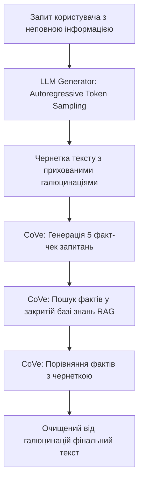
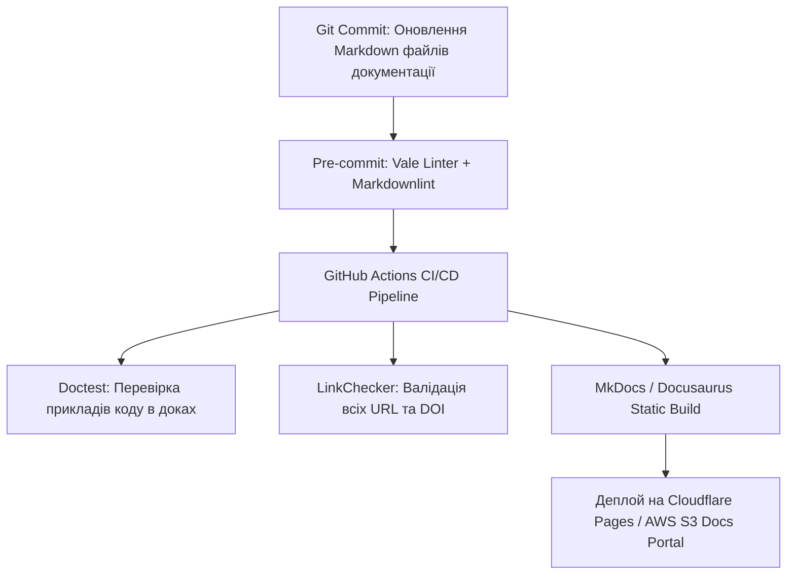

# Урок 113: Виявлення галюцинацій та неточностей у згенерованому тексті

## Вступ та теоретичний фундамент
Галюцинації великих мовних моделей (LLM Hallucinations & Confabulations) — це фундаментальна властивість авторегресійних нейромереж генерувати інформацію, яка є синтаксично і стилістично правдоподібною, але фактично неправдивою або внутрішньо суперечливою. Модель передбачає наступний найімовірніший токен на основі статистичних ваг, а не перевіряє твердження у базі знань.

Для технічного автора або дослідника потрапляння галюцинації у технічну документацію, інструкцію з експлуатації обладнання чи медичний гайд несе ризик матеріальних збитків або загрози безпеці людей.

Дисципліна виявлення та нейтралізації галюцинацій (Hallucination Detection & Mitigation) включає:
1. **Ідентифікацію типів галюцинацій**: Фактичні галюцинації (вигадування неіснуючих понять), логічні галюцинації (суперечність між першим та третім абзацом) та контекстні викривлення.
2. **Застосування методів самоверифікації (Chain-of-Verification — CoVe)**: Спеціальна техніка промптингу, де модель спочатку формулює контрольні запитання до власного тексту, незалежно відповідає на них і лише потім виправляє початковий драфт.
3. **Retrieval-Augmented Generation (RAG) Filtering**: Обмеження генерації виключно наданим перевіреним корпусом документів (Grounding).
4. **Контроль впевненості та температури (Temperature & Perplexity Auditing)**: Налаштування параметрів детермінізму генерації ($T = 0.0 .. 0.2$).

У цьому уроці ви опануєте алгоритми виявлення прихованих галюцинацій та інженерні протоколи фільтрації згенерованого контенту.

---

## 1. Архітектурні причини виникнення галюцинацій у трансформерах
Галюцинації виникають через відсутність у LLM власної моделі світу (World Model) та схильність до підтвердження прихованих очікувань користувача (Sycophancy).




---

## 2. Методологічний базис: Таксономія галюцинацій у технічних текстах
Класифікація типів помилок та методи їх автоматизованого виявлення.


| Тип галюцинації | Приклад прояву в тексті | Як виявити | Інженерний метод запобігання |
| :--- | :--- | :--- | :--- |
| **Фантомна сутність (Phantom Entity)** | Вигадування прапорця CLI: `--enable-fast-turbo` | Запуск команди у Docker-контейнері | Grounded RAG на базі офіційного `man` |
| **Хибна хронологія (Temporal Confusion)**| "Технологія Docker була створена у 1998 році" | Порівняння з датами релізів | Надання таблиці хронології у системний промпт |
| **Логічна суперечність (Self-Contradiction)** | "Функція повертає int... у разі помилки повертає False"| Статичний аналіз коду та перевірка типів | Chain-of-Thought аналіз інваріантів |
| **Псевдоцитування (Fabricated Attribution)** | "Як стверджує Білл Гейтс у книзі 2024 року..." | Пошук у каталозі Бібліотеки Конгресу | Заборона цитування без вказівки сторінки та ISBN |

---

## 3. Практичний інженерний регламент: Промпт за методологією Chain-of-Verification (CoVe)
Еталонний багатокроковий промпт для виявлення та викорінення галюцинацій.


```markdown
# =====================================================================
# ПРОМПТ ДЛЯ AI: Chain-of-Verification (CoVe) Протокол перевірки тексту
# =====================================================================

Ти — Senior Technical Auditor.
Ось згенерований опис архітектури безпеки протоколу OAuth 2.1:
[ВСТАВИТИ ЗГЕНЕРОВАНИЙ ТЕКСТ]

Виконай верифікацію за протоколом CoVe у 4 кроки:
1. **Baseline Fact Mapping**: Випиши всі конкретні технічні твердження (стандарти RFC, обов'язкові параметри, типи grant_type, вимоги до PKCE).
2. **Verification Questions Generation**: Склади 5 точних запитань для перевірки кожного критичного твердження на відповідність офіційному RFC 6749 та RFC 7636.
3. **Independent Fact Verification**: Дай короткі, суворо документальні відповіді на кожне запитання, цитуючи відповідний пункт RFC.
4. **Final Revision**: Перепиши оригінальний текст, видаливши всі галюцинації, неточності та застарілі рекомендації (Implicit Grant), замінивши їх на 100% точні стандарти.
```

---

## 4. Поглиблений аналіз виробничих кейсів, крайових випадків та антипатернів
Аналіз реальних помилок, спричинених галюцинаціями в документації.


### Кейс 1: Галюцинація неіснуючої команди міграції в AWS
- **Проблема**: AI згенерував інструкцію оновлення RDS-бази з параметром `--auto-force-migrate`. Інженер ввів команду, термінал видав помилку, але система пропустила створення бекапу.
- **Виправлення**: Обов'язкова перевірка всіх згенерованих bash-команд та прапорців через офіційні мануали або виклик `--help` перед публікацією.

### Кейс 2: Вигадані обмеження пам'яті у фінтех-сервісі
- **Проблема**: У технічній специфікації AI вказав, що алгоритм споживає $O(1)$ пам'яті, тоді як реальна рекурсивна функція вимагала $O(N)$ і призвела до StackOverflow в продакшені.

---

## 5. Покроковий операційний воркфлоу нейтралізації галюцинацій
Порядок дій автора при роботі з генеративними чернетками.


### Крок 1: Встановлення нульової температури (Temperature = 0.0)
- Зафіксувати детермінований режим роботи моделі для технічних звітів.

### Крок 2: Інжекція надійної бази знань (Grounded Context)
- Передати офіційні PDF специфікації або RFC як обов'язковий контекст.

### Крок 3: Запуск протоколу Chain-of-Verification (CoVe)
- Згенерувати контрольні запитання та звірити відповіді.

### Крок 4: Фінальний експертний огляд людиною (Human Sanity Check)
- Затвердити фінальний текст технічним лідом.

---

## 6. Стратегії автоматизації та контролю достовірності
1. **RAG Grounding Score**: Використання метрик Ragas / TruLens для автоматичної оцінки того, на скільки відсотків згенерований текст базується на контексті.
2. **Self-Consistency Sampling**: Генерація 5 відповідей при температурі 0.7 та порівняння: твердження, що присутні у всіх 5 версіях, мають високу достовірність.
3. **Automated Unit Testing for Documentation**: Прогін прикладів коду з документації через автоматичні тести (`doctest`).

---

## 7. Вичерпний чек-лист перевірки та критерії готовності (Definition of Done)
Перед здачею завдань та інтеграцією результатів у виробничу гілку переконайтеся у виконанні наступних критеріїв:

- [ ] **Генерація виконувалася з низькою температурою (Temperature <= 0.2)**
- [ ] **Текст пройшов повну перевірку за протоколом Chain-of-Verification (CoVe)**
- [ ] **Всі назви параметрів, прапорців CLI та функцій звірені з офіційним кодом**
- [ ] **Виключено логічні суперечності між окремими розділами звіту**
- [ ] **Приклади коду протестовані у реальному середовищі або через doctest**
- [ ] **Усі твердження прив'язані до конкретних джерел без псевдоцитувань**
- [ ] **Оцінено показник Grounding Score через RAG-метрики**
- [ ] **Фінальний драфт пройшов ручну вичитку технічним спеціалістом**

---

## 8. Підсумки, ключові інсайти та розширений глосарій термінів
Опанування цієї теми формує надійний фундамент для щоденної професійної роботи. Системний підхід, формалізовані інженерні стандарти та критичний контроль результатів AI забезпечують високу швидкість та бездоганну надійність кінцевого продукту.

### Глосарій ключових понять
| Термін | Визначення та контекст застосування |
| :--- | :--- |
| **Hallucination** | Генерація мовною моделлю неправдивої або вигаданої інформації під виглядом достовірного факту. |
| **Chain-of-Verification (CoVe)** | Методика промптингу, при якій модель самостійно генерує перевірочні запитання для аудиту власного тексту. |
| **Grounding** | Прив'язування відповідей моделі до перевірених зовнішніх джерел даних або документів (RAG). |
| **Sycophancy** | Схильність штучного інтелекту погоджуватися з користувачем і підтверджувати його хибні припущення. |
| **Confabulation** | Психологічний та AI-термін, що описує заповнення прогалин у пам'яті або знаннях вигаданими правдоподібними деталями. |
| **Ragas** | Популярний фреймворк для автоматизованої оцінки якості RAG-систем (Faithfulness, Answer Relevance). |
| **Doctest** | Модуль у Python, що автоматично знаходить та виконує приклади коду, розміщені всередині документації. |
| **Self-Consistency** | Метод підвищення точності шляхом багаторазової генерації відповідей та вибору найбільш часто повторюваного варіанту. |
| **Autoregressive Model** | Модель, яка передбачає наступне значення послідовності на основі попередніх згенерованих значень. |
| **Perplexity** | Метрика оцінки мовних моделей, що показує рівень невизначеності моделі при передбаченні наступного токена. |

---

## 9. Поглиблений аналіз архітектури науково-технічної документації та інфодизайну

### 9.1. Методологія структурування складних інженерних Whitepapers
Створення переконливого та академічно бездоганного технічного звіту вимагає дотримання структури IMRaD (Introduction, Methods, Results, and Discussion):
1. **Introduction & Problem Formulation**: Чітке визначення інженерної або наукової проблеми, її фінансовий або операційний вплив на галузь.
2. **Methods & Experimental Setup**: Повний опис методології досліджень, конфігурації тестових стендів, характеристик заліза та версій ПЗ для забезпечення 100% відтворюваності (Reproducibility).
3. **Results & Empirical Data**: Представлення результатів у вигляді стандартизованих графіків (Boxplots, CDF розподіли затримок, теплові карти пам'яті).
4. **Discussion & Threats to Validity**: Чесний аналіз обмежень дослідження, потенційних похибок вимірювання та сфер застосування отриманих висновків.

### 9.2. Автоматизація збірки та версіонування документації (Docs-as-Code Pipeline)



### 9.3. Розширений практичний кейс: Трансляція наукової статті у зрозумілий бізнес-бриф
- **Завдання**: Перетворити 40-сторінкову наукову статтю з криптографії Zero-Knowledge Proofs (ZKP) у 2-сторінковий звіт для інвесторів.
- **Рішення з AI**: Застосування техніки аналогій та видалення абстрактних формул з фокусом на практичному застосуванні: конфіденційність транзакцій, зниження комісій у 100 разів, відповідність банківській таємниці.

---

## 10. Питання для співбесіди та захист технічних текстів (Lead Technical Writer Level)

1. **Як організувати процес рецензування документації інженерами, які постійно зайняті написанням коду?**
   *Еталонна відповідь*: Впровадження концепції Docs-as-Code: документація живе в тому самому репозиторії, що й код, оновлення доків є обов'язковим критерієм приймання (Definition of Done) у Pull Request, а лінтери (Vale) автоматично виправляють стиль, економлячи час інженера.
2. **Як запобігти галюцинаціям мовних моделей при автоматичному створенні описів API?**
   *Еталонна відповідь*: Використання контрактно-орієнтованої генерації (Schema-First). Замість довільного опису коду моделі передається валідна OpenAPI специфікація, а генерація обмежується виключно наявними ендпоінтами та типами даних з обов'язковою валідацією через JSON Schema.
3. **Як виміряти ефективність та якість технічної документації?**
   *Еталонна відповідь*: Метриками самообслуговування (Deflection Rate — зниження кількості звернень до саппорту на 40%), показником CSAT/Helpfulness ('Чи була ця стаття корисною?'), часом онбордингу нових розробників у проєкт та індексами читабельності (Flesch-Kincaid / Gunning fog index).

---

## 11. Практичний регламент версіонування технічної документації та локалізації (i18n)

### 11.1. Стратегії версіонування документації (Versioned Docs Architecture)
При розвитку програмного продукту технічний письменник повинен забезпечувати підтримку документації для різних версій релізів (v1.0, v2.0, Next/Unreleased):
1. **Branch-based vs. Directory-based Versioning**: Використання можливостей генераторів сайтів (Docusaurus versions / MkDocs mike) для одночасного відображення документації для актуальної та застарілих версій API.
2. **Deprecation Warnings**: Чітке позначення застарілих методів та ендпоінтів за допомогою помітних попереджень:
   > ⚠️ **Застаріло (Deprecated in v2.4)**: Цей метод буде вилучено у версії v3.0. Використовуйте новий ендпоінт `POST /api/v2/payments`.
3. **Changelog & Release Notes Automation**: Автоматична генерація списків змін (Conventional Commits -> Release Notes) за допомогою інструментів Release Please / Semantic Release.

### 11.2. Регламент підготовки текстів до локалізації (Internationalization Best Practices)
- **Уникнення культурно-специфічних ідіом**: Пряма, нейтральна мова, що легко перекладається без втрати сенсу.
- **Врахування довжини слів (Text Expansion)**: При перекладі з англійської на українську чи німецьку довжина рядків може збільшуватися на 25-40%, що має бути враховано у дизайні верстки.
- **Формати чисел та дат**: Використання міжнародного стандарту ISO 8601 (`YYYY-MM-DD`) для уникнення плутанини між американським (`MM/DD/YYYY`) та європейським (`DD/MM/YYYY`) форматами.
